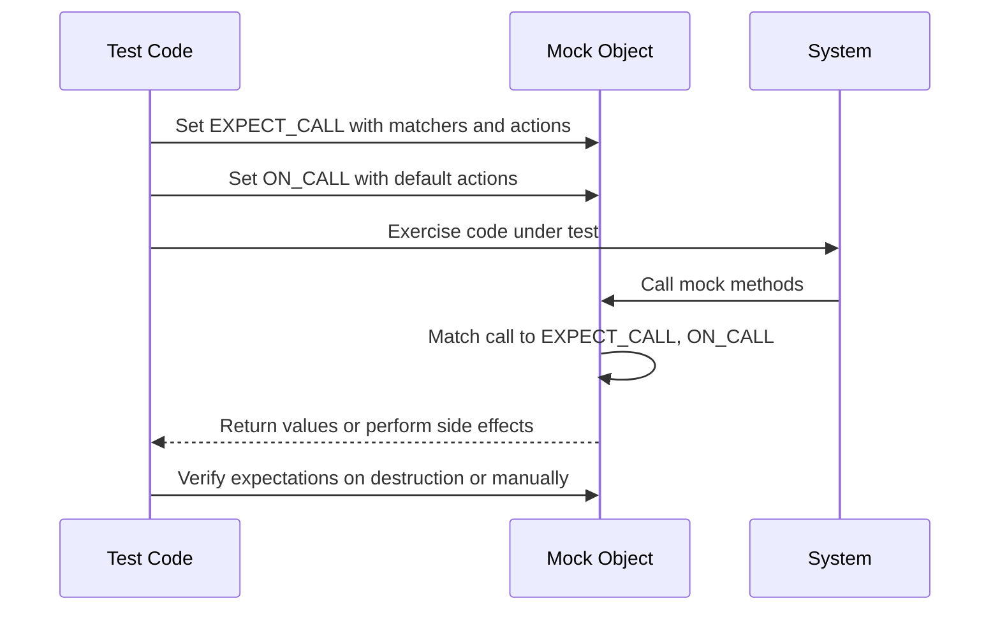

# Mocking: Principles and Patterns

GoogleMock (gMock) centers on the concept of *mock objects* — programmable test doubles that simulate the behavior of real objects in your system. This page explores the core concepts behind mocking, how to specify expectations and behaviors, and control the verification of mock interactions in your tests.

---

## What is a Mock Object?

A mock object mimics the interface of a real object, allowing you to:

- Define **expectations** on method calls: which methods are called, with what arguments, how many times, and in what order.
- Specify **behaviors** for method calls: what values to return, side effects to perform, or other stub actions.
- **Verify** at runtime that the expectations were met, enabling interaction-based testing.

Unlike real objects, mocks let you precisely control and observe the interaction between your code and its dependencies — an essential part of unit testing and Test-Driven Development (TDD).

<Info>
Mock objects represent *interaction specifications* — they describe how collaborators are expected to behave and interact, not just final system state.
</Info>

## Defining Mock Classes

To create a mock, you define a class that inherits from the interface or base class you want to mock, using the `MOCK_METHOD` macro to declare mocked methods.

### Basic Syntax

```cpp
class MockFoo : public Foo {
public:
  MOCK_METHOD(ReturnType, MethodName, (Args...), (Specs...));
};
```

- `ReturnType` is the return type of the method.
- `MethodName` is the name of the method being mocked.
- `Args...` is a comma-separated list of argument types.
- `Specs...` is an optional list of qualifiers, such as `const`, `override`, or calling convention specifications.

### Key Guidelines

- Always place `MOCK_METHOD` declarations in the **public** section of the mock class, even if the base method is protected or private. This allows GoogleMock to access the mock functions.
- When mocking overloaded functions, you must mock each overload separately.
- To deal with argument or return types containing commas (e.g. `std::pair<int, int>`), wrap the type in extra parentheses or declare type aliases.

<CodeGroup>
```cpp
class MockFoo {
public:
  MOCK_METHOD((std::pair<bool, int>), GetPair, ());
  MOCK_METHOD(bool, CheckMap, ((std::map<int, double>), bool));
};
```
```cpp
using BoolAndInt = std::pair<bool, int>;
using MapIntDouble = std::map<int, double>;

class MockFoo {
public:
  MOCK_METHOD(BoolAndInt, GetPair, ());
  MOCK_METHOD(bool, CheckMap, (MapIntDouble, bool));
};
```
</CodeGroup>

## Setting Expectations with `EXPECT_CALL`

Expectations assert that a mock method will be called in a specific way during the test.

### Syntax

```cpp
EXPECT_CALL(mock_object, MethodName(matchers...))
    .With(multi_argument_matcher)
    .Times(cardinality)
    .InSequence(sequences...)
    .After(expectations...)
    .WillOnce(action)
    .WillRepeatedly(action)
    .RetiresOnSaturation();
```

- `matchers...`: specify how arguments must match for the expectation to fire.
- Modifier clauses must be used in this order.

### Common Clauses

#### `.With(multi_argument_matcher)`
Matches the mock function call arguments as a whole tuple.

#### `.Times(cardinality)`
Defines how many times the call is expected:

| Cardinality      | Meaning                                    |
| ---------------- | ------------------------------------------ |
| `AnyNumber()`    | Any number of calls allowed.                |
| `AtLeast(n)`     | At least `n` times.                         |
| `AtMost(n)`      | At most `n` times.                          |
| `Between(m, n)`  | Between `m` and `n` (inclusive).           |
| `Exactly(n)` or `n` | Exactly `n` times.                       |

If omitted, cardinality is inferred from the number of `.WillOnce` and `.WillRepeatedly` clauses.

#### `.InSequence(sequences...)`
Specifies that calls occur in a particular sequence. Use with `Sequence` objects to impose order.

#### `.After(expectations...)`
Specifies that this call occurs after one or more other expectations.

#### `.WillOnce(action)` and `.WillRepeatedly(action)`
Define behavior for matching calls. `.WillOnce` applies to the next call only, `.WillRepeatedly` applies after all `.WillOnce` actions have been used.

#### `.RetiresOnSaturation()`
Causes the expectation to retire (become inactive) once its maximum calls are reached.

### Example

```cpp
using ::testing::Return;
using ::testing::_;

EXPECT_CALL(mock_obj, GetValue(_))
    .Times(3)
    .WillOnce(Return(1))
    .WillOnce(Return(2))
    .WillRepeatedly(Return(3));
```

This sets the expectation that `GetValue` is called exactly 3 times, returning `1` on the first call, `2` on the second, and `3` on all subsequent calls (though the test will fail if called more than three times, unless `.RetiresOnSaturation` is used).

## Controlling Behavior with `ON_CALL`

Unlike `EXPECT_CALL`, `ON_CALL` specifies the default behavior of a mock method but does **not** set an expectation that the method will be called.

```cpp
ON_CALL(mock_obj, MethodName(matchers...))
    .With(multi_argument_matcher)
    .WillByDefault(action);
```

This is useful when the test doesn't care whether the mock method is called, but requires a particular default behavior when it is.

## Understanding Calls

- **Uninteresting call**: a mock method is called but no `EXPECT_CALL` exists for that method.
  - By default, this triggers a warning.
  - `NiceMock` suppresses this warning.
  - `StrictMock` treats this as a failure.

- **Unexpected call**: a mock method is called and one or more `EXPECT_CALL`s exist, but none match the call arguments.
  - Always treated as an error.

## Mock Wrappers: NiceMock, NaggyMock, and StrictMock

GoogleMock provides wrappers over mock classes to modify the handling of uninteresting calls:

| Class        | Behavior on Uninteresting Calls                |
| ------------ | ---------------------------------------------- |
| `NiceMock`   | Suppresses warnings, lets calls pass silently.|
| `NaggyMock`  | Default behavior: prints warnings.             |
| `StrictMock` | Treats uninteresting calls as fatal errors.   |

```cpp
using ::testing::NiceMock;
NiceMock<MockFoo> mock;  // No warnings on uninteresting calls.
```

Use these wrappers to suit your level of strictness for unimportant calls.

## Sequences and Ordering

Use `Sequence` objects to specify that calls must occur in a particular order. Expectations added to the same sequence are enforced to occur sequentially.

```cpp
using ::testing::Sequence;
Sequence s1, s2;

EXPECT_CALL(mock, FirstCall())
    .InSequence(s1, s2);
EXPECT_CALL(mock, SecondCall())
    .InSequence(s1);
EXPECT_CALL(mock, ThirdCall())
    .InSequence(s2);
```

The above enforces a partial order where `FirstCall` occurs before both `SecondCall` and `ThirdCall`, but `SecondCall` and `ThirdCall` can occur in any order relative to each other.

## Verifying and Clearing Expectations

GoogleMock automatically verifies expectations on mock object destruction, but you can:

- Use `Mock::VerifyAndClearExpectations(&mock_obj)` to verify and clear expectations earlier.
- Use `Mock::VerifyAndClear(&mock_obj)` to verify and clear both expectations and default actions.
- Use `Mock::AllowLeak(&mock_obj)` to mark a mock object as safe to leak (skipping verification).

<Warning>
Do not set new expectations after verifying and clearing expectations/delegations on a mock object—it leads to undefined behavior.
</Warning>

## Practical Tips and Best Practices

- Write expectations **before** exercising your code; do not interleave `EXPECT_CALL` and calls.
- Use `ON_CALL` for default behavior without enforcing calls.
- Use `EXPECT_CALL` to verify interactions.
- Place your `MOCK_METHOD` declarations in the public section.
- Carefully manage expectation order when overlapping expectations exist.
- Use `RetiresOnSaturation()` or sequences to avoid sticky expectations that lead to unexpected failures.

## Troubleshooting Common Issues

- If you get warnings for uninteresting calls, consider whether you should add an `EXPECT_CALL` with `Times(AnyNumber())` or use `NiceMock`.
- For unexpected calls, verify that expectations match the actual calls.
- Use `--gmock_verbose=info` during test runs to see a detailed trace of matching decisions.

## Summary Diagram: User Workflow in Mocking



## Further Reading and Related Pages

- [Mocking Macros and Methods](../api-reference/matchers-and-mocking/mocking-macros-and-methods.md) — Details on `MOCK_METHOD` and other macros.
- [gMock Cookbook](docs/gmock_cook_book.md) — Practical recipes for mocking.
- [Matchers Reference](reference/matchers.md) — List and explanation of argument matchers.
- [Actions and Call Behaviors](reference/actions-and-call-behaviors.md) — Built-in and custom actions.
- [Writing and Running Your First Tests](guides/core-workflows/writing-first-tests.md) — Integrating mocks in your test code.

<Check>
Tip: Start with `ON_CALL` for defining behaviors in your test fixtures and use `EXPECT_CALL` sparingly to specify interactions you really want to verify.
</Check>
