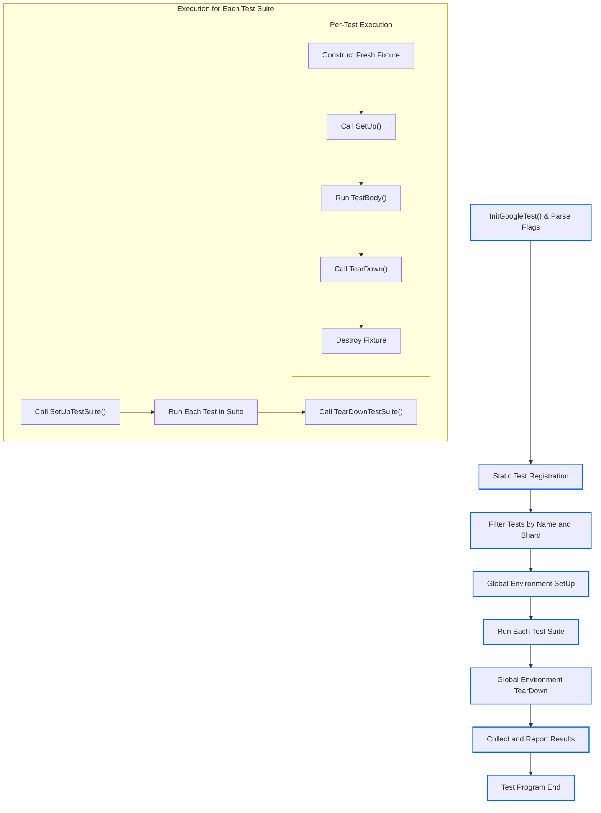

# Test Lifecycle and Execution Model

Explore how tests are defined, instantiated, and executed within GoogleTest, including the lifecycle of test fixtures, setup and teardown flows, the structure of parameterized and type-parameterized tests, and how results are collected and reported. This guide dives into the division of test parts and the orchestration of the entire test run from initialization to final reporting.

---

## Overview of Test Execution in GoogleTest

At its core, GoogleTest organizes your tests into **test suites**, which contain individual **tests**. When you execute your test program (typically via `RUN_ALL_TESTS()`), GoogleTest manages the entire lifecycle of tests and fixtures, ensuring that your tests are independent, repeatable, and results are collected accurately.

The core lifecycle progresses through these stages:

1. **Test and Fixture Definition**
    - Tests are defined via macros such as `TEST()`, `TEST_F()`, `TEST_P()`, and `TYPED_TEST()`.
    - Fixtures encapsulate reusable setup/teardown for multiple tests.
    - Parameterized and type-parameterized tests extend test definitions with data or types.

2. **Test Registration and Discovery**
    - At compile/link time, tests get registered automatically with GoogleTest’s `UnitTest` singleton.
    - The framework knows about all tests without manual enumeration.

3. **Test Filtering and Sharding**
    - Before running, GoogleTest filters tests based on the user-specified patterns and handles sharding (distributed testing) setup.

4. **Global Environment Setup**
    - All registered global `Environment` objects have their `SetUp()` called in registration order.

5. **Test Suite Execution**
    - For each test suite:
      - Run `SetUpTestSuite()` (shared setup once per suite)
      - For each *test*:
        - Instantiate fresh fixture object
        - Call `SetUp()` (fixture setup for the individual test)
        - Run test body
        - Call `TearDown()`
        - Destroy fixture object
      - Run `TearDownTestSuite()`

6. **Global Environment Teardown**
    - All global environment `TearDown()` methods are called in reverse order of setup.

7. **Result Reporting**
    - Test results, failures, skips, and timings are reported via event listeners and optionally output in XML or JSON.

---

## Test Definition and Fixture Lifecycle

### Defining Tests

- **Simple Tests (`TEST`)**: Defines a test function that runs independently.
- **Fixture Tests (`TEST_F`)**: Uses a test fixture class for sharing setup and teardown across tests.
- **Value-Parameterized Tests (`TEST_P`)**: Parameter-driven tests where the same test logic runs over multiple data values.
- **Typed Tests (`TYPED_TEST` and `TYPED_TEST_SUITE`)**: Runs the same test logic over different types.
- **Type-Parameterized Tests (`TYPED_TEST_P` and related macros)**: Like typed tests but with flexible instantiation of type lists.


### Execution Flow for Fixture Tests

Each test, especially those using fixtures, follow this consistent lifecycle:

1. **Fixture Construction:** A fresh instance of the fixture class is created.
2. **`SetUp()` Method:** Called to prepare test-specific state.
3. **Test Body (`TestBody`) Execution:** Executes assertions and test commands.
4. **`TearDown()` Method:** Called immediately after the test finishes, for cleanup.
5. **Fixture Destruction:** Deletes the fixture instance.

For example, in a fixture `FooTest` with two tests:

```cpp
TEST_F(FooTest, Test1) { ... }
TEST_F(FooTest, Test2) { ... }
```

GoogleTest will create and destroy separate instances of `FooTest` for each `Test1` and `Test2`, calling `SetUp()` and `TearDown()` accordingly.

#### Note:

- **Fixture objects are never reused between tests.** Each test gets a clean, isolated fixture.
- `SetUpTestSuite()` and `TearDownTestSuite()` provide shared setup and teardown at the test suite level.

---

## Test Suite and Global Environment Lifecycle

- **Test Suites**
  - Contain logically grouped tests.
  - Execute `SetUpTestSuite()` once before any test runs.
  - Execute `TearDownTestSuite()` once after all tests finish.

- **Global Test Environments**
  - Created by subclassing `testing::Environment`.
  - Registered via `AddGlobalTestEnvironment()` before invoking `RUN_ALL_TESTS()`.
  - Have `SetUp()` and `TearDown()` called before and after *all* tests.
  - Are executed strictly in registration order.
  - Are recreated or reused per iteration depending on `--gtest_recreate_environments_when_repeating` flag.

---

## Parameterized and Type-Parameterized Test Lifecycle

### Value-Parameterized Tests:

- Require defining a fixture class that inherits from both `Test` and `WithParamInterface<T>`.
- Tests use `TEST_P()` macro.
- Tests are instantiated via `INSTANTIATE_TEST_SUITE_P()` macro with supplied parameter generators (e.g., `Values()`, `Range()`, `Combine()`).
- For each parameter value, GoogleTest creates a separate test case named as `{InstantiationName}/{TestSuiteName}.{TestName}/{ParameterIndex}`.

### Type-Parameterized Tests:

- Allow repeating test logic across multiple types.
- Define test suite template; use macros `TYPED_TEST_SUITE` and `TYPED_TEST`.
- Type lists are associated at compile time.

### Type-Parameterized Tests with Flexible Instantiations:

- Use `TYPED_TEST_SUITE_P`, `TYPED_TEST_P`, and `REGISTER_TYPED_TEST_SUITE_P` to define.
- Instantiate with specific type lists via `INSTANTIATE_TYPED_TEST_SUITE_P`.

---

## Test Execution Model: Step-by-Step Flow

The GoogleTest test execution follows this multistage workflow:

<Steps>
<Step title="Initialization">
  User calls `InitGoogleTest()`, which parses command-line flags (e.g., filters, sharding, repeat, shuffle).
</Step>
<Step title="Test Registration">
  Tests are detected and registered via static initialization.
</Step>
<Step title="Test Filtering and Sharding">
  Tests that do not match filter or belong to other shards are disabled.
</Step>
<Step title="Global Environment SetUp">
  All registered global test environments’ `SetUp()` methods are called.
  If any global setup fails fatally, tests are skipped.
</Step>
<Step title="Test Suite Execution">
  For each test suite:

  - `SetUpTestSuite()` is called.
  - For each test:
    - A fresh fixture object is instantiated.
    - The fixture's `SetUp()` is called.
    - The test function is executed.
    - The fixture's `TearDown()` is called.
    - The fixture object is destroyed.
  - `TearDownTestSuite()` is called.
</Step>
<Step title="Global Environment TearDown">
  Global environments' `TearDown()` methods are called in reverse registration order.
</Step>
<Step title="Result Collection and Reporting">
  All test results, failures, skips, and timings are gathered.
  Event listeners are notified in order.
  Optional XML or JSON reports are generated.
</Step>
</Steps>

---

## Test Events and Listeners

GoogleTest's event listener API provides hooks at major lifecycle junctures, enabling customized reporting or integration with other tools. Events are fired in this order:

| Event                         | Description                                  |
|-------------------------------|----------------------------------------------|
| `OnTestProgramStart`           | Before any tests start.                       |
| `OnTestIterationStart`         | Before each iteration (if repeating).        |
| `OnEnvironmentsSetUpStart`     | Before global environment setup begins.      |
| `OnEnvironmentsSetUpEnd`       | After global environment setup completes.    |
| `OnTestSuiteStart`             | Before each test suite.                       |
| `OnTestStart`                  | Before each individual test.                  |
| `OnTestPartResult`             | After each assertion or `SUCCEED()` call.    |
| `OnTestEnd`                   | After each individual test finishes.         |
| `OnTestSuiteEnd`               | After each test suite finishes.               |
| `OnEnvironmentsTearDownStart` | Before global environment teardown begins.   |
| `OnEnvironmentsTearDownEnd`   | After global environment teardown completes. |
| `OnTestIterationEnd`           | After each iteration finishes.                |
| `OnTestProgramEnd`             | After all tests and environments finish.     |

Listeners receive descriptive context objects (e.g., `UnitTest`, `TestSuite`, `TestInfo`) with detailed status and timing information.

---

## How Results Are Collected and Reported

- Each test maintains a `TestResult` object holding:
  - Assertion results (`TestPartResult` objects), including failure messages.
  - Test properties (user-supplied key-value data).
  - Test duration and start timestamp.

- Test suites collect results from their tests and hold their own shared-resource setup results.

- The `UnitTest` singleton aggregates statistics across all suites and tests.

- Results are streamed to all registered listeners in the appropriate event callbacks.

- Outputs can be printed to console, or saved in XML/JSON formats for tooling integration.

---

## Practical Tips and Best Practices

- **Isolated Tests:** Each test runs in a fresh fixture and will not interfere with others.
- **Reliable Setup/TearDown:** Use `SetUpTestSuite()` and `TearDownTestSuite()` for expensive shared setup.
- **Use Parameterized Tests:** To maximize test coverage with minimal code duplication.
- **Implement Event Listeners:** To customize test feedback, integrate with CI or capture enhanced diagnostics.
- **Handle Skipped and Disabled Tests:** Skipped tests are explicitly reported and help identify unmet preconditions.
- **Leverage Repeat and Shuffle:** Repeat tests multiple times and randomize order to detect flakiness or inter-test dependencies.

---

## Troubleshooting Common Issues

- **Tests Not Running:** Check filters, disabled test flags, and shard settings.
- **Fixtures Not Setup Correctly:** Verify that `SetUp()` and `TearDown()` override correctly, and constructors are lightweight.
- **Global Environments Not Triggered:** Ensure `AddGlobalTestEnvironment()` is called before `RUN_ALL_TESTS()`.
- **Misuse of Macros:** Mixing `TEST` and `TEST_F` in the same suite causes errors.

---

## Diagram: GoogleTest Test Execution Lifecycle



---

## References and Further Reading

- [GoogleTest Primer](primer.md) – A gentle introduction to basics.
- [Advanced GoogleTest Topics](advanced.md) – In-depth topics like parameterized tests and death tests.
- [Testing Reference](reference/testing.md) – Detailed API description.
- [Assertions Reference](reference/assertions.md) – All assertion macros explained.
- [Parameterized and Type-Parameterized Tests](api-reference/core-testing-api/parameterized-and-type-parameterized-tests.mdx) – Guide to data-driven testing.
- [Event Listeners and Test Output](api-reference/specialized-testing-apis/test-output-and-logging.mdx) – Customize how results are reported.

---

This page fits within the Concepts tab under Architecture & Core Principles and builds upon foundational knowledge covered in the GoogleTest Primer and complements detailed API reference pages on test registration and execution.