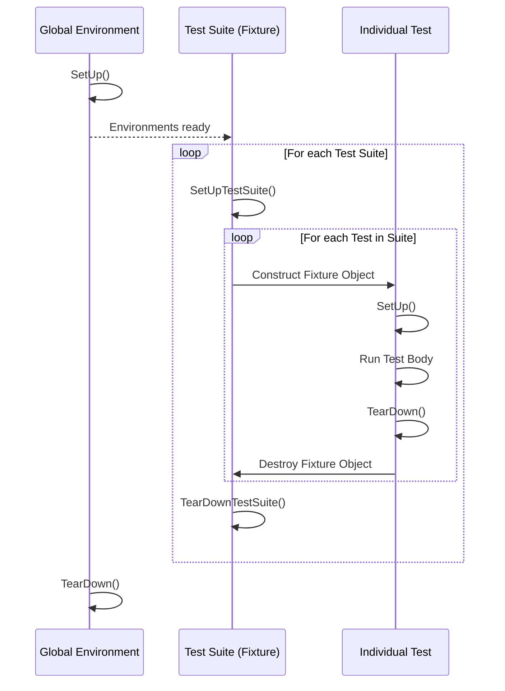

# Test Lifecycle and Execution Model

Understanding the lifecycle and execution model of tests in GoogleTest is crucial for creating reliable and maintainable C++ test suites. This guide walks through the sequence of events that occur before, during, and after a test's execution, focusing on initialization routines, test fixtures, environment setup, resource management, failure handling, logging, and teardown. Mastery of these concepts empowers users to write efficient tests and diagnose issues swiftly.

---

## Overview of the Test Execution Flow

Every test in GoogleTest follows a well-defined sequence to ensure isolation, correctness, and repeatability. At a high level, the lifecycle breaks down into the following phases:

1. **Global Environment Setup** — Prepare any shared resources or conditions that all tests depend on.
2. **Test Suite Setup** — Initialize resources shared by all tests within a specific test suite.
3. **Individual Test Setup** — Create a fresh test fixture and prepare its state.
4. **Test Execution** — Run the actual test code.
5. **Test Teardown** — Clean up the test fixture.
6. **Test Suite Teardown** — Release resources shared by the suite.
7. **Global Environment Teardown** — Clean up global resources.

This strict order guarantees that test failures or side effects in one test cannot silently affect others.

<Info>
GoogleTest creates a new test fixture object for every individual test, ensuring complete isolation between tests. No fixture object is reused.
</Info>

---

## Global Environment Initialization and Cleanup

Often you need to set up and tear down global resources, such as database connections or hardware interface initialization. GoogleTest supports this through the `Environment` class.

- Derive a class from `::testing::Environment`.
- Override the `SetUp()` and `TearDown()` methods for global preparation and cleanup.
- Register instances with `::testing::AddGlobalTestEnvironment()` before running tests.

All registered environments have their `SetUp()` called **before any tests run**, and their `TearDown()` called **after all tests finish**, in reverse order.

---

## Test Suite (Fixture Class) Setup and Teardown

When multiple tests share common setup code or expensive-to-create resources, GoogleTest allows defining a test suite with fixtures.

- A **test suite** is identified by a test fixture class, normally derived from `::testing::Test`.
- Define static methods `SetUpTestSuite()` and `TearDownTestSuite()` inside the fixture class to initialize and clean up shared resources.
- GoogleTest calls `SetUpTestSuite()` once before the first test in the suite, and `TearDownTestSuite()` once after the last test runs.

<Note>
`SetUpTestSuite()` and `TearDownTestSuite()` enable resource reuse and reduce overhead when setup is costly.
</Note>

---

## Per-Test Lifecycle

Each test is run in its own fresh context defined by its fixture object. The steps are:

### 1. Fixture Construction

- A new instance of the test fixture class is created via its constructor.
- This construction **does not** support GoogleTest assertions (`ASSERT_*`) because it is a constructor, but you can initialize constants or member variables here.

### 2. Test Setup

- GoogleTest calls the `SetUp()` method of the test fixture.
- This is the place for per-test initialization that may fail - assertions can be safely used here.

### 3. Running the Test Body

- The user-defined test code is executed within the test fixture.
- Both fatal (`ASSERT_*`) and nonfatal (`EXPECT_*`) assertions can be used here.
- The execution is aborted immediately on a fatal failure.

### 4. Test Teardown

- GoogleTest calls the `TearDown()` method after the test code finishes (regardless of pass or failure).
- Use this to release resources or reset state.

### 5. Fixture Destruction

- The test fixture object is destroyed via its destructor.

<Note>
GoogleTest creates and destroys a test fixture object per test to ensure test independence and avoid side effects.
</Note>

---

## Skipping Tests

Tests or test suites can be skipped at runtime by invoking the `GTEST_SKIP()` macro within:

- The test body
- `SetUp()` methods of test fixtures
- Global environment setup

Skipping prevents test execution and is logged as skipped in reports.

---

## Failure Handling and Logging

GoogleTest distinguishes **fatal** and **nonfatal** failures:

- **Fatal failures** (via `ASSERT_*`) abort the current function.
- **Nonfatal failures** (via `EXPECT_*`) allow the test to continue.

Within tests, failures are logged with file names, line numbers, and expression details.

Additionally, the `SCOPED_TRACE` macro or `ScopedTrace` class can add contextual information to failure messages, improving debugging.

Example:

```cpp
TEST(FooTest, Example) {
  SCOPED_TRACE("Iteration 3");
  EXPECT_EQ(Func(3), 10);
}
```

If `EXPECT_EQ` fails, the output will include the trace message "Iteration 3" to identify the context.

---

## Summary of Key APIs in Test Lifecycle

| Phase                   | API                          | Description                                      |
|-------------------------|------------------------------|--------------------------------------------------|
| Global environment setup | `Environment::SetUp()`       | Set up global context before any tests run      |
| Suite setup             | `TestFixture::SetUpTestSuite()` | Set up resources shared by test suite            |
| Per-test setup          | `TestFixture::SetUp()`       | Prepare the test environment before each test   |
| Test execution          | Test body (in `TEST_F`)       | Run the test logic                                |
| Per-test teardown       | `TestFixture::TearDown()`    | Clean up after each test                          |
| Suite teardown          | `TestFixture::TearDownTestSuite()` | Release suite-level resources                   |
| Global environment teardown | `Environment::TearDown()` | Clean up global resources after all tests       |

---

## Practical Tips and Best Practices

- **Use test fixtures to share setup and teardown code for logically grouped tests.** This avoids duplication and speeds up tests.

- **Avoid putting assertions in constructors and destructors.** Instead, use `SetUp()` and `TearDown()` because constructors cannot use fatal assertions safely.

- **Use `SetUpTestSuite()` and `TearDownTestSuite()` for expensive global setup steps** shared by all tests in a suite.

- **Leverage `SCOPED_TRACE` to add context for failures inside loops or subroutines,** making it easier to pinpoint the source of failures.

- **Use `GTEST_SKIP()` to skip tests when prerequisites are unmet or environments do not support a test.** Adding a message helps communicate why the test was skipped.

- **Test isolation is guaranteed by fixture recreation; do not rely on side effects across tests.**

- **Remember order of tests is undefined. Do not write tests dependent on previous ones.**

---

## Troubleshooting Common Issues

### 1. Tests Not Running or Skipping Unexpectedly

- Verify that no `GTEST_SKIP()` calls are unintentionally triggered in `SetUp()` or `Environment::SetUp()`.
- Check command-line filters and flags (like `--gtest_filter`) that may exclude tests.

### 2. Shared Resources Not Properly Initialized or Released

- Ensure that `SetUpTestSuite()` and `TearDownTestSuite()` are public and static.
- Confirm that resource initialization is idempotent, especially if subclasses use the same fixture.

### 3. Fatal Failures in Fixture Constructors

- Avoid placing assertion or setup logic that may fail inside fixture constructors. Move them to `SetUp()`.

### 4. Tests Failing to Isolate State

- Remember each test gets a fresh fixture. Any global or static state must be reset accordingly if used.

### 5. Debugging Failed Tests

- Use verbosity flags like `--gtest_verbose=info` to gain detailed logs.
- Leverage `SCOPED_TRACE` to see contextual traces.

---

## Illustrative Example

Here's a minimal test fixture workflow example demonstrating the lifecycle:

```cpp
class MyTestSuite : public testing::Test {
 protected:
  static void SetUpTestSuite() {
    // Expensive global setup
    shared_resource = new Resource();
  }

  static void TearDownTestSuite() {
    delete shared_resource;
    shared_resource = nullptr;
  }

  void SetUp() override {
    // Prepare fresh state for each test
    buffer.clear();
  }

  void TearDown() override {
    // Cleanup if needed
  }

  static Resource* shared_resource;
  std::vector<int> buffer;
};

Resource* MyTestSuite::shared_resource = nullptr;

TEST_F(MyTestSuite, TestOne) {
  ASSERT_TRUE(shared_resource->Initialize());
  buffer.push_back(42);
  EXPECT_EQ(buffer.size(), 1);
}

TEST_F(MyTestSuite, TestTwo) {
  GTEST_SKIP() << "Skipping this test for demonstration.";
  EXPECT_TRUE(false); // Won't be executed
}
```

Running these tests exercises the full lifecycle:
- `SetUpTestSuite` runs before either test.
- Each test has fresh fixture construction and `SetUp`.
- `GTEST_SKIP` in the second test prevents execution.
- `TearDownTestSuite` runs after all tests.

---

## Visualizing the Test Lifecycle



This sequencing enforces a robust lifecycle that ensures fresh test state and proper resource management.

---

# See Also

- [GoogleTest Primer](primer.md) — Beginner-friendly introduction to tests and fixtures
- [Writing Your First Test](guides/core-testing-workflows/writing-basic-tests.md) — Walkthrough of simple tests
- [Test Macros and Fixtures API Reference](api-reference/core-testing-api/test-macros-fixtures.md) — Detailed explanation of test fixtures setup
- [Assertions and Best Practices](guides/core-testing-workflows/assertions-best-practices.md) — Handling failures effectively
- [Integration with Bazel and CMake](guides/integration-and-best-practices/build-system-integration.md) — How to add GoogleTest to your project
- [Common Setup Issues & Solutions](getting-started/troubleshooting-faq/common-setup-issues.md) — Troubleshooting lifecycle problems

---

# Summary

A deep understanding of the GoogleTest test lifecycle empowers you to write maintainable, reliable, and efficient C++ tests. Leveraging environment setup, test suite fixtures, and per-test setup and teardown ensures resource reuse without sacrificing test isolation. Effective failure handling and logging further enhance debugging and test clarity.

