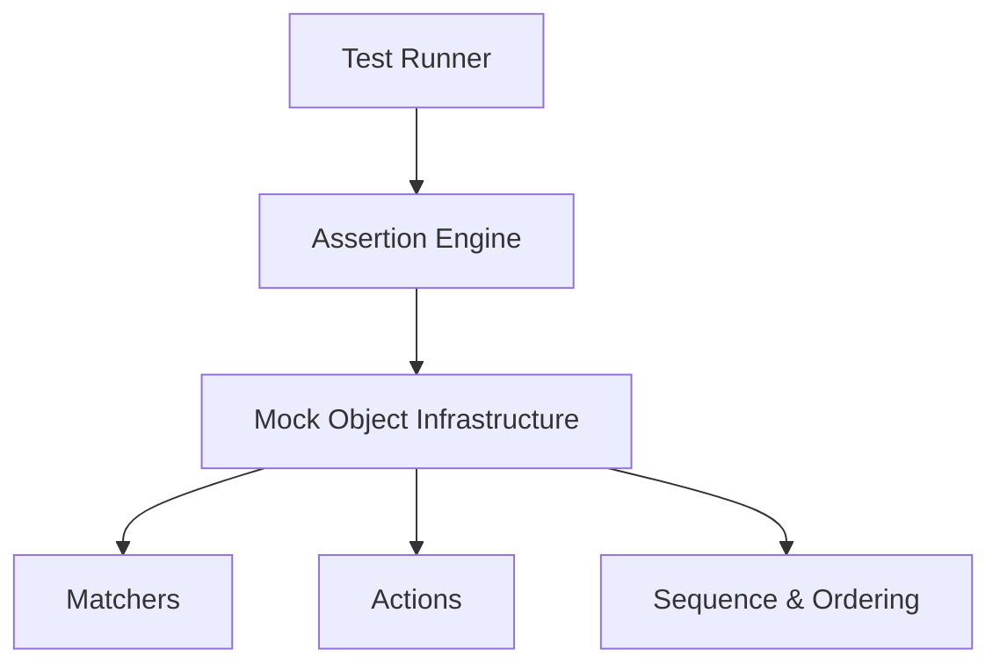

# Main Components and Their Roles

GoogleTest and GoogleMock consist of several key components, each responsible for distinct aspects of test creation, execution, and validation. Understanding these components helps you write effective and maintainable tests while leveraging the framework's full capabilities.

---

## 1. Test Runner

The Test Runner is the heart of GoogleTest's execution flow.

- **Purpose:** It discovers tests in your code, manages their lifecycle, and executes them.
- **User Intents Served:** 
  - Run all or selected tests based on filters.
  - Control test execution order, repetition, and parallelism.
  - Collect and report test results with detailed summaries.

### How It Works for You
You typically do not interact directly with the test runner beyond invoking your test executable, which by default runs all tests it discovers. Command-line flags and filters help customize what runs and how results are output (including formats for CI pipelines).

### Practical Tips
- Use filtering flags to run subsets of tests during development for faster feedback.
- Capture results in XML or JSON for integration with CI systems.

## 2. Assertion Engine

Assertions are the primary way tests verify correctness.

- **Purpose:** Assertions check conditions and report failures with detailed messages.
- **Types:**
  - *Fatal Assertions* (e.g., `ASSERT_*`), which stop test execution on failure.
  - *Non-fatal Assertions* (e.g., `EXPECT_*`), which record failures but continue.

### User Value
- Enables you to verify code behavior precisely and efficiently.
- Provides human-readable diagnostics to understand failures quickly.

### Best Practices
- Use `ASSERT_` when the failure makes further test actions meaningless.
- Use `EXPECT_` to continue testing multiple conditions within the same test.

## 3. Mock Object Infrastructure

The mocking framework, GoogleMock, augments GoogleTest by providing tools to simulate and verify interactions between objects.

### Mock Classes and Methods
- **Mock Declaration:** Use the `MOCK_METHOD` macro to declare mock methods in a class.
- **Overloaded Methods:** Supported seamlessly, with strategies to disambiguate overloads.
- **Non-virtual Methods:** Supported via specialized techniques for high-performance dependency injection.

### Setting Expectations
- **Use** `EXPECT_CALL` to specify expected calls, argument matchers, call counts, order (using sequences or dependencies), and responses.
- **Use** `ON_CALL` for default behaviors without setting mandatory call expectations.

### Behavior Controls (Strictness)
Mock objects' reaction to uninteresting calls (calls to methods without expectations) can be customized for verbosity and strictness.

- **NaggyMock (default):** Warns on uninteresting calls.
- **NiceMock:** Suppresses warnings on uninteresting calls, letting those calls pass silently.
- **StrictMock:** Treats all uninteresting calls as test failures.

### Construction and Usage
- These wrappers are subclasses of your mock class and inherit constructors, so you can pass arguments transparently.

### Delegation Patterns
- Delegate mock behavior to real or fake implementations using `ON_CALL` with `Invoke` or lambda expressions for complex interactions.

### User Workflow Summary
- Define your mock classes with `MOCK_METHOD`.
- Create instances wrapped by `NiceMock`, `NaggyMock`, or `StrictMock` as suits your testing needs.
- Set default behaviors with `ON_CALL` and expectations with `EXPECT_CALL` *before* executing your test code.
- Run your tests and respond to failures indicated by unmet expectations or unexpected calls.

## 4. Matchers

Matchers specify constraints on function arguments for precise verification.

- Allow you to specify expected argument values with patterns, predicates, and combinators.
- Integral in writing concise and expressive expectations.

## 5. Actions

Actions define what happens when mock methods are called.

- Examples include returning values, invoking callbacks, setting output parameters, throwing exceptions, and combining multiple behaviors.
- Designed to be intuitive and composable using lambdas, functors, or predefined helpers.

## 6. Sequence and Ordering Controls

- GoogleMock supports specifying call order constraints via `Sequence`, `InSequence` scopes, and `After` clauses to represent complex partial orders among expected calls.
- These help ensure your code interacts with mocks in the right temporal order.

## 7. Verification and Lifecycle

- Expectations are verified automatically when mock objects are destroyed.
- Functions exist to force verification and clearing of expectations early if needed (`Mock::VerifyAndClearExpectations`).
- Helps catch hanging expectations or leaks in test scenarios.

## 8. Support for Advanced Features

- Move-only types are supported cleanly, enabling mocks for modern C++ constructs like `std::unique_ptr`.
- Facilities exist for mocking complex interactions, asynchronous operations, and other real-world patterns.

---

## Visual Overview of Component Roles

---

## Common Pitfalls and Best Practices

- **Set expectations before exercising mocks:** Setting expectations afterwards leads to undefined behavior.
- **Use strictness wisely:** Prefer `NiceMock` in most cases for maintainability; use `StrictMock` only when you want to catch unexpected uninteresting calls aggressively.
- **Retire expectations when sequences are used:** This avoids the "sticky" expectation problem where old expectations linger.
- **Use filtering in the test runner:** For focused test runs and faster feedback loops.
- **Avoid over-specification:** Keep matchers and expectations as simple as possible for stable tests.

---

## Further Learning and References

- [GoogleMock for Dummies](https://google.github.io/googletest/gmock_for_dummies.html) — A beginner-friendly guide.
- [Mocking Reference](https://github.com/google/googletest/blob/main/docs/reference/mocking.md) — Complete API specs and usage.
- [gMock Cookbook](https://google.github.io/googletest/gmock_cook_book.html) — Advanced recipes and examples.
- [GoogleTest Primer](overview/introduction-and-core-concepts/core-concepts-and-terminology) — For understanding fundamental testing concepts.

---

This page focuses on clarifying the individual component responsibilities within GoogleTest and GoogleMock, presenting their roles from a user-centric viewpoint to empower you to write clear, robust tests that leverage the framework effectively.
