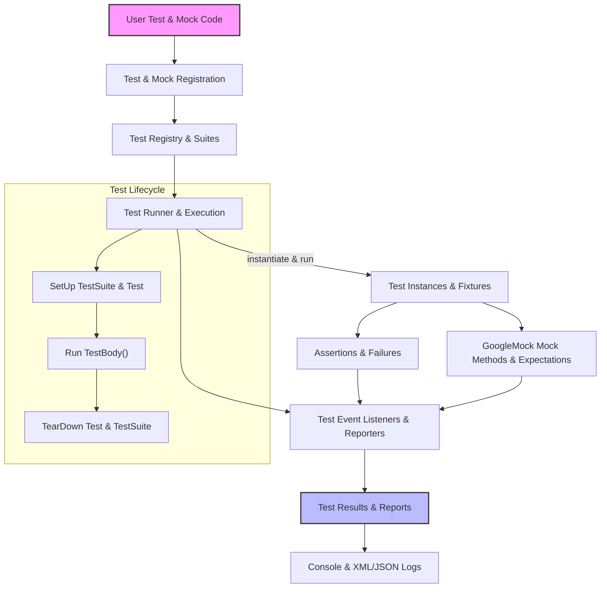

# Core System Architecture

GoogleTest and GoogleMock together form a unified, powerful C++ testing framework designed for creating, managing, and running automated tests and mocks efficiently. This guide walks you through the major architectural components and workflows that process your user-written tests and mocks, culminating in detailed execution and rich reporting.

---

## Overview

The core system architecture of GoogleTest revolves around enabling seamless test discovery, execution, assertion handling, and reporting. It tightly integrates the GoogleMock mocking framework for enhanced unit test expressiveness and isolation.

At a high level, your test binary consists of:

- Your **test code and mocks** (written with GoogleTest and GoogleMock APIs),
- The **Test Registry and Test Suites**,
- The **Test Runner & Execution Engine**,
- The **Assertion Framework**, and
- The **Event Listener & Reporting System**.

These components interoperate to provide an automated, maintainable, and highly productive test development environment.

---

## Major Components

### 1. Test Definition & Registration

- **Macros like `TEST`, `TEST_F`, `TEST_P`, and `TYPED_TEST`** define individual tests and fixtures.
- Each test registers itself automatically at static initialization time, creating instances of `TestInfo`.
- Tests are logically grouped into **Test Suites** (`TestSuite` class), which hold multiple related tests sharing a fixture.
- The **Test Registry** keeps track of all TestSuites and their constituent tests. It ensures no test runs without proper registration.

### 2. Test Execution Engine

- Managed by the singleton `UnitTest` object, which provides the main point of control.
- Users invoke `RUN_ALL_TESTS()` to execute all registered tests.
- The execution flow:
  1. Filters tests by name, disabling or skipping those that don't match the filter or sharding rules.
  2. Runs global test environments registered via `testing::AddGlobalTestEnvironment`.
  3. Sequentially executes each TestSuite:
      - Calls suite-level setup (`SetUpTestSuite()`).
      - Runs each enabled Test:
        - Creates a Test instance from the factory registered with `TestInfo`.
        - Invokes `SetUp()`, `TestBody()` (test code), and `TearDown()`.
        - Captures all assertions and failures.
      - Calls suite-level teardown (`TearDownTestSuite()`).
  4. Tears down global environments.
  5. Collects and aggregates results.

### 3. Assertion Framework

- Assertions like `ASSERT_EQ`, `EXPECT_TRUE`, `ASSERT_DEATH` report test success or failure.
- Each assertion produces a `TestPartResult` containing status (success, failure, skip), location, and message.
- Failures increment appropriate counters and may abort the current test depending on fatal/non-fatal nature.
- The framework provides rich predicate assertions, exception assertions, and customized matchers.

### 4. Mocking Subsystem (GoogleMock)

- Users define mock classes with `MOCK_METHOD` macros.
- Expectations (`EXPECT_CALL`) specify how mock methods should be called and their behavior.
- GoogleMock intercepts calls to mocked methods, verifies expectations, and provides default or custom actions when invoked.
- Supports sequencing, cardinalities, actions, matchers, and side-effect simulation.

### 5. Test Event Listeners & Reporting

- `TestEventListener` interface allows reacting to major test lifecycle events (start/end of program, iteration, suite, test, assertions).
- Default listeners handle console output, XML and JSON report generation, and test listing.
- Users can add or replace listeners to customize output formats and integrate with CI tools.

---

## Flow From User Tests to Result Processing

1. **User writes tests** using GoogleTest and optionally mocks using GoogleMock.
2. Each test is registered into the global registry during program initialization.
3. `RUN_ALL_TESTS()` triggers the `UnitTest::Run()` method:
   - Initializes the test environment.
   - Applies filters and sharding rules.
   - Runs test suites and their tests, capturing results and exceptions.
4. Assertions inside tests produce success or failure results.
5. Mock expectations are verified automatically after test execution.
6. Event listeners report detailed test progress, results, failures, skips.
7. Test results are aggregated and the overall test program status is returned.

---

## System Components Diagram

---

## Practical Tips & Best Practices

- **Always use test fixtures** (`TEST_F`) to share common setup and teardown.
- **Leverage parameterized and typed tests** to avoid duplication and increase coverage.
- Use **mocking** judiciously to isolate units under test and control dependencies.
- Use **event listeners** to customize results reporting in your CI/CD setup.
- Use **test filtering and sharding** flags for running subsets or parallel portions of tests.
- Ensure **exception and failure handling** are properly configured to catch test crashes.

---

## Troubleshooting & Common Issues

- Tests not running: check name filters and sharding environment variables.
- Unexpected test failures: verify correct setup/teardown in fixtures.
- Mock expectations not triggered: use `ON_CALL` to set default behavior before asserting with `EXPECT_CALL`.
- Test result reporting issues: confirm listeners and output paths are correctly set.

---

## Further Reading

- [Test Discovery and Lifecycle](../architecture-overview/test-lifecycle) to understand detailed lifecycle events.
- [Integration and Extensibility Points](../architecture-overview/integration-extensions) for custom listener and environment hooks.
- Guides on [Value- and Type-Parameterized Tests](../../concepts/test-data-and-types/parameterized-tests) and [Mocks](../../concepts/mocking-stubs/mock-class-anatomy).
- API References for [Test Definition & Execution](../../api-reference/core-testing-api/test-definition-execution) and [Mocking API](../../api-reference/mocking-api/mock-methods).

---

This architecture ensures that GoogleTest and GoogleMock provide a robust, extensible foundation for creating dependable, maintainable C++ tests with consistent execution and comprehensive reporting.