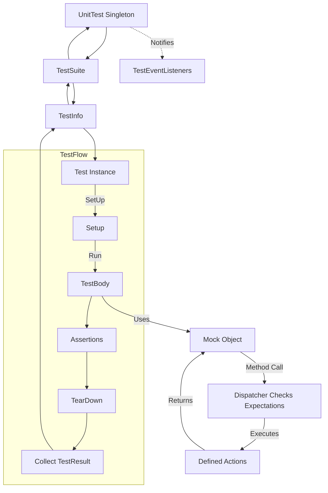

# Core Components & Test Dataflow

GoogleTest and GoogleMock are built upon a set of fundamental core objects that orchestrate the process of defining, executing, and reporting tests. Understanding these core components—such as **Test**, **TestSuite**, **UnitTest**, and **Mock**—and how they interact to drive a typical test run is essential to mastering GoogleTest's testing workflow.

---

## Key Core Components

### Test

The **Test** object represents an individual test case: a single logical unit of testing that includes setup, execution, assertions, and teardown.

- Each **Test** is defined using macros like `TEST` or `TEST_F`.
- It inherits from the `testing::Test` class.
- Encapsulates the test body to be run and manages the setup and cleanup related to that specific test.
- Tracks failures and successes during execution.

### TestSuite

A **TestSuite** is a collection of related tests.

- Groups tests logically, often by the class or functionality they are testing.
- Supports shared setup and teardown at the suite level via `SetUpTestSuite` and `TearDownTestSuite` methods.
- Enables aggregated tracking of test results, such as counting passed, failed, or skipped tests within the suite.

### UnitTest

The **UnitTest** class is a singleton representing the entirety of the current test program execution.

- Holds all registered test suites and their tests.
- Manages the lifecycle of the tests, from initialization and iteration to final reporting.
- Provides tracking and querying of global test execution statistics.
- Acts as the primary interface for the test runner executing `RUN_ALL_TESTS()`.

### Mock (from GoogleMock)

Mocks enable behavior verification of objects in isolation.

- Mock classes are created with the `MOCK_METHOD` macro to create mock methods.
- Mocks intercept calls, verify expectations, and simulate object interactions.
- Enforce call sequence, call count, and argument validation.
- Associate with expectations and actions to define precise testing scenarios.

---

## Test Lifecycle and Dataflow

Understanding how a test flows from registration through execution to reporting helps unlock the intuition behind GoogleTest's design.

### Typical Test Run Flow:

1. **Test Registration**
   - Tests are automatically registered using the `TEST` family of macros.
   - Each test registers itself with its parent `TestSuite`.
   - The test suite itself is registered with the global `UnitTest` singleton.

2. **Initialization and Setup**
   - `UnitTest` initializes all registered environments.
   - Before executing a test suite, `SetUpTestSuite()` is called to prepare shared resources.

3. **Test Execution**
   - For each test in the suite:
     - A fresh **Test** object is instantiated.
     - `SetUp()` is called to prepare test-specific resources.
     - `TestBody()` runs the actual test code.
     - Assertions evaluate conditions, reporting success or failure.
     - `TearDown()` cleans up test-specific resources.
     - The **Test** object gathers test results.

4. **Test and Suite Teardown**
   - After all tests are run, `TearDownTestSuite()` is called for the test suite.
   - The `UnitTest` object aggregates results across all suites.

5. **Reporting**
   - Final test statistics and results are reported.
   - Event listeners notify about test lifecycle events.
   - XML or JSON reports can be generated based on test outcomes.

### Mock Interaction in Tests

- Mock objects respond to method calls during the test.
- Expectations set on mock methods define allowed behavior and verify calls.
- When a mock method is invoked, GoogleMock's dispatcher checks expectations, executes actions, and logs results or errors.

---

## Detailed Component Interactions

### Test, TestSuite, and UnitTest Classes

- `UnitTest` owns the set of all `TestSuites`.
- Each `TestSuite` owns its collection of `TestInfos` representing tests.
- A `TestInfo` object manages a single `Test` instance, orchestrating its construction, execution, and destruction.
- Tests themselves derive from `testing::Test` and implement the actual test logic.

### Test Result Propagation

- Each **Test** produces a `TestResult` that encapsulates outcome, including passes, failures, skips, and timing.
- The TestSuite collects and aggregates test results.
- The `UnitTest` aggregates results across all suites to produce the overall test program status.

### Event Listeners and Notifications

- GoogleTest supports `TestEventListener` interfaces.
- These listeners receive callbacks for lifecycle events (test start/end, assertion failures, suite start/end).
- Custom listeners can be added to log, report, or otherwise respond to test progress.

### Mock Objects and Expectations

- Mocks specify expected calls via `EXPECT_CALL` macros.
- Calls to mock methods are checked against these expectations.
- GoogleMock tracks call counts, argument matching, sequences, and action invocations.
- Outstanding expectations lead to test failures if unmet.

---

## Example: Visualizing the Test Dataflow

This diagram captures how tests are managed and executed within GoogleTest, showing how mocks interact during test execution and how events inform listeners.

---

## Practical Tips & Best Practices

- **Isolate tests**: Each `Test` runs independently with its own fixture instance to avoid state leakage.

- **Use TestSuites wisely**: Group related tests to share common setup and teardown.

- **Define clear expectations on Mocks**: Use `EXPECT_CALL` minimally and favor `ON_CALL` for default behavior to avoid brittle tests.

- **Leverage listeners**: Use event listeners to integrate custom logging, reporting, or resource management.

- **Record properties**: Use `RecordProperty()` to attach metadata to tests, aiding in richer reporting.

- **Understand test execution order** is undefined; do not write tests that depend on order except with explicit sequences.

---

## Troubleshooting Common Issues

- **Unexpected Tests Not Running**: Ensure tests are properly registered and not filtered out via `--gtest_filter`.

- **Test Fails Silently**: Check for correct use of `ASSERT_` vs `EXPECT_`; fatal failures abort current function but may not stop entire test unless structured accordingly.

- **Mocks Generate Unexpected Call Warnings**: Consider converting mocks to `NiceMock` if uninteresting calls are expected; review expectation coverage.

- **Test Order Dependencies**: Avoid relying on the order of test execution unless using `Sequence` or `After` clauses explicitly.

---

## Summary

The core components of GoogleTest and GoogleMock act together to enable robust and scalable C++ testing. From the definition of individual tests via **Test**, grouping tests into **TestSuites**, orchestrating the entire run through **UnitTest**, to the powerful behavior verification with **Mocks**, this system supports complete test lifecycle control. Understanding these pieces and their orchestration demystifies how your tests run and how to write effective tests that fit seamlessly into this architecture.

---

## See Also

- [GoogleTest Primer](../overview/product-introduction/what-is-googletest)
- [System Architecture Overview](/overview/architecture-concepts/system-architecture)
- [Core Concepts & Terminology](/overview/architecture-concepts/core-concepts-terminology)
- [Mock Object Definition and Usage](/api-reference/gmock-mocking-apis/mock-object-definition)
- [Setting Expectations and Call Control](/api-reference/gmock-mocking-apis/expectations-and-control)
- [Assertions Reference](../api-reference/gtest-core-apis/assertions)

---

## Source

<Source url="https://github.com/google/googletest" branch="main" paths={[{"path": "googletest/include/gtest/gtest.h", "range": "150-730"},{"path": "docs/reference/testing.md", "range": "60-294"},{"path": "docs/primer.md", "range": "20-108"},{"path": "docs/advanced.md", "range": "136-721"},{"path": "docs/reference/mocking.md", "range": "18-423"}]} />
