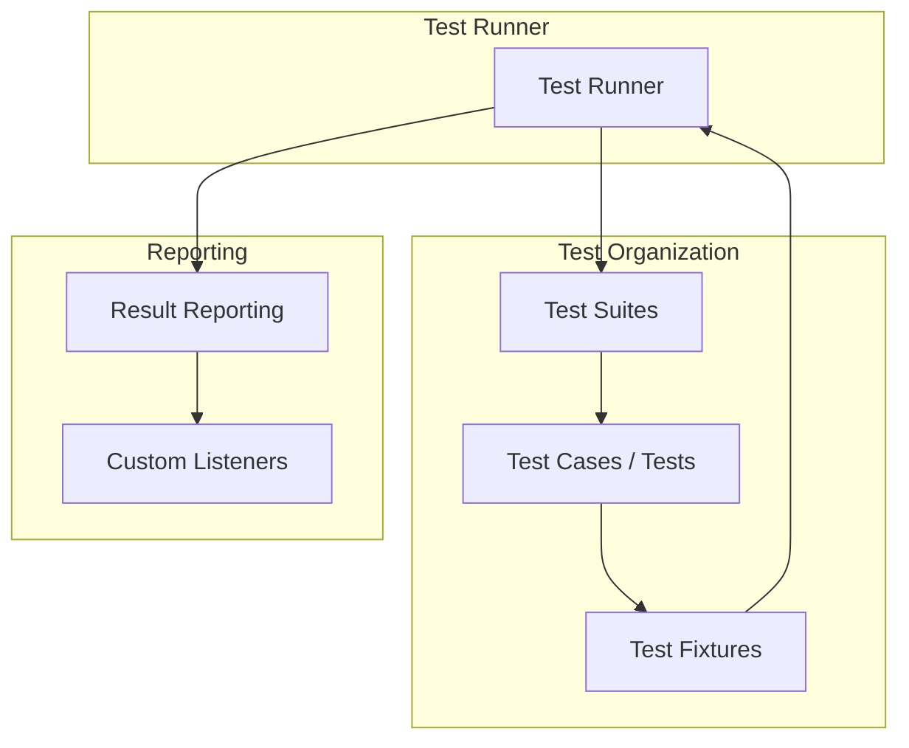

# Core Components & Architecture

Explore the fundamental building blocks of GoogleTest—the test runner, test cases, test fixtures, and the extensible result reporting system. Understand how these components collaborate to provide automated test discovery, isolated execution, and dependable results across platforms.

---

## Overview of Core Components

GoogleTest is designed with a modular architecture where each component plays a pivotal role in creating a seamless and efficient testing experience. This section introduces the essential elements and how they work together.

### Test Runner

The Test Runner is the heart of GoogleTest's execution engine. It automatically discovers all tests in your program, orchestrates their execution, and aggregates the results. Users benefit from:

- **Automated test discovery:** No need to manually list tests; GoogleTest gathers them via registration.
- **Isolated execution:** Each test runs independently to avoid side effects, helping in pinpointing failures.
- **Flexible invocation:** Easily run all or subsets of tests using filters.

**User Intent:** Run your tests efficiently and receive clear feedback without hassle.

### Test Cases & Test Suites

Though terminology evolved, GoogleTest organizes tests into logical groups known as test suites (previously called test cases). Each test suite contains multiple individual tests:

- Tests in a suite share a name prefix, helping structure test code logically.
- Grouping related tests improves organization, maintainability, and selective execution.

```cpp
TEST(TestSuiteName, TestName) {
  // Test code
}
```

Tests within the same suite share a conceptual boundary but execute independently.

### Test Fixtures

Test fixtures enable users to configure common objects or state shared among multiple tests within a suite:

- Derived classes from `testing::Test` house setup and teardown code.
- Use `SetUp()` and `TearDown()` methods to prepare and clean resources.
- Each test runs on a fresh instance of the fixture, guaranteeing isolation.

```cpp
class MyTestFixture : public ::testing::Test {
 protected:
  void SetUp() override {
    // Initialize shared test state
  }

  void TearDown() override {
    // Clean up
  }

  // Shared objects
};

TEST_F(MyTestFixture, Test1) {
  // Access shared objects
}
```

This approach minimizes duplication and keeps tests clean and focused.

### Result Reporting System

GoogleTest provides an extensible reporting system delivering detailed test outcomes:

- Reports include success, non-fatal failures, and fatal failures with file and line references.
- Supports output to console and XML formats compatible with CI systems.
- Users can implement custom listeners to integrate GoogleTest results with other tooling.

**Benefit:** Capture rich feedback to diagnose issues quickly and automate quality gates.

---

## Interplay Between Components

GoogleTest’s architecture leverages each component synergistically, ensuring robust and maintainable test runs.

1. **Test Registration:** Test cases/suites and fixtures are registered at compile-time via macros.
2. **Test Discovery:** The Test Runner queries registered tests transparently.
3. **Fixture Setup:** Before each test, the Test Runner instantiates a new fixture and invokes `SetUp()`.
4. **Test Execution:** The specific test function runs.
5. **Fixture Teardown:** Runs `TearDown()` and destroys the fixture object.
6. **Result Collection:** Results are recorded and dispatched to listeners.

This process ensures:
- No residual state between tests and reliable reproducibility.
- Clear relationship mapping from fixtures to tests and their outcomes.

---

## Architecture Enabling Key User Scenarios

### Automated Test Discovery

Users want to write tests without boilerplate enumeration. GoogleTest achieves this by:

- Using macros (`TEST()`, `TEST_F()`) that automatically register tests in internal data structures.
- The Test Runner scans these registries at runtime to build test lists.

### Isolated Test Execution

To diagnose issues effectively, each test runs in isolation:

- GoogleTest creates a fresh test fixture instance for every test function.
- `SetUp()` prepares the environment; `TearDown()` cleans up afterward.
- Test independence means flaky or side-effect-prone tests can be spotted easily.

### Reliable Result Reporting

Accurate feedback drives confidence:

- Assertions report detailed locations and messages for failures.
- Continued execution after non-fatal failures lets users see multiple issues in one run.
- Support for custom listeners allows adapting results for complex test harnesses.

---

## Practical Tips and Best Practices

- **Group related tests:** Use test suites to mirror your code’s logical structure.
- **Leverage fixtures:** Avoid repeated setup by sharing common test data.
- **Keep tests independent:** Avoid inter-test dependencies for easier debugging.
- **Use assertions wisely:** Favor non-fatal (`EXPECT_*`) where possible, reserving fatal (`ASSERT_*`) for critical checks.
- **Customize reporting:** Use listeners or XML output to integrate with CI pipelines.

---

## Troubleshooting Common Component Issues

- **Tests not discovered:** Make sure tests are defined via `TEST()` or `TEST_F()`, and linked properly.
- **Fixture setup not running:** Confirm `SetUp()` is correctly spelled and `override` is used.
- **State leakage between tests:** Avoid static or global mutable states affecting multiple tests.
- **Verbose output not showing:** Adjust `--gtest_verbose` flags or listeners.

---

## Visualization of Component Relationships



---

## Summary

This page detailed the core components that make GoogleTest robust and user-friendly. Users gain the ability to write tests grouped logically into suites and fixtures, run them isolatedly via the test runner, and get detailed reports suitable for diverse environments.

For smooth adoption, focus on structuring tests clearly, leverage fixtures for shared data, and explore custom reporting options to fit your needs.

---

## Related Documentation

- [GoogleTest Primer](https://github.com/google/googletest/blob/main/docs/primer.md): Learn foundational test writing concepts.
- [Test Cases and Fixtures API](https://github.com/google/googletest/blob/main/api-reference/gtest-core/test-case-and-fixture.md): Explore test organization and fixture lifecycle.
- [Feature Overview](https://github.com/google/googletest/blob/main/overview/feature-highlights-integration/feature-overview.md): Discover GoogleTest’s capabilities.
- [Integration & Ecosystem](https://github.com/google/googletest/blob/main/overview/feature-highlights-integration/integration-ecosystem.md): Understand build system and IDE integration.

For users writing complex mocks:
- [Mocking Reference](https://github.com/google/googletest/blob/main/docs/reference/mocking.md)
- [Expectations, Matchers, & Actions Concepts](https://github.com/google/googletest/blob/main/concepts/mocking-essentials/expectations-matchers-actions.md)

---

## Next Steps

- Start by writing simple tests using `TEST()`;
- Group related tests with fixtures and `TEST_F()`;
- Familiarize yourself with assertions and reporting customization;
- Explore advanced topics such as parameterized tests and custom listeners.

---

Embrace GoogleTest’s architecture to unlock fast, reliable, and maintainable C++ testing at scale.