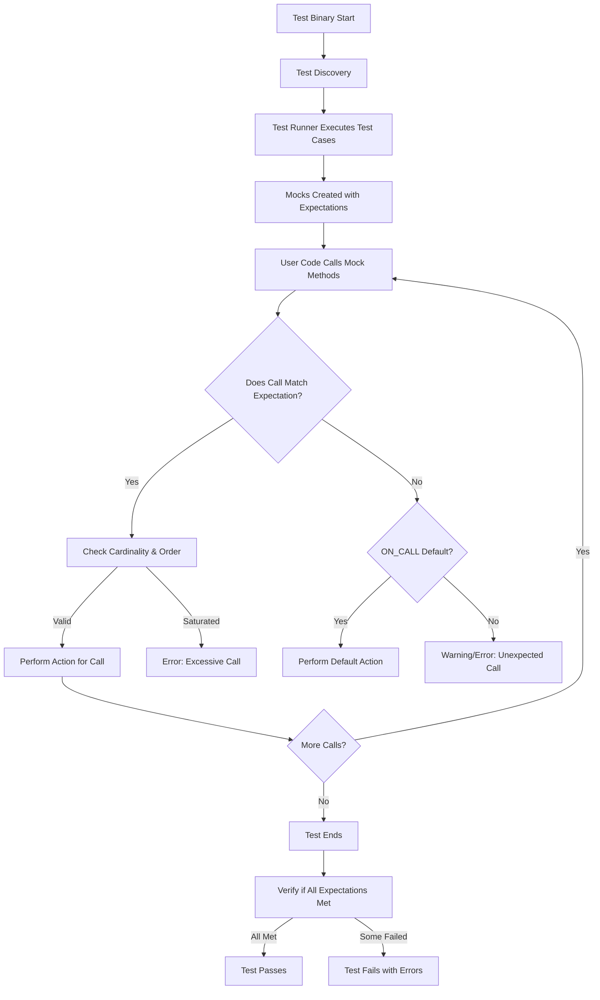

# Data Flow and Test Execution

Explore how test discovery, execution, and reporting are handled in GoogleTest and GoogleMock, illustrating the journey from test definition to result output. This guide explains the interactions between GoogleTest and GoogleMock during a typical test run.

---

## Introduction to the Test Execution Flow

When you write tests using GoogleTest and GoogleMock, the framework automates the process of discovering, executing, and reporting tests. Understanding this flow helps you craft robust tests and diagnose issues related to test execution and mock behavior.

The test execution journey involves:

- **Test Discovery:** Automatically finding the tests defined via macros like `TEST()`, `TEST_F()`, and those incorporating mocks.
- **Test Execution:** Running the identified tests while honoring expectations, matchers, and actions.
- **Result Reporting:** Providing clear feedback on test results, including error messages, warnings, and success confirmations.

## From Test Definition to Execution

### Test Discovery

GoogleTest leverages macros such as `TEST()`, `TEST_F()`, and GoogleMock macros such as `EXPECT_CALL()` and `ON_CALL()` to register test cases and mock expectations. The framework collects:

- **Test Cases and Suites:** Defined test functions with names and optional fixtures.
- **Mock Expectations:** Declarative specifications on mock method calls and behaviors.

This registration happens during static initialization, prior to test execution.

### Test Execution Process

Once the test binary starts, GoogleTest's test runner iterates over the discovered tests.

- Each test is executed within a controlled environment.
- Mock objects intercept function calls and apply expectations as specified by `EXPECT_CALL` and default behaviors by `ON_CALL`.
- When a mock method is invoked, the following happens:
  - The most recent matching expectation is located (searching in reverse order as they override earlier ones).
  - The call is checked against cardinalities (call counts), sequences, and pre-requisites.
  - Appropriate actions (`WillOnce()`, `WillRepeatedly()`, or default actions) are executed.
  - Violations trigger immediate failures with informative messages and stack traces, helping pinpoint problems early.

### Reporting

GoogleTest reports outcomes including:

- **Test Pass:** The tests completed matching all expectations.
- **Test Failures:** When an unexpected call happens, arguments do not match, cardinalities are violated, or prerequisites aren't met.
- **Warnings:** Uninteresting calls (mock methods called without an expectation) trigger warnings unless suppressed by `NiceMock` or other mechanisms.

A verbose mode (`--gmock_verbose=info`) can be enabled to log more detailed traces of expectation setups and mock calls.

---

## Interactions Between GoogleTest and GoogleMock

GoogleMock extends GoogleTest by enabling fine-grained control of function call expectations and behavior simulation.

### Key Interaction Points

- **Test Setup:** When `EXPECT_CALL()` or `ON_CALL()` is invoked, GoogleMock registers expectations and default actions tied to the mock objects.
- **Mock Method Calls:** These are routed through GoogleMock's internal dispatcher, which matches calls to expectations, tracks invocation counts, manages sequences, and executes associated actions.
- **Verification:** Upon test completion or mock destruction, GoogleMock verifies that all expectations were satisfied. Violations are reported as GoogleTest failures.

### Handling Expectations

- Each `EXPECT_CALL()` generates an `Expectation` object that records:
  - Matchers and argument conditions
  - Cardinality (times expected to be called)
  - Possible call ordering constraints (`InSequence`, `After`)
  - Actions specifying the mocked method’s output or side effects

- Mock functions evaluate incoming calls against these expectations atomically ensuring thread-safety.

- GoogleTest integrates the results and emits test outcomes accordingly.

---

## Understanding Expectations and Actions

### Setting Expectations with `EXPECT_CALL`

- Specifies how many times a method is expected to be called.
- Supports clauses such as `.Times()`, `.InSequence()`, `.After()`, `.WillOnce()`, `.WillRepeatedly()`, and `.RetiresOnSaturation()`.

Example:

```cpp
EXPECT_CALL(mock_obj, SomeMethod(_, _))
   .Times(2)
   .WillOnce(Return(5))
   .WillRepeatedly(Return(10));
```

Interpretation:
- The mock expects `SomeMethod` to be called twice.
- Returns 5 the first time, 10 every time after.

### Default Behaviors with `ON_CALL`

- Defines behavior for calls that don't have explicit `EXPECT_CALL`.
- Provides a fallback action without setting strict call-count expectations.

Example:

```cpp
ON_CALL(mock_obj, SomeMethod(_))
    .WillByDefault(Return(0));
```

### Managing Call Order and Cardinality

- `InSequence`: Groups expectations into sequences where calls must occur in order.
- `After`: Specifies that a call must occur after other specified expectations.
- Cardinalities enforce how many times an expectation is satisfied.

Failing to obey these rules leads to failures showing detailed messages indicating the cause.

---

## Practical Call Flow in a Mocked Test

1. **Test begins.**
2. **Mocks and expectations are instantiated and set.**
3. **User code calls mock methods.**
4. **Each mock method call:**
   - Lock is acquired ensuring thread-safe verification.
   - Latest matching expectation is found.
   - If the call matches expectation and is permitted by cardinality and order constraints:
     - Call count is incremented.
     - Associated action is performed.
     - If the expectation is saturated and `RetiresOnSaturation()` is specified, expectation is retired.
   - Else if no matching expectation found:
     - If default `ON_CALL` is present, its action is performed.
     - Otherwise, an error or warning is logged depending on mock type (nice, naggy, strict).
5. **Test ends, mock destructors verify all expectations satisfied.**
6. **Results are reported by GoogleTest runner.**

---

## Handling Common Scenarios and Pitfalls

### Uninteresting Calls

- Calls to mock functions without expectations trigger warnings.
- Use `NiceMock` to suppress warnings when unexpected calls are acceptable.
- Use catch-all expectations (`EXPECT_CALL(...).Times(AnyNumber())`) to explicitly permit unexpected calls.

### Excessive Calls

- Calling a mock function more times than expected is immediately reported as failure.
- Use `RetiresOnSaturation()` to retire expectations once saturation is reached.

### Unsatisfied Expectations

- Missing calls or incorrect call counts cause test failures detailing which expectation wasn’t met.

### Unsatisfied Prerequisites

- If an expectation has dependent expectations (via `.After` or sequences), failing to respect the ordering causes failures with diagnostic messages about unsatisfied prerequisites.

### Debugging Tips

- Enable verbose mode (`--gmock_verbose=info`) for call and expectation traces.
- Carefully order `EXPECT_CALL`s so that more specific expectations come last; this controls precedence.
- Use sequences and `.After` to explicitly express expected call orders.
- Use descriptive `.Description()` to name expectations for clearer logs.

---

## Summary Diagram of Test and Mock Call Flow



---

## Additional Resources

For deeper understanding and advanced usage of GoogleTest and GoogleMock in the context of test execution and mocking flows, consult:

- [Core Components](https://github.com/google/googletest/tree/main/docs/concepts/architecture-overview/core-components.md) for foundational terminology.
- [Mocking Reference](https://github.com/google/googletest/tree/main/docs/reference/mocking.md) for detailed mock API documentation.
- [gMock Cheat Sheet](https://github.com/google/googletest/tree/main/docs/gmock_cheat_sheet.md) for quick usage reference.
- [gMock for Dummies](https://github.com/google/googletest/tree/main/docs/gmock_for_dummies.md) for approachable introduction to mocking.
- [Installation Guide](https://github.com/google/googletest/tree/main/docs/getting-started/setup-requirements-installation/installing-googletest.md) to ensure a smooth setup.
- [Running Tests](https://github.com/google/googletest/tree/main/docs/getting-started/first-run-validation/running-tests.md) for execution instructions.
- [gMock Cookbook](https://github.com/google/googletest/tree/main/docs/gmock_cook_book.md) for recipes on mocking techniques.


---

This understanding of data flow and test execution enables you to write precise, maintainable, and efficient tests using GoogleTest and GoogleMock, gaining confidence that your tests verify the intended behaviors and interactions correctly.