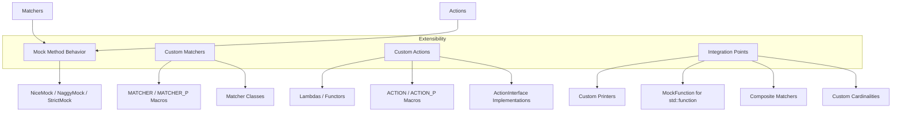

# Extensibility and Customization

GoogleMock is a powerful C++ mocking framework designed for flexible and expressive unit testing. While it provides a rich set of built-in functionalities, its true power lies in its extensibility and customization capabilities. This guide focuses exclusively on how you can extend GoogleMock to meet domain-specific testing needs by creating custom matchers, actions, behaviors, and integrating with other systems.

---

## Why Extend GoogleMock?

GoogleMock excels in enabling interaction-based testing through declarative mocking. However, complex domains often require more specialized validations or behaviors than those offered out-of-the-box. Extending GoogleMock lets you:

- Encode business domain rules into custom argument matchers.
- Define nuanced mock method behaviors using tailored actions.
- Simplify test logic with reusable, readable extensions.
- Integrate GoogleMock with external testing utilities or custom verification logic.

By embracing extensibility, you transform GoogleMock from a generic mocking tool into a finely tuned testing instrument that communicates your intent clearly.

---

## Custom Matchers

Matchers specify the criteria used to validate mock method arguments. While GoogleMock offers numerous built-in matchers, creating custom matchers lets you capture complex or domain-specific validation logic succinctly.

### Approaches to Custom Matchers

1. **Using `MATCHER` and `MATCHER_P` Macros**

   These macros provide a convenient way to define matchers with minimal boilerplate. For example:

   ```cpp
   MATCHER(IsDivisibleBy7, "") { return (arg % 7) == 0; }
   
   EXPECT_CALL(mock, Foo(IsDivisibleBy7()));
   ```

   Parameterized versions (`MATCHER_P`) let you pass in matcher parameters:

   ```cpp
   MATCHER_P(HasAbsoluteValue, value, "") { return abs(arg) == value; }
   
   EXPECT_CALL(mock, Foo(HasAbsoluteValue(10)));
   ```

2. **Implementing Matcher Classes Directly**

   For more control and better compile-time errors, define a matcher as a class implementing:

   - `bool MatchAndExplain(const T& val, std::ostream* os) const;`
   - `void DescribeTo(std::ostream* os) const;`
   - `void DescribeNegationTo(std::ostream* os) const;`

   This approach is suited when:

   - You want polymorphic matchers usable for multiple types.
   - You need fine-tuned error messages.
   - The matcher will be widely reused.

   Example outline:

   ```cpp
   class DivisibleBy7Matcher {
    public:
     using is_gtest_matcher = void;

     bool MatchAndExplain(int n, std::ostream* os) const {
       const int remainder = n % 7;
       if (remainder != 0 && os != nullptr) {
         *os << "the remainder is " << remainder;
       }
       return remainder == 0;
     }

     void DescribeTo(std::ostream* os) const {
       *os << "is divisible by 7";
     }

     void DescribeNegationTo(std::ostream* os) const {
       *os << "is not divisible by 7";
     }
   };

   inline testing::Matcher<int> DivisibleBy7() {
     return testing::Matcher<int>(DivisibleBy7Matcher());
   }
   ```

### Best Practices and Tips for Matchers

- **Pure functions**: Matchers must have no side-effects, ensuring repeatable and reliable matching.
- **Clear descriptions**: Provide descriptive `DescribeTo` and `DescribeNegationTo` to guide users on failures.
- **Polymorphic matchers**: Use method templates for `MatchAndExplain` to enable flexibility across types.
- **Parameter inclusion**: Include matcher parameters in the failure messages when using parameterized matchers.

---

## Custom Actions

Actions define what a mock method does upon invocation. While GoogleMock provides many built-in actions like `Return`, `Invoke`, `SetArgPointee`, or `Throw`, creating custom actions enables precise behavioral control tailored to your testing scenarios.

### Ways to Create Custom Actions

1. **Using Lambdas or Callables**

   The simplest method for custom actions is to supply a lambda or function object compatible with the mocked method's signature:

   ```cpp
   EXPECT_CALL(mock, Foo(_))
       .WillOnce([](int x) { return x * 42; });
   ```

2. **Using `ACTION` Macros**

   For more reusable or parameterized actions, use `ACTION`, `ACTION_P`, or `ACTION_Pk` macros:

   ```cpp
   ACTION(IncrementArg1) { return ++(*arg1); }
   EXPECT_CALL(mock, Foo(_)).WillOnce(IncrementArg1());

   ACTION_P(Add, n) { return arg0 + n; }
   EXPECT_CALL(mock, Foo(_)).WillOnce(Add(5));
   ```

   These macros allow access to mock function arguments via `arg0`, `arg1`, etc.

3. **Implementing Action Classes**

   For complex behavior or polymorphic actions usable across many function signatures, implement `::testing::ActionInterface<F>` where `F` is the function type, providing a method:

   ```cpp
   template <typename Result, typename ArgumentTuple>
   Result Perform(const ArgumentTuple& args) const;
   ```

   Then wrap it using `MakeAction` and return an `Action<F>`. This ensures type safety and broad applicability.

4. **Polymorphic Actions**

   Use `MakePolymorphicAction()` to define actions usable on mocks with varying signatures, increasing reusability.

### Best Practices and Tips for Actions

- Chain multiple behaviors with `DoAll()`, with the last action providing the return value.
- Be cautious to not return a moved-from value multiple times with `Return(std::move(...))`; prefer lambdas that create fresh values.
- Use `Invoke` variants to call existing functions, methods, or functors, optionally discarding arguments if needed.
- Use `SetArgPointee`, `DeleteArg`, or `SaveArg` to manipulate output parameters safely.

---

## Behavioral Modes and Call Reaction

Extensibility also includes how your mocks respond to unexpected or uninteresting calls.

- Use `NiceMock<T>` to suppress warnings for calls without `EXPECT_CALL`.
- Use `NaggyMock<T>` (default) to warn on uninteresting calls.
- Use `StrictMock<T>` to fail tests upon uninteresting calls.

This control allows you to tune test strictness without altering the primary mock class.

---

## Integration Points for Extensibility

GoogleMock’s extensibility facilitates integration into broader testing ecosystems:

- **Custom Printers**: Teach GoogleTest/GoogleMock how to print your types for better diagnostic messages.
- **MockFunction**: Easily mock `std::function`-based callbacks.
- **Composite Matchers**: Build matchers that incorporate other matchers for complex argument validations.
- **Cardinalities**: Define custom call count matchers (`Times`) to capture nuanced behavior.

Extensibility points support composing new building blocks atop the existing framework, preserving test clarity and maintainability.

---

## Common Pitfalls and Troubleshooting in Extensibility

- **Side Effects in Matchers**: Matchers must be pure; do not invoke mock methods or alter state.
- **Uninteresting Call Warnings**: Use `NiceMock` or explicit expectations to avoid spurious warnings.
- **Parameter Commas in MOCK_METHOD**: Wrap complex types with parentheses or use `using` aliases to avoid macro parsing errors.
- **Return Value Lifetime**: Returning references or pointers must ensure objects outlive mock method calls.
- **Action Lifetime**: Actions passed to `WillOnce()` must be callable exactly once; repeated use must use `WillRepeatedly()`.

---

## Example: Defining a Custom Parameterized Matcher

```cpp
MATCHER_P(InClosedRange, low, "") {
  return low <= arg && arg <= this->param;
}

// Usage
EXPECT_CALL(mock, Foo(InClosedRange(5, 10)));
```

Failure messages automatically include the range and indicate the nature of the mismatch.

---

## Summary Diagram of Extensibility Concepts



---

## Resources and Next Steps

- Consult the [gMock Cookbook](https://google.github.io/googletest/gmock_cook_book.html) for practical recipes on creating mocks and extending functionality.
- Review the [Custom Actions and Matchers guide](https://google.github.io/googletest/guides/mock_actions_and_matchers.html) for detailed examples.
- Use the [Mocking Reference](https://google.github.io/googletest/reference/mocking.html) for syntax and API details.
- Explore the [Actions Reference](https://google.github.io/googletest/reference/actions.html) and [Matchers Reference](https://google.github.io/googletest/reference/matchers.html) for built-in features.

---

This focused guide empowers you to harness GoogleMock's full potential by adding precise, reusable extensions to your test code, ensuring your tests remain expressive, maintainable, and aligned with your domain needs.

---