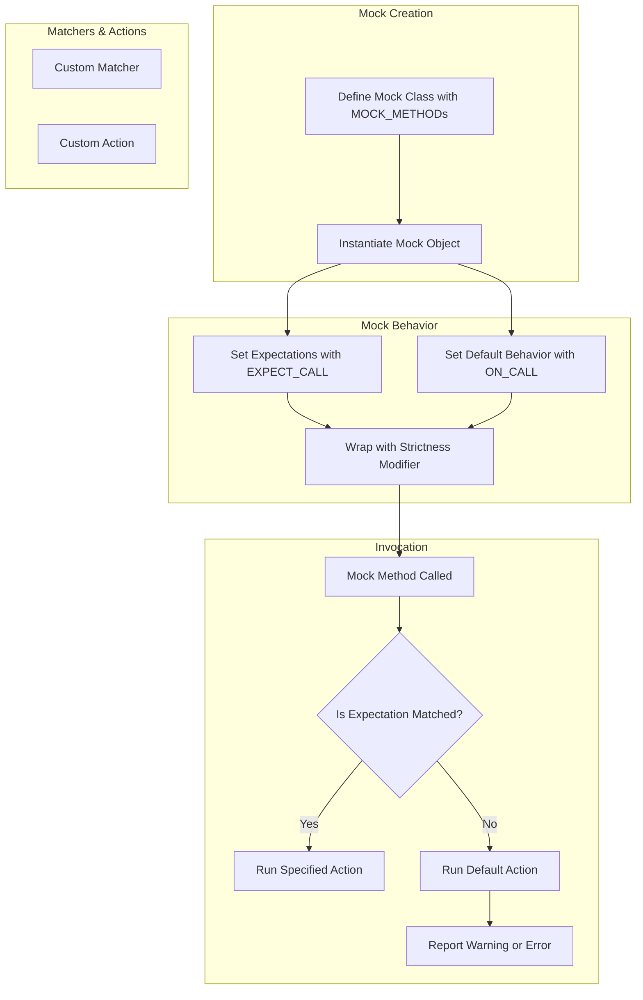

# Extensibility & Customization Points

Discover the extension mechanisms built into GoogleTest and GoogleMock, including user-defined assertions, custom matchers, and how new actions or reporting behaviors can be introduced. This page explains extensibility hooks and what makes the frameworks adaptable to complex testing needs.

---

## Introduction

GoogleTest and GoogleMock are designed not only to provide a rich set of default capabilities but also to empower users to extend and adapt the frameworks to their unique testing scenarios. This page guides you through the key extensibility points that enable customization of assertions, matchers, actions, and behaviors—ensuring that you can tailor the framework to complex needs beyond the out-of-the-box functionality.

Whether you want to add new assertion styles, define intricate matchers, implement custom mock behaviors, or control mock strictness, you will find practical insights and best practices here.

## Understanding Extensibility in GoogleMock

At the heart of GoogleMock's powerful extensibility is its modular architecture that allows integration of user-defined components while seamlessly fitting into its expectation, mocking, and verification workflows.

Users can:

- Define **custom matchers** to express sophisticated argument validation.
- Create **custom actions** to specify specialized mock method responses.
- Tune **mock object behavior** with strictness modes like NiceMock, NaggyMock, and StrictMock.
- Employ **parameterized and templated actions/matchers** to write reusable and type-safe extensions.

The extension mechanisms are intuitive, maintainable, and integrate fully with Google's testing idioms.

## Custom Matchers: Defining Precise Argument Validation

GoogleMock matchers validate mock function call arguments. While it ships with a broad set of built-in matchers, many real-world testing scenarios require domain-specific constraints. You can create your own matchers with two primary approaches:

### Using Matcher Macros

The simplest way to write a new matcher is to use macros like `MATCHER`, `MATCHER_P`, and `MATCHER_Pn` which define matchers that are easy to write and maintain:

```cpp
MATCHER(IsDivisibleBy7, "Checks if a number is divisible by 7") {
  return (arg % 7) == 0;
}

// Usage:
EXPECT_CALL(mock, SomeMethod(IsDivisibleBy7()));
```

The matcher macros let you define the matching condition and optional failure messages clearly, with support for parameters and negations.

### Creating Matcher Classes

For advanced control, you can define a matcher class that implements the matcher interface, supporting:

- `MatchAndExplain` to check if the value matches and optionally explain failures.
- `DescribeTo` and `DescribeNegationTo` for descriptive output in test failures.

Example:

```cpp
class DivisibleBy7Matcher {
 public:
  using is_gtest_matcher = void;

  bool MatchAndExplain(int n, std::ostream* os) const {
    if (n % 7 != 0 && os) {
      *os << "remainder: " << (n % 7);
    }
    return n % 7 == 0;
  }

  void DescribeTo(std::ostream* os) const { *os << "is divisible by 7"; }
  void DescribeNegationTo(std::ostream* os) const { *os << "is not divisible by 7"; }
};

::testing::Matcher<int> DivisibleBy7() {
  return ::testing::MakeMatcher(new DivisibleBy7Matcher());
}
```

Both methods integrate fully with GoogleMock's assertion and reporting systems.

## Custom Actions: Specifying Mock Behavior Beyond Defaults

Actions define what a mock method does when invoked. While GoogleMock provides numerous built-in actions such as `Return()`, `SetArgPointee()`, and `Invoke()`, you can define your own to model complex behavior.

### Defining Actions Via Callables

The modern and simplest approach is to use lambdas, functors, or function pointers compatible with the mock method signature.

Example:

```cpp
EXPECT_CALL(mock, Compute(_))
    .WillOnce([](int x) { return x * x; });
```

### Implementing Action Classes

You can implement the `ActionInterface<F>` for a given mock method type `F` to tightly control execution. This involves providing a `Perform(...)` method to be called when the action fires.

### Parameterized and Template Actions

For reusable, type-safe actions, you can use `ACTION`, `ACTION_P`, and even `ACTION_TEMPLATE` macros that let you write templated actions with explicit compile-time parameters and runtime values.

Example (duplicating an argument):

```cpp
ACTION_TEMPLATE(DuplicateArg,
                HAS_2_TEMPLATE_PARAMS(int, k, typename, T),
                AND_1_VALUE_PARAMS(output)) {
  *output = T(::std::get<k>(args));
}
```

Then you can create specialized actions as:

```cpp
EXPECT_CALL(mock, Foo(_, _)).WillOnce(DuplicateArg<1, unsigned char>(&n));
```

This approach offers powerful expressiveness and performance.

## Mock Object Strictness: NiceMock, NaggyMock, and StrictMock

Your tests can benefit from controlling the strictness of mock objects regarding uninteresting calls (calls to mock methods with no matching expectation):

- **NaggyMock** (default mock behavior): Prints warnings for uninteresting calls.
- **NiceMock**: Silences warnings and ignores uninteresting calls.
- **StrictMock**: Treats uninteresting calls as errors, failing the test.

### How to Use Strictness Modifiers

Wrap your mock class like so:

```cpp
using ::testing::NiceMock;
using ::testing::NaggyMock;
using ::testing::StrictMock;

NiceMock<MockFoo> nice_mock;      // Suppress warnings
NaggyMock<MockFoo> naggy_mock;    // Print warnings (default)
StrictMock<MockFoo> strict_mock;  // Treat as errors
```

These wrappers inherit from your mock class and "inherit" its constructors, enabling seamless substitution.

### Important Caveats

- They affect only uninteresting calls, not unexpected calls.
- They work only for mock methods declared directly in your mock class using the `MOCK_METHOD` macro; inherited mock methods are not always affected.
- Nesting these wrappers is unsupported.

Use them thoughtfully to balance test strictness with maintainability.

## Delegating Calls: To Fakes, Real Objects, or Parent Classes

Extensibility also means you can delegate mock calls to other objects.

- **Delegating to a Fake:** Use `ON_CALL` with lambdas that call a fake implementation inside your mock.

- **Delegating to Real Object:** Retain original behavior inside mocks by forwarding calls.

- **Delegating to Parent Class:** When mocking a concrete class with implemented virtual methods, call the base method explicitly to avoid infinite recursion.

Example delegating to fake:

```cpp
void DelegateToFake() {
  ON_CALL(*this, SomeMethod).WillByDefault([this](Args... args) {
    return fake_.SomeMethod(args...);
  });
}
```

## Extending GoogleTest Assertions

GoogleTest allows you to write your own assertion macros to suit your domain and testing style. This advanced topic ties naturally with custom matchers.

You can:

- Define **user-defined assertions** by implementing functions that return detailed failure messages.
- Combine them with GoogleTest's rich printing and fatal/non-fatal failure macros.

This deepens test readability and diagnostic value.

## Practical Tips & Best Practices

- Prefer the macro-based extensions (`MATCHER`, `ACTION`) for quick and readable additions.
- Use strictness wrappers judiciously: default to NiceMock to reduce noise but switch to StrictMock when you want to enforce call discipline.
- When implementing custom matchers and actions, ensure they are pure, thread-safe, and side-effect-free where expected.
- Use delegation to real or fake implementations sparingly, as it may complicate mocks but can simplify complex behaviors.
- Leverage matcher's description methods to provide helpful diagnostic messages.

## Troubleshooting Common Extensibility Issues

- **Uninteresting call warnings remain with NiceMock:** Verify that mocked methods are declared directly in your mock class using `MOCK_METHOD`.
- **Errors with nested strictness wrappers:** Refrain from nesting NiceMock, NaggyMock, and StrictMock wrappers.
- **Custom action or matcher type mismatches:** Check your types are compatible with the mocked method signature; use `SafeMatcherCast` if appropriate.
- **Compilation slowdowns with large mocks:** Consider moving constructor and destructor definitions to `.cc` files.

## Summary Diagram: Call Flow of Extensibility Components



This simplified flow summarizes how extensibility components participate during mock object setup and invocation.

---

## Additional Resources

- [gMock Cookbook: Writing New Matchers and Actions](https://google.github.io/googletest/gmock_cook_book.html#NewMatchers)
- [Mock Strictness and Behavioral Modes](reference/gmock-mocking-apis/mock-strictness-and-behavior.mdx)
- [gMock Cheat Sheet](docs/gmock_cheat_sheet.md)
- [Mocking Reference](docs/reference/mocking.md)

---

## Links to Related Documentation

- [Core Concepts & Terminology](overview/architecture-concepts/core-concepts-terminology)
- [Mock Object Definition and Usage](api-reference/gmock-mocking-apis/mock-object-definition)
- [Matchers and Actions](api-reference/gmock-mocking-apis/matchers-and-actions)
- [Setting Expectations and Call Control](api-reference/gmock-mocking-apis/expectations-and-control)

---

By mastering these extensibility and customization mechanisms, you gain full control over testing behaviors, enabling tests that are both expressive and resilient to complex software designs.


<Note>
When extending GoogleMock, always ensure your matchers and actions are logically pure and free from side effects outside their intended behavior, to maintain test determinism and reliability.
</Note>