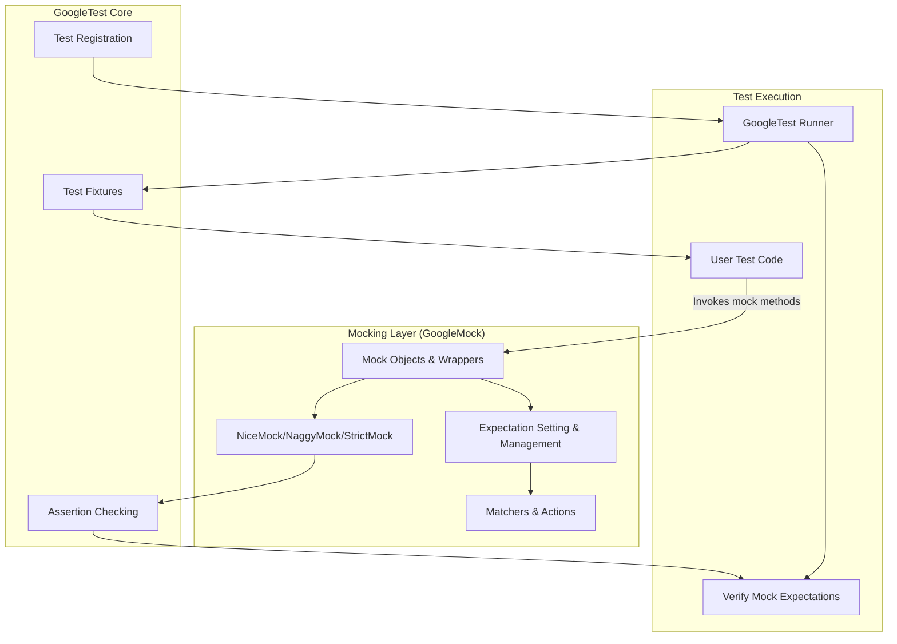

# GoogleMock Integration Model

GoogleMock is architected as a comprehensive extension to GoogleTest, enhancing it with powerful mocking capabilities tailored to C++ unit testing. This integration model explains how GoogleMock builds on top of GoogleTest, providing user-friendly syntax and utilities for creating mock objects, setting expectations, and verifying interactions.

---

## Overview of Integration

GoogleMock seamlessly augments GoogleTest's foundational testing framework by:

- Defining macros and classes that simplify mock creation.
- Providing a rich language for setting expectations and default behaviors.
- Extending test execution with automated verification of mock interactions.

Underlying GoogleMock are core headers and utilities that integrate with GoogleTest’s test runner and assertion engine, allowing users to write expressive and maintainable tests that verify both state and interaction.

---

## Core Mechanisms for Mocking

### MOCK_METHOD Macro

At the heart of GoogleMock’s mocking capabilities is the `MOCK_METHOD` macro, which allows users to declare mock methods in subclasses that override virtual functions from interfaces or base classes. This macro:

- Takes the return type, method name, parameter list, and optional qualifiers.
- Automatically generates mock implementations and hooks for expectations.
- Supports const, override, noexcept, calltype, and reference qualifiers to match method signatures precisely.

Example:

```cpp
class MockFoo : public Foo {
 public:
  MOCK_METHOD(int, GetSize, (), (const, override));
  MOCK_METHOD(void, SetName, (const std::string& name), (override));
};
```

### Setting Expectations and Behaviors

GoogleMock provides two primary macros to specify the usage contracts of mock methods:

- `EXPECT_CALL`: Sets an explicit expectation that a mock method will be called with specific arguments and defines actions (e.g., return values).
- `ON_CALL`: Defines default behavior for a mock method without enforcing a call expectation.

This distinction helps users precisely control when and how mock methods must be invoked, balancing test strictness and flexibility.

Example:

```cpp
// Expect Bar to be called with 5 and return true once
EXPECT_CALL(mock_foo, Bar(5))
    .WillOnce(Return(true));

// Set default action for Bar to return false
ON_CALL(mock_foo, Bar(_))
    .WillByDefault(Return(false));
```

---

## Strictness Modifiers: NiceMock, NaggyMock, StrictMock

GoogleMock integrates nicely with GoogleTest by encapsulating mock objects inside wrappers that control the strictness of uninteresting calls (calls to methods without expectations):

- **NiceMock<T>**: Suppresses warnings for uninteresting calls.
- **NaggyMock<T>**: Prints warnings on uninteresting calls (the default behavior).
- **StrictMock<T>**: Treated uninteresting calls as errors, making tests strict.

These wrappers “inherit” constructors from the base mock class, meaning they respect constructors with parameters. They are essential to managing test verbosity and brittleness with mock objects.

### Usage Example

```cpp
using ::testing::NiceMock;

NiceMock<MockFoo> nice_mock(10, "param");  // Constructs with arguments
EXPECT_CALL(nice_mock, DoSomething());
nice_mock.DoSomething();  // No warnings on other calls
```

### Behavior Summary

| Modifier  | Uninteresting Call Behavior                      | Typical Use Case                        |
|-----------|-------------------------------------------------|---------------------------------------|
| NiceMock  | No warnings or errors                            | Most tests; suppress noisy warnings   |
| NaggyMock | Warnings printed (default)                       | Debugging tests; reviewing calls      |
| StrictMock| Fail test on uninteresting calls                | Highest test strictness; enforcing APIs|

---

## Internal Call Flow

GoogleMock extends GoogleTest’s test execution by inserting verification points that ensure all mock expectations are satisfied once the test completes or when mock objects go out of scope.

Typical flow:

1. Create mock object (possibly wrapped in a strictness modifier).
2. Set default behaviors (`ON_CALL`) and call expectations (`EXPECT_CALL`).
3. Run test code that invokes the mock methods.
4. GoogleMock verifies that all expectations meet their cardinalities.
5. Provide detailed failure reports on unmet expectations or unexpected calls.

---

## Key GoogleMock Headers and Utilities

GoogleMock builds on GoogleTest with these critical components:

- `gmock.h`: Main header exposing `MOCK_METHOD`, `EXPECT_CALL`, `ON_CALL`, and more.
- `gmock-nice-strict.h`: Implements `NiceMock`, `NaggyMock`, and `StrictMock` templates.
- `gmock-spec-builders.h`: Facilities for building and composing mock expectations.
- `gmock-matchers.h` and `gmock-actions.h`: Provide argument matchers and actions to define complex expectations and behaviors.

These headers work cohesively with GoogleTest’s core infrastructure to ensure that mock objects integrate smoothly within the test lifecycle.

---

## User Value and Workflow

By extending GoogleTest’s core, GoogleMock empowers users to write tests that not only validate state but also confirm behaviors and interactions in a highly expressive manner. Users benefit by:

- Simplifying mock class creation via macros.
- Defining precise call expectations and default behaviors.
- Controlling test strictness to balance agility and rigor.
- Diagnosing test failures with clear diagnostics injected by GoogleMock.

Combined with GoogleTest’s assertion and test running capabilities, this integration provides a robust framework for modern C++ testing.

---

## Troubleshooting and Best Practices

- Always define mock methods in the `public:` section for accessibility.
- Use `EXPECT_CALL` to specify precise expectations; prefer `ON_CALL` for defaults.
- Apply strictness wrappers wisely: use `NiceMock` for general use, `StrictMock` sparingly.
- Set expectations **before** exercising the mocks in test code for reliability.
- Utilize sequences and `After` clauses to enforce call order when necessary.
- Avoid over-specification; the framework infers default cardinalities and callable numbers.

---

## Further Reading and Cross-References

- [gMock Cookbook](https://google.github.io/googletest/gmock_cook_book.html) — practical recipes for mock creation and usage.
- [Mocking Reference](https://google.github.io/googletest/reference/mocking.html) — detailed API reference on mock-related macros and classes.
- [gMock Cheat Sheet](https://google.github.io/googletest/gmock_cheat_sheet.html) — concise guide for day-to-day use.
- [Strictness and Mock Behavior Modifiers](https://google.github.io/googletest/reference/strictness.html) — deeper dive into NiceMock, NaggyMock, StrictMock.

---



---

## Source Links

<Source url="https://github.com/google/googletest" paths='[{"path": "googlemock/include/gmock/gmock.h", "range": "1-115"},{"path": "googlemock/include/gmock/gmock-nice-strict.h", "range": "1-240"}]' />

---

## Summary

This document explains how GoogleMock integrates with GoogleTest, extending it with powerful mocking capabilities. It covers essential user-facing mechanisms such as mock creation macros, setting expectations, behavior modifiers (NiceMock, NaggyMock, StrictMock), and how these components work together within GoogleTest’s execution model.

Key sections include:
- Overview of Mocking in GoogleMock
- Core Macros and Usage Patterns (`MOCK_METHOD`, `EXPECT_CALL`, `ON_CALL`)
- Strictness Wrappers for Mocks
- Integration Flow and Verification Process
- Best Practices and Troubleshooting
- Key Headers and Internals
- Architecture Diagram of GoogleMock within GoogleTest

Related references:
- [gMock Cookbook](https://google.github.io/googletest/gmock_cook_book.html)
- [Mocking Reference](https://google.github.io/googletest/reference/mocking.html)
- [Strictness and Behavior Modifiers](https://google.github.io/googletest/reference/strictness.html)
- [gMock Cheat Sheet](https://google.github.io/googletest/gmock_cheat_sheet.html)

Users are encouraged to consult the cookbooks and references for practical recipes and deeper conceptual understanding, as well as strictness guides to tailor mock behaviors to their testing needs.