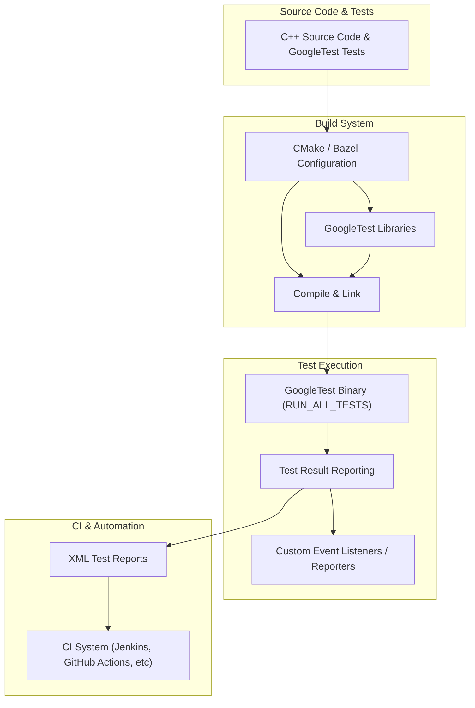

# Integration and Extensibility Points

GoogleTest is designed not only to provide a robust framework for writing and running C++ tests but also to adapt flexibly to diverse development environments and workflows. This page guides you through the key integration and extensibility mechanisms that allow GoogleTest to fit seamlessly into your build systems, testing pipelines, and customized reporting needs.

---

## Custom Assertions and Extensions

GoogleTest enables you to extend the framework with user-defined assertions beyond the built-in macros. Custom assertions let you encapsulate complex test validations into reusable components, improving test readability and maintainability.

- **User-Defined Assertions:** Implement your own predicates returning `AssertionResult` to provide fine-grained success/failure information with detailed messages.
- **Streaming Failure Messages:** Use the stream operator (`<<`) within your custom assertions for rich contextual failure messages.

**Example:**

```cpp
::testing::AssertionResult IsEven(int n) {
  if (n % 2 == 0) {
    return ::testing::AssertionSuccess();
  } else {
    return ::testing::AssertionFailure() << "Expected an even number but got " << n;
  }
}

TEST(NumberTest, EvenNumber) {
  EXPECT_PRED_FORMAT1(IsEven, 4);  // Passes
  EXPECT_PRED_FORMAT1(IsEven, 5);  // Fails with message
}
```

Custom assertions improve test expressiveness and allow targeting domain-specific correctness criteria within your codebase.

---

## Custom Test Result Reporting

GoogleTest provides hooks to create custom reporters that observe test execution and results. This enables integration with external systems, custom logging, or enhanced visualization.

### Test Event Listeners

- Implement the [`TestEventListener`](#TestEventListener) interface to respond to lifecycle events such as test start/end, failures, test suite start/end, and environment setup/teardown.
- Register your listener via `testing::UnitTest::GetInstance()->listeners().Append(new YourListener());`, which transfers ownership to GoogleTest.

### Use Cases for Custom Listeners

- Forwarding test results to external monitoring or dashboard systems
- Formatting output differently from the built-in console or XML reporters
- Filtering or augmenting test event streams based on project requirements

---

## Integration with Build Systems

Seamless integration with build tools like CMake and Bazel is central to automating test execution during the build and continuous integration (CI) processes.

### CMake Integration

- GoogleTest provides CMake scripts (`CMakeLists.txt`) supporting both standalone builds and embedding within existing projects.
- Use `find_package(GTest CONFIG REQUIRED)` to locate installed GoogleTest libraries.
- Link your test executables against `GTest::gtest` or `GTest::gtest_main`.
- Alternatively, embed GoogleTest as a subdirectory using `add_subdirectory()` for tighter integration and consistent compiler settings.

Example minimal CMake snippet:

```cmake
find_package(GTest CONFIG REQUIRED)
add_executable(my_tests test_file.cpp)
target_link_libraries(my_tests GTest::gtest_main)
add_test(NAME my_tests COMMAND my_tests)
```

### Bazel Integration

- Bazel users can declare dependencies on `@com_google_googletest` and link the appropriate targets.
- GoogleTest binaries can be executed as Bazel test targets within your project pipeline.

### Best Practices

- Ensure compiler C++17 support in your build environment.
- Avoid linking multiple versions of GoogleTest within the same project.
- Use `gtest_force_shared_crt` option in Visual Studio projects to prevent runtime mismatches.

---

## Continuous Integration (CI) Pipeline Support

GoogleTest supports automation-friendly test output and integration features:

### XML Test Reports

- Enable XML output with `--gtest_output=xml[:path]` flag to produce reports consumable by tools like Jenkins, GitHub Actions, and GitLab CI.
- Reports include detailed information about errors, failures, test timing, and skipped tests.

### Customizing Verbosity and Filtering

- Use flags such as `--gtest_filter` to run subsets of tests relevant for CI stages.
- Adjust verbosity (`--gtest_brief`, `--gtest_print_time`) to tailor log output to your needs.

### Handling flaky and parallel tests

- Support for test sharding and repeated test runs is available to improve test stability and performance (see guides on [Scaling Test Suites](https://google.github.io/googletest/guides/scaling-and-performance.html)).

---

## Platform and Portability Considerations

GoogleTest supports a wide variety of platforms and compilers, but you can customize certain low-level behaviors to fit constrained or specialized environments.

- **Platform Abstraction Macros:** GoogleTest defines and respects macros for OS detection, feature availability (like pthreads, exceptions), and compiler quirks, allowing conditional compilation and platform-specific handling.
- **Threading and Synchronization:** You can define or override synchronization primitives and thread-local storage mechanisms to adapt GoogleTest for platforms with different threading models.
- **Logging Hooks:** Provide custom logging macros `GTEST_LOG_` to redirect messages to your preferred logging framework.

See the [Platform Abstractions & Portability Macros](https://google.github.io/googletest/api/infrastructure-utilities/platform-abstractions.html) for details.

---

## Summary Diagram: Integration Flow



---

## Practical Tips & Troubleshooting

- **Verify Environment Setup:** Confirm your compiler and platform meet GoogleTest's C++17 requirement and platform support.
- **Use Provided Flags:** Initialize GoogleTest with `InitGoogleTest()` before running tests, and configure flags for filtering, output format, and behavior.
- **Custom Test Registration:** Use `RegisterTest` API to programmatically register tests if you need dynamic test definitions.
- **Debugging Custom Assertions:** Ensure your custom assertions return meaningful messages and use `AssertionFailure()` / `AssertionSuccess()` appropriately.
- **Add Custom Listeners Carefully:** Always cleanly release listeners if replacing defaults to avoid memory issues.

For common issues and solutions, consult the [Troubleshooting Common Setup Issues](https://google.github.io/googletest/getting-started/first-steps-validation/common-setup-issues.html) and [Integrating with CI Pipelines](https://google.github.io/googletest/guides/advanced-and-best-practices/integrating-with-ci.html).

---

For further extensibility details, see the [Customization Points in the source](https://github.com/google/googletest/tree/main/googlemock/include/gmock/internal/custom) and official [GoogleTest Primer](https://google.github.io/googletest/primer.html) for practical integration scenarios.
