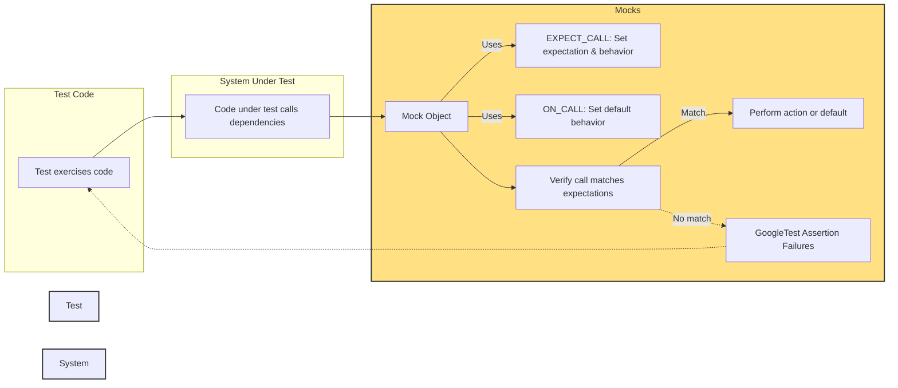

# Mocking: Conceptual Model and Roles

GoogleMock (gMock) revolutionizes C++ unit testing by allowing you to create mock classes that simulate the behavior of real objects with programmatically specified expectations and behaviors. This page clarifies the core concepts behind mocking in gMock—how mock objects are defined, how method expectations and behaviors are declared, and how they interact with the GoogleTest assertion layer.

---

## Introduction to Mocking in gMock

Mocks are test doubles that verify interactions between the system under test and its dependencies. By mocking, you can control the behavior of dependencies and assert that your code calls them correctly without relying on real implementations.

GoogleMock enables defining mock classes with virtual methods replaced by mock methods that can:

- Specify **expectations** (what calls are expected, with what arguments, and how often).
- Define **behaviors** (what to do when a mocked method is called).
- Detect violations immediately during test execution, providing precise error reports.


---

## Defining Mock Classes and Methods

You create a mock class by subclassing an interface or base class and using the `MOCK_METHOD` macro to define mock methods. For example:

```cpp
#include <gmock/gmock.h>

class Turtle {
 public:
  virtual ~Turtle() {}
  virtual void PenUp() = 0;
  virtual void GoTo(int x, int y) = 0;
  virtual int GetX() const = 0;
};

class MockTurtle : public Turtle {
 public:
  MOCK_METHOD(void, PenUp, (), (override));
  MOCK_METHOD(void, GoTo, (int x, int y), (override));
  MOCK_METHOD(int, GetX, (), (const, override));
};
```

**Key points:**

- `MOCK_METHOD` must be placed in the `public:` section even if the original method is `protected` or `private`.
- Supports qualifiers such as `(const, override)`.
- Overloads and methods with complex signatures are handled transparently.

---

## Declaring Mock Method Expectations

Use the `EXPECT_CALL()` macro to declare expectations on mock methods. Expectations specify:

- Which method is expected to be called.
- What argument matchers constrain the call parameters.
- How many times the call should happen.
- What order constraints apply.
- What actions or return values the method should perform.

### Basic Syntax

```cpp
EXPECT_CALL(mock_object, Method(matchers...))
    .Times(cardinality)           // How many times
    .WillOnce(action)             // One-time action
    .WillRepeatedly(action);      // Action for subsequent calls
```

### Argument Matchers

Matchers can specify exact or fuzzy argument conditions. For example:

```cpp
EXPECT_CALL(turtle, GoTo(50, _));  // First arg must be 50; second arg anything
EXPECT_CALL(turtle, Forward(Ge(100)));  // Argument >= 100
```

### Cardinalities

Control call count with these clauses:

| Cardinality          | Meaning                                 |
|---------------------|-----------------------------------------|
| `Times(Exactly(n))` or `Times(n)` | Called exactly n times               |
| `Times(AtLeast(n))` | Called at least n times                   |
| `Times(AtMost(n))`  | Called at most n times                    |
| `Times(Between(m,n))` | Called between m and n times (inclusive) |
| `Times(AnyNumber())` | Called any number of times (default if omitted) |

If omitted, gMock infers cardinalities based on the use of `.WillOnce` and `.WillRepeatedly`.

### Ordering Calls

- Use **`InSequence`** to constrain calls to occur strictly in order.

```cpp
using ::testing::InSequence;
{
  InSequence seq;
  EXPECT_CALL(mock, Foo());
  EXPECT_CALL(mock, Bar());
}
```

- Use **`After`** clause to express partial order dependencies between expectations.

### Actions

Actions specify what the mock method will do when called. Examples include:

- `Return(value)` — return a specified value.
- `ReturnRef(variable)` — return a reference.
- `Invoke(callable)` — invoke a function or functor.
- `SetArgPointee<N>(value)` — set the `N`th pointer argument's pointee to `value`.

Example:

```cpp
EXPECT_CALL(mock, GetX())
  .WillOnce(Return(10))
  .WillRepeatedly(Return(20));
```

---

## Setting Default Method Behavior with `ON_CALL`

Unlike `EXPECT_CALL`, `ON_CALL` specifies **default behavior** without setting any expectation that the method will be called.

```cpp
ON_CALL(mock, GetX())
    .WillByDefault(Return(42));
```

This is useful for setting common behaviors shared across multiple tests without asserting call count or order.

---

## Interplay Between Expectations and Assertions

- `EXPECT_CALL` specifies what calls are expected and verifies these expectations.
- GoogleTest assertions (`EXPECT_` and `ASSERT_`) provide checks in test code, independent from mock expectations.

### How They Work Together

- If a mock method is called more or fewer times than expected, GoogleMock reports failures through GoogleTest's assertion framework.
- Unexpected calls cause immediate failure messages, showing which expectation failed and why.
- When a mock object is destroyed, GoogleMock verifies that all expectations were satisfied, reporting any discrepancies.

This tight integration ensures that mocking failures are immediately visible as test failures, aiding rapid diagnosis.

---

## Handling Uninteresting and Unexpected Calls

- **Uninteresting calls**: Calls to mock methods without any matching `EXPECT_CALL`. By default, these calls perform the default action and usually emit a warning.
- **Unexpected calls**: Calls that match some `EXPECT_CALL`s but don't satisfy any of the specified argument matchers or ordering constraints, resulting in errors.

### Controlling Behavior:

- Use `NiceMock<T>` to silence warnings on uninteresting calls.
- Use `NaggyMock<T>` (default) to warn on uninteresting calls.
- Use `StrictMock<T>` to turn uninteresting calls into errors.

### Example:

```cpp
NiceMock<MockFoo> nice_mock;  // Warnings suppressed.
StrictMock<MockFoo> strict_mock;  // Calls without expectations cause errors.
```

---

## Sequencing and Partial Orders

GoogleMock lets you define when expected calls must happen in relation to others.

- Use `Sequence` objects combined with `.InSequence(seq)` to require calls occur in strict order.
- Use `.After(expectation)` or `.After(expectation_set)` to impose partial ordering constraints allowing more flexibility.

This guards against brittle tests that depend on exact call orders while still verifying interaction correctness.

---

## Common Pitfalls & Best Practices

- **Set expectations before exercising mocks.** Setting `EXPECT_CALL` after method calls produce undefined behavior.
- **Avoid over-specifying argument expectations.** Match only what's necessary to reduce test brittleness.
- **Prefer `ON_CALL` for default behaviors and `EXPECT_CALL` only for calls you want to verify.**
- **Use `.RetiresOnSaturation()` in long sequences of `.WillOnce()` to deactivate expectations once saturated and avoid conflicts.**

---

## Example Workflow

```cpp
class MockFoo {
 public:
  MOCK_METHOD(int, Bar, (int), (override));
};

TEST(FooTest, BarIsCalledOnce)
{
  MockFoo mock;

  ON_CALL(mock, Bar(Ge(0)))
      .WillByDefault(Return(42));

  EXPECT_CALL(mock, Bar(5))
      .Times(1)
      .WillOnce(Return(10));

  int val = mock.Bar(5);  // Returns 10.
  int default_val = mock.Bar(7); // Returns 42 (default action).

  EXPECT_EQ(val, 10);
  EXPECT_EQ(default_val, 42);
}
```

---

## Summary

gMock's conceptual model revolves around:

- Declaring **mock classes** with `MOCK_METHOD`.
- Setting **expectations** with `EXPECT_CALL` to verify interactions.
- Defining **default behaviors** with `ON_CALL`.
- Controlling invocation counts (**cardinalities**) and call order.
- Handling **uninteresting vs unexpected calls** with nicety and strictness controls.
- Integrating tightly with GoogleTest assertions for clear test failure reporting.

For a deeper dive, consult the [gMock Cookbook](https://google.github.io/googletest/gmock_cook_book.html), [Mocking Reference](https://google.github.io/googletest/reference/mocking.html), and [gMock for Dummies](https://google.github.io/googletest/gmock_for_dummies.html).

---

## Visual: Mocking Interaction Overview



---

## Troubleshooting

### Expectation Not Met or Called Too Many Times

- Verify that you set `EXPECT_CALL` **before** the mock method is called.
- Check for argument matcher correctness.
- Consider `.RetiresOnSaturation()` if multiple expectations on same method cause conflicts.

### Uninteresting Calls Warnings

- Use `NiceMock` to silence warnings for methods where you don't care about invocation.
- Or add a catch-all `EXPECT_CALL(method, _).Times(AnyNumber())` to explicitly allow any calls.

### Ambiguous Overload Errors

- Use `Const()` wrapper on const overloads.
- Specify argument types or use type-specific matchers to disambiguate.

### Mock Methods Not Called As Expected

- Check call order constraints (`InSequence` or `After`).
- Enable `--gmock_verbose=info` to trace call matching.

---

## See Also

- [gMock Cookbook](https://google.github.io/googletest/gmock_cook_book.html)
- [Mocking Reference](https://google.github.io/googletest/reference/mocking.html)
- [gMock for Dummies](https://google.github.io/googletest/gmock_for_dummies.html)
- [Matchers Reference](https://google.github.io/googletest/reference/matchers.html)
- [Actions Reference](https://google.github.io/googletest/reference/actions.html)
- [Mock Class Modes (NiceMock, StrictMock, NaggyMock)](/api_reference/mocking_api/strict_nice_mocks)

