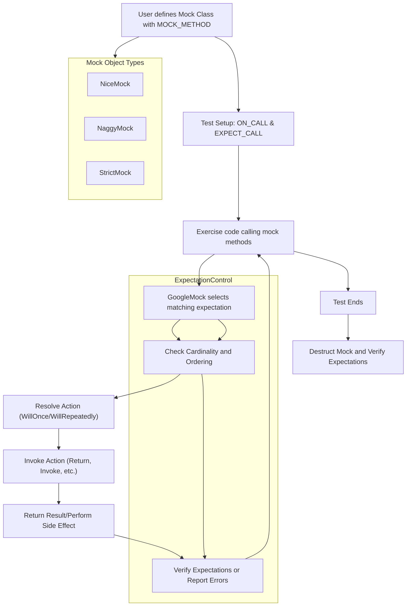

# Mocking System Design

GoogleMock’s mocking system is a sophisticated framework that enables precise control, verification, and customization of C++ mock classes in tests. At its core, it models how mock classes are constructed, how expectations on method calls are set and managed, and the underlying mechanisms that connect actions, call verifications, and invocation sequencing. This design provides the foundation for effective test isolation, reproducibility, and interaction-driven testing.

---

## Mock Classes: The Building Blocks of Mocking

A **mock class** in GoogleMock is a user-defined class derived from an interface or a base class, where methods to be mocked are declared using special macros such as `MOCK_METHOD`. These macros automatically generate the plumbing required to intercept calls, record invocations, and apply user-defined behaviors and expectations.

Mock classes behave like stand-ins for real classes, enabling tests to verify *what was called*, *how many times*, *in what order*, and *with what arguments* without the complexity or cost of real implementations.

### Defining Mock Methods

Mock methods are declared using the `MOCK_METHOD` macro:

```cpp
class MockWidget : public WidgetInterface {
 public:
  MOCK_METHOD(int, Compute, (int a, int b), (const, override));
};
```

This macro creates a method that can:

- Capture calls with specified argument matchers
- Implement behaviors (e.g., return values, side effects)
- Enforce expectations on call counts and ordering

### Accessibility Considerations

Regardless of the access level (public, protected, or private) of the original method,
mock methods **must** be defined in the `public:` section of the mock class. This ensures:

- The expectation syntax (`EXPECT_CALL` and `ON_CALL`) can access methods
- Seamless integration with test code regardless of original method visibility

### Overloaded and Template Methods

GoogleMock fully supports overloaded methods by requiring method signature disambiguation via parameter lists and qualifiers. Templates and move-only arguments are also supported, allowing flexibility for complex interfaces.

---

## Expectations: Specifying Intent and Verification

At the heart of mocking is the concept of *expectations*: statements declaring how mock methods are anticipated to be called.

### Using `EXPECT_CALL`

To declare an expectation, tests use the `EXPECT_CALL` macro:

```cpp
EXPECT_CALL(mock_obj, Method(arg_matchers))
    .Times(Exactly(3))
    .WillOnce(Return(true))
    .WillRepeatedly(Return(false));
```

This means that the `Method` is expected to be called exactly three times, with the first call returning `true` and subsequent calls returning `false`.

### Expectation Clauses

Expectations can be finely tuned with chainable clauses (in this strict order):

- **`.With()`** — Specify a multi-argument matcher that evaluates all call arguments as a tuple
- **`.Times()`** — Define the number or range of expected calls (e.g., `Exactly(n)`, `AtLeast(n)`)
- **`.InSequence()`** — Assign expectations to sequences to enforce call order
- **`.After()`** — State that a call is expected after other expectations have been satisfied
- **`.WillOnce()`** — Define actions for one-time calls (multiple allowed)
- **`.WillRepeatedly()`** — Default action for calls after `WillOnce` actions are exhausted
- **`.RetiresOnSaturation()`** — Retires the expectation once the upper bound is reached

### Cardinality Rules

If `.Times()` is omitted, GoogleMock infers invocation counts based on action clauses:

- No `.WillOnce()` or `.WillRepeatedly()` implies `Times(1)`
- *n* `.WillOnce()` implies `Times(n)` if no `.WillRepeatedly()`
- *n* `.WillOnce()` and one `.WillRepeatedly()` imply `Times(AtLeast(n))`

### Unexpected and Uninteresting Calls

- **Unexpected call:** The mock method is called with arguments that do not match any expectation; always treated as an error.
- **Uninteresting call:** The mock method has no expectation for the arguments; by default, a warning is issued but execution continues.

This system helps detect violations of specified contract interactions while allowing flexibility.

---

## Default Behavior: Specifying How Mocks React

GoogleMock enables defining default behaviors for mock methods using the `ON_CALL` macro, which specifies what happens when a method is called but no strict expectation (`EXPECT_CALL`) matches.

Example:

```cpp
ON_CALL(mock_obj, Method(_))
    .WillByDefault(Return(42));
```

This says that any call to `Method` with any arguments will, by default, return 42 if none of the expectations are triggered.

---

## Actions: What Happens When a Mock Method Is Invoked

Actions are the behaviors performed when a mock method matching an expectation or default behavior is called.

### Built-in Actions Include:

- **`Return(value)`** — Return a specified value
- **`ReturnRef(value)`** — Return a reference
- **`Invoke(function/lambda)`** — Call a real function or lambda
- **`SetArgPointee<N>(value)`** — Modify an output argument
- **`DoAll(...)`** — Perform multiple actions sequentially

Custom actions can be implemented by defining callable types or using the `ACTION` macros.

### Multiple Actions Support

`WillOnce` clauses specify action(s) for the first n calls; a single `WillRepeatedly` action defines behavior for all subsequent calls.

---

## Sequences and Ordering

GoogleMock allows rigorous control of call order among expectations with **Sequences** and **InSequence**.

### `Sequence` Objects

Define a partial order between expectations at a fine-grained level by associating expectations with sequences. Calls to expectations in the same sequence must occur in the order declared.

```cpp
Sequence s1, s2;
EXPECT_CALL(mock, Init()).InSequence(s1, s2);
EXPECT_CALL(mock, Load()).InSequence(s1);
EXPECT_CALL(mock, Render()).InSequence(s2);
```

This expresses that `Init` must be called before `Load` and `Render`, but `Load` and `Render` can occur in any order relative to each other.

### `InSequence` Object

An RAII helper that places all expectations constructed within its scope into an anonymous sequence.

```cpp
{
  InSequence seq;
  EXPECT_CALL(mock, A());
  EXPECT_CALL(mock, B());
}
```

Indicates calls must occur in order A followed by B.

---

## Expectation Graph & Verification Flow

Each expectation records prerequisites defined via `.After()` clauses, forming a partial ordering DAG that GoogleMock uses at runtime to verify correct sequencing.

- An expectation becomes **active** once all its prerequisites are satisfied
- When called enough times (per cardinality), an expectation becomes **saturated** and may retire if `.RetiresOnSaturation()` is used
- GoogleMock checks invocation counts and ordering synchronously to provide immediate feedback on expectation violations

This mechanism ensures reproducible tests where the interaction contracts are precisely specified and enforced.

---

## Handling Uninteresting Calls: Nice, Naggy, and Strict Mocks

GoogleMock offers three mock object wrappers to control the treatment of uninteresting calls:

- **`NiceMock<T>`** — suppresses warnings, allowing uninteresting calls silently
- **`NaggyMock<T>`** — default behavior, warns on uninteresting calls
- **`StrictMock<T>`** — treats uninteresting calls as test failures

These wrappers inherit from the mock class and forward constructors, enabling seamless substitution.

Choose based on your test’s noisiness tolerance and strictness requirements.

---

## Internal Plumbing Connecting Expectations and Actions

Internally, GoogleMock’s `FunctionMocker` class template manages expectation collections and default actions per mocked method. Highlights include:

- Maintaining ordered lists of `TypedExpectation` objects
- On invocation, selecting the last matching, active expectation (favoring newest expectations)
- Incrementing call counts, verifying cardinality, and applying sequencing constraints
- Executing the associated action or default behavior
- Logging detailed diagnostics on unexpected or excessive calls

This internal mechanism ensures thread-safe, atomic decision-making about which expectation a call satisfies, and actions to perform.

---

## How the Mocking System Enables Effective Isolation and Reproducibility

By combining:

- Clear declarative expectation syntax
- Rich argument matching and cardinality specification
- Explicit control over call ordering
- Default action definitions separate from expectations
- Strict, naggy, and nice mock modes

GoogleMock gives developers precise tools to isolate units under test, simulate complex interactions, and guarantee test outcomes do not depend on external dependencies or real implementations. This leads to high confidence in test validity and maintainability.

---

## Practical Tips and Best Practices

- Define mock methods in the `public:` section even if original methods are protected or private
- Use `ON_CALL` to specify default behavior, and reserve `EXPECT_CALL` for calls where you want to verify invocation
- Compose expectations carefully, keeping more general expectations earlier and more specific ones later for correct matching
- Use `InSequence` or `After` clauses to enforce call ordering in complex scenarios
- Prefer `NiceMock` for tests that tolerate uninteresting calls to reduce noise
- Use `.RetiresOnSaturation()` to retire expectations that should only be used a fixed number of times
- Avoid mixing mocks and real implementations unless delegating explicitly

---

## Troubleshooting Common Issues

- **Uninteresting call warnings:** Consider adding `EXPECT_CALL` with `Times(AnyNumber())` or switch to a `NiceMock` to suppress
- **Unexpected call failures:** Check argument matchers and call order; use `--gmock_verbose=info` for detailed tracing
- **Overly strict expectations causing test brittleness:** Simplify by removing unnecessary matchers, use default actions
- **Compiling mocks with complex types:** Wrap comma-containing types in extra parentheses or define type aliases
- **Mock objects not verifying:** Ensure mocks are destructed or call `Mock::VerifyAndClearExpectations(mock)` explicitly

---

## Diagram: The Mocking Workflow



---

This design document provides a comprehensive look into the conceptual model behind GoogleMock's mocking approach, framing how the interplay of mock classes, expectations, actions, sequences, and verification forms a robust system for isolation and test reproducibility.

---

For deeper insights, consider reviewing these key documents:

- [Mocking Reference](../reference/mocking.md) for detailed macros and classes
- [gMock Cookbook](../gmock_cook_book.md) for practical usage recipes
- [NiceMock, NaggyMock, and StrictMock](../mocking_core/nice_naggy_strict_mocks.mdx) for mock object strictness
- [EXPECT_CALL and ON_CALL](../mocking_core/expect_call_on_call.mdx) for expectation usage
- [Core Concepts & Terminology](../../overview/architecture-core-concepts/core-terminology) to ground mocking in overall framework concepts


---

<Check>
Use this document as the foundational guide when designing or understanding mocking workflows and their implications on test reliability.
</Check>

