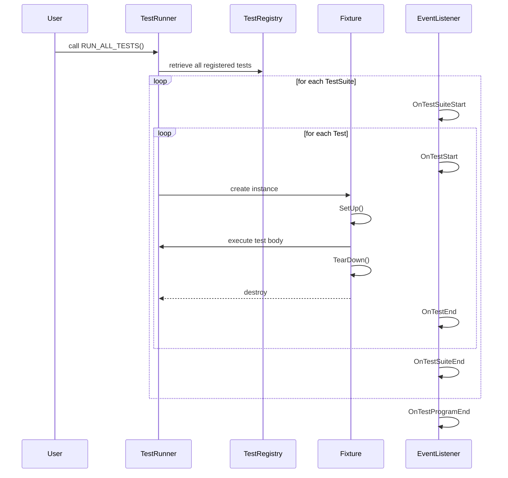

# System Architecture

Explore the modular design of GoogleTest by understanding its main components and their interactions. This page focuses specifically on the architecture underpinning GoogleTest's testing process, highlighting key elements such as test initialization, fixtures, test discovery, and result reporting. Understanding these pieces will empower you to leverage GoogleTest effectively and appreciate its flexibility and extensibility in C++ testing.

---

## Overview of GoogleTest System Architecture

GoogleTest is designed as a modular, extensible framework that simplifies writing and running C++ tests following the xUnit architecture. Its system architecture supports scalable, maintainable test suites by clearly delineating responsibilities across components.

### Core Components

- **Test Initialization**
  - Sets up the testing environment and prepares GoogleTest for execution.
  - Parses command-line flags that control runtime behavior.

- **Test Fixtures**
  - Provide a structured way to group related tests and share setup/teardown code.
  - Facilitate isolation by ensuring a fresh fixture instance per test.

- **Test Discovery**
  - Automatically registers tests defined with macros such as `TEST()`, `TEST_F()`, and `TEST_P()`, removing the need for manual enumeration.
  - Supports both compile-time registration (macros) and runtime dynamic registration where necessary.

- **Result Reporting**
  - Collects comprehensive test results, including success, nonfatal failure, fatal failure, and skipped tests.
  - Exposes an extensible event listener API allowing users to track test execution and customize reporting.


## Interaction and Flow among Components

### User Workflow

1. **Writing Tests**
   - Tests are defined using macros like `TEST()`, `TEST_F()`, and others, which implicitly register tests with the framework.
   - Test fixtures organize common setup logic and shared data within a test suite.

2. **Running Tests**
   - Invoking `RUN_ALL_TESTS()` kicks off the testing lifecycle.
   - GoogleTest performs test initialization, parsing command-line options and initializing the framework.

3. **Test Execution**
   - For each registered test:
     - A fresh test fixture instance is created.
     - `SetUp()` is called to prepare the test environment.
     - The test method runs, performing assertions.
     - `TearDown()` cleans up after the test.
     - The fixture is destroyed, ensuring isolation.

4. **Result Collection & Reporting**
   - Assertions record success or failure states.
   - Event listeners receive notifications for test lifecycle events, including start/end of tests and test suites.
   - Results are aggregated for console and XML report outputs.


## Modular Design for Flexibility and Extensibility

It is vital to understand how GoogleTest's modular architecture enables both straightforward usage for simple projects and powerful customization for complex needs.

- **Test Registration is Automatic**: Using simple macros, tests are automatically registered and discoverable — no manual listing is needed.

- **Event Listener API**: Users can craft custom event listeners to plug into the test lifecycle for advanced reporting, logging, or integrating with CI systems.

- **Test Fixtures Enable Data Sharing and Isolation**: Each test uses a separate fresh fixture to avoid side effects while sharing setup code within suites.

- **Support for Parameterized and Typed Tests**: Enables reusing test logic with varying inputs and types, supported by the suite and fixture abstractions.

- **Extensible Command-Line Flags and Initialization Hooks**: Initialization functions parse flags and prepare environments, facilitating flexible test runtime configurations.


## Component Responsibilities Explained

### Test Initialization
- Parses GoogleTest-specific command-line flags.
- Sets up global test environments.
- Establishes test listeners, including default and user-defined ones.

### Test Fixtures
- Represented by user-defined classes derived from `testing::Test`.
- Implement `SetUp()` and `TearDown()` for preparing and cleaning shared data.
- Ensure a new instance per test to maintain isolation.

### Test Discovery
- Test macros expand into registrations within GoogleTest's internal test registry.
- Supports both value-parameterized and type-parameterized tests.
- Provides dynamic registration APIs for advanced scenarios.

### Result Reporting
- Aggregates test outcomes centrally.
- Supports console output, XML reports, and custom listeners.
- Listeners have lifecycle methods like `OnTestStart()`, `OnTestEnd()`, etc., for detailed observation.


## Data Flow in a Typical Test Run




## Practical Tips & Best Practices

- Always use test fixtures (`TEST_F`) when multiple tests share common setup logic.
- Treat fixtures as ephemeral; never rely on data persistence across tests.
- Use event listeners to integrate GoogleTest into custom reporting workflows or CI dashboards.
- When extending, prefer using GoogleTest’s public APIs for registration and event listening.
- Ensure test suites are logically grouped to align with fixtures for maintainability.


## Troubleshooting Common Architecture-Related Issues

- **Tests not discovered?**
  - Verify test macros (`TEST` or `TEST_F`) are properly used for automatic registration.
  - Ensure `RUN_ALL_TESTS()` is called after initialization.

- **Shared state across tests?**
  - Remember GoogleTest creates a new fixture instance per test.
  - Use `SetUpTestSuite` / `TearDownTestSuite` for shared setup/teardown at suite level.

- **Custom event listeners not firing?**
  - Confirm listeners are registered before test execution begins.
  - Ensure listeners implement relevant virtual methods.


## Summary

GoogleTest’s architecture is a well-crafted, modular system that balances ease of use and extensibility. By understanding components like test initialization, fixtures, test discovery, and result reporting, users gain confidence to write robust, scalable tests and integrate GoogleTest into their tooling and workflows.


---

## Additional Resources

For users seeking deeper understanding or examples related to the system architecture, the following materials provide valuable insights:

- [High-Level Architecture](/overview/architecture-overview/highlevel-architecture): For a visual and detailed explanation of GoogleTest components with interaction flows.
- [Core Terminology & Concepts](/overview/architecture-overview/core-terminology): Clarifies the fundamental terms used throughout GoogleTest.
- [Test Cases, Suites & Fixtures](/concepts/architecture-overview/test-abstractions): Detailed coverage of test abstractions and fixture patterns.
- [Test Discovery and Execution Patterns](/guides/getting_started/test_discovery_execution): Explores how tests are registered, discovered, and run.
- [Test Environment and Event Listeners](/api-reference/core-testing-interfaces/test-environment-and-event-listeners): Documentation on writing and using custom test event listeners.


<Tip>
Understanding these concepts is key to effectively scaling your GoogleTest usage from simple tests to complex, extensible test suites integrated with continuous integration systems.
</Tip>

<Note>
Remember, this page focuses on system architecture concepts specific to GoogleTest. For implementation details, setup, or writing tests, please consult the dedicated user guides and API references.
</Note>

---

## Diagram: GoogleTest System Architecture Overview

```mermaid
flowchart TD
  Init[Test Initialization]
  Register[Test Registration & Discovery]
  Run[Test Execution Loop]
  Fixture[Test Fixture (SetUp/TearDown)]
  Assert[Assertions & Result Recording]
  Report[Result Reporting & Event Listeners]

  Start([Start]) --> Init
  Init --> Register
  Register --> Run
  Run --> Fixture
  Fixture --> Assert
  Assert --> Report
  Report --> End([End])

  classDef component fill:#f9f9f9,stroke:#333,stroke-width:1px;
  class Init,Register,Run,Fixture,Assert,Report component;
```

This illustrates the high-level flow from initialization through test registration, execution, assertion recording, and final reporting.


---