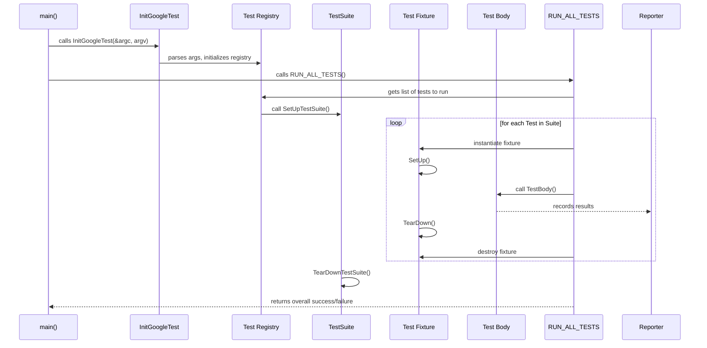

# Test Discovery and Execution Lifecycle

GoogleTest automates the process of finding, registering, running, and reporting on tests to provide a seamless and reliable C++ testing experience. This guide covers the entire lifecycle of tests — from writing individual tests and test suites, to running them via the test runner, and finally to interpreting test results. By understanding this lifecycle, you can better organize your tests, customize their execution, and integrate testing workflows efficiently.

---

## 1. Test Definition and Registration

In GoogleTest, tests are defined using macros that not only declare the test functions but also register them automatically with the framework.

- **TEST Macro**: Defines a simple, standalone test in a named test suite.
- **TEST_F Macro**: Defines a test that uses a test fixture, sharing common setup/teardown.
- **TEST_P and INSTANTIATE_TEST_SUITE_P Macros**: Define parameterized tests that run the same logic multiple times with different inputs.

When you write tests using these macros, GoogleTest implicitly registers each test with an internal global test registry. This means you never have to manually list tests or register them — they are discovered automatically at runtime by the framework.

### Example: Defining and Registering Tests

```cpp
TEST(FactorialTest, HandlesZeroInput) {
  EXPECT_EQ(Factorial(0), 1);
}

class QueueTest : public ::testing::Test {
 protected:
  void SetUp() override {
    // common setup for Queue tests
  }
};

TEST_F(QueueTest, IsEmptyInitially) {
  EXPECT_TRUE(queue.empty());
}
```

When compiled, these tests are registered globally and ready to run without additional code.

---

## 2. Test Organization

Tests are grouped into **test suites** (formerly called test cases). Each suite contains multiple related tests identified by their individual names.

- Test suites help organize tests logically, mirroring the tested code’s structure.
- Tests within a suite can share common test fixture classes that provide setup and teardown logic.

This organization supports focused test execution by suite or individual test name.

---

## 3. Test Runner Initialization

Before test execution starts, you must initialize the testing framework with:

```cpp
::testing::InitGoogleTest(&argc, argv);
```

This function parses command-line flags consumed by GoogleTest (such as filters, output options, repeat counts) and removes them from `argv`. It configures the test environment accordingly.

**Important:** Always call `InitGoogleTest` before running tests to ensure flags are recognized and applied.

---

## 4. Running Tests

After initialization, call the global function:

```cpp
int result = RUN_ALL_TESTS();
```

This command triggers GoogleTest to discover all registered tests eligible to run, then runs them in sequence:

- It creates a fresh test fixture object for each test.
- Calls the test fixture's `SetUp()` before the test.
- Invokes the test body.
- Calls the test fixture's `TearDown()` after the test.
- Destroys the fixture.

The return value indicates the overall test program success (`0` means all tests passed).

**Note:**

- Tests run sequentially by default.
- Filtering and shuffling tests is supported to run subsets of tests or change order.

---

## 5. Test Execution Flow

The internal flow for each test can be visualized as:

1. **SetUpTestSuite()** — Called once before the first test in a suite.
2. For each test:
   - Fresh test fixture object created.
   - `SetUp()` called on the fixture.
   - Test body (`TestBody()`) runs.
   - `TearDown()` called.
   - Fixture destroyed.
3. **TearDownTestSuite()** — Called once after the last test in a suite.

Failures within tests are recorded via assertions; fatal failures abort the current test, while non-fatal failures allow it to continue.

---

## 6. Test Reporting

During and after test execution, GoogleTest collects detailed results:

- Per-test results include passed/failed/skipped status, failure messages, file/line info.
- Aggregate test suite and overall program results are compiled.
- Results can be printed on console, captured by custom listeners, or exported as XML.

GoogleTest also supports event listeners that can be added to track test lifecycle events for customized reporting or integration.

---

## 7. Filtering and Selective Execution

GoogleTest supports powerful filtering options via command-line arguments:

- `--gtest_filter=SuiteName.TestName` lets you run a specific subset of tests.
- Wildcard patterns enable running groups of tests matching certain criteria.

This makes it easy to focus on failing tests or those relevant to your current work.

---

## 8. Integration with GoogleMock

GoogleMock tests are seamlessly discovered and run as part of the GoogleTest framework since GoogleMock depends on GoogleTest.

Use `testing::InitGoogleMock()` in place of `InitGoogleTest()` to initialize both frameworks simultaneously if using mocks.

Example main function:

```cpp
int main(int argc, char** argv) {
  testing::InitGoogleMock(&argc, argv);
  return RUN_ALL_TESTS();
}
```

---

## 9. Test Lifecycle Diagram



---

## 10. Troubleshooting Common Lifecycle Issues

- **Tests not running?** Ensure tests are correctly defined with `TEST()` or `TEST_F()` macros so they register properly.
- **Flags not recognized?** Confirm you called `InitGoogleTest()` before `RUN_ALL_TESTS()`.
- **Tests silently skipped?** Check your filter settings and `should_run()` conditions.
- **Multiple main() functions conflicting?** Prefer linking with the default `gtest_main` or `gmock_main` libraries unless you need custom behavior.

---

## Summary

GoogleTest’s test discovery and execution lifecycle is designed to let you write tests naturally and run them effortlessly. Automatically registering tests and running them in isolated fixtures ensures reliable test outcomes. The framework provides filtering, repeating, and customizable reporting to fit diverse workflows. Leveraging these lifecycle mechanisms maximizes your test productivity and code quality assurance.

---

## See Also

- [GoogleTest Primer](https://google.github.io/googletest/primer.html) — Start writing your first tests
- [Test Structure & Lifecycle](../api-reference/core-testing-apis/test-structure-and-lifecycle.md) — Detailed API reference
- [Organizing and Running Tests Guide](/guides/core-workflows/organizing-and-running-tests)
- [GoogleMock Integration Model](/concepts/architecture-overview/googlemock-integration)
- [Running Tests with Filters and Options](/api-reference/core-testing-apis/test-runner-and-invocation.md)

<Source url="https://github.com/google/googletest" branch="main" paths={[{"path": "docs/primer.md", "range": "1-384"},{"path": "docs/reference/testing.md", "range": "53-502"},{"path": "googlemock/src/gmock_main.cc", "range": "1-42"}]} />
