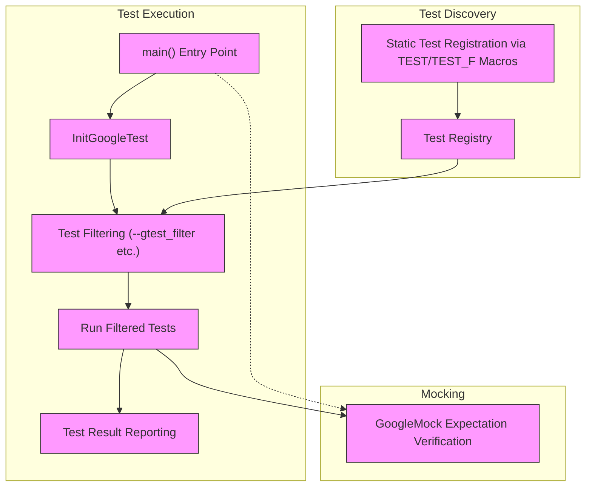

# Test Discovery and Execution Lifecycle

Understanding how tests are discovered and executed is crucial for effectively using GoogleTest and GoogleMock in your C++ projects. This guide walks you through the journey of tests starting from the main entry point invocation, through automatic discovery, initialization, filtering, execution, and ending with result reporting. It also highlights the underlying registration mechanism and integration aspects with build systems.

---

## 1. Overview of the Lifecycle

When you run a GoogleTest-enabled test binary, a series of automated steps occur behind the scenes to find, filter, run, and report on tests defined in your code. This lifecycle ensures that you can write multiple test cases and fixtures in your projects without needing manual registration or invocation code.

### Primary Phases

- **Test Registration:** Test cases and fixtures register themselves automatically at static initialization.
- **Filtering:** Based on command-line flags or environment variables, only relevant tests are selected.
- **Execution:** Selected tests are executed in an isolated manner, honoring set expectations and behaviors.
- **Result Reporting:** Detailed results, including successes, failures, and errors, are collected and displayed.

<Info>
GoogleTest and GoogleMock operate in harmony by managing lifecycle seamlessly, so no manual plugging-in of mocks or registration calls are required.
</Info>

## 2. Automatic Test Discovery

The cornerstone of GoogleTest's usability is the automatic discovery mechanism, which relieves you from manually registering each test.

### How Tests Register

- Tests created with the `TEST()` or `TEST_F()` macros instantiate internal objects at static initialization.
- These objects call into internal GoogleTest registries, associating test names, fixture classes, and test functions.
- This dynamic setup happens before `main()` is executed, ensuring all tests are ready to be filtered and run.

### Role of the Test Registry

- The registry maintains a global catalog of all test cases and individual tests.
- It maps each registered test to its corresponding test factory that creates test instances at runtime.
- This setup supports querying, filtering, and execution order control.

## 3. Execution Starting with `main()` Entry Point

Your test binary typically has a `main()` function provided by linking with `gtest_main`. This function kicks off the lifecycle:

<Steps>
<Step title="Initialization">
The testing framework initializes internal data structures, processes command-line flags, and prepares the environment.
</Step>
<Step title="Test Filtering">
Based on `--gtest_filter` and other flags, the framework selects which tests to run. Filtering allows running a subset of tests matching name patterns, supporting wildcard and exclusion.
</Step>
<Step title="Test Iteration">
Tests are executed one by one in the filtered order. Each test is run in its own environment to prevent side effects.
</Step>
<Step title="Mock Integration">
During tests, GoogleMock intercepts and validates mocked method calls according to expectations.
</Step>
<Step title="Reporting">
After tests complete, a summary report is generated with detailed results, including failure messages and stack traces when applicable.
</Step>
</Steps>

### Example `main()` Usage

If you define your own main, it should typically call `::testing::InitGoogleTest()` followed by `RUN_ALL_TESTS()`:

```cpp
#include <gtest/gtest.h>

int main(int argc, char** argv) {
  ::testing::InitGoogleTest(&argc, argv);
  return RUN_ALL_TESTS();
}
```

## 4. Registration Mechanism Details

Behind the scenes, each `TEST` macro invocation creates a static object that performs registration via GoogleTest's internal structures.

### Key Points:

- No explicit registry manipulation is required by users.
- The registration consists of:
  - Test suite name
  - Test name
  - The factory that creates the test instance
- This design supports the flexible and extensible addition of new tests across translation units.

## 5. Test Filtering Mechanism

GoogleTest supports sophisticated filtering through:

- **`--gtest_filter` flag:** Selectively runs tests based on wildcard patterns (e.g., MySuite.* to run all under MySuite).
- **Exclusion:** Patterns starting with `-` exclude tests.
- **Test names must match patterns:** Both test suite and test name are checked.

### Practical Example:

```bash
test_myapp --gtest_filter=MySuite.MyTest
```

Runs only `MyTest` under `MySuite`.

## 6. Integration with Build Systems

GoogleTest integrates well with popular build systems like CMake and Bazel:

- **CMake**: Provides `FetchContent` and `add_subdirectory()` methods to link GoogleTest.
- **Bazel**: Offers dedicated Bazel rules and pre-packaged modules for tests.
- Automatically discovered test binaries are run during build/test phases.

## 7. Test Execution Workflow

Each test runs as:

- **Setup:** Calls fixture `SetUp()` methods.
- **Execution:** Runs the test body.
- **Teardown:** Calls fixture `TearDown()` methods.
- Mocks verify expectations at test end. Failures are reported instantly.

## 8. Result Reporting

- Detailed output includes passed, failed tests, and reasons.
- GoogleTest provides XML and JSON result formats to integrate into dashboards.
- Failures trigger stack traces and descriptions to aid debugging.

## 9. Troubleshooting Common Lifecycle Issues

<Tip>
If some tests don't seem to run:
- Verify the test file is linked with GoogleTest correctly.
- Check the filter patterns.
- Confirm the `main()` entry point is correctly setup.
</Tip>

<Note>
To suppress warnings about uninteresting mock calls, consider using `NiceMock` wrappers. However, prefer proper expectations (`EXPECT_CALL`) to avoid missing relevant calls.
</Note>

## 10. Summary Mermaid Diagram


```

---

## Additional Resources

- **GoogleTest Primer:** For understanding how to write and run basic tests.
- **GoogleMock CookBook:** For detailed mocking techniques and usage.
- **Mocking Reference:** For definitions and details on `EXPECT_CALL` and `ON_CALL` macros.
- **Build Integration Guides:** Learn how to integrate with CMake and Bazel smoothly.

For practical tips on managing expectations, filtering tests, and debug support, the companion guides and reference documentation listed above provide in-depth information.

---