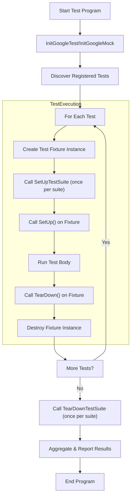

# Test Lifecycle and Architecture

Understanding the test lifecycle in GoogleTest is key to harnessing its full power and designing robust, maintainable C++ test suites. This guide walks you through the high-level flow of a test suite from test registration, discovery, execution, and result reporting, clarifying the roles of test cases and fixtures, and explains how GoogleMock extends these foundations to support sophisticated mock-based testing.

---

## Overview of the Test Lifecycle

When you start a GoogleTest-based test program, the following high-level workflow unfolds:

1. **Test Registration**: Using macros like `TEST()` and `TEST_F()`, test cases are automatically registered with the framework. You never need to enumerate them explicitly; GoogleTest keeps track behind the scenes.

2. **Test Discovery**: Before execution begins, GoogleTest discovers all registered tests. It organizes them logically into test suites (formerly called "test cases") that group related tests.

3. **Test Execution**: GoogleTest runs tests in sequence, creating a fresh test fixture object for each test method to ensure test isolation. Each fixture undergoes construction, optional `SetUp`, running of the test body, optional `TearDown`, and destruction.

4. **Test Reporting**: After running, GoogleTest collects and reports detailed results including passes, failures, skipped tests, and timing metrics.

<Check>
This lifecycle enables writing tests that are independent, repeatable, and maintainable.
</Check>

### Key User-Facing Concepts

| Concept       | Description                                           |
|---------------|-------------------------------------------------------|
| Test          | A single executable unit, consisting of code and assertions. |
| Test Suite   | A named group of related tests that share common setup patterns. |
| Test Fixture | A C++ class derived from `testing::Test` to hold shared data and setup/teardown logic used by multiple tests within a test suite. |


---

## Detailed Walkthrough of the Lifecycle

### 1. Test Registration

Using GoogleTest macros such as `TEST()`, `TEST_F()` (for fixtures), and `TEST_P()` (for parameterized tests), you define and register your test cases:

```cpp
TEST(SimpleTest, WorksCorrectly) {
  EXPECT_EQ(1 + 1, 2);
}

class MyFixture : public testing::Test {
 protected:
  void SetUp() override {
    // Common setup for tests
  }
};

TEST_F(MyFixture, UsesFixture) {
  EXPECT_TRUE(/* conditions */);
}
```

No manual registration is needed. Each test's registration records file, line, test suite name, test name, and fixture factory.

### 2. Test Discovery

Before execution, GoogleTest enumerates all registered tests. It supports selection and filtering via command-line flags to run all, some, or disabled tests.

### 3. Test Execution

GoogleTest runs tests one by one with this process for each test:

- Instantiate a test fixture object (if a fixture is used).
- Call `SetUpTestSuite()` once before the first test in the suite runs to perform shared setup.
- Call the fixture's `SetUp()` method before each test.
- Execute the test body.
- Run `TearDown()` after each test.
- Run `TearDownTestSuite()` after the last test in the suite.
- Destroy the test fixture.

This lifecycle guarantees test isolation and consistency.

### 4. Test Reporting

Each test produces detailed results, including:

- Pass/Fail status.
- Assertion and fatal error details (with source location).
- Execution time.

GoogleTest aggregates these results and provides:

- Console summary.
- Optional XML or JSON reports.

Listeners can hook into events to customize reporting.

---

## How Fixtures and Test Cases Relate

- A **Test Suite** (formerly called Test Case) is a logical grouping of tests, often sharing a fixture class.
- A **Test Fixture** provides reusable setup and teardown routines and shared test data.
- Each test under `TEST_F(FixtureName, TestName)` uses a fresh instance of the fixture.

<Note>
Tests do not share state unless explicitly managed, preventing hidden dependencies and promoting reliability.
</Note>

---

## GoogleMock Integration with the Test Lifecycle

GoogleMock builds on the GoogleTest lifecycle by introducing mock objects to control and verify interactions:

- Mock classes define mock methods using macros like `MOCK_METHOD`.
- You set expectations (`EXPECT_CALL`) and default behaviors (`ON_CALL`) on mocks.
- During test execution, mock invocations are verified against expectations automatically.
- Failures in mock verification cause test failures, with clear diagnostic messages indicating expected vs actual calls.

This integration allows behavior-driven testing and precise verification of interactions with dependencies.

### User Workflow With GoogleMock

1. **Create Mock Classes** representing dependencies.
2. **Setup Mock Behavior and Expectations** before exercising your test subject.
3. **Run the Test**, which internally triggers mocks as per expectations.
4. **Verify** that all expectations were met automatically upon mock object destruction, or earlier via explicit calls.

<Note>
GoogleMock shares the same lifecycle hooks of fixtures, allowing complex setup with `SetUp()` and `TearDown()` alongside mocks.
</Note>

---

## Code Entry Point and Running Tests

GoogleTest provides a default `main()` function, usually linked via `gtest_main` or `gmock_main`. Internally this function:

- Calls `InitGoogleTest()` and `InitGoogleMock()` to parse command-line flags and initialize frameworks.
- Calls `RUN_ALL_TESTS()` to execute all registered tests.
  - Returns 0 if all tests succeed.
  - Returns 1 if any test fails.

Users rarely need to write their own `main()` unless custom initialization is necessary.

Example typical main function:

```cpp
#include <gtest/gtest.h>
#include <gmock/gmock.h>

int main(int argc, char** argv) {
  testing::InitGoogleMock(&argc, argv);
  return RUN_ALL_TESTS();
}
```

---

## Troubleshooting Common Lifecycle Issues

### Test Not Running

- Ensure tests are properly defined and linked.
- Confirm `RUN_ALL_TESTS()` is called once after initialization.
- Check your test filters (`--gtest_filter`) don't exclude desired tests.

### Fixture Setup/TearDown Not Called

- Override `SetUp()` and `TearDown()` with exact capitalization.
- Use `override` keyword in C++11+ to catch typos.

### Mock Expectations Not Verified

- Mock objects must be destructed to trigger automatic verification.
- For mocks allocated on heap, verify with `Mock::VerifyAndClearExpectations()`.

---

## Practical Example: Writing and Running Tests

```cpp
// Define a Test Fixture
class MyClassTest : public testing::Test {
 protected:
  void SetUp() override {
    // Common initialization
  }
  void TearDown() override {
    // Cleanup
  }
  int shared_value_;
};

// Define a Test
TEST_F(MyClassTest, DoesSomething) {
  shared_value_ = 42;
  EXPECT_EQ(shared_value_, 42);
}

int main(int argc, char** argv) {
  testing::InitGoogleTest(&argc, argv);
  return RUN_ALL_TESTS();
}
```

When run, GoogleTest will:
- Register the `DoesSomething` test under `MyClassTest` suite.
- Create a fresh `MyClassTest` fixture for it.
- Call `SetUp()` on the fixture.
- Run the test and check the assertion.
- Call `TearDown()` and destroy fixture.

---

## Diagram: High-Level Test Execution Flow



---

## Summary

This page detailed how GoogleTest manages the test lifecycle—from automatic test registration through discovery, isolated execution of each test with fresh fixtures, to comprehensive reporting of results. You learned how test fixtures and test suites organize tests, and how GoogleMock integrates by verifying mock interactions within this lifecycle. Understanding this flow equips you to write reliable, maintainable tests and use mocks effectively.

---

## Additional Resources

- [GoogleTest Primer](../primer.md) — Beginner introduction to writing tests
- [gMock for Dummies](https://google.github.io/googletest/gmock_for_dummies.html) — Introduction to mocking basics
- [EXPECT_CALL and ON_CALL Reference](../../api_reference/mocking_core/expect_call_on_call.md) — Deep dive into setting mock expectations
- [GoogleTest Assertion Macros](../../api_reference/matchers_assertions/assertion_macros.md) — Details on assertion types
- [Test Fixtures](../primer.md#same-data-multiple-tests) — Reusing setup logic across tests
- [Troubleshooting Setup Errors](../../getting-started/troubleshooting-common-issues/troubleshooting-setup-errors.md) — For common lifecycle problems
- [Test Event Listeners](../../docs/reference/testing.md#TestEventListener) — Hooking into test run events for custom reporting

---

## Next Steps

- Start writing your tests using `TEST()` and fixtures with `TEST_F()`.
- Integrate GoogleMock in your tests to verify interactions.
- Explore advanced test patterns using parameterized tests and sequences.


