# Test Discovery and Lifecycle

Understanding the journey from writing a test to seeing the test results is crucial for mastering GoogleTest. This guide explains the process of test registration, discovery, selection for execution, and the lifecycle of a test run including setup and teardown hooks at multiple levels.

---

## 1. Test Registration and Discovery

GoogleTest automatically registers tests when you use macros like `TEST()`, `TEST_F()`, and `TEST_P()`. This removes the need to manually list tests to run.

### 1.1 Defining Tests

- **Simple Tests (`TEST`)** define standalone tests identified by a test suite and a test name.
- **Fixture Tests (`TEST_F`)** use shared setup/teardown logic via test fixture classes.
- **Parameterized Tests (`TEST_P`)** allow the same tests to run with different parameters.

All these macros implicitly register the tests with GoogleTest's internal registry during program initialization.

### 1.2 Programmatic Registration

For advanced users, tests can be registered dynamically using `RegisterTest()`, allowing runtime decisions about which tests to add before running them.

### 1.3 Test Suites (formerly Test Cases)

Tests are grouped into *test suites*. All tests in the same suite share the same fixture type. Mixing different fixtures or mixing `TEST` and `TEST_F` macros in the same suite is prohibited and triggers failures.

### 1.4 Naming Conventions

- Test suite and test names must be valid C++ identifiers and should **not** contain underscores to avoid clashes and ambiguity.
- Death test suites should be named with the suffix `DeathTest` to ensure they execute before other tests for thread-safety reasons.

<Tip>Always follow the recommended naming conventions to prevent runtime errors and maintain test clarity.</Tip>

## 2. Test Filtering and Selection

Before executing, GoogleTest filters tests to decide which will run based on user-provided filters and other criteria.

### 2.1 Filtering by Name

GoogleTest supports filtering tests by their full names using the `--gtest_filter` flag or the `GTEST_FILTER` environment variable. The filter supports positive and negative patterns with wildcards.

Example filter patterns:

```sh
--gtest_filter=FooTest.*        # Runs all tests in FooTest
--gtest_filter=*Error*:*Crash*  # Runs tests whose names contain "Error" or "Crash"
--gtest_filter=-*DeathTest.*    # Runs all tests except death tests
```

### 2.2 Disabled Tests

Tests prefixed with `DISABLED_` are skipped by default but will still compile. Use `--gtest_also_run_disabled_tests` to include them in runs.

### 2.3 Sharding

GoogleTest supports test sharding to distribute tests across multiple machines via the environment variables `GTEST_TOTAL_SHARDS` and `GTEST_SHARD_INDEX`. This lets you run tests in parallel across shards.

### 2.4 Skipping and Fail Fast

- Tests can be skipped at runtime using `GTEST_SKIP()`.
- Run can stop at the first failure with the `--gtest_fail_fast` flag.

## 3. Test Execution Lifecycle

Once tests are selected, GoogleTest orchestrates the entire lifecycle of each test suite and individual test.

### 3.1 Global Test Environment

- Global setup and teardown are done via subclasses of `testing::Environment`.
- These environments are setup once before any test runs and torn down after all tests finish.
- Multiple environments execute their `SetUp()` and `TearDown()` methods in registration order and reverse order respectively.

### 3.2 Test Suite Setup and Teardown

- `SetUpTestSuite()` and `TearDownTestSuite()` are **static** methods on the test fixture class.
- `SetUpTestSuite()` runs once before the first test in that test suite.
- `TearDownTestSuite()` runs once after the last test in the suite.
- Shared expensive resources can be allocated/freed here to optimize test execution.

### 3.3 Individual Test Setup and Teardown

- For each test, GoogleTest creates a new instance of the test fixture.
- It calls `SetUp()` to prepare the fixture.
- The test body (`TestBody()`) is executed.
- Then `TearDown()` is called followed by destruction of the fixture instance.

### 3.4 Test Execution Flow

1. Global environments `SetUp()` are called.
2. For each test suite:
   - `SetUpTestSuite()` is invoked once.
   - Each test runs:
     - `SetUp()`
     - test code
     - `TearDown()`
   - `TearDownTestSuite()` is invoked once.
3. Global environments `TearDown()` are called.

<Tip>When overriding setup and teardown methods, prefer `SetUp()`/`TearDown()` for instance-level logic, and `SetUpTestSuite()`/`TearDownTestSuite()` for suite-level shared resources.</Tip>

## 4. Test Results and Reporting

- Each test has a `TestResult` that records success, failures (fatal and nonfatal), skipped status, and execution time.
- Events fired during the test lifecycle can be observed and intercepted using the Event Listener API.
- GoogleTest provides detailed output to the console by default, and can generate XML and JSON reports for integration with CI tools.

## 5. Best Practices and Common Pitfalls

### 5.1 Consistent Fixture Usage

All tests in a suite must use the same fixture type. Mixing `TEST()` and `TEST_F()` or different fixtures in the same suite causes errors.

### 5.2 Default Constructors

Fixture classes must have a default constructor for GoogleTest to instantiate test objects.

### 5.3 Setup and TearDown Correctness

- Do not name setup functions with `Setup()` (small "u"); it must be exactly `SetUp()`.
- Avoid putting fatal assertions in constructors or destructors; use `SetUp()` and `TearDown()` instead.

### 5.4 Parameterized and Typed Tests

- Parameters must be instantiated properly with `INSTANTIATE_TEST_SUITE_P` to avoid failures.
- Use the `GTEST_ALLOW_UNINSTANTIATED_PARAMETERIZED_TEST()` macro to suppress warnings for abstract test suites.

### 5.5 Death Tests Handling

- Name death test suites with the suffix `DeathTest`.
- Death test statements run in a subprocess; side effects do not propagate to parent.
- Minimize interference from other threads to avoid flakiness.

## 6. Example: Test Definition and Execution Flow

```cpp
// Define a test fixture.
class FooTest : public ::testing::Test {
 protected:
  void SetUp() override {
    // Prepare each test.
  }
  void TearDown() override {
    // Clean up after each test.
  }
  static void SetUpTestSuite() {
    // Allocate shared resources once.
  }
  static void TearDownTestSuite() {
    // Free shared resources once.
  }
};

// Register tests using the fixture.
TEST_F(FooTest, TestOne) {
  EXPECT_TRUE(SomeCondition());
}

TEST_F(FooTest, TestTwo) {
  EXPECT_EQ(42, CalculateAnswer());
}
```

When you run the test binary with GoogleTest initializations and `RUN_ALL_TESTS()`:

- Global environments set up.
- `FooTest::SetUpTestSuite()` runs once.
- For `TestOne`:
  - Instantiate `FooTest`
  - Call `SetUp()`
  - Run test body
  - Call `TearDown()`
  - Destroy fixture
- Repeat above for `TestTwo`.
- `FooTest::TearDownTestSuite()` runs once.
- Global environments tear down.

## 7. Diagram: Test Registration and Execution Flow

```mermaid
flowchart TD
  subgraph Registration Phase
    TEST_MACRO["TEST/TEST_F/TEST_P macro+ RegisterTest()"]
    TEST_MACRO --> TEST_REGISTRY["Test Registry"]
  end

  subgraph Execution Phase
    INIT["InitGoogleTest() - flag parsing"]
    RUN["RUN_ALL_TESTS()"]
    RUN --> ENV_SETUP["Global Environment SetUp()"]
    ENV_SETUP --> SUITE_SETUP["TestSuite SetUpTestSuite()"]
    SUITE_SETUP --> TEST_RUN["Test Tests Start"]

    subgraph Per Test Loop
      TEST_RUN --> FIXTURE_CREATE["Create Test Fixture Instance"]
      FIXTURE_CREATE --> FIXTURE_SETUP["SetUp()"]
      FIXTURE_SETUP --> TEST_BODY["TestBody()"]
      TEST_BODY --> FIXTURE_TEARDOWN["TearDown()"]
      FIXTURE_TEARDOWN --> FIXTURE_DESTROY["Destroy Fixture"]
      FIXTURE_DESTROY --> TEST_RUN
    end

    TEST_RUN --> SUITE_TEARDOWN["TestSuite TearDownTestSuite()"]
    SUITE_TEARDOWN --> ENV_TEARDOWN["Global Environment TearDown()"]
    ENV_TEARDOWN --> FINISH["Tests Finished"]
  end

  %% Styling
  classDef registry fill:#e3f2fd,stroke:#0d47a1,stroke-width:1px;
  class TEST_REGISTRY registry;

  classDef execution fill:#e8f5e9,stroke:#1b5e20,stroke-width:1px;
  class INIT,RUN,ENV_SETUP,SUITE_SETUP,TEST_RUN,FIXTURE_CREATE,FIXTURE_SETUP,TEST_BODY,FIXTURE_TEARDOWN,FIXTURE_DESTROY,SUITE_TEARDOWN,ENV_TEARDOWN,FINISH execution;
```



## 8. Troubleshooting Common Lifecycle Issues

- **SetupNotCalled:** Ensure method names `SetUp`, `TearDown`, `SetUpTestSuite`, `TearDownTestSuite` are correctly spelled and use public access where required.
- **Fixture Mismatch:** Verify all tests in a suite use the same fixture class.
- **Missing Default Constructor:** Define a public default constructor if none exists.
- **Uninstantiated Parameterized Tests:** Instantiate your `TEST_P` suites using `INSTANTIATE_TEST_SUITE_P`. Use `GTEST_ALLOW_UNINSTANTIATED_PARAMETERIZED_TEST()` to suppress errors for intentionally uninstantiated abstract tests.
- **Death Test Hanging:** Prefer threadsafe style and isolate threads inside death test statements.

<Tip>When tests fail to run or appear missing, run your test binary with `--gtest_list_tests` to confirm registration.</Tip>

----

## References

- [Testing Reference - Test Definition & Execution](../api-reference/core-testing-api/test-definition-execution.md)
- [Advanced GoogleTest Topics - Test Lifecycle](../docs/advanced.md#running-test-programs-advanced-options)
- [GoogleTest Primer](../docs/primer.md)
- [Writing and Running Your First Test](../getting-started/first-steps-validation/writing-first-test.mdx)
- [Value-Parameterized and Typed Tests](../concepts/test-data-and-types/parameterized-tests.md)
- [Death Tests API](../api-reference/core-testing-api/death-tests.md)

<Tip>Reading about Event Listeners can further empower you to extend or customize test output and behavior based on lifecycle events.</Tip>

---

## Quick Tips Summary

- Use macros to define tests; GoogleTest registers them automatically.
- Tests grouped as test suites must share fixture class.
- Use filtering and run options to control test execution scope.
- Utilize test suite setup/teardown for costly shared resources.
- Invoke `RUN_ALL_TESTS()` after `InitGoogleTest()` in `main()`.
- Handle special cases like parameterized and death tests explicitly.

<Tip>Always check the test registration and execution flow when tests do not behave as expected.</Tip>
