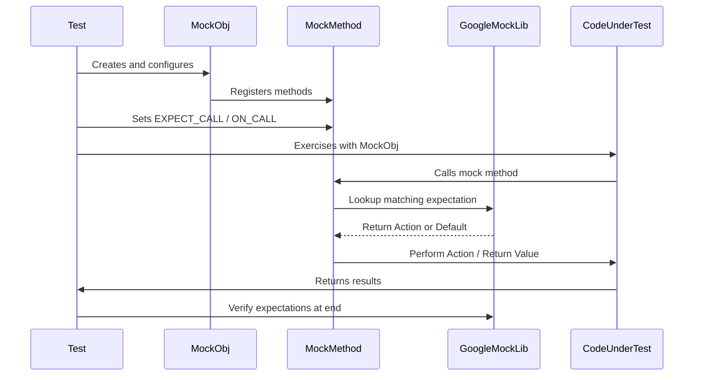

# The Mocking Model

Understand the foundational concepts of function mocking within the GoogleMock framework, central to writing expressive, precise, and maintainable unit tests for C++ code. This guide unveils key distinctions between mock objects and test doubles and explains how GoogleMock harnesses type-safe, configurable mocks to facilitate isolated and repeatable tests.

---

## Introduction to the Mocking Model

In C++ testing, the mocking model is the strategy and mechanism that allow you to create *mock objects* — specialized test doubles crafted to simulate behavior of real components. GoogleMock provides a powerful mocking model that enables you to:

- Define detailed function call expectations.
- Specify default behaviors for when mock methods are called.
- Verify invocation counts, argument constraints, and call order.

This model is crucial for isolating your unit tests and verifying interactions without relying on real dependencies.

---

## Mock Objects vs Test Doubles

Before diving deeper, it’s essential to distinguish **mock objects** from general **test doubles**:

- **Test Double:** Any object used to replace a real component for testing purposes, including fakes, stubs, mocks, and spies.
- **Mock Object:** A specific type of test double pre-programmed with *expectations* that verify the interaction between the system under test and its collaborators.

GoogleMock specializes in providing advanced, expressive mock objects.

---

## Core Concepts of GoogleMock’s Mocking Model

### 1. Mock Methods

At the heart of a mock object are its mock methods, declared using the `MOCK_METHOD` macro, which simulate the behavior of the real methods. Each mock method supports:

- Specifying which calls are expected with `EXPECT_CALL`.
- Defining default behaviors for uninteresting calls with `ON_CALL`.

You instruct GoogleMock how each method should behave and what arguments and call counts are valid.

### 2. Expectations

Expectations define the expected interaction with a mock method during the test run. With an expectation you specify:

- **Which arguments:** Using matchers (_ wildcards, predicates, comparisons, tuples).
- **How many times:** Using cardinalities like `Times(1)`, `AtLeast(n)`, or `AnyNumber()`.
- **Ordering constraints:** Via `InSequence`, `After` clauses or implicit sequences (`InSequence` scope).
- **Behavior:** Actions to perform on matching calls, such as `Return()`, `Invoke()`, or custom lambdas.

The expectations drive rigorous verification — any deviation is reported immediately with detailed failure messages.

### 3. Default Actions

`ON_CALL` lets you specify default actions for mock methods without enforcing an expectation that they are called. This establishes a behavior baseline:

```cpp
ON_CALL(mock_obj, Method(_)).WillByDefault(Return(100));
```

If calls do not match any `EXPECT_CALL`, default actions allow the test to proceed gracefully.

---

## Expressive and Type-Safe Mocking

GoogleMock’s mocking model balances expressiveness and compile-time checking:

- Matchers are statically type-checked to match argument and return types.
- Method call sequences and cardinalities can be precisely expressed and verified.
- Repeated `EXPECT_CALL`s on the same method are ordered so newer expectations override older ones, supporting a common pattern of general default expectations in setup code and more specific expectations in tests.

This ensures your mocks both capture the intent of your tests and prevent common mistakes early in the build.

---

## Working with Mock Expectations: User Workflow

1. **Define a mock class** with mocked methods specifying function signatures.

2. **Set default behaviors** with `ON_CALL()` in test fixture setup or constructor.

3. **Specify expectations** with `EXPECT_CALL()` before exercising the tested code. Example:

```cpp
EXPECT_CALL(mock_turtle, Forward(50))
    .Times(1)
    .WillOnce(Return());
```

4. **Control order and cardinality** using `InSequence`, `After`, and `Times()`.

5. **Run your tests**. GoogleMock verifies at runtime that expectations are met,
   reporting detailed info on failures immediately.

---

## Call Strictness: Nice, Naggy, and Strict Mocks

GoogleMock allows controlling how uninteresting calls (calls without explicit expectations) are handled by wrapping your mock class with:

- `NiceMock<Mock>`: suppresses warnings on uninteresting calls.
- `NaggyMock<Mock>` (default): warns on uninteresting calls.
- `StrictMock<Mock>`: treats uninteresting calls as errors.

Choose based on your need to enforce strict verification or suppress noise.

---

## Sequencing and Partial Ordering

Expectations can be ordered strictly or partially:

- Use the `InSequence` object to enforce strict linear call order within a scope.

- Use `Sequence` objects combined with `.InSequence()` clauses allowing partial orders represented as Directed Acyclic Graphs (DAGs). This enables expressing complex inter-call dependencies without overconstraining tests.

- The `.After()` clause lets you specify that one expectation depends on others’ satisfaction.

This flexibility helps avoid brittle tests while still verifying critical interaction order.

---

## Verifying and Clearing Expectations

You can explicitly verify that expectations are met by calling:

```cpp
Mock::VerifyAndClearExpectations(&mock_object);
```

This is useful when object lifetime extends beyond the scope of the test or when you want to reset expectations.

GoogleMock also verifies expectations automatically when mock objects are destroyed, ensuring fail-fast notifications.

---

## Troubleshooting Common Mocking Issues

- **Unexpected Calls:** Occur when a method call does not match any existing expectation. GoogleMock reports detailed failure messages including argument mismatches and call counts.

- **Uninteresting Calls:** Occur on methods with no expectations. Depending on your mock’s strictness, they can generate warnings or errors.

- **Saturation Violations:** Calling a mock method more times than allowed triggers immediate errors with clear diagnostics.

- Always set expectations *before* the method is invoked, as calling `EXPECT_CALL()` after a method invocation leads to undefined behavior.

---

## Practical Tips for Success

- Place `EXPECT_CALL()` statements up front, typically in test setup, to avoid surprises.
- Use `ON_CALL()` to define common default behaviors.
- For multiple return values, chain `.WillOnce()` and `.WillRepeatedly()` intelligently to match expected call counts.
- Use `RetiresOnSaturation()` on expectations that should no longer match after being saturated.
- Employ `NiceMock` or `StrictMock` based on how strictly you want to enforce mock usage.
- Combine sequences and `.After()` to express complex interactions cleanly.

---

## Summary Diagram of the Mocking Model Interaction Flow



---

## Additional Resources

To deepen your mastery of GoogleMock’s mocking model, explore:

- [gMock Cookbook](https://google.github.io/googletest/gmock_cook_book.html) for recipes and best practices.
- [Mocking Reference](https://google.github.io/googletest/reference/mocking.md) for technical API details.
- [gMock for Dummies](https://google.github.io/googletest/gmock_for_dummies.html) for learning basics.
- [Writing & Running Tests](https://google.github.io/googletest/api/core_testing_apis/writing-and-running-tests.html) for integrating mocks into test flows.

Having a firm grasp on the mocking model empowers you to write clear, robust, interaction-based tests that accelerate development and improve code quality.
