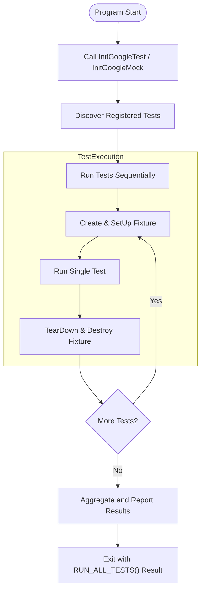

# Testing Architecture & Entrypoints

## Overview

Understanding how GoogleTest and GoogleMock orchestrate the testing lifecycle is crucial for users aiming to write robust tests and effectively interpret test outcomes. This guide breaks down the core layers involved in test discovery, initialization, execution, and reporting. It also explains the various entrypoints used across platforms and how they integrate to provide a smooth test-running experience.

Whether you're running tests locally on your development machine or deploying tests in embedded environments, knowing these core concepts lets you harness GoogleTest and GoogleMock’s full potential.

---

## Test Lifecycle: From Discovery to Reporting

At the heart of GoogleTest and GoogleMock is an automated flow that discovers tests in your code, initializes required resources, runs tests in isolation, and reports detailed results.

### 1. Test Discovery

GoogleTest automatically discovers tests and test fixtures defined using macros like `TEST`, `TEST_F`, and related variants. Each test is uniquely identified by its test suite and test name.

- **Test Suites** group related tests logically.
- Test fixture classes prepare and clean up common test environments.

The discovery happens at runtime through auto-registration, meaning you don’t need to manually list tests.

### 2. Initialization

Before tests run, GoogleTest initializes global state and parses command-line flags.

- `testing::InitGoogleTest(&argc, argv)` must be called early to parse flags and prepare the framework.
- For GoogleMock, `testing::InitGoogleMock(&argc, argv)` extends this initialization to include mocking-specific setup.

Initialization handles platform-specific nuances (e.g., Windows UNICODE support, embedded platforms initialization).

### 3. Test Execution

- Tests execute one at a time on fresh test fixtures, ensuring isolation and repeatability.
- Setup and teardown happen via `SetUp()` and `TearDown()` methods on fixtures.
- Assertion failures can be fatal (`ASSERT_*`) or non-fatal (`EXPECT_*`), controlling flow continuation.

GoogleTest supports parallel and asynchronous test execution where permitted by the environment.

### 4. Result Reporting

- After each test, GoogleTest reports success or failure with detailed messages and stack traces.
- The aggregated results are returned by `RUN_ALL_TESTS()`, with exit code `0` on success.
- This behavior is critical for CI systems and automated pipelines relying on standard exit codes.

---

## Entrypoints: Running Tests Across Environments

GoogleTest and GoogleMock provide built-in main functions suitable for most users, simplifying test binary creation.

### GoogleTest Main Entrypoint

The `gtest_main` library provides a default implementation:

```cpp
int main(int argc, char **argv) {
  testing::InitGoogleTest(&argc, argv);
  return RUN_ALL_TESTS();
}
```

This main function initializes the framework and runs all discovered tests. It also handles parsing flags that control test filtering and output.

You can write a custom `main` if you need additional setup but should always return `RUN_ALL_TESTS()`.

### GoogleMock Main Entrypoint

GoogleMock extends `gtest_main` with its own:

```cpp
int main(int argc, char** argv) {
  testing::InitGoogleMock(&argc, argv);
  return RUN_ALL_TESTS();
}
```

`InitGoogleMock` initializes both GoogleMock and GoogleTest together to ensure mocking features are ready.

### Embedded & Special Platforms

For Arduino-like platforms and some embedded systems (ESP8266, ESP32, NRF52), entrypoints are adapted to their event loops by implementing `setup()` and `loop()` instead of `main()`.

```cpp
void setup() {
  testing::InitGoogleTest();  // or InitGoogleMock()
}

void loop() {
  RUN_ALL_TESTS();
}
```

This allows tests to run in environments without a conventional OS main function.

---

## Architectural Components Involved

While the internal architecture is complex, from a user's viewpoint, these are the key components working behind the scenes:

- **Test Registers**: Store metadata about defined tests for discovery and lookup.
- **Test Suites & Fixtures**: Manage grouping and shared test data.
- **Assertion Macros**: Provide outcome control and messaging.
- **Test Runner**: Drives the execution lifecycle, handling setup, teardown, and result aggregation.

GoogleMock integrates by adding mocking expectations and behaviors, extending test plans with mock objects and call verifications.

---

## Typical User Workflow Illustrated

Imagine you are a developer who has just written a few tests and mocks:

1. **You write tests and mocks** using `TEST()`, `TEST_F()`, and `MOCK_METHOD()`.
2. **You define a `main` function or link with `gtest_main`/`gmock_main`**.
3. **When you run your test binary:**
   - The framework **discovers** your tests.
   - **Initializes** GoogleTest and GoogleMock.
   - Runs each test separately on a fresh fixture.
   - Reports test success/failure.
4. **You interpret results** and fix or extend tests.

This process is seamless due to the built-in orchestration.

---

## Practical Tips & Best Practices

- **Always return `RUN_ALL_TESTS()` from your `main()`**; this ensures proper reporting and exit codes.
- Use `testing::InitGoogleTest(&argc, argv)` or `testing::InitGoogleMock(&argc, argv)` at program start.
- If needed, write your own `main()` only for specialized environment setup.
- Use built-in `gtest_main` or `gmock_main` libraries for quick startup.
- In embedded platforms, adapt entrypoints using provided `setup()` and `loop()` patterns.
- Group related tests into test suites for better organization and clarity.

---

## Troubleshooting Common Entrypoint Issues

<AccordionGroup title="Common Entrypoint Challenges & Solutions">
<Accordion title="Test Not Discovered or Run">
If your test does not appear in the test run:
- Verify you used `TEST` or `TEST_F` macros correctly.
- Ensure your test file is compiled and linked into the test binary.
- Check that `RUN_ALL_TESTS()` is called in `main()`.
</Accordion>
<Accordion title="Tests Always Passing or Never Running">
- Confirm that `InitGoogleTest` or `InitGoogleMock` is called before `RUN_ALL_TESTS()`.
- Ensure no early exit before `RUN_ALL_TESTS()`.
- Make sure `main()` returns the value of `RUN_ALL_TESTS()`.
</Accordion>
<Accordion title="Entry Point Not Found or Multiple Mains">
- Use `gtest_main` or `gmock_main` only once in your project.
- Avoid manually defining `main()` if linking against `gtest_main`.
- On embedded platforms, implement `setup()` and `loop()` correctly.
</Accordion>
</AccordionGroup>

---

## Illustration: Test Execution Flow Diagram



---

## Summary

This page has broken down how GoogleTest and GoogleMock control the workflow from test discovery through initialization and execution to reporting. It has clarified the roles of core entrypoints like `InitGoogleTest()`, `RUN_ALL_TESTS()`, and platform-specific startup mechanisms. Understanding this empowers users to efficiently run and diagnose their tests in diverse environments — from desktop to embedded.

For further mastery, explore related documentation covering writing tests, mocking behavior, assertions, and integration with build systems and CI pipelines.

---

## References and Further Reading

- [GoogleTest Primer](../getting-started/first-test-and-validation/quickstart-primer.md) — Learn the basics of writing and running tests
- [Mocking with GoogleMock](../guides/core-testing-workflows/mocking-with-googlemock.md) — Deep dive into mocks and expectations
- [GoogleMock Main Entrypoint Code](../googlemock/src/gmock_main.cc) — See the actual implementation of the GoogleMock main()
- [GoogleTest Main Entrypoint Code](../googletest/src/gtest_main.cc) — Reference GoogleTest's main()
- [Installing with CMake](../getting-started/installation-and-configuration/installing-googletest-cmake.md) — Setup for building test binaries
- [Test Structure and Discovery](../guides/getting-started/test-structure-and-discovery.md) — How tests are located and organized

---

## Contact and Contribution

Contributions and feedback are welcome. Visit the [GoogleTest GitHub repository](https://github.com/google/googletest) for issue reporting and pull requests.

---