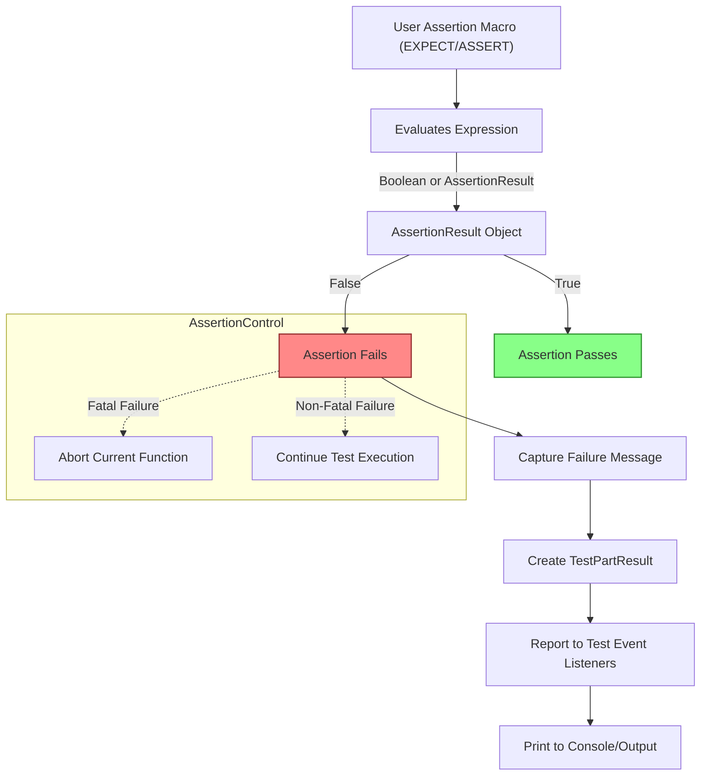

# Assertion Result Model

Understanding how GoogleTest communicates the outcome of your assertions is critical to writing effective tests and diagnosing failures. This guide unpacks how GoogleTest represents assertion results, manages success and failure states, and provides rich diagnostic information to help you swiftly pinpoint issues.

---

## Introduction to Assertion Results

At the core of every assertion in GoogleTest is the `AssertionResult` class, which encapsulates whether an assertion succeeded or failed, along with any accompanying messages describing failures.

- **Success Indicator**: Reflects if the assertion passed.
- **Failure Message**: For failed assertions, a message explains why.

The typical user does not instantiate `AssertionResult` directly but uses the factory functions:

```cpp
// Successful assertion
::testing::AssertionResult result = ::testing::AssertionSuccess();

// Failed assertion with message
::testing::AssertionResult result = ::testing::AssertionFailure() << "Value is odd";
```

This abstraction enables assertions to not simply return `true` or `false` but provide detailed messages that will be included in test failure reports.

## Why Use AssertionResult?

Booleans alone do not provide context. `AssertionResult` allows custom predicates to convey richer diagnostics.

### Example: Checking Evenness

```cpp
testing::AssertionResult IsEven(int n) {
  if (n % 2 == 0)
    return testing::AssertionSuccess() << n << " is even";
  else
    return testing::AssertionFailure() << n << " is odd";
}
```

When used with:

```cpp
EXPECT_TRUE(IsEven(someValue));
```

A failure will print:

```
Value of: IsEven(someValue)
  Actual: false (5 is odd)
Expected: true
```

Providing clear context beyond a simple boolean failure.

## Fatal vs Non-Fatal Failures

GoogleTest distinguishes between:

- **Fatal Failures**: e.g., `ASSERT_*` macros, which abort the current function immediately.
- **Non-fatal Failures**: e.g., `EXPECT_*` macros, which log the failure but allow the test to continue.

This distinction is managed outside of `AssertionResult` but relies on it to indicate success or failure.

<Check>
Use `ASSERT_*` when the test cannot sensibly proceed after failure.
Use `EXPECT_*` when you want to detect multiple failures in a single test.
</Check>

## AssertionResult API Highlights

Users writing predicate functions or custom matchers can interact with `AssertionResult` as follows:

- **Conversion to bool**: Allows assertions like `EXPECT_TRUE(predicate)`.
- **Negation Operator `!`**: Produces the logical negation while preserving the message.
- **Stream Insertion Operator `<<`**: Add diagnostic text to the message.

### Example: Streaming Additional Messages

```cpp
AssertionResult MyPredicate(int x) {
  if (x > 0) return AssertionSuccess() << "positive value: " << x;
  return AssertionFailure() << "non-positive value: " << x;
}
```

### Using with `EXPECT_TRUE` and `EXPECT_FALSE`

```cpp
EXPECT_TRUE(MyPredicate(a));
EXPECT_FALSE(MyPredicate(b));
```

GoogleTest will print the message accordingly, reflecting whether the predicate succeeded or failed.

## Internals: Message Buffering

`AssertionResult` stores streamed messages internally in a dynamically allocated string, ensuring failure messages are preserved even when copies are made.

## Advanced Usage: Predicate-Formatter Assertions

For full control over failure messages, GoogleTest supports *predicate-formatters*, functions returning `AssertionResult` and taking expression strings alongside values.

```cpp
testing::AssertionResult MyPredicateFormatter(const char* expr, int value) {
  if (value > 0) return testing::AssertionSuccess();
  return testing::AssertionFailure() << expr << " evaluates to " << value << ", which is not positive.";
}
```

Used with macros like `EXPECT_PRED_FORMAT1`, this enables highly descriptive failure reporting.

## Integration with GoogleTest Framework

When an assertion fails, GoogleTest creates a `TestPartResult` incorporating the message from `AssertionResult`. This result is then sent to event listeners and printed in the failure output.

## Best Practices

- **Write Predicate Functions Returning `AssertionResult`**: Prefer this approach to gain richer failure messages.
- **Avoid Overly Verbose Messages in Success Cases**: Streaming into the success path is optional and may impact performance.
- **Use Predicate-Formatter for Complex Conditions**: This allows expressing logic alongside custom error messages clearly.

## Troubleshooting Common Issues

- **Lost Failure Context**: Ensure predicate functions return `AssertionFailure() <<` rather than just `false`.
- **No Failure Message Printed**: Confirm you stream messages into the `AssertionResult` object.
- **AssertionResult Object Is Ignored**: Avoid discarding returned `AssertionResult`; use it directly in `EXPECT_TRUE` or `EXPECT_FALSE`.

## Summary

`AssertionResult` is a powerful abstraction at the heart of GoogleTest's assertion system, facilitating clear communication of test outcomes with rich diagnostic messages. Mastering its use helps create precise, maintainable, and informative tests.

---

## Additional Code Example: Custom Predicate with Explanation

```cpp
#include <gtest/gtest.h>

// Predicate function returning AssertionResult.
testing::AssertionResult IsPositive(int n) {
  if (n > 0) return testing::AssertionSuccess() << n << " is positive";
  else return testing::AssertionFailure() << n << " is not positive";
}

TEST(SampleTest, CheckPositive) {
  int value = -1;
  EXPECT_TRUE(IsPositive(value));  // Fails with message "-1 is not positive"
}
```

## See Also

- [Assertions Reference](../reference/assertions.md)
- [Advanced GoogleTest Topics - Using Functions Returning AssertionResult](../docs/advanced.md#using-a-function-that-returns-an-assertionresult)
- [Predicate Assertions](../reference/assertions.md#predicates)
- [Writing Your First Test](../getting-started/first-test-and-validation/writing-your-first-test)

---

## Visual Diagram of AssertionFlow


