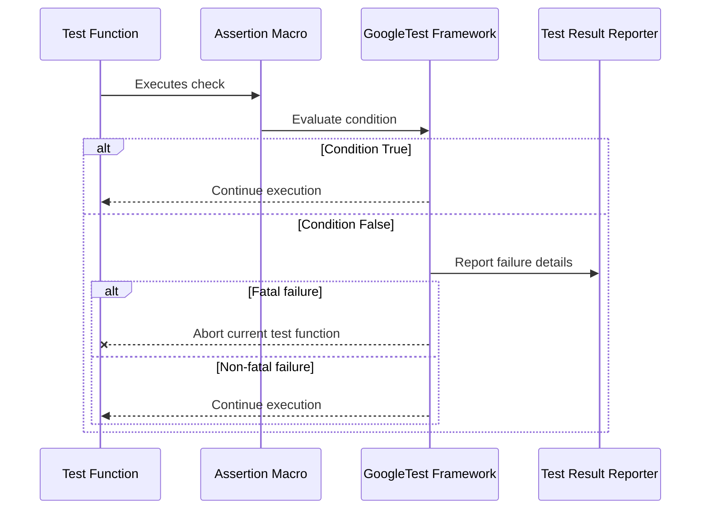

# Assertion Model and Failure Handling in GoogleTest

Understand the conceptual model of assertions in GoogleTest, distinguishing between fatal and non-fatal failures, how assertions are evaluated, and how they influence test flow and reporting.

---

## Introduction

Assertions are the backbone of test validation in GoogleTest. This page explains the assertion model, focusing on how assertions impact test execution, the difference between fatal and non-fatal failures, and how users can effectively interpret and handle these outcomes. Understanding this model empowers you to write tests that express intent clearly, catch errors precisely, and manage test flow deliberately.


## 1. Understanding Assertions in GoogleTest

Assertions are statements that check for an expected condition during test execution. If the condition holds, the test continues silently; if it fails, GoogleTest reports the failure and reacts based on the assertion's nature.

### Types of Assertions

GoogleTest categorizes assertions into two types:

- **Fatal Assertions** (`ASSERT_*`): When a fatal assertion fails, the current test function aborts immediately.
- **Non-Fatal Assertions** (`EXPECT_*`): Non-fatal failures are reported but do *not* abort the current test function, allowing subsequent code to run.

This distinction allows tests to choose whether a failure should stop further verification (for instance, when the failing condition makes subsequent checks meaningless) or whether the test should continue to verify other aspects.

### Practical Example

```cpp
TEST(MyTestSuite, ExampleTest) {
  int x = ComputeValue();
  ASSERT_NE(x, 0) << "x should not be zero";  // Fatal if fails
  int y = ComputeRatio(10, x);
  EXPECT_GT(y, 0) << "y should be positive";   // Non-fatal
  // more test code...
}
```

If `x` is zero, `ASSERT_NE` stops the test immediately, preventing division by zero. But if `y` is not positive, `EXPECT_GT` logs the failure but continues, allowing multiple issues to be discovered in one run.


## 2. The Role of Assertions in Test Flow

### How Fatal Failures Affect Execution

Fatal failures cause the current function to return immediately, skipping any remaining statements. This is crucial for protecting the test from invalid states or undefined behaviors, especially after critical checks.

### How Non-Fatal Failures Behave

Non-fatal failures record the failure but allow the test to proceed. This enables the test to report *all* failures it encounters in a single run rather than stopping at the first one.

### Test Outcome Based on Assertions

- A test **passes** only if all assertions succeed.
- A test **fails** if *any* assertion fails.
- Fatal failures abort the test function early, but the test will still be marked as failed.


## 3. Under the Hood: How Assertions Influence Reporting

When an assertion fails, GoogleTest generates detailed failure messages, including:

- The file and line number where the assertion failed.
- The failed expression.
- Custom user messages streamed via `<<`.

For fatal assertions, the framework halts the current test iteration immediately, ensuring that subsequent test code does not execute.

For non-fatal assertions, detailed failure messages accumulate, allowing tests to report multiple issues in one execution cycle.


## 4. Assertion Evaluation Workflow

To illustrate the flow of assertion evaluation and its impact on test execution, consider this user-focused sequence:



This workflow clearly shows how the assertion result controls the continuation or abortion of the test function.


## 5. Best Practices for Using Assertions

- Use **`ASSERT_*` (fatal assertions)** for conditions that must hold for the test to continue safely, e.g., validating preconditions before dereferencing pointers.
- Use **`EXPECT_*` (non-fatal assertions)** when you want to check multiple properties even if some fail, to provide comprehensive test feedback.
- Prefer **specific assertion macros** that clearly express intent (e.g., `EXPECT_EQ` over `EXPECT_TRUE` for equality checks) to get better failure messages.
- Always include a brief failure message where appropriate to improve debugging efficiency.


## 6. Common Pitfalls and How to Avoid Them

<AccordionGroup title="Common Assertion Pitfalls and Solutions">
<Accordion title="Interpreting Fatal vs Non-Fatal Failures">
Avoid confusing `EXPECT_*` and `ASSERT_*` macros. A common mistake is to use non-fatal assertions where the test cannot proceed safely.

**Tip:** When the failure of an assertion means the rest of the test logic is invalid, use a fatal assertion.
</Accordion>
<Accordion title="Ignoring Assertion Results">
Do not ignore the result of assertions. For example, writing `EXPECT_TRUE(condition);` without handling its failure impact can lead to misleading test status.

**Tip:** Rely on the test framework to handle failures and report them properly.
</Accordion>
<Accordion title="Unclear Failure Messages">
Failure messages with no additional information can slow debugging.

**Tip:** Provide contextual information using streaming operators to make failure causes explicit.

Example:
```cpp
EXPECT_EQ(a, b) << "Expected 'a' and 'b' to be equal in scenario XYZ.";
```
</Accordion>
</AccordionGroup>


## 7. Fatal and Non-Fatal Failures in GoogleMock

GoogleMock builds on GoogleTest's assertion model but adds richer control through expectations and default actions.

- **Unexpected calls**: Calls to mock functions with no matching expectation cause non-fatal failures and may use default return actions.
- **Uninteresting calls**: Calls without any expectations trigger warnings or errors depending on mock strictness.

Mock objects can be created with** different strictness levels**:

| Mock Type   | Behavior on Uninteresting Calls              |
| ----------- | --------------------------------------------- |
| `NiceMock`  | Suppresses warnings for uninteresting calls. |
| `NaggyMock` | Prints warnings (default behavior).            |
| `StrictMock`| Treats uninteresting calls as errors.         |

By understanding this, users can better design tests to balance noise and strictness.


## 8. Test Flow and Failure Reporting Impact

When an assertion or mock expectation fails:

- The failure is recorded on the current test execution context.
- For fatal assertions, control flow jumps out immediately, avoiding execution of further statements in the test.
- For non-fatal assertions, the test continues, possibly uncovering additional failures.
- At test completion, the aggregate of failures decides the test's pass/fail status and outputs consolidated reports including failure locations, messages, and stack traces, if enabled.


## 9. Summary

Understanding the assertion model in GoogleTest is essential for writing effective, maintainable tests. The choice between fatal and non-fatal failures directly shapes test flow and influences how problems are uncovered during development. Combined with GoogleMock's expectation model, this gives you a powerful, expressive testing framework.


---

## See Also

- [GoogleTest Assertion Macros](../../api-reference/core-assertions-macros/googletest-assertions.md) — deep dive into available assertion macros with examples.
- [Expectations, Actions, Cardinalities, and Matchers](../../googletest-guides/advanced-mocking/expectations-actions-cardinalities-matchers.md) — understand mock expectations.
- [Mocking Policies and Behaviors](../../api-reference/mocking-actions/mock-object-behaviors.md) — explains Nice, Naggy, Strict mocks and their impact on uninteresting calls.
- [Troubleshooting Common Issues](../../getting-started/first-test-execution/troubleshooting-common-issues.mdx) — addresses assertion-related test errors.


---

## Practical Tips

- Use `ASSERT_*` macros when a failure invalidates subsequent test steps.
- Use `EXPECT_*` macros to collect multiple failures and avoid premature test termination.
- Use custom messages liberally to aid debugging.
- Switch mock strictness based on testing phase: `NiceMock` while developing, `StrictMock` when validating.
- Consider test maintenance and code clarity when balancing assertion strictness.


## Troubleshooting

<Accordion title="Failures Not Aborting Test as Expected">
If a fatal assertion does not abort the test function, check if it is within a function returning non-void type, as `FAIL()` can only be used in `void` functions.
</Accordion>
<Accordion title="Unexpected Calls in Mocks">
If tests report unexpected mock calls, verify your expectation setup order and whether your mock object is configured to catch unexpected calls strictly or allow them.
</Accordion>


## Illustrative Diagram: Assertion Impact on Test Execution Flow

```mermaid
flowchart TD
    Start([Start Test Function]) --> CheckAssertion{Assertion Executes}
    CheckAssertion -->|Pass| Continue[Continue Execution]
    CheckAssertion -->|Fail (Fatal)| Abort[Abort Test Function]
    CheckAssertion -->|Fail (Non-Fatal)| LogFail[Log Failure]
    LogFail --> Continue
    Continue --> End([End Test Function])
```

This diagram frames how different assertion outcomes control test behavior.

---

*This concludes the explanation of the assertion model and failure handling in GoogleTest.*

---

<Check>
To dive deeper into assertion mechanisms and best practices, begin with the [GoogleTest Primer](../getting-started/primer.md) and the [Assertions Reference](../../api-reference/core-assertions-macros/googletest-assertions.md).
</Check>