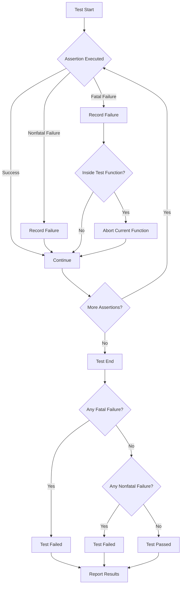

# Assertion Models and Failure Handling

## Understanding Assertions in GoogleTest

At the heart of GoogleTest’s verification mechanism lie **assertions** — statements that test expected conditions during test execution. Assertions allow you to precisely check the behavior of your code and decide if a test passes or fails.

### Outcomes of Assertions

An assertion in GoogleTest can produce three outcomes:

- **Success:** The checked condition is true.
- **Nonfatal Failure:** The condition is false, but the test continues execution, allowing other verifications to run.
- **Fatal Failure:** The condition is false, and the current function is aborted immediately.

This tri-state model empowers you to balance thoroughness and robustness in your tests. For example, nonfatal failures let you detect multiple problems in a test run, while fatal failures prevent subsequent statements that depend on critical preconditions.


## Types of Assertions

GoogleTest divides assertions into two main categories based on severity:

1. **Nonfatal Assertions (`EXPECT_*`)**
   - Generate failures but allow the current test function to continue.
   - Use these when it makes sense to detect multiple independent failures in one run.

2. **Fatal Assertions (`ASSERT_*`)**
   - Generate failures and immediately abort the current test function.
   - Use when subsequent code cannot proceed safely without the assertion passing.

> **Example:**
> ```cpp
> ASSERT_EQ(container.size(), expected_size) << "Container size mismatch.";
> // The test aborts here if container sizes differ.
>
> for (size_t i = 0; i < container.size(); ++i) {
>   EXPECT_EQ(container[i], expected_values[i]) << "Mismatch at index " << i;
> }
> // The loop reports multiple mismatches but doesn't abort early.
> ```


## Predicate Assertions for Enhanced Clarity

Sometimes, a simple Boolean check isn’t enough to express complex conditions clearly or provide the best failure messages. GoogleTest offers **predicate assertions** as an advanced feature to address this.

### `EXPECT_PRED*` and `ASSERT_PRED*`

- These macros test an arbitrary predicate function or functor that returns `bool`.
- When a predicate fails, GoogleTest prints the values of each argument to help identify the cause.

#### Example:
```cpp
// Returns true if both numbers are coprime.
bool MutuallyPrime(int m, int n) { /*...*/ }

int a = 3, b = 4;
EXPECT_PRED2(MutuallyPrime, a, b);  // Succeeds
EXPECT_PRED2(MutuallyPrime, b, 10); // Fails, prints argument values
```


### `EXPECT_PRED_FORMAT*` and `ASSERT_PRED_FORMAT*`

- These allow even more customizable failure messages.
- The predicate formatter has access to the test expressions as strings, enabling informative messages.

#### Example:
```cpp
testing::AssertionResult AssertMutuallyPrime(const char* expr1, const char* expr2,
                                              int m, int n) {
  if (MutuallyPrime(m, n))
    return testing::AssertionSuccess();

  return testing::AssertionFailure() << expr1 << " and " << expr2
      << " (" << m << " and " << n << ") share a common divisor.";
}

EXPECT_PRED_FORMAT2(AssertMutuallyPrime, a, b);
```


## Supplying Custom Failure Messages

Every assertion macro supports streaming a custom failure message using the `<<` operator. This complements automatic messages by letting you add context relevant to your tests.

### Example:
```cpp
EXPECT_EQ(value, expected) << "Value received does not match expected for input " << input_data;
```

This message will be appended if the assertion fails, giving you tailored insight when diagnosing failures.


## Fatal vs Nonfatal Failure Behavior in Subroutines

GoogleTest macros like `ASSERT_*` abort *only the current function* when they fail. This can surprise developers expecting the whole test to abort.

> **Problem Scenario:**
> ```cpp
> void Helper() {
>   ASSERT_EQ(1, 2);  // Fatal failure, aborts Helper().
>   // Not executed.
> }
>
> TEST(MyTest, TestBehavior) {
>   Helper();
>   // Test continues even after Helper's assertion failure.
>   int* p = nullptr;
>   *p = 42; // Could segfault!
> }
> ```

### How to Handle This?

GoogleTest offers three approaches:

1. **Check for Fatal Failures with `HasFatalFailure()`:**
   - Allows subroutines to detect a fatal failure and return early.
   - Usage:
   ```cpp
   Helper();
   if (testing::Test::HasFatalFailure()) return;
   ```

2. **Use Exceptions:**
   - Install a listener that throws on fatal failures, turning fatal asserts into exceptions.
   - This can propagate failures as exceptions skipping all caller frames.

3. **Use `ASSERT_NO_FATAL_FAILURE` / `EXPECT_NO_FATAL_FAILURE`:**
   - Wrap statements expected to run without fatal failures.


## Managing Assertion Messages with Traces

When assertions fail inside frequently called subroutines, it may be hard to pinpoint exactly *where* the failure occurred.

GoogleTest's **`SCOPED_TRACE()` macro** and **`ScopedTrace`** utility enable you to add contextual traces to all assertions within a scope, enriching failure diagnostics with file-line info and custom messages.

### Example:
```cpp
void Process(int n) {
  EXPECT_EQ(1, n);
  ASSERT_EQ(2, n);
}

TEST(MyTest, TracedAssertions) {
  SCOPED_TRACE("Processing input 42");
  Process(42);  // Failures here include the scope trace.
}
```

This outputs failure messages like:
```
path/to/file.cc:10: Failure
Expected: 1
  Actual: 42
Google Test trace:
path/to/file.cc:20: Processing input 42
```

This feature helps you quickly locate the context of failures, especially in loops or nested calls.


## Reporting Details and Flow of Assertion Results

GoogleTest keeps structured records of assertion results as **`TestPartResult`** objects, which capture:

- Outcome type (success, fatal failure, nonfatal failure, skipped)
- Source file and line number
- Summary and detailed failure messages

The results aggregate to test results, influencing the overall test pass/fail status and flow.

### Key Methods for Tests

- `testing::Test::HasFatalFailure()`: checks if the current test contains a fatal failure.
- `testing::Test::HasNonfatalFailure()`: checks for any nonfatal failure.
- `testing::Test::HasFailure()`: detects if there is any failure at all.

Use these helpers to programmatically query the test state within your test or subroutines.


## Practical Tips and Best Practices

- Use `EXPECT_*` assertions to gather multiple failures without aborting the test early.
- Use `ASSERT_*` assertions when failing means further test logic is unsafe or meaningless.
- Always stream meaningful custom messages to assist troubleshooting.
- Use `SCOPED_TRACE()` liberally in helper functions to provide contextual clues on failures.
- Check for fatal failures after subroutine calls when propagating errors.


## Common Pitfalls

- **Misunderstanding Fatal Assertion Scope:** Fatal failures abort only the current function, not the whole test.
- **Assertions in Constructors/Destructors:** Fatal assertions are disallowed in constructors and destructors; use `SetUp()`/`TearDown()` instead.
- **String Comparisons:** Use `EXPECT_STREQ` for C-string contents; `EXPECT_EQ` compares pointer addresses.
- **Evaluation Side Effects:** Assertions evaluate each argument exactly once; expect no surprises but be mindful about expensive expressions.


## Summary of Key Assertion Macros

| Assertion Type           | Description                          | Aborts Function? | Can Stream Messages? |
|-------------------------|------------------------------------|------------------|----------------------|
| `EXPECT_TRUE(condition)` | Checks `condition` is true          | No               | Yes                  |
| `ASSERT_TRUE(condition)` | Checks `condition` is true          | Yes              | Yes                  |
| `EXPECT_EQ(val1, val2)`  | Checks `val1 == val2`               | No               | Yes                  |
| `ASSERT_EQ(val1, val2)`  | Checks `val1 == val2`               | Yes              | Yes                  |
| `EXPECT_STREQ(s1,s2)`    | Checks C-string contents equality  | No               | Yes                  |
| `ASSERT_STREQ(s1,s2)`    | Checks C-string contents equality  | Yes              | Yes                  |
| `SUCCEED()`              | Explicit success; no effect on test | No               | Yes                  |
| `FAIL()`                 | Generates a fatal failure           | Yes              | Yes                  |
| `ADD_FAILURE()`          | Generates a nonfatal failure        | No               | Yes                  |


## Example: Handling Fatal Failures in Subroutines

```cpp
void CheckValue(int x) {
  ASSERT_EQ(1, x) << "Expected x to be 1";
}

TEST(ExampleTest, Example) {
  CheckValue(0);
  if (testing::Test::HasFatalFailure()) return;

  // Safe to continue if no fatal failure.
  // ... further test logic ...
}
```

By explicitly checking `HasFatalFailure()`, users can ensure tests abort safely and provide clear diagnostics.


## Additional Assertion Facilities

- **Exception Assertions:** Verify that code throws or does not throw exceptions.
- **Floating-point Comparisons:** Specialized macros like `EXPECT_FLOAT_EQ` to overcome rounding errors.
- **Death Assertions:** For testing that code terminates as expected (see related Guide).


---

This page complements the detailed [Assertions Reference](reference/assertions.md) and the [GoogleTest Primer](primer.md) to deepen your understanding of assertion behaviors in the framework.

---

## Diagram: Assertion Effect and Test Flow Overview



This flowchart shows how assertions during a test affect test execution and its pass/fail status.
