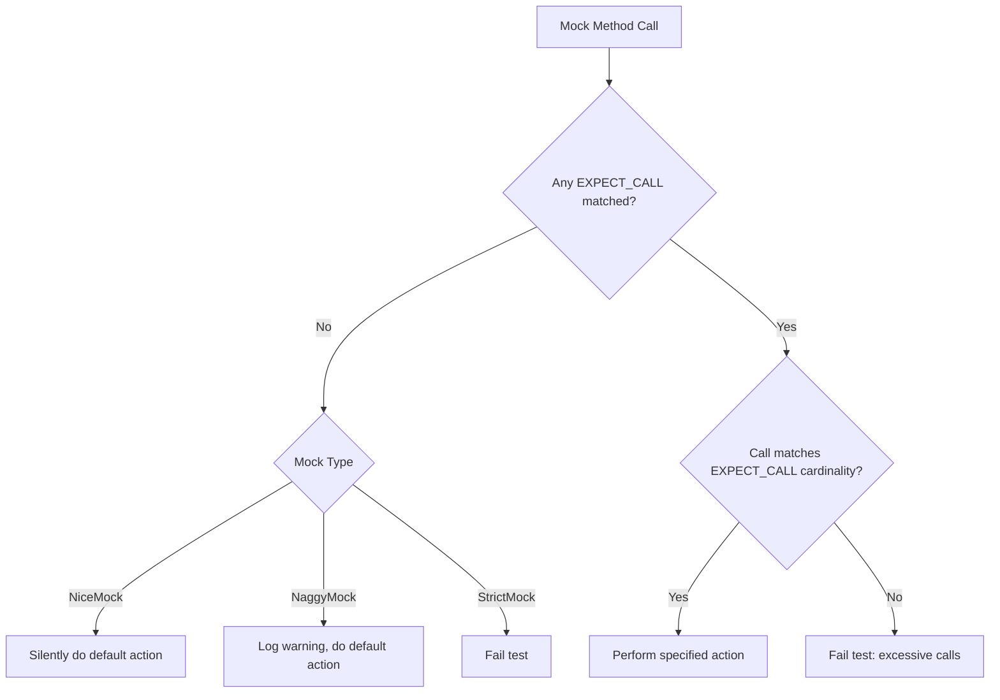

# Mock Strictness and Call Expectations

In unit testing with GoogleMock, the behavior of mock objects when they receive calls not explicitly expected by the test can be finely controlled using special wrappers known as **NiceMock**, **NaggyMock**, and **StrictMock**. These wrappers influence how uninteresting calls—calls to mock methods with no associated `EXPECT_CALL`—are handled, helping improve test reliability and feedback.

---

## Understanding Uninteresting Calls and Strictness

When you use a mock object, one of the common scenarios is that some mock methods have specific expectations (`EXPECT_CALL`), while others don’t. Calls to mock methods without any expectations are known as **uninteresting calls**. GoogleMock provides three main levels of control over how such calls are treated:

| Mock Type  | Behavior on Uninteresting Calls                                  | Use Case Summary                             |
|------------|-----------------------------------------------------------------|----------------------------------------------|
| NiceMock   | Silently ignores uninteresting calls, no warnings or failures. | Use when uninteresting calls are expected and safe to ignore.  |
| NaggyMock  | Prints warnings but does not fail the test. *Default current behavior.* | Use during test development when you want visibility into unexpected mock calls but not test failure. |
| StrictMock | Treats uninteresting calls as test failures.                    | Use when you want to fail tests on any unanticipated calls, ensuring rigorous verification.           |


## How to Use NiceMock, NaggyMock, and StrictMock

These are simple templates wrapping your existing mock classes, such as `MockFoo`:

```cpp
using ::testing::NiceMock;
using ::testing::NaggyMock;
using ::testing::StrictMock;

// Suppressing warnings for uninteresting calls
NiceMock<MockFoo> nice_mock_foo;
EXPECT_CALL(nice_mock_foo, DoThis());
nice_mock_foo.DoThis();  // Won't warn if other calls happen.

// Default naggy behavior warns on uninteresting calls
NaggyMock<MockFoo> naggy_mock_foo;
EXPECT_CALL(naggy_mock_foo, DoThis());
naggy_mock_foo.DoSomethingElse();  // Prints a warning.

// Strict failing on uninteresting calls
StrictMock<MockFoo> strict_mock_foo;
EXPECT_CALL(strict_mock_foo, DoThis());
strict_mock_foo.DoSomethingElse();  // Causes test failure.
```

You can pass constructor arguments to these wrappers as you would normally to your base mock class.

## Behavior of Uninteresting Calls

- **NiceMock:** Uninteresting calls to mock methods invoke the default action silently without warnings.
- **NaggyMock:** Prints a detailed warning message about the uninteresting call, including the function signature and call stack trace at `--gmock_verbose=info` level.
- **StrictMock:** Immediately treats any uninteresting call as a test failure with clear error messages, stopping test execution.

Even with strictness modifiers, **unexpected calls**—calls that do not match any active `EXPECT_CALL`—always produce test failures regardless of the mock’s strictness level.

## Choosing the Right Mock Strictness

| Scenario                                        | Recommended Mock Wrapping       |
|------------------------------------------------|-------------------------------|
| You want to ignore minor calls you don’t care about | `NiceMock`                    |
| You want to be warned so you can track unexpected usage | `NaggyMock` (default Mock behavior) |
| You want to enforce strict adherence to expected calls | `StrictMock`                  |

**Guidance:**
- Prefer _nice_ mocks for stable, maintainable tests where unimportant calls are tolerated.
- Use _naggy_ mocks to develop or debug tests when you want visibility without failures.
- Apply _strict_ mocks for critical interfaces where any deviation from expectations must be detected.

## Effects on Test Reliability and Feedback

Strictness choice impacts:
- **Test fragility:** Strict mocks cause tests to fail upon any extraneous calls, increasing brittleness but improving precision.
- **Debugging throughput:** Naggy mocks warn without failing, helping spot potential issues during test creation.
- **Noise reduction:** Nice mocks quiet unimportant warnings, making logs easier to read but potentially hiding problems.

Use strictness wrappers thoughtfully to balance test maintainability and detection sensitivity.

## Common Usage Patterns and Best Practices

- When initially writing tests, start with **NaggyMock** to get warnings on unexpected calls.
- Once tests mature and stabilize, switch to **NiceMock** to reduce log noise while keeping test outcome unchanged.
- Use **StrictMock** selectively for interfaces where unexpected interactions indicate serious faults.
- If you see uninteresting call warnings and want to silence them globally, wrap your mocks with `NiceMock` rather than adding catch-all `EXPECT_CALL`s.
- Avoid mixing strictness wrappers—in particular, never nest `NiceMock<StrictMock<...>>` or similar combinations.
- Ensure mocked classes have virtual destructors for proper behavior with these wrappers.

## Behavior Verification and Leak Handling

All strictness wrappers automatically register themselves with the GoogleMock framework to enforce their behavior. They also support `Mock::AllowLeak()` to prevent leak detection failures when a mock is intended to live beyond the test scope.

## Practical Troubleshooting Tips

<AccordionGroup title="Troubleshooting Strictness and Call Expectations">
<Accordion title="Unexpected Calls Are Not Failing Tests">
Verify you are using `StrictMock` or have explicit `EXPECT_CALL`s for the methods you expect to be called. Remember that uninteresting calls on `NiceMock` or `NaggyMock` won't fail tests.
</Accordion>
<Accordion title="Uninteresting Call Warnings Are Too Noisy">
Use `NiceMock` to suppress warnings if you trust the uninteresting calls. Alternatively, tune the `--gmock_verbose` flag (`error` level suppresses warnings).
</Accordion>
<Accordion title="My StrictMock Wrapper Isn't Failing on Unexpected Calls">
Check that the mock methods are declared using `MOCK_METHOD` directly in the class wrapped by `StrictMock`. Methods inherited from base classes might bypass strictness enforcement.
</Accordion>
<Accordion title="Constructor Arguments Not Passed Correctly to Wrapped Mock">
Make sure you forward constructor arguments correctly when instantiating `NiceMock`, `NaggyMock`, or `StrictMock`. They forward all their constructor parameters to the underlying mock.
</Accordion>
</AccordionGroup>

---

## Illustrative User Flow: Using Mock Strictness Wrappers in a Test

1. **Initialize the Mock:**

    ```cpp
    StrictMock<MockFoo> mock_foo;
    EXPECT_CALL(mock_foo, DoSomethingImportant());
    ```

2. **Test Subject Uses the Mock:**

    The code under test invokes `DoSomethingImportant()` as expected.

3. **Handling Uninteresting or Unexpected Calls:**

    - If an unexpected method call occurs, e.g., `mock_foo.Unexpected()`, the test fails immediately with a detailed error.
    - If an uninteresting call occurs, e.g., to `mock_foo.Unexpected()` without an expectation:
        - `StrictMock` reports an error and fails the test.
        - `NaggyMock` logs a warning.
        - `NiceMock` silently ignores the call.

4. **Test Completion and Verification:**

    On test teardown, GoogleMock verifies all expectations were met. If any expectation wasn't met, the test fails.

---

## Technical Relationship of Wrappers

These wrapper templates inherit from your mock class and privately inherit from internal classes that register with GoogleMock to alter the default behavior regarding uninteresting calls:

- `NiceMockImpl` allows uninteresting calls silently.
- `NaggyMockImpl` warns about uninteresting calls.
- `StrictMockImpl` fails on uninteresting calls.

Each wrapper disables copy construction and assignment to prevent misuse.

---

## Further Reading and References

- [gMock Cookbook: The Nice, the Strict, and the Naggy](https://google.github.io/googletest/gmock_cook_book.html#NiceStrictNaggy)
- [Mocking Reference: NiceMock, NaggyMock, StrictMock](https://google.github.io/googletest/reference/mocking.html#NiceMock)
- [GoogleMock Cheat Sheet: Using Nice, Naggy, and Strict Mocks](https://google.github.io/googletest/gmock_cheat_sheet.html#MockClass)
- [gmock-nice-strict.h](https://github.com/google/googletest/blob/main/googlemock/include/gmock/gmock-nice-strict.h)

---

## Summary

This page explains how `NiceMock`, `NaggyMock`, and `StrictMock` templates control the strictness of mock objects in handling uninteresting calls. By choosing among these wrappers, you can silence warnings when safe, receive warnings for unexpected mock usage, or enforce strict failures on any unpredicted calls. These features empower you to tune test feedback and maintain reliable, maintainable test suites.

---

## Visual Summary Diagram of Mock Call Handling Behavior



---

# End of Document
