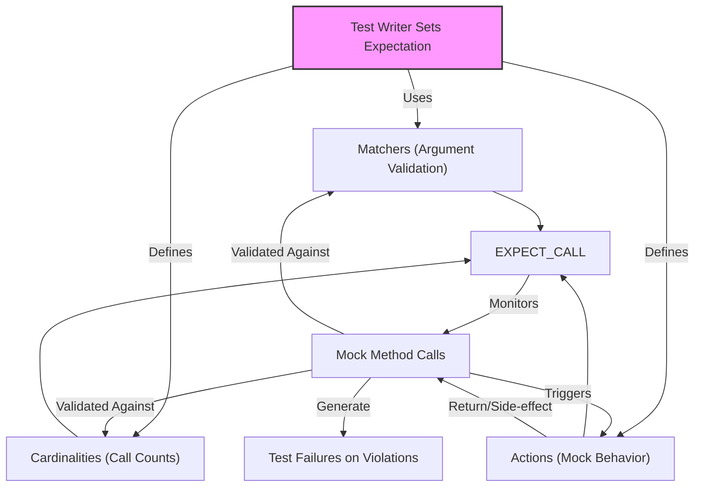

# Matchers, Actions, and Cardinalities

This guide explores the essential conceptual building blocks of GoogleMock's expressive testing framework: **Matchers**, **Actions**, and **Cardinalities**. Together, these components empower you to write tests that are not only precise and robust, but also readable and expressive.

---

## Introduction

When you write tests with GoogleMock, you primarily work with three kinds of entities that define and control mock behavior:

- **Matchers** specify what argument values you expect the mock methods to be called with.
- **Actions** define what the mock methods *do* when called, such as returning values or invoking callbacks.
- **Cardinalities** describe *how many times* you expect a mock method to be called.

They compose a domain-specific language to express your intent clearly and precisely, allowing tests to verify *interaction patterns* between your code and its dependencies.

## Conceptual Roles and User Flow

Imagine you are testing a component that depends on another class — the mock represents that class. Here is how the three concepts fit into your user journey:

1. **Matchers: Defining Expected Arguments**

   When setting expectations with `EXPECT_CALL(mock_obj, Method(args))`, you specify *which* calls matter by describing the arguments. Matchers answer the question:

   > _What arguments should the mock method receive to consider the call valid?_

   Examples:
   ```cpp
   using ::testing::_;  // wildcard matcher
   EXPECT_CALL(mock, Foo(42));        // Exact value matcher
   EXPECT_CALL(mock, Bar(Ge(5)));     // Greater or equal matcher
   EXPECT_CALL(mock, Baz(_, Lt(10))); // Combination with wildcard
   ```

   You can mix simple literals as implicit `Eq()` matchers or use complex composable matchers (like `AllOf()`, `AnyOf()`, or custom predicates).

2. **Cardinalities: Describing Call Counts**

   Next, you constrain the **quantity** of calls expected via the `.Times()` clause with cardinalities, answering:

   > _How many times should this method be called with matching arguments?_

   Cardinalities are flexible and can express exact counts, ranges, or open-ended scopes.

   Common cardinality examples:

   | Cardinality                      | Meaning                                |
   |---------------------------------|----------------------------------------|
   | `Exactly(3)` or `Times(3)`       | Exactly three calls expected            |
   | `AtLeast(1)`                     | At least one call expected              |
   | `AtMost(5)`                      | At most five calls allowed               |
   | `Between(2, 4)`                  | Between two and four calls inclusive     |
   | `AnyNumber()`                    | Calls allowed any number of times        |
   | `Times(0)`                      | The method shouldn't be called at all   |

   If you omit `.Times()`, GoogleMock infers it intelligently based on actions specified — for instance, multiple `WillOnce()` clauses imply that many calls are expected.

3. **Actions: Specifying Mock Behavior**

   Actions dictate:

   > _When the mock method is invoked (with matching arguments), what should it do?_

   By default, mock methods will return default-constructed values or zero-like values. You can override behavior with `.WillOnce()` and `.WillRepeatedly()` clauses to define sequences of actions or continuous behavior.

   Examples of actions:

   ```cpp
   using ::testing::Return;

   // Return different values for successive calls
   EXPECT_CALL(mock, GetValue())
       .WillOnce(Return(100))
       .WillOnce(Return(150))
       .WillRepeatedly(Return(200));
   ```

   Beyond returning values, actions can perform side effects, invoke callbacks, modify arguments, or call user-defined functions.

## How These Pieces Interlock

The combined use of **Matchers**, **Cardinalities**, and **Actions** permits writing expectations that read almost like sentences:

```cpp
EXPECT_CALL(turtle, GoTo(50, _))   // Called with x=50, y arbitrary
    .Times(AtLeast(2))              // Called two or more times
    .WillRepeatedly(Return(true));  // Returns true on each call
```

This example says: the mock object's `GoTo` method is expected to be called with 50 as the first argument, any value as the second, at least twice, and will always return `true`.

## Practical Tips and Best Practices

- **Be precise but not over-specific.** Only match arguments and call counts you care about to avoid fragile tests.

- **Use `_` matcher when argument values don't matter.** This improves test readability and maintenance.

- **Prefer expressing call count flexibly.** For example, `AtLeast(0)` rather than `AnyNumber()`, unless the exact constraint matters.

- **Chain `WillOnce()` for sequential behavior, `WillRepeatedly()` to cover recurring calls.** If `Times(n)` is omitted but you have `n` `WillOnce()` clauses, cardinality is inferred.

- **Use `.RetiresOnSaturation()` when multiple expectations on the same method overlap.** This deactivates expectations once saturated, allowing later ones to match.

- **Order expectations carefully.** More specific `EXPECT_CALL`s should come last because GoogleMock matches later expectations first.

- **Use sequences (`InSequence`) for ordered calls.** This adds temporal constraints to call order.

## Common Pitfalls

- **Expecting calls after they happen.** All expectations must be declared before exercising the mock.

- **Mismatch between cardinality and actions.** Having fewer or more actions (`WillOnce` or `WillRepeatedly`) than call counts expected results in warnings or errors.

- **Overly strict matching causing failed tests.** This often happens if matchers are too narrowly defined or `.Times()` is incorrectly set.

- **Ignoring `.RetiresOnSaturation()` when multiple overlapping expectations exist.** Leads to unintended failures due to expectation stickiness.

## Understanding Cardinalities in Depth

Cardinality controls **how many times** a mock method should be called.  Built-in cardinalities are implemented via classes that implement the `CardinalityInterface`, which provides methods to answer the following:

- How many calls are *allowed*?
- Is the call count *satisfied* (valid)?
- Is the call count *saturated* (upper bound reached)?

You can also implement custom cardinalities by implementing this interface.

The commonly used cardinalities include:

| Cardinality Function  | Description                             | 
|-----------------------|-----------------------------------------|
| `AnyNumber()`         | Allows any number of calls (from 0 up)
| `AtLeast(n)`          | At least `n` calls allowed
| `AtMost(n)`           | At most `n` calls allowed
| `Between(min, max)`   | Between `min` and `max` calls (inclusive)
| `Exactly(n)`          | Exactly `n` calls

For example, `Times(Exactly(2))` expects the method to be called exactly twice.

### Cardinality Examples

```cpp
EXPECT_CALL(mock, Foo()).Times(AnyNumber());    // No upper bound.
EXPECT_CALL(mock, Foo()).Times(AtLeast(1));     // One or more times.
EXPECT_CALL(mock, Foo()).Times(AtMost(3));      // Up to three calls.
EXPECT_CALL(mock, Foo()).Times(Between(2, 4));  // Between two and four calls.
EXPECT_CALL(mock, Foo()).Times(Exactly(5));     // Exactly five calls.
```


## Summary Example

Here is a complete example combining matchers, actions, and cardinalities:

```cpp
using ::testing::_;          // wildcard matcher
using ::testing::AtLeast;   // cardinality
using ::testing::Return;     // action

EXPECT_CALL(turtle, GoTo(50, _))      // Called with 50 as first argument, anything as second
    .Times(AtLeast(2))                 // At least two calls expected
    .WillRepeatedly(Return(true));    // Returns true on each matching call

EXPECT_CALL(turtle, PenDown())         // No args to match
    .Times(Exactly(1))
    .WillOnce(Return());                // Void return, just run once
```

If you run your tests and the expected call counts or argument patterns aren't met, GoogleMock will generate detailed error messages that include what was expected, what was actually called, and where the expectations were set.

---

## Troubleshooting

### Unexpected Call Failures

If a method is called more times than specified or with arguments that don't match any expectation, you get an error immediately. Use `AnyNumber()` or remove `.Times()` to allow unexpected calls.

### Cardinality and Action Mismatch

Warnings will appear if the number of `WillOnce` actions is greater than specified cardinality or fewer than necessary without a `WillRepeatedly` fallback.

### Method Overloading Ambiguity

When mocking overloaded methods, ensure you specify matchers precisely or use disambiguation helpers to avoid ambiguity errors.

### Sticky Expectations

Expectations remain active even after saturation unless `.RetiresOnSaturation()` is specified, which can cause unexpected failures.

---

## Additional Resources

- [gMock Cookbook](https://google.github.io/googletest/gmock_cook_book.html) — for practical recipes and detailed examples.
- [Mocking Reference](https://google.github.io/googletest/reference/mocking.html) — detailed API reference on mock classes, matchers, actions.
- [gMock for Dummies](https://google.github.io/googletest/gmock_for_dummies.html) — a gentle introduction with usage examples.
- [Cardinalities and Strictness Guide](https://google.github.io/googletest/guides/mocking-advanced/cardinalities-strictness.html) — managing call counts and mock strictness.

---

## Related Concepts in GoogleMock

- **Expectations and Call Ordering:** Use `InSequence` and `After` clauses to control call order.
- **Mock Strictness:** Use `NiceMock`, `NaggyMock`, and `StrictMock` wrappers to control uninteresting call behavior.
- **Custom Matchers and Actions:** Extend gMock with your own predicates and custom action classes.

---

By mastering matchers, actions, and cardinalities, you gain precise control over how your mocks behave, enabling you to write tests that clearly communicate intent and rigorously verify interaction contracts.

---

### Visual Representation: Mocking Interaction Flow



---