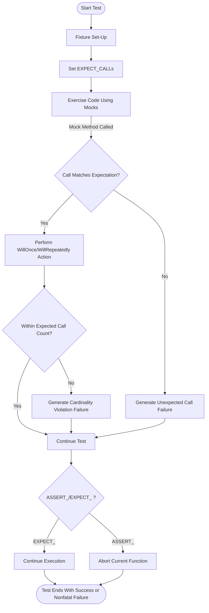

# Assertions, Expectations, and Test Failures

Understanding how assertions and expectations function in GoogleTest and GoogleMock is crucial for writing robust, maintainable tests. This guide explains the types of assertions, how expectations control mock behavior, the difference between fatal and non-fatal failures, and best practices for effective error signaling.

---

## 1. Understanding Assertions in GoogleTest

Assertions are your primary tool for verifying the correctness of code under test. GoogleTest distinguishes between two classes of assertions:

- **Non-fatal failures (`EXPECT_` macros):** Signal a failure but allow the test function to continue executing.
- **Fatal failures (`ASSERT_` macros and `FAIL()`):** Signal a failure and immediately abort the current function.

### 1.1 Examples of Assertions

```cpp
// Non-fatal assertion continues the test even if it fails
EXPECT_EQ(foo, bar) << "foo and bar should be equal";

// Fatal assertion aborts the test function if it fails
ASSERT_TRUE(is_ready()) << "Object is not ready";

// Explicit failure
FAIL() << "This code should not be reached";
```


### 1.2 User-Facing Failure Messages and Streaming

Assertions support streaming additional custom error messages via `<<`. This is useful to add context on failures:

```cpp
EXPECT_NE(ptr, nullptr) << "Pointer should not be null at this point";
```

### 1.3 Propagating Fatal Failures

A key point: fatal failures abort only the current function, not the entire test. For example:

```cpp
void Subroutine() {
  ASSERT_EQ(1, 2);  // Fatal failure aborts Subroutine(), not whole test
  // ... further code not executed if above fails
}

TEST(FooTest, Bar) {
  Subroutine();
  // This will still run even if ASSERT_EQ failed above.
  // To handle this, you can check for failures:
  if (testing::Test::HasFatalFailure()) return;
  // ... rest of test
}
```

Consider using `ASSERT_NO_FATAL_FAILURE(statement)` to assert that no fatal failures occur within a subroutine.

<br/>

---

## 2. Expectations and Behavior in GoogleMock

Expectations describe how mock objects should behave and what calls are anticipated during test execution. They inform verification and determine runtime behavior when mocks are invoked.

### 2.1 Setting Expectations with `EXPECT_CALL`

```cpp
EXPECT_CALL(mock_object, MethodName(matchers))
    .Times(cardinality)
    .WillOnce(action)
    .WillRepeatedly(action);
```

- `mock_object`: The mock instance.
- `MethodName`: The method being mocked.
- `matchers`: Argument matchers for expected call arguments.
- `Times`: How many times the call is expected (e.g., `Times(1)`, `AtLeast(2)`).
- `WillOnce`: A sequence of actions the mock will perform on each matching invocation.
- `WillRepeatedly`: Action to perform once `WillOnce` actions are exhausted.

If `Times()` is not specified, GoogleMock infers call count based on `WillOnce()` and `WillRepeatedly()` presence:

- No `WillOnce()` or `WillRepeatedly()`: `Times(1)` is assumed.
- n `WillOnce()` with no `WillRepeatedly()`: `Times(n)` is assumed.
- n `WillOnce()` with one `WillRepeatedly()`: `Times(AtLeast(n))` is assumed.

### 2.2 Default Behavior with `ON_CALL`

`ON_CALL` defines default behavior of a mock when a method is invoked but no explicit expectation matches.

```cpp
ON_CALL(mock_object, MethodName(matchers))
    .WillByDefault(action);
```

`ON_CALL` does *not* set any expectation that the method must be called.

### 2.3 Uninteresting vs Unexpected Calls

- **Uninteresting call:** A mock method call that doesn't match any `EXPECT_CALL`. This is allowed but may emit a warning.
- **Unexpected call:** A mock method call that matches some `EXPECT_CALL` but does not satisfy argument matchers or cardinality. This is always an error.

You can control how uninteresting calls are treated:

- Use `NiceMock<T>` to suppress warnings on uninteresting calls.
- Use `StrictMock<T>` to treat uninteresting calls as test failures.

### 2.4 Call Matching and Ordering

GoogleMock searches expectations in reverse order they are declared—recent expectations override previous ones.

**Ordering constraints:**

- Use `InSequence` or `.InSequence()` to require calls happen in given order.

```cpp
{
  InSequence seq;
  EXPECT_CALL(mock, Foo(1));
  EXPECT_CALL(mock, Foo(2));
}
```

- Use `.After()` to specify a call should happen only after other calls.

### 2.5 Expectation Lifetime and Retiring

By default, expectations are "sticky" — they stay active even after their expected number of calls is reached, causing errors on excess calls.

Use `.RetiresOnSaturation()` on an expectation to make it automatically retire when saturated, allowing subsequent expectations to match.

<br/>

---

## 3. Fatal vs. Non-Fatal Failures and Their Impact on Tests

GoogleTest and GoogleMock distinguish between failures that abort the current function and those that do not. This behavior impacts test flow and failure reporting.

| Failure Type | Macros / Functions      | What Happens to Test?                              |
|--------------|------------------------|---------------------------------------------------|
| Fatal        | `ASSERT_`, `FAIL()`    | Abort current function immediately, marking test failure.
| Non-Fatal    | `EXPECT_`, `ADD_FAILURE()` | Record failure but continue test execution.

<Info>
Fatal assertions only abort the *current function*, not the entire test body or thread. This encourages writing helper functions with assertions and careful failure management.
</Info>

### 3.1 Propagating Fatal Failures

- Check `testing::Test::HasFatalFailure()` after subroutine calls to decide whether to continue.
- Use `ASSERT_NO_FATAL_FAILURE(stmt)` to assert a statement contains no fatal failure.

### 3.2 Skipping Tests and Assertions

You can skip tests early with `GTEST_SKIP()` macro:

```cpp
TEST(FooTest, Bar) {
  if (!IsSupported()) {
    GTEST_SKIP() << "Skipping test due to unsupported environment";
  }
  // ... rest of test ...
}
```

Skipped tests neither count as failure nor success and allow skipping complex precondition checks.

<br/>

---

## 4. Examples Highlighting Assertion and Expectation Behavior

### 4.1 Simple Assertion

```cpp
TEST(SimpleTest, Equality) {
  int a = 5;
  int b = 5;
  EXPECT_EQ(a, b) << "a and b should be equal";
}
```

### 4.2 Using `EXPECT_CALL` with Times and Actions

```cpp
using ::testing::Return;

TEST(MockTest, ReturnsExpectedValues) {
  MockFoo mock;
  EXPECT_CALL(mock, GetValue())
      .Times(3)
      .WillOnce(Return(10))
      .WillOnce(Return(20))
      .WillRepeatedly(Return(30));
  
  EXPECT_EQ(mock.GetValue(), 10); // 1st call
  EXPECT_EQ(mock.GetValue(), 20); // 2nd call
  EXPECT_EQ(mock.GetValue(), 30); // 3rd call
  EXPECT_EQ(mock.GetValue(), 30); // 4th call, uses WillRepeatedly
}
```

### 4.3 Ordering with `InSequence`

```cpp
using ::testing::InSequence;

TEST(MockTest, CallOrderEnforced) {
  MockFoo mock;
  {
    InSequence s;
    EXPECT_CALL(mock, Step1());
    EXPECT_CALL(mock, Step2());
    EXPECT_CALL(mock, Step3());
  }
  
  mock.Step1();
  mock.Step3();  // Fails: out of order
}
```

### 4.4 Handling Unexpected Calls

```cpp
EXPECT_CALL(mock, Foo(1));
mock.Foo(2);  // Unexpected call, generates a test failure
```

### 4.5 Using `EXPECT_NO_FATAL_FAILURE`

```cpp
void DoSubtest() {
  ASSERT_EQ(1, 2);  // Fatal failure but does not abort test
}

TEST(ParentTest, ChecksSubtest) {
  EXPECT_NO_FATAL_FAILURE(DoSubtest());
}
```

This macro flags test failure if `DoSubtest` produces any fatal failures.

<br/>

---

## 5. Best Practices for Robust Error Signaling

- Use `EXPECT_` macros when you want to continue testing even if an assertion fails.
- Use `ASSERT_` macros when failure of a condition makes further testing invalid or unsafe.
- Set expectations (`EXPECT_CALL`) *before* exercising the code to avoid undefined mock behaviors.
- Use `ON_CALL` to set default mock behaviors without enforcing a call count.
- Use appropriate cardinalities (`Times()`, `AtLeast()`, `AnyNumber()`) to model expected call counts accurately.
- Use `RetiresOnSaturation()` when you want an expectation to retire when saturated, to allow others to match.
- Handle fatal assertions in subroutines carefully with `EXPECT_NO_FATAL_FAILURE` or `HasFatalFailure`.
- Suppress unnecessary warnings on uninteresting mock calls with `NiceMock` or controlled verbosity.
- Name your death tests with the `*DeathTest` suffix and handle mock leaks accordingly.

<br/>

---

## 6. Troubleshooting Common Failures

### 6.1 Unexpected Calls

Occurs when a mock method is called with arguments that do not match any active `EXPECT_CALL` for that method. Check the argument matchers and call order.

### 6.2 Uninteresting Calls Warning

Mock method called without any `EXPECT_CALL` matching that method. Use `ON_CALL` to define default behavior, or use `NiceMock` to suppress warnings.

### 6.3 Times Cardinality Violations

Fails when call count of an expected method is less or more than specified in `Times()`. Correct your test flow or loosen cardinality as needed.

### 6.4 Calls Out of Order

Using `InSequence` or `.After()` incorrectly can cause errors. Check if the sequence or ordering constraints align with actual calls.

### 6.5 Fatal Assertions Not Terminating Entire Tests

Remember fatal assertions abort only the current function. Use `HasFatalFailure()` to guard further execution after a failure.

### 6.6 Mock Object Not Verified

If a mock object is leaked or destroyed late, verification for expectations may not occur causing false positives. Use `Mock::VerifyAndClearExpectations(&mock_obj)` to force verification.

<br/>

---

## 7. Summary

This guide clarified how assertions and expectations dictate test success and failure in GoogleTest and GoogleMock. Mastery of fatal vs non-fatal failures, proper expectation setting, and mock call behavior is essential for precise, maintainable tests.

For next steps, explore [Matchers and Actions](https://google.github.io/googletest/gmock_cook_book.html#matchers-and-actions), [Mocking Reference](https://google.github.io/googletest/reference/mocking.html#EXPECT_CALL) and [Writing Effective Assertions](https://github.com/google/googletest/blob/main/docs/guides/core-workflows/rich-assertions.md).


---

## 8. References

- [GoogleTest Assertions Reference](../api_reference/core_test_api/assertions_reference.md)
- [GoogleMock Expectations and Behaviors](../api_reference/mocking_api/expectations_and_behaviors.md)
- [gMock Cookbook – Matching and Actions](../guides/mocking-advanced/matchers-and-actions.md)
- [gMock for Dummies](../docs/gmock_for_dummies.md)
- [GoogleTest Advanced Topics](../docs/advanced.md#propagating-fatal-failures)


---

### Diagram: Test Flow with Assertions and Expectations



This diagram illustrates how GoogleMock routes mock method calls through expectation matching and cardinality checks, and how GoogleTest assertion failures affect test control flow.

---