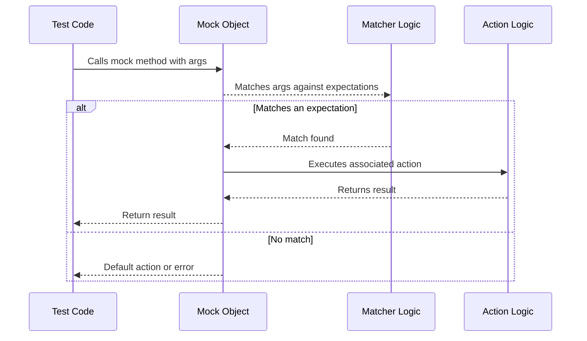

# Matchers and Actions

GoogleMock's expressive power comes from its ability to precisely specify how mock methods are expected to be called, with what arguments, how often, and what behavior they should exhibit. This is achieved through **Matchers** and **Actions**, the core ingredients that enable writing robust, clear, and maintainable tests.

This guide unpacks these fundamental concepts, helping you master how to control test expectations fluently and extend GoogleMock’s behavior through custom definitions.

---

## Understanding Matchers

Matchers are *predicates* that specify constraints on the arguments a mock method is expected to receive. They allow you not only to check equality but also to express complex conditions, combining, composing, and tailoring argument validations to your exact needs.

### Why Use Matchers?

Imagine you are mocking a method `Foo(int x)`. You could either expect exact values:

```cpp
EXPECT_CALL(mock, Foo(5));
```

or demand a broader condition using a matcher:

```cpp
using ::testing::Gt;  // greater than
EXPECT_CALL(mock, Foo(Gt(5)));
```

The latter states that calls to `Foo` with any value greater than 5 are acceptable, adding resilience and relevance to your tests.

### Basic Matchers

- **Literal values** serve implicitly as equality matchers (e.g., `5` is `Eq(5)`).
- **`_`** matches any argument.
- Common relational matchers include `Gt()`, `Lt()`, `Ge()`, `Le()`, and `Ne()` for greater than, less than, etc.

### Composing Matchers

Matchers can be combined to express more complex conditions:

```cpp
using ::testing::AllOf;
using ::testing::Ne;
using ::testing::Gt;

// Matches values > 5 and != 10
EXPECT_CALL(mock, Foo(AllOf(Gt(5), Ne(10))));
```

Nested matchers enable fine-grained tailoring of test expectations without brittleness.

### Matching Complex Arguments

- **Member Validation:** Use `Field()` and `Property()` to match object members or results of getter methods.

  ```cpp
  using ::testing::Field;
  EXPECT_CALL(mock, Foo(Field(&MyClass::count, Ge(3))));  // match if count >= 3
  ```

- **Pointers:** Use `Pointee(matcher)` to validate the value pointed to by a pointer.

- **Containers:** Use `ElementsAre()`, `UnorderedElementsAre()` and friends to match elements of STL containers, including nested containers.

### Handling Overloaded Functions

When mocking overloaded methods, help the compiler by disambiguating the matchers or using the `Const()` wrapper for const-qualified overloads.

### Creating Custom Matchers

If built-in matchers do not fit your needs, you can define **custom matchers** either using `MATCHER` macros for quick definitions or implementing matcher classes for advanced control. Custom matchers must be:

- **Purely functional and side-effect free**
- **Provide clear, human-readable descriptions**

Example using `MATCHER`:

```cpp
MATCHER(IsDivisibleBy7, "") { return (arg % 7) == 0; }
EXPECT_CALL(mock, Foo(IsDivisibleBy7()));
```

### Best Practices for Matchers

- Use matchers to express intent rather than exact values when possible.
- Combine matchers to prevent brittle tests that break on irrelevant argument details.
- Avoid matchers with side effects; these may cause nondeterministic behavior.

---

## Mastering Actions

Actions specify *what happens* when a mock method is invoked. They directly control the behavior of your mock methods.

### Default Behavior

Mock methods have built-in default actions:

- Functions returning `void` do nothing.
- Numeric and pointer returns yield zero, `false`, or `nullptr`.
- In C++11 and later, mock methods return default-constructed values for such types.

If you need specialized behavior, you can override this using actions.

### Common Built-in Actions

| Action                 | Description                                   |
|-----------------------|-----------------------------------------------|
| `Return(value)`        | Return the given value.                        |
| `ReturnRef(variable)`  | Return a reference to a variable.              |
| `ReturnPointee(ptr)`   | Return the value pointed to by a pointer.      |
| `SetArgPointee<N>(val)`| Set the value pointed by the Nth argument.
| `DoAll(a1, ..., an)`   | Do all actions, returning the last action's result.|
| `Invoke(f)`            | Call a function or functor `f` with mock args. |
| `Throw(exception)`     | Throw an exception.                            |

### Combining Multiple Actions

Sometimes you want to perform several behaviors on a call — like modifying an output parameter and returning a value. Use `DoAll()` to achieve this:

```cpp
EXPECT_CALL(mock, Foo(_))
    .WillOnce(DoAll(SetArgPointee<1>(5), Return(true)));
```

The actions `SetArgPointee` updates an output argument, and `Return` provides the return value.

### Using Functions and Lambdas as Actions

You can use free functions, lambdas, member functions, or functors as actions:

```cpp
int Add(int x, int y) { return x + y; }
EXPECT_CALL(mock, Sum(_, _)).WillOnce(Invoke(&Add));

// Lambda example
EXPECT_CALL(mock, DoSomething()).WillOnce([]() { return 42; });
```

### Handling Side Effects

To simulate side effects like modifying output parameters or global state, Actions such as `SetArgPointee`, `SetArrayArgument`, and custom functors are available.

### Delegating Actions

You can delegate actions to:

- **A fake object:** useful when you have a more complex fake implementation.
- **The real object:** to keep behavior consistent while still verifying calls.
- **Parent class:** when mocking an overridden method but want to call its base version.

### Custom Actions

Define your own actions by implementing `ActionInterface` for precise control or using the `ACTION` family of macros for rapid prototyping. Support for parameterized actions and templates is also available to create reusable test utilities.

---

## Practical Tips and Best Practices

### When to Use Matchers vs Literal Arguments

Always balance expressiveness with simplicity. Use literals when exact equality is important; use matchers to generalize and make tests resilient.

### Setting Default Behavior vs Expectations

Use `ON_CALL()` for defining default mock behavior without enforcing call counts or argument verification,

Use `EXPECT_CALL()` to express expectations about method invocations and verify interaction correctness.

### Avoid Over-Specifying Tests

Specify only the arguments and calls your tests care about. Over-specifying leads to brittle tests and excessive maintenance.

### Ordering Expectations

Use `InSequence` or `After` clauses to control the order of expected calls explicitly.

### Troubleshooting Common Issues

- If you get _uninteresting call_ warnings, consider using `NiceMock` or adding appropriate `EXPECT_CALL()` catch-alls.
- When a mock method call is unexpected or has no matching expectation, revisit your matchers and call order.

### Managing Move-Only Types

Support for move-only parameters and return types exists; prefer lambdas or functors for actions involving move-only types.

### Optimizing for Compilation Speed

Move definitions of mock constructors and destructors out of header files if compilation times get excessive.

---

## Summary Diagram: Flow of Mock Method Calls with Matchers and Actions



---

## Additional Resources

For greater detail, examples, and advanced techniques, explore:

- [gMock Cookbook](https://google.github.io/googletest/gmock_cook_book.html) — comprehensive recipes.
- [gMock Cheat Sheet](https://google.github.io/googletest/gmock_cheat_sheet.html) — quick syntax reference.
- [Mocking Reference](https://google.github.io/googletest/reference/mocking.md) — detailed API usage.
- [Matchers Reference](https://google.github.io/googletest/reference/matchers.md) — built-in and custom matchers.
- [Actions Reference](https://google.github.io/googletest/reference/actions.md) — built-in and custom actions.

Each resource will deepen your mastery of mock expectations, argument matching, behavior simulation, and test verification strategies.

---

By harnessing the power of matchers and actions, your mock-based tests evolve from rigid checks to expressive, maintainable contracts that precisely capture intended behavior — enhancing the quality and resilience of your C++ testing efforts.
