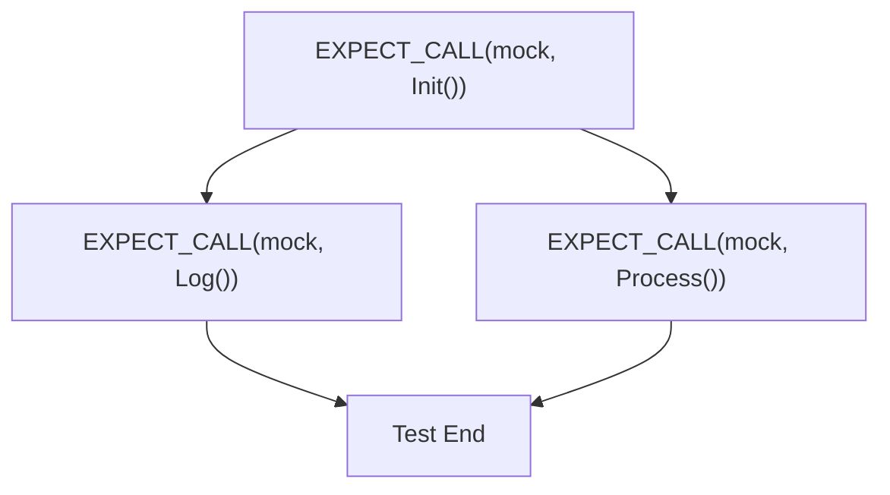

# Call Sequences and Cardinality Rules

GoogleMock empowers you to specify not only *what* calls are expected on your mock methods but also *how many* times and *in what order* these calls occur. This page explains the core concepts and semantics behind specifying call counts (cardinalities) and sequences for mock interactions, enabling you to write precise, maintainable test assertions.

---

## Understanding Call Cardinalities

A **cardinality** defines *how many times* you expect a mock method to be invoked. By specifying cardinalities, you precisely express expectations about call counts and the acceptable range they can occur in.

### Built-in Cardinalities

GoogleMock offers common cardinalities that comprehensively cover typical use cases:

| Cardinality         | Description                                                  | Example              |
|---------------------|--------------------------------------------------------------|----------------------|
| `Exactly(n)`        | Expect exactly *n* calls.                                    | `.Times(Exactly(3))`  |
| `AtLeast(n)`        | Expect *n* or more calls.                                    | `.Times(AtLeast(1))`  |
| `AtMost(n)`         | Expect no more than *n* calls.                               | `.Times(AtMost(5))`   |
| `Between(m, n)`     | Expect between *m* and *n* calls, inclusive.                 | `.Times(Between(2,4))`|
| `AnyNumber()`       | Expect any number of calls, including zero.                  | `.Times(AnyNumber())` |

If you omit `.Times()`, GoogleMock infers cardinality from your `.WillOnce()` and `.WillRepeatedly()` clauses:
- No `WillOnce` or `WillRepeatedly`: `.Times(Exactly(1))` by default
- *n* `WillOnce` clauses, no `WillRepeatedly`: `.Times(Exactly(n))`
- *n* `WillOnce` clauses plus a `WillRepeatedly`: `.Times(AtLeast(n))`

<Note>
Cardinalities are immutable objects you can copy and reuse, including creating your own by implementing `CardinalityInterface`.
</Note>

<AccordionGroup title="Common Cardinalities Explained">
<Accordion title="Exactly(n)">
Demand an exact call count. If this expectation is violated (called less or more), GoogleMock reports a failure.

```cpp
EXPECT_CALL(mock, Foo()).Times(Exactly(2)); // Foo() is called exactly twice
```
</Accordion>
<Accordion title="AtLeast(n)">
Allow the mock method to be called *at least* n times. Useful when you care about minimum occurrences.

```cpp
EXPECT_CALL(mock, Bar()).Times(AtLeast(3)); // Bar() called 3 or more times
```
</Accordion>
<Accordion title="AtMost(n)">
Restrict calls to occur *at most* n times.

```cpp
EXPECT_CALL(mock, Baz()).Times(AtMost(1)); // Baz() called no more than once
```
</Accordion>
<Accordion title="Between(m, n)">
Specify a bounded range for call count.

```cpp
EXPECT_CALL(mock, Quux()).Times(Between(2, 4)); // Quux() called 2 to 4 times
```
</Accordion>
<Accordion title="AnyNumber()">
Indicate that calls can happen any number of times (including zero).

```cpp
EXPECT_CALL(mock, X()).Times(AnyNumber()); // X() can be called any number of times
```
</Accordion>
</AccordionGroup>

### Cardinality Evaluation

- **IsSatisfiedByCallCount(n)** tells if *n* calls satisfy the cardinality.
- **IsSaturatedByCallCount(n)** tells if *n* calls saturate (i.e., no more calls expected beyond *n*).
- **IsOverSaturatedByCallCount(n)** means calls exceed the allowed cardinality.

GoogleMock uses these methods to verify calls and trigger failures or warnings when expectations are not met.

<Info>
Always ensure call counts align with cardinalities to avoid test failures (too few or too many calls).
</Info>

---

## Call Ordering with Sequences

In addition to how many times a call occurs, GoogleMock allows you to control *when* calls happen relative to others.

### Using `Sequence`

A `Sequence` object represents a chronological chain of expectations that must be satisfied in order.

By associating multiple expectations to a sequence via `.InSequence()`, GoogleMock enforces that calls occur in the expected order within that sequence.

```cpp
Sequence seq1, seq2;

EXPECT_CALL(mock, Init()).InSequence(seq1, seq2);
EXPECT_CALL(mock, Process()).InSequence(seq1);
EXPECT_CALL(mock, Cleanup()).InSequence(seq2);
```

This creates a partial order: `Init()` must happen before both `Process()` and `Cleanup()`. `Process()` must happen before `Cleanup()`.

### Using `InSequence`

The `InSequence` helper class automates sequencing for all expectations created within its scope, associating them to an anonymous sequence.

```cpp
{
  InSequence s;
  EXPECT_CALL(mock, Step1());
  EXPECT_CALL(mock, Step2());
  EXPECT_CALL(mock, Step3());
}
```

Makes Step1, Step2, Step3 expected to be called in that exact order.

### Using `.After()` for Partial Ordering

You can express partial orders by specifying which expectations should happen before others using `.After()`.

```cpp
Expectation e1 = EXPECT_CALL(mock, Open());
ExpectationSet es;
es += EXPECT_CALL(mock, Read());
es += EXPECT_CALL(mock, Write());
EXPECT_CALL(mock, Close()).After(e1, es);
```

Here, `Close()` must be called only after `Open()`, `Read()`, and `Write()`.

<Check>
Sequences and `.After()` can be combined to model complex expectations workflows.
</Check>

---

## Interaction of Cardinality and Sequences

- When an expectation is attached to a sequence, it becomes **sticky**.
- Expectations in a sequence **retire** (become inactive) when their successors in the sequence are invoked, preventing future matches.
- Without `.RetiresOnSaturation()`, expectations remain active even after satisfying the upper bound, enforcing strict call counts.
- `.RetiresOnSaturation()` allows an expectation to automatically deactivate after the upper bound of calls, making room for other matching expectations.

<Warning>
Expectations without `.RetiresOnSaturation()` that are saturated but not retired will cause failures on further matching calls.
</Warning>

---

## Practical Examples

### Default Cardinality and Actions

```cpp
EXPECT_CALL(mock, Foo()).WillOnce(Return(1));  // times inferred as Exactly(1)
mock.Foo();  // returns 1
```

### Multiple Actions With Sequencing

```cpp
{
  InSequence s;
  EXPECT_CALL(mock, Bar()).WillOnce(Return(10));
  EXPECT_CALL(mock, Bar()).WillOnce(Return(20));
}

EXPECT_EQ(10, mock.Bar());  // First call
EXPECT_EQ(20, mock.Bar());  // Second call
```

### Using `.RetiresOnSaturation()`

```cpp
EXPECT_CALL(mock, SendData(_))
    .Times(2)
    .RetiresOnSaturation();
EXPECT_CALL(mock, SendData(_))
    .Times(AnyNumber());

// First two calls match first expectation; then subsequent calls match second
```

### Complex Partial Order

```cpp
Sequence s1, s2;

EXPECT_CALL(mock, Init())
    .InSequence(s1, s2);
EXPECT_CALL(mock, ProcessData())
    .InSequence(s1);
EXPECT_CALL(mock, LogResult())
    .InSequence(s2);

// Enforces Init() happens before both ProcessData() and LogResult(),
// and LogResult() happens after ProcessData()
```

---

## Best Practices and Tips

- Use `ON_CALL()` to specify *default* behavior without requiring calls.
- Use `EXPECT_CALL()` to enforce *expected* calls with cardinalities and sequences.
- Avoid overly strict cardinalities to reduce brittle tests.
- Use sequences or `.After()` to model required call ordering.
- Use `.RetiresOnSaturation()` to allow expectations to gracefully retire.
- Remember expectations are sticky by default unless retired.

<Warning>
Do not set expectations or default actions after exercising the mock; doing so leads to undefined behavior.
</Warning>

<Note>
GoogleMock prints human-readable messages for unmet cardinalities and violated sequences to help debugging.
</Note>

---

## Troubleshooting Common Issues

- **Unexpected Calls**: Occur when a call does not match *any* active expectation.
  - Verify argument matchers and call order.
  - Use `--gmock_verbose=info` to see detailed call matching logs.

- **Too Many Calls**: When calls exceed the upper limit of cardinality.
  - Add `.RetiresOnSaturation()` if you intend to allow later calls to be handled by other expectations.

- **Sticky Expectations Blocking Calls**: If a saturated expectation is not retired, it continues rejecting further calls.

- **Out-of-Order Calls**: When calls violate a sequence or `.After()` order.
  - Confirm sequence declarations and pre-requisite expectations.

- **Warning on Uninteresting Calls**: When method called without `EXPECT_CALL`, GoogleMock issues a warning by default.
  - Use `NiceMock<T>` or add a catch-all expectation with `.Times(AnyNumber())` to suppress warnings.

---

## Visualizing Expectation Sequences



This diagram shows two sequences originating from `Init` and converging later.

---

## Related Documentation

- [EXPECT_CALL and ON_CALL Macros](../api-reference/mocking-apis/expect-call-and-on-call.md) — Detailed syntax and semantics for setting expectations.
- [Call Count Expectations (Cardinalities)](../api-reference/matchers-and-actions/call-cardinalities.md) — Comprehensive cardinality descriptions.
- [Using Mocks: Patterns and Best Practices](../guides/mocking-and-advanced-techniques/using-mocks.md) — Practical usage of sequences and cardinality.
- [Mock Strictness and Handling Unexpected Calls](concepts/behavioral_characteristics/mock_strictness_and_unexpected_calls.md) — Managing uninteresting and unexpected calls.

---

Mastering call cardinalities and sequences in GoogleMock enables you to write robust, readable, and maintainable test expectations that precisely capture the interactions between your mocks and the system under test. Use these tools to encode not just the valid inputs but also the valid call counts and orderings, ensuring tests fail fast and clearly when behaviors diverge from the contract.