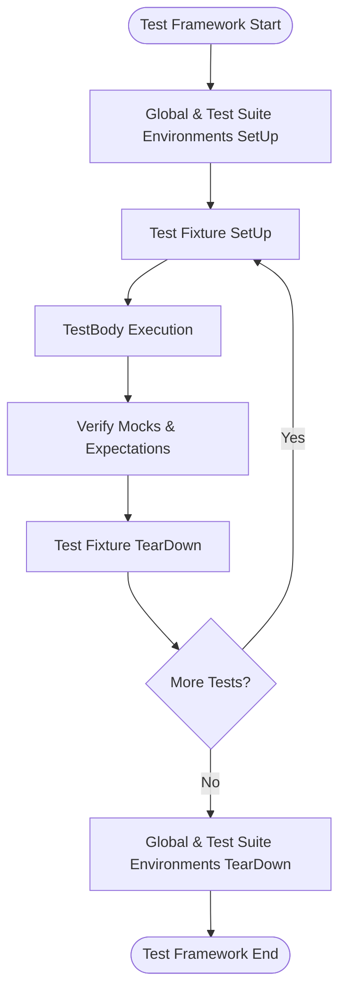

# Test Lifecycle & Failure Reporting

Understanding the lifecycle of tests and mock objects, alongside the mechanisms of failure reporting, is essential for writing robust, maintainable, and debuggable test suites with GoogleTest and GoogleMock. This guide walks you through the typical phases in test execution, the behavior of mocks during setup and teardown, and how failures propagate and are reported, supporting both developer interaction and automated systems.

---

## 1. Test Lifecycle Overview

The lifecycle of a test in GoogleTest follows a structured sequence, ensuring proper setup, execution, and teardown, with failure detection and reporting integrated throughout.

### 1.1 Phases of Test Execution

1. **Environment Setup:**
   - Global and test suite environments (`testing::Environment` and `SetUpTestSuite`) are initialized prior to any test execution.

2. **Test Fixture Setup:**
   - Per-test setup (`SetUp()`) prepares test-specific resources.

3. **Test Execution:**
   - The test body (`TestBody()`) runs, exercising the code under test.

4. **Verification & Cleanup:**
   - Upon completion or test failure, GoogleMock verifies expectations on mock objects.
   - Per-test teardown (`TearDown()`) cleans up test-specific resources.

5. **Environment Teardown:**
   - After all tests, global and test suite environments (`TearDownTestSuite`, `TearDown()`) are cleaned up.

### 1.2 Test Execution Flow with Mocks

- When a mock object is constructed (usually in test setup), it is prepared with default or explicit expectations.
- During test execution, calls on mocks are matched against expectations; violations (unexpected calls, missing calls) cause failures.
- After the test completes, mock objects are destructed and automatic verification confirms all expectations were met; mismatches produce test failures.

<Tip>
Always set expectations (`EXPECT_CALL`) before exercising the mocks. Setting expectations after calls or during teardown leads to undefined behavior.
</Tip>

## 2. Mock Object Lifecycle

Mocks are central to interaction-based testing. Understanding their lifecycle and scope is key to effective test design.

### 2.1 Construction & Initialization

- **Declaration:** Mock objects are typically declared at the beginning of a test or test fixture.
- **Default Actions:** Use `ON_CALL` to specify common default behaviors for mock methods without strict expectations.
- **Strictness Levels:** Wrap mocks with `NiceMock`, `NaggyMock`, or `StrictMock` to adjust handling of uninteresting calls and warnings.

### 2.2 During Test Execution

- Mock methods intercept calls and perform specified actions.
- Calls not matching any `EXPECT_CALL` may trigger warnings or errors, depending on mock strictness.
- Expectations may have cardinalities (`Times()`) and call order constraints (`InSequence`, `After()`).

### 2.3 Verification & Destruction

- The mock destructor automatically verifies that all expectations were satisfied.
- You can enforce verification earlier with `::testing::Mock::VerifyAndClearExpectations(&mock)`.
- Avoid setting new expectations after verification; this can cause undefined behavior.

<Warning>
If a mock object is dynamically allocated and owned by the code under test, you may want to call `Mock::VerifyAndClearExpectations()` before handing over ownership to ensure expectation verification is not missed.
</Warning>

### 2.4 Best Practices

- Declare mocks in the smallest possible scope.
- Prefer automatic (stack) allocation unless ownership transfer is required.
- Use mock wrappers (`NiceMock`, `StrictMock`) judiciously to balance strictness and test maintainability.

## 3. Failure Reporting Mechanisms

GoogleTest integrates a robust failure reporting system to provide detailed feedback for assertion and mock expectation failures.

### 3.1 TestPartResult and TestResult

- Each failure or success in a test is represented as a `TestPartResult`.
- The overall outcome is collected in a `TestResult`, including test properties and timing info.

### 3.2 Assertion Failures

- GoogleTest macros like `EXPECT_EQ`, `ASSERT_TRUE` record failures as `TestPartResult` objects.
- Comparison and matcher failures include detailed messages describing expected and actual values.

### 3.3 Mock Expectation Failures

- When a mock call violates expectations (wrong arguments, unexpected calls, wrong order), gMock reports failure through GoogleTest's system.
- Warnings for uninteresting calls can be promoted to failures with `StrictMock` or suppressed with `NiceMock`.

### 3.4 Failure Propagation

- Failures do not abort the entire test immediately (except fatal assertions).
- Fatal failures (`ASSERT_*`, `FAIL()`) abort the current function but not the entire test.
- Use `HasFatalFailure()` to check if earlier errors occurred and conditionally abort the test logic.
- In event listeners, failures can only be reported in certain callbacks (never in `OnTestPartResult`).

<Tip>
To get exceptions thrown on fatal assertion failures (for more traditional control flow), add a failure listener that throws `testing::AssertionException` on fatal failures.
</Tip>

## 4. Integration with Build and CI Systems

Testing typically happens as part of automated build and continuous integration pipelines.

### 4.1 Test Execution and Reporting in CI

- GoogleTest produces console output and can emit XML or JSON reports (`--gtest_output=xml:path` or `--gtest_output=json:path`) for CI parsing.
- Test suites, test cases, and test results are structured in reports, including detailed failure information.

### 4.2 Handling Test Flakiness

- Use `--gtest_repeat=N` and `--gtest_shuffle` to run tests multiple times in varying order to catch flaky failures.

### 4.3 Selecting and Filtering Tests

- Use `--gtest_filter` to run subsets, aiding incremental runs.

### 4.4 External Failure Catching

- Use the header `gtest/gtest-spi.h` macros like `EXPECT_FATAL_FAILURE` to write tests for the testing code itself.

## 5. Practical Tips and Common Pitfalls

### 5.1 Setting Expectations Early

Expectations must always be set before mock methods are called. Setting them late leads to undefined behavior and hard-to-diagnose failures.

### 5.2 Use of `ON_CALL` vs `EXPECT_CALL`

- `ON_CALL` sets default behavior without failure if the call is missing.
- `EXPECT_CALL` sets expectations and causes failure if violated.
- Prefer `ON_CALL` to establish smooth defaults; use `EXPECT_CALL` only where call verification is critical.

### 5.3 Handling Uninteresting and Unexpected Calls

- Default mocks are 'naggy'; they warn on unexpected calls.
- Use `NiceMock` to suppress warnings for uninteresting calls.
- Use `StrictMock` to treat uninteresting calls as failures.

### 5.4 Managing Call Order and Cardinality

- Use `InSequence`, `After()`, and `Sequence` to enforce call order where necessary.
- Use cardinalities like `Times(n)`, `AtLeast(n)`, or `AnyNumber()` carefully to express intent.

### 5.5 Debugging Failures

- Run tests with `--gmock_verbose=info` to see detailed matching logs.
- Use `SCOPED_TRACE()` to annotate assertions inside helper functions.
- Use breakpoints triggered on failure or `GTEST_FLAG_SET(death_test_style, "threadsafe")` for more robust death tests.

## 6. Summary

In sum, understanding the well-defined lifecycle of tests and mocks, combined with Google's comprehensive failure reporting and rich mock configuration, enables crafting precise, effective, and maintainable test suites. Proper use of setup/teardown, mock strictness, expectation declarations, and failure analysis transforms your testing into a powerful feedback tool suited for both rapid development and continuous integration environments.

---

## Appendix: Minimal Test Execution Flow Diagram

---

## References & Further Reading

- [gMock for Dummies](https://google.github.io/googletest/gmock_for_dummies.html): Beginner-friendly introduction to mocks and expectations.
- [gMock Cookbook](https://google.github.io/googletest/gmock_cook_book.html): In-depth recipes on mock usage, expectations, actions, and strictness.
- [Mocking Reference](https://google.github.io/googletest/reference/mocking.html): Formal API details on mock method macros and expectation syntax.
- [Assertion Macros Reference](https://google.github.io/googletest/reference/assertions.html): Guides on assertion macros and failure handling.
- [Test Discovery and Structure](https://google.github.io/googletest/reference/testing.html#TestDiscovery): Understanding how tests are registered and executed.
- [Mock Strictness and Unexpected Calls](https://google.github.io/googletest/concepts/behavioral_characteristics/mock_strictness_and_unexpected_calls.html): Clear explanation about strictness controls and call behavior.
- [Test Lifecycle & Failure Reporting](https://google.github.io/googletest/concepts/behavioral_characteristics/test_lifecycle_and_failure_reporting.html): Companion conceptual guide.

---