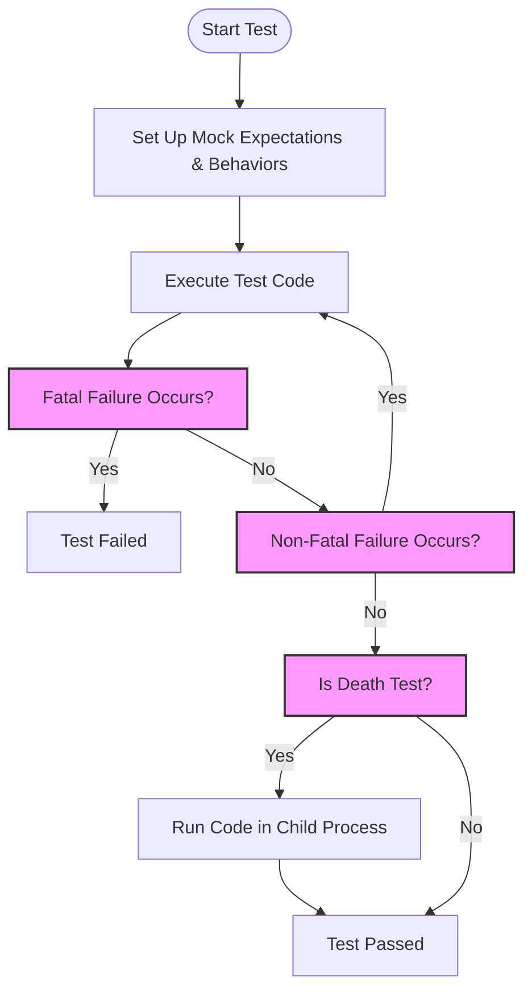

# Failure Modes: Fatal, Non-Fatal, and Death Tests

In unit testing with GoogleTest and GoogleMock, understanding the different failure modes is crucial for writing comprehensive tests that verify your software's robustness. This page explains the distinctions between **fatal failures**, **non-fatal failures**, and **death tests**, illustrating when and why to use each to effectively validate error handling, defensive programming, and critical fail-fast behaviors.

---

## 1. Fatal vs. Non-Fatal Failures

GoogleTest assertions come in pairs: `ASSERT_*` assertions generate **fatal failures** and `EXPECT_*` assertions generate **non-fatal failures**. These failure modes affect test flow dramatically:

- **Fatal Failures (ASSERT_*)**: Immediately abort the current function upon failure, preventing further execution within that test body. Useful when continuing would cause errors or meaningless results.
- **Non-Fatal Failures (EXPECT_*)**: Record a failure but allow the test to continue execution, enabling multiple verifications to be performed within the same test.

### When to Use Fatal Failures

Consider a user flow where later verification results depend on a critical assumption, such as a resource being correctly initialized. Use fatal assertions to safeguard later code from running with invalid state, and to rapidly catch serious bugs as early as possible.

```cpp
TEST(MyClassTest, Initialization) {
  MyClass obj;
  ASSERT_TRUE(obj.Init());  // Fatal: no point continuing if Init fails
  EXPECT_EQ(obj.GetValue(), 42);  // Safe to check afterward
}
```

### When to Use Non-Fatal Failures

Apply non-fatal failures when tests benefit from collecting multiple independent checks, supporting rich diagnostics and more efficient debugging.

```cpp
TEST(MyClassTest, MultipleValues) {
  MyClass obj;
  EXPECT_EQ(obj.GetX(), 10);
  EXPECT_EQ(obj.GetY(), 20);
  EXPECT_TRUE(obj.IsReady());
}
```

<Callout>
**Note:** Fatal failures only abort the current function (e.g., a test body or a helper method). They do **not** halt the entire test suite. To halt execution completely, you might need to structure tests accordingly or use explicit program exits.
</Callout>

## 2. Death Tests: Verifying Expected Process Termination

Certain checks in software, especially safety or invariant enforcement, cause the program to terminate if violated. Testing such conditions requires **death tests**, which verify that code correctly aborts under specific conditions.

- **Death Tests** run the code in a separate process.
- They confirm the process terminates as expected (crash, abort, or exit).
- They check stderr output matches expected error patterns.

### Death Test Macros

GoogleTest provides macros tailored for death tests:

- `EXPECT_DEATH(statement, regex)` verifies that `statement` causes process death, with stderr matching `regex`.
- `ASSERT_DEATH()` works similarly but aborts the current test function on failure.
- Variants like `EXPECT_DEATH_IF_SUPPORTED` gracefully degrade when death tests aren't supported.

### Example Death Test

```cpp
TEST(FileSystemTest, CrashesOnNullPath) {
  EXPECT_DEATH({ fs.LoadFile(nullptr); }, "null path");
}
```

This ensures the test fails if the method does not terminate as expected when passed a null pointer.

---

## 3. Integrating Failure Modes in Testing Strategy

### Using Fatal and Non-Fatal Failures Together

Consider situations where a failed precondition makes continued testing meaningless:

- Use `ASSERT_*` to ensure preconditions before running detailed verifications.
- Use `EXPECT_*` to accumulate multiple checks safely after validations.

This pattern improves test clarity and debuggability.

### When to Rely on Death Tests

Use death tests for verifying critical fail-fast behaviors:

- Assertions or program invariants that should never fail silently.
- Defensive programming checks that terminate on corruption or misuse.
- Error-handling that kills the process deliberately in extreme scenarios.

### Common Pitfall: In-Memory Side Effects in Death Tests

Since death tests run in subprocesses, modifications to memory or state within them do **not** affect the parent process or subsequent tests. To test observable effects, either check indirectly or avoid test code relying on shared state mutated by death tests.

<Warning>
Death tests may cause test runs to be slower and less stable due to process forking. Use them judiciously and isolate them when possible.
</Warning>

## 4. Practical Tips and Best Practices

- Set expectations and mock behaviors **inside** death test macros if you want their effects to be observable within the subprocess.
- Avoid setting expectations before death tests unless you understand the isolation.
- Use descriptive regular expressions for the error message argument to ensure meaningful validation.
- Name test suites with a `*DeathTest` suffix to indicate presence of death tests and avoid unintended ordering issues.

## 5. Example Workflow Combining Failure Modes

```cpp
TEST(MyComponentTest, HandlesInvalidInput) {
  // Fatal failure: invalid input should not proceed
  ASSERT_FALSE(component.IsValidInput(nullptr));
  
  // Non-fatal: verify multiple inputs
  EXPECT_FALSE(component.IsValidInput("");
  EXPECT_TRUE(component.IsValidInput("valid"));
}

TEST(MyComponentDeathTest, TerminatesOnNullDereference) {
  EXPECT_DEATH({ component.Process(nullptr); }, "Null pointer dereferenced");
}
```

## 6. Troubleshooting Failure Mode Issues

- **Unexpected non-fatal failures**: Verify your `EXPECT_*` checks. Failures will allow test continuation but will still mark the test as failed.
- **Missing fatal failures behavior**: Ensure `ASSERT_*` macros are used in `void` functions, as fatal assertions cannot be used in constructors or functions returning non-void.
- **Death tests hang or fail to run**: Death tests spawn subprocesses; issues can arise with multithreading, environment setup, or platform support. Consider using thread-safe death tests (`--gtest_death_test_style=threadsafe`).
- **Death test excluding mock verification**: Mock objects may not be destructed properly in death tests, use `Mock::AllowLeak()` to suppress false positives.

---

## Related Concepts and Further Reading

To deepen your understanding of failure modes and testing robustness, consult the following:

- [Writing Mock Expectations and Actions](/guides/mocking-with-googlemock/writing-mock-expectations)
- [Failure Modes in GoogleMock: Report and Handling](/concepts/concepts-behaviors/failure-modes)
- [Using Assertions Effectively](/guides/testing-techniques/advanced-assertions)
- [Death Test Implementation and Usage](/api-reference/core-testing-apis/assertions-expectations#death)
- [Test and Mock Object Lifecycle](/concepts/core-architecture/test-and-mock-lifecycle)

---

## Diagram: How Failure Modes Fit Into a Test Execution Flow



---

This page has guided you through the distinctions and best usages of fatal failures, non-fatal failures, and death tests within GoogleTest to help you build robust and reliable C++ test suites focused on real-world error handling and defensive programming.
