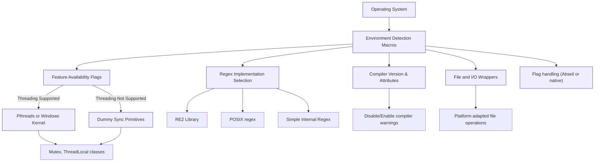

# Platform Portability and Compatibility

GoogleTest and GoogleMock are designed to provide seamless, reliable testing and mocking functionalities across a wide range of platforms and compilers. This documentation focuses specifically on the abstractions and utilities that enable this cross-platform compatibility, outlining key environmental considerations, compatibility flags, and the strategies that keep the framework both portable and future-proof.

---

## Introduction to Portability in GoogleTest and GoogleMock

Achieving broad portability is one of GoogleTest's and GoogleMock's core strengths. The codebase abstracts away platform-specific quirks and compiler idiosyncrasies through well-structured utilities and macros, ensuring developers can write tests that behave consistently regardless of the underlying operating system or compiler.

The portability layer resides prominently in the internal headers `gtest-port.h` and `gmock-port.h`, which define:

- Environment detection macros
- Feature availability flags
- Compiler and platform capability abstractions
- Synchronization primitives suitable per platform
- Command-line flag handling

By relying on these carefully crafted utilities, GoogleTest and GoogleMock maintain a robust compatibility stance and minimize the friction for developers integrating them into diverse environments.

---

## Environment and Platform Detection

GoogleTest auto-detects the compilation environment to set appropriate macros that describe:

- The operating system family (e.g., Windows, Linux, MacOS, FreeBSD, etc.)
- Compiler versions and their capabilities
- Supported threading libraries like POSIX Threads (pthreads)
- Availability of features such as exception handling, RTTI, regex libraries, and wide string support

This detection allows for specialized implementations where necessary and fallback mechanisms elsewhere. For example:

- **Platform Macros:** `GTEST_OS_WINDOWS`, `GTEST_OS_LINUX`, `GTEST_OS_MAC`, etc., are defined to identify the current target.
- **Feature Macros:** `GTEST_HAS_EXCEPTIONS`, `GTEST_HAS_RTTI`, `GTEST_HAS_PTHREAD`, `GTEST_HAS_DEATH_TEST`, etc., indicate compiler and platform support for certain features.

Users rarely need to override these manually thanks to the thorough automatic detection. However, in edge cases or unusual environments, it is possible to define these macros explicitly in the build system to guide GoogleTest’s behavior.

---

## Compiler Compatibility and Version Checks

GoogleMock imposes specific minimal compiler requirements to build successfully. For instance, Microsoft Visual C++ compilers must be version 2015 or later (`_MSC_VER >= 1900`).

Compiler-specific pragmas and warnings are managed internally to suppress noise and ensure a smooth compilation:

- Disabling warnings for deprecated functions or unreachable code where appropriate
- Managing differences in function attributes like `noinline` or `disable_tail_calls`
- Mapping functionality such as snprintf to platform-correct variants (`_snprintf_s` on MSVC)

This ensures that developers can use GoogleTest and GoogleMock without manual tweaking of compiler settings beyond the documented minimums.

---

## Threading and Synchronization Primitives

To maintain thread safety, GoogleTest provides synchronization utilities tailored to the target platform:

- On platforms supporting pthreads, mutexes and thread-local storage employ native pthread primitives.
- On Windows (desktop, not phones or RT), synchronization is built upon Windows kernel objects (`CRITICAL_SECTION`, `HANDLE`).
- Where threading support is absent or unwanted, dummy stubs are used to compile but disable concurrency guarantees.

This adaptive strategy means test code leveraging GoogleTest remains usable across a diverse range of concurrency models without modification.

### ThreadLocal and Mutex Usage Example:

```cpp
// Define a thread-local variable with default initialization
static testing::internal::ThreadLocal<int> thread_local_var(42);

// Use a mutex to protect shared data
static testing::internal::Mutex mu;

void UpdateSharedResource() {
  testing::internal::MutexLock lock(&mu);  // Acquire mutex
  // ...update shared resource...
}
```

---

## Regular Expression Support

GoogleTest chooses the most powerful available regular expression library for your platform:

- **RE2:** If your build includes Abseil and RE2, GoogleTest uses these for efficient and robust regex matching.
- **POSIX Extended Regex:** On many UNIX-like systems that lack RE2, the POSIX regex library `<regex.h>` is used.
- **Simple Regex:** As a fallback, GoogleTest includes its own simplified regex engine.

This hierarchy ensures that tests involving regex assertions or matchers perform optimally.

---

## Command-Line Flags and Environment Variables

Both GoogleTest and GoogleMock provide flexible command-line flag handling that adapts based on available dependencies:

- When Abseil support is enabled, flags use Abseil's flag library, allowing sophisticated flag parsing, reflection, and documentation generation.
- Otherwise, flags are handled as simple global variables within the testing namespace and exposed via macros.

For example, referencing a flag named `verbose` in GoogleMock looks like:

```cpp
#define GMOCK_FLAG_NAME_(name) gmock_##name
#define GMOCK_FLAG(name) FLAGS_gmock_##name

// Then you can use:
if (GMOCK_FLAG(verbose)) {
  // verbose logging enabled
}
```

This system supports declaring, defining, getting, and setting flags uniformly regardless of platform.

---

## File System and I/O Abstractions

GoogleTest internally wraps common file and I/O operations to hide platform differences, such as:

- File descriptor handling differences between Windows and POSIX
- Directory operations like `rmdir` adapted with `posix::RmDir` variation
- Detecting if output streams are connected to a terminal (`isatty`)
- Accessing environment variables with fallbacks for embedded or mobile platforms without getenv support

These utilities ensure predictable behavior when tests interact with files, directories, or environment settings.

---

## Platform-Specific Limitations and Compatibility Flags

Some platforms or environments impose limitations that GoogleTest gracefully handles:

- **Limited or no threading:** The framework disables synchronization where threads are unsupported.
- **Mobile and Embedded:** Stream redirection and death tests may be disabled on Windows Mobile, Windows Phone, or various minimal embedded targets.
- **Unicode and Wide String Handling:** Wide strings use UTF-16 primarily on Windows platforms but disable or adapt where unsupported.

Users can control these behaviors via configuration macros such as `GTEST_HAS_PTHREAD`, `GTEST_HAS_STREAM_REDIRECTION`, and others if default detection is insufficient.

---

## Best Practices for Users

- **Minimum C++ Version:** Ensure your compiler supports C++17 as GoogleTest requires it for full feature availability.
- **Set Platform Flags Only if Necessary:** Let GoogleTest auto-detect environment features; override only in case of build or runtime issues.
- **Use Provided Synchronization Primitives:** Avoid implementing custom locking or thread-local storage as the built-in classes ensure cross-platform correctness.
- **Incorporate Abseil if Available:** Integrating Abseil provides more robust flag handling and may improve regex support.

---

## Troubleshooting Common Portability Issues

- **Compilation Fails Due to Compiler Version:** Verify that your Visual Studio version is 2015 or later, or that your compiler supports C++17.
- **Unexpected Macro or Flag Errors:** Confirm that macros like `GTEST_HAS_PTHREAD` or `GTEST_OS_WINDOWS` are properly set or overridden deliberately.
- **Missing Platform Features:** For embedded platforms, some features (like environment variables or certain I/O) may be unavailable; adjust test scenarios accordingly.

For in-depth troubleshooting, refer to the [Platform and Compiler Compatibility FAQ](https://github.com/google/googletest/tree/main/faq/troubleshooting/platform-compatibility-faq).

---

## Visual Diagram: Platform Abstraction Overview



---

## Summary

This page bridges what developers need to understand about the foundational layers that give GoogleTest and GoogleMock their impressive cross-platform flexibility. By leveraging internal macro definitions, environment detection, and specialized utilities, the frameworks run reliably on a wide variety of platforms and compilers while offering uniform APIs.

To master effective usage, users should integrate this knowledge into their build and runtime environments, ensuring correct compiler versions and platform macro configurations.

---

## Related Documentation

- [Supported Platforms & Requirements](/overview/integration-ecosystem/supported-platforms) — Overview of officially supported operating systems and compilers.
- [Platform and Toolchain Support](/guides/integration-and-troubleshooting/platform-support) — Practical tips on configuring and troubleshooting platform compatibility.
- [Build & Integration Troubleshooting](/faq/troubleshooting/build-integration-issues) — Helps diagnose build failures related to platform or compiler issues.
- [GoogleTest Installation with CMake](/getting-started/installation-quickstart/install-cmake) — Configuring the environment correctly for portability.
- Internal headers: `gtest-port.h`, `gmock-port.h`, `gtest-port-arch.h`

---

## Practical Tips

- Always verify minimum compiler versions and C++ standard support before integrating GoogleTest or GoogleMock.
- Prefer using the default auto-detected macros and flags; manual overrides should be last-resort.
- If your application requires it, incorporate Abseil for enhanced compatibility features.
- Review platform-specific notes when targeting embedded or mobile systems to understand unsupported features.

---

For further detailed implementation or troubleshooting, developers can consult the source files and platform-specific macros inside the source tree under `googletest/include/gtest/internal` and `googlemock/include/gmock/internal`.

---

_Last updated: 2024-06_
