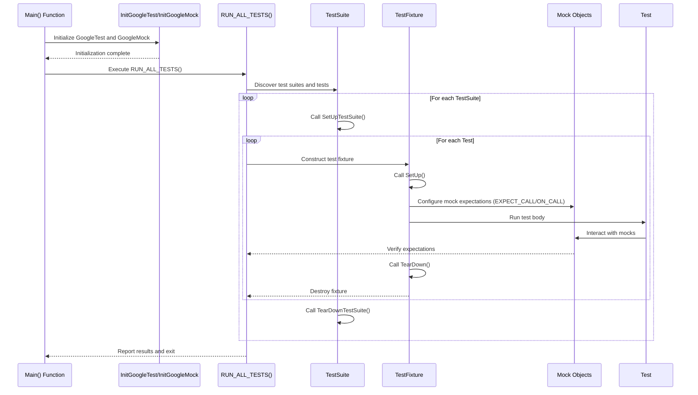

# System Architecture Overview

Explore the high-level design of GoogleTest and GoogleMock, two integral components forming a robust C++ testing ecosystem. This overview illustrates how test runners, test cases, assertions, and mock objects interconnect under the guidance of the xUnit philosophy to deliver modularity, scalability, and ease of use.

---

## The xUnit Philosophy and Its Influence on GoogleTest Architecture

GoogleTest is deeply rooted in the xUnit architecture style, emphasizing modularity by separating responsibilities into clear components. It mirrors familiar patterns used in popular frameworks like JUnit but is uniquely crafted for C++ needs. This philosophy ensures:

- **Isolation of tests:** Each test executes in a self-contained manner.
- **Reusability of fixtures:** Shared setup and teardown for logical groups of tests.
- **Extensibility:** Components like assertions and mocks can be extended without disrupting the core.

By adhering to this philosophy, GoogleTest provides a predictable, extensible, and maintainable structure for test writing and execution.

## Core Components and Their Relationships

### Test Runners

At the heart of execution is the test runner, typically invoked via the `RUN_ALL_TESTS()` macro inside `main()`. This runner:

- Initializes the framework (via `InitGoogleTest()`).
- Discovers all test cases (including parameterized and typed tests).
- Executes tests sequentially or in filtered subsets.
- Collects and reports results.

Under the hood, GoogleMock’s inclusion ties directly to GoogleTest’s test lifecycle, calling `InitGoogleMock()` which initializes GoogleMock and GoogleTest seamlessly.

### Test Cases & Suites

Tests are organized into *test suites* (formerly called test cases), each representing a logical group typically reflecting a class or module under test.

- **Individual Tests** are defined using `TEST()`, `TEST_F()` for fixtures, or `TEST_P()` for parameterized fixtures.
- **Fixtures** provide shared setup/teardown across tests.
- **Parameterized and Typed Tests** provide sectional repeatability for varied inputs or type-driven scenarios.

### Assertions

Assertions are the verification mechanism embedded within tests. They come in two flavors:

- **Fatal assertions (`ASSERT_`)** abort the current test upon failure.
- **Non-fatal assertions (`EXPECT_`)** report failures but allow tests to continue.

GoogleTest offers rich built-in assertions covering booleans, comparisons, strings, exceptions, floating-point precision, death tests, and more, empowering nuanced validations.

### Mocks (GoogleMock)

Mock objects represent simulated dependencies that help test interactions:

- **Mock Classes** are defined using `MOCK_METHOD` macros that create controllable mock methods.
- **Expectations** (`EXPECT_CALL`) specify and enforce expected mock interactions.
- **Default Behaviors** (`ON_CALL`) define default mock method responses without imposing call guarantees.
- Various **Mock Object Strictness Levels** (Nice, Naggy, Strict) tailor how uninteresting calls are treated.

Mocks integrate tightly with GoogleTest's execution model, enabling seamless setup, verification, and teardown within a unified test runner.

## Data and Control Flow

User-written test code, including tests and mocks, is registered statically or dynamically before runtime. During execution:

1. **Initialization:** The test runner launches and initializes GoogleTest/GoogleMock.
2. **Discovery:** The framework enumerates all tests and fixtures, respecting filters and parameters.
3. **Setup:** For each test suite, shared fixtures run `SetUpTestSuite()`.
4. **Execution:** For each test,
   - A fresh test fixture is instantiated.
   - `SetUp()` is called.
   - The individual test body runs with embedded assertions and mock interactions.
   - `TearDown()` is called.
5. **Teardown:** After all tests in a suite run, `TearDownTestSuite()` is executed.
6. **Reporting:** Test results are aggregated, formatted (console, XML, JSON), and output.

Each mock invocation goes through GoogleMock’s matching engine to verify call expectations and apply any specified behaviors (e.g., returning values, invoking actions).

## Modularity & Extensibility

The design carefully separates concerns:

- The **Test Framework Core** handles discovery, execution, and result gathering.
- The **Assertions API** provides rich semantic validation.
- The **Mock Framework** (GoogleMock) is an integrated but standalone extension focused on interaction-based testing.
- The **Event Listener API** allows hooking into test lifecycles for customized reporting, logging, or integration.

This modularity means users can customize or extend GoogleTest functionality (e.g., write custom matchers, actions, or event listeners) without modifying core code.

## User Test Code Management

User test code fits into this architecture as follows:

- **Static Registration:** Most tests are registered via the `TEST` macros, which create static instances representing test methods.
- **Dynamic Instantiation:** Test fixtures are constructed and destroyed per test to ensure isolation.
- **Mock Lifecycle:** Mock objects live within tests, are set up with expectations and default behaviors, and verify expectations on destruction.

The framework shields users from manual test tracking or lifecycle management, focusing efforts on test definition and verification logic.

## Practical Example: Test Execution Flow


```

## Key Best Practices

- Tests should isolate behaviors; GoogleTest’s per-test fixture instances encourage this.
- Use `EXPECT_CALL` to specify important mock expectations; prefer `ON_CALL` for default behaviors.
- Leverage parameterized and typed tests for broad coverage with minimal duplication.
- Use event listeners to customize reporting or extend integration.
- Exploit the built-in assertion macros to maximize test expressiveness and diagnostic clarity.

## Troubleshooting Common Architecture Issues

- **Mismatch in test results:** Verify that test fixtures and expectations are correctly scoped per test.
- **Unintended mock warnings:** Use `NiceMock` or explicit `EXPECT_CALL(...).Times(AnyNumber())` to manage "uninteresting" calls.
- **Test discovery failures:** Ensure `InitGoogleTest()` is called correctly before `RUN_ALL_TESTS()`.
- **Assertion failures without clear cause:** Use `SCOPED_TRACE` or custom assertions to improve diagnostic context.

## Summary

This overview unpacks the integrated and modular architecture of GoogleTest and GoogleMock, demonstrating how tests, assertions, and mocks harmonize within the xUnit-inspired framework. Understanding these components’ roles and interactions equips users to write robust, maintainable, and scalable tests.

---

## Additional Resources

- [GoogleTest Primer](https://github.com/google/googletest/blob/main/docs/primer.md) — Core testing concepts and introductory content.
- [Mocking Reference](https://github.com/google/googletest/blob/main/docs/reference/mocking.md) — In-depth detail on mock classes, expectations, and behaviors.
- [Advanced GoogleTest Topics](https://github.com/google/googletest/blob/main/docs/advanced.md) — Covers extension points and complex usage.
- [System Architecture Overview](https://github.com/google/googletest/blob/main/overview/core-architecture-features/architecture-overview.md) — Formal architecture document.

For a visual understanding of workflow and component relationships, refer to the sequence diagram in this document.

---