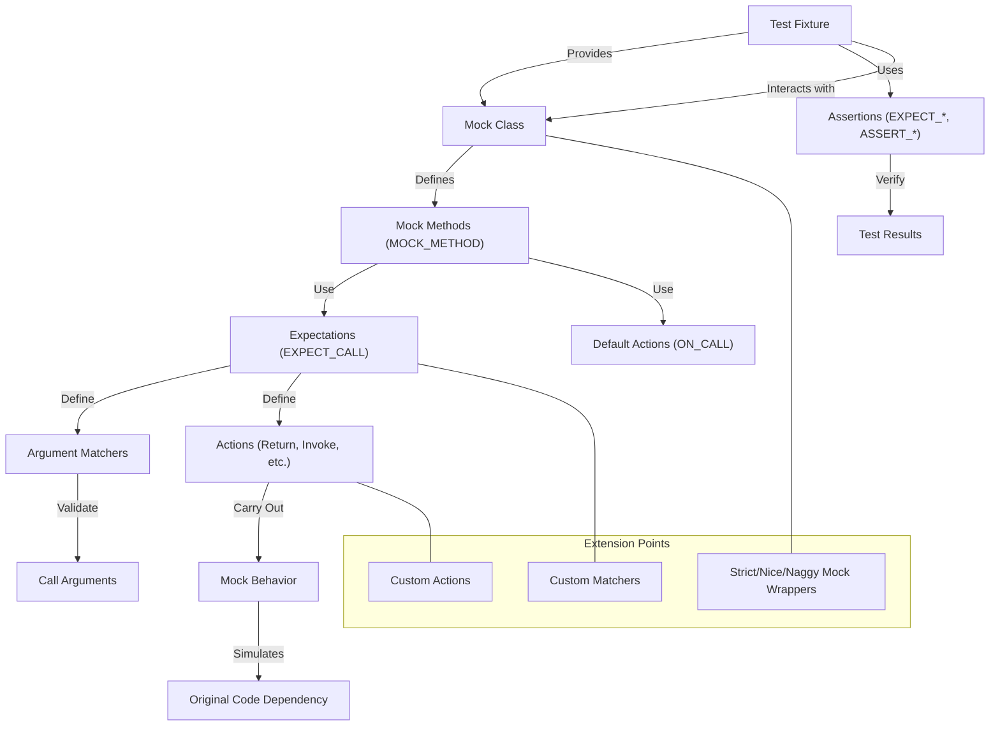

# Abstractions and Extension Points

GoogleTest and GoogleMock provide a rich ecosystem of abstractions that empower developers to write precise, flexible, and maintainable tests. By leveraging core building blocks like test fixtures, mock classes, matchers, actions, and assertions, users can simulate complex interactions, verify behavior, and extend the framework to meet specialized testing needs.

This guide details these fundamental abstractions and highlights how their synergy—enabled through macros, templates, and custom components—creates a highly expressive testing and mocking environment.

---

## Core Abstractions in GoogleTest and GoogleMock

### Test Fixtures

**What are test fixtures?**

Test fixtures provide a consistent environment for running a group of related tests. They enable setup and teardown operations, sharing of common data and resources across multiple test cases, promoting DRY (Don't Repeat Yourself) principles.

In GoogleTest, fixtures are derived from `testing::Test`, and you override the `SetUp()` and `TearDown()` methods to prepare and clean up the environment:

```cpp
class MyTestFixture : public ::testing::Test {
 protected:
  void SetUp() override {
    // Initialization code here
  }

  void TearDown() override {
    // Cleanup code here
  }

  // Shared test resources
};

TEST_F(MyTestFixture, TestCase1) {
  // Use shared resources and environment
}
```

### Mock Classes and Methods

At the heart of interaction-based testing, mock classes simulate the behavior of real components. GoogleMock simplifies mock creation by generating mock method implementations using the powerful `MOCK_METHOD` macro.

**Defining Mock Methods:**

The syntax:

```cpp
MOCK_METHOD(ReturnType, MethodName, (Args...), (Qualifiers));
```

- `ReturnType`: Method's return type.
- `MethodName`: Method’s name.
- `(Args...)`: Parenthesized list of argument types.
- `(Qualifiers)`: Optional qualifiers like `(const, override, noexcept)`.

**Handling Complex Signatures:**

Types with commas (e.g., templates like `std::pair<int, int>`) should be wrapped in parentheses or aliased to avoid macro parsing errors:

```cpp
class MockFoo {
 public:
  MOCK_METHOD((std::pair<int, int>), GetPair, ());
  using MapType = std::map<int, double>;
  MOCK_METHOD(bool, CheckMap, (MapType, bool));
};
```

**Guidelines:**

- Always define mock methods in the `public:` section, even if the original methods are protected or private.
- Mock overloaded and const methods explicitly, helping the compiler disambiguate.

### Matchers: Specifying Argument Expectations

Matchers define the rules for which arguments satisfy an expectation. They are predicates tested against each argument of a mock method call. GoogleMock provides a comprehensive set of built-in matchers:

- Simple value matchers: `Eq(value)`, `Ne(value)`, `Lt(value)`, etc.
- Wildcard matcher: `_` (matches anything).
- Compound matchers: `AllOf()`, `AnyOf()`, `Not()`, etc.
- Matchers for containers, pointers, tuples, and fields.

**Using Matchers in EXPECT_CALL:**

```cpp
EXPECT_CALL(mock_obj, Method(Eq(5), _, Lt(10)));
```

This sets an expectation that `Method` is called with first argument exactly 5, second argument anything, third argument less than 10.

Matchers can be combined, parameterized, or even custom-defined using `MATCHER` macros or by implementing matcher interfaces.

### Actions: Defining Mock Method Behavior

Actions specify what a mock method should do when invoked. GoogleMock supports:

- Returning values (`Return()`, `ReturnRef()`, `ReturnPointee()`).
- Invoking user-defined functions or lambdas (`Invoke()`, `InvokeWithoutArgs()`).
- Changing output or reference arguments (`SetArgPointee()`, `SetArrayArgument()`).
- Combining actions (`DoAll()`).
- Ignoring results (`IgnoreResult()`).

**Setting Default Actions and Expectations:**

- `ON_CALL` sets default behavior for calls that do not have explicit expectations.
- `EXPECT_CALL` sets both expectations and behaviors.

```cpp
ON_CALL(mock, Foo(_)).WillByDefault(Return(false));
EXPECT_CALL(mock, Foo(42)).WillOnce(Return(true));
```

This means that by default `Foo` returns `false`, but when called with `42`, it returns `true` once.

### Assertions: Verifying Test Outcomes

Assertions confirm that the code under test behaves as expected. GoogleTest provides a rich set including:

- Boolean assertions: `EXPECT_TRUE()`, `ASSERT_FALSE()`, etc.
- Equality and inequality: `EXPECT_EQ()`, `ASSERT_NE()`, etc.
- Floating point comparisons with tolerances.
- Exception assertions and more.

Combined with matchers, assertions become powerful tools for fluent, readable verification:

```cpp
EXPECT_THAT(value, Ge(10));
```

### Extension Points: Tailoring GoogleTest/GoogleMock

GoogleTest and GoogleMock are extensible. You can extend functionality via:

- **Custom Matchers:** By implementing matcher interfaces or using `MATCHER` macros, you can create reusable predicates tailored to your domain.

- **Custom Actions:** Define behavior beyond built-in actions by implementing action interfaces or using `Invoke()` to call user-defined logic.

- **Mocking Patterns:** Build composite mocks, delegate calls to fakes or real objects for hybrid testing scenarios.

- **Controlling Mock Behavior:** Use `NiceMock`, `NaggyMock`, and `StrictMock` wrappers to adjust how uninteresting calls are treated and how strict verification is.

- **Thread Safety:** GoogleMock is designed to be thread-safe for mock method calls, but expects construction and expectation setup to be single-threaded.

---

## Typical User Flow for Using Abstractions

1. **Design an interface:** Start with an interface or an abstract class representing the dependency.
2. **Define a Mock Class:** Use `MOCK_METHOD` macros within a mock class derived from the interface.
3. **Set Default Behaviors:** Use `ON_CALL` to specify general behaviors that your mocks will use unless overridden.
4. **Set Expectations:** Use `EXPECT_CALL` in your tests to specify what calls must happen and define how to respond using actions.
5. **Run Test Logic:** Exercise the code under test, passing mocked dependencies.
6. **Verify Results:** Assertions capture expected outcomes; GoogleMock automatically verifies expectations on mock destruction.

---

## Practical Best Practices and Tips

- **Use `ON_CALL` for Default Behaviors:** Avoid writing unnecessary `EXPECT_CALL`s just to suppress warnings on uninteresting calls. Use `ON_CALL` or wrap mocks in `NiceMock` where appropriate.

- **Specify Expectations Precisely:** Overly strict expectations make tests brittle; focus on intent by matching interesting arguments and cardinalities only.

- **Leverage Sequences and Partial Ordering:** Use `InSequence` or `.After()` to enforce call order where relevant without making tests overly rigid.

- **Wrap Complex Arguments:** Define type aliases or wrap parameter types to help `MOCK_METHOD` handle complex types with commas.

- **Delegate to Fakes/Real Implementations When Possible:** Simplify mock behavior by delegating to existing implementations when they provide meaningful logic.

- **Control Mock Strictness:** Use `StrictMock` to catch unwanted calls or `NiceMock` to reduce noise.

- **Verify and Clear Expectations Explicitly:** Use `Mock::VerifyAndClear()` when you need to check expectations before object destruction.

- **Avoid Mocking Non-Virtual Functions Directly:** Instead, use interfaces or templates that can be instantiated with either concrete or mock types.

- **Understand Call Lifecycle and Reference Semantics:** Be mindful of when actions are evaluated and how lambdas or functors capture state.

---

## Diagram: Overview of Key Mocking Abstractions and Interactions



---

## Troubleshooting Common Issues

- **Unrecognized Matchers or Failing to Compile MOCK_METHOD:**
  - Wrap return or argument types containing commas with parentheses or create type aliases.

- **Uninteresting Call Warnings:**
  - Use `ON_CALL` or wrap mock instances in `NiceMock` to suppress.
  - Alternatively, add a catch-all `EXPECT_CALL` with `Times(AnyNumber())`.

- **Unexpected Call Failures:**
  - Check argument matching—use verbose logging with `--gmock_verbose=info` to trace call matching.

- **Ordering Errors:**
  - Use `InSequence` or `.After()` to specify call order.

- **Action Exhaustion Warnings:**
  - Ensure your `WillOnce` clauses match the expected call counts, or add `WillRepeatedly`.

- **Mock Object Leaks:**
  - Use `Mock::AllowLeak()` for intentional leaks; otherwise, verify your tests clean up mocks.

- **Inheritance and Destructor Issues:**
  - Ensure interfaces have virtual destructors to avoid resource leaks and undefined behavior.

---

## Summary

The abstractions presented—test fixtures, mock classes and methods, matchers, actions, and assertions—offer a powerful toolbox to define and verify code interactions in C++ using GoogleTest and GoogleMock. Their design allows for intuitive, readable, and extensible test suites that promote maintainability and clarity.

With extension points and best practices, users can adapt GoogleTest and GoogleMock to virtually any domain, achieving precise behavioral testing and robust validation.

---

## Additional Resources

- [Mocking Reference](https://google.github.io/googletest/gmock/reference/mocking.md) — Detailed macro and class documentation.
- [gMock Cookbook](https://google.github.io/googletest/gmock_cook_book.html) — Practical recipes and patterns.
- [gMock for Dummies](https://google.github.io/googletest/gmock_for_dummies.html) — Beginner-friendly introduction.
- [Matchers Reference](https://google.github.io/googletest/gmock/reference/matchers.md) — Extensive built-in matcher documentation.
- [Expectations and Actions](https://google.github.io/googletest/gmock/reference/mocking.md#EXPECT_CALL) — Deep dive into expectations and action clauses.


## Tips for Mastery

- Start by writing simple mocks using `MOCK_METHOD` macros.
- Use `EXPECT_CALL` cautiously to specify only necessary expectations.
- Employ `ON_CALL` for general default mock behavior.
- Explore custom matchers and actions to tailor tests uniquely to your logic.
- Leverage sequences and partial orders to enforce interaction contracts.
- Change mock strictness according to test needs with `NiceMock`, `NaggyMock`, and `StrictMock`.
- Activate verbose mode when troubleshooting unexpected mock behaviors.
- Always verify and clear mocks to avoid leaks and unintended test side effects.

By understanding and combining these abstractions, you will gain full control over your test doubles, enabling rigorous, maintainable, and expressive tests in your C++ projects.
