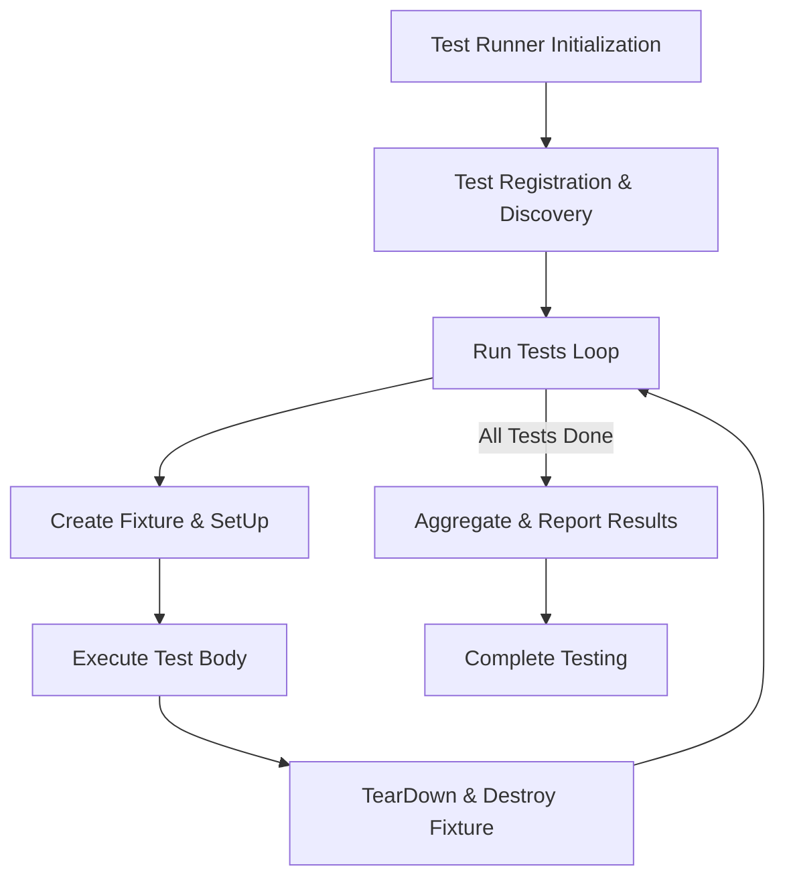
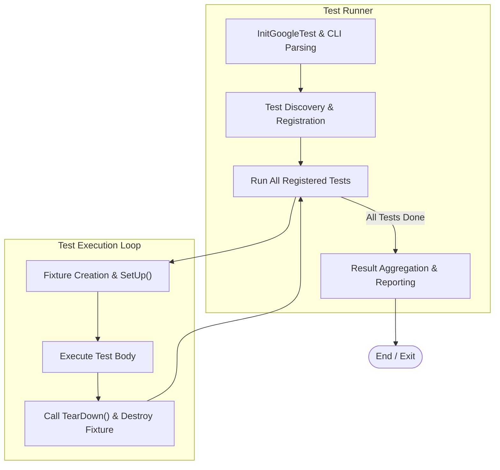

# GoogleTest Architecture Overview

Gain a holistic view of GoogleTest’s architecture, exploring how its xUnit foundations, modular test structure, and automated test discovery work together. Understand the interplay between test suites, fixtures, and the test runner in delivering scalable, repeatable, and maintainable testing.

---

## Introduction

GoogleTest builds on the xUnit architecture to offer a robust C++ testing framework, designed to facilitate automated, structured, and modular unit testing. This page covers the overall architecture to help you grasp how GoogleTest enables efficient test writing, discovery, and execution.

Understanding this architecture empowers you to write better tests, organize them effectively, and leverage GoogleTest's integrated mechanisms to scale testing across large projects.

## Architecture Foundations: The xUnit Model

At its core, GoogleTest follows the xUnit architecture pattern familiar to many testing frameworks such as JUnit or PyUnit. The key components of this pattern include:

- **Tests:** Basic units of verification. Each tests a particular behavior or output.
- **Test Suites:** Logical groups of related tests, allowing shared setup and teardown.
- **Test Fixtures:** Specialized classes that provide common test context, reusing setup across multiple tests.
- **Test Runner:** Orchestrates test discovery, execution, and result reporting.

GoogleTest’s adherence to this model ensures that tests are isolated, repeatable, and organized. It also provides the fundamental layer required for advanced features like parameterized tests and mocking.

## Modular Structure of Test Components

### Test Suites and Fixtures

- **Test Suites:** GoogleTest organizes tests into named suites. Tests within a suite can share fixtures and related resources.
- **Test Fixtures:** These are user-defined classes derived from `testing::Test` that provide shared data and helper methods. Each individual test gets its own fresh fixture instance, ensuring complete independence.

### Test Macros

- **`TEST()` Macro:** Defines a simple test that does not use a fixture.
- **`TEST_F()` Macro:** Defines a test that uses a fixture, inheriting setup and teardown configuration.

Both macros register tests automatically for discovery, eliminating the need for manual test listing.

## Automated Test Discovery

GoogleTest employs a static registration system that automatically detects tests at compile time. This means:

- You declare tests with macros like `TEST()` or `TEST_F()`.
- GoogleTest internally registers each test and fixture with the test framework.
- Tests are collected without requiring additional code.

This automation allows your test binary to execute any and all found tests by default, promoting ease of use and minimizing boilerplate.

## Test Runner and Execution Lifecycle

The test runner is the component responsible for:

1. **Initialization:** Parsing command-line options, setting up the environment using `testing::InitGoogleTest()`.
2. **Test Execution:** Iterating over all registered tests.
   - For each test, GoogleTest:
     - Creates a fresh test fixture instance.
     - Runs any setup code (`SetUp()`).
     - Executes the test body.
     - Runs teardown code (`TearDown()`).
     - Destroys the fixture.
3. **Result Reporting:** Aggregates and prints test success, failure, and detailed diagnostics.

This lifecycle ensures:

- **Isolation:** Each test runs independent of others.
- **Repeatability:** Tests can be run in any order or individually.
- **Detailed Feedback:** On a failure, users get precise file, line, and message information.

## Scalability and Extensibility

GoogleTest’s architecture supports:

- **Parameterized and Typed Tests:** Facilitated by extending the underlying xUnit architecture to run tests with varying data.
- **Mocking Integration:** Seamless integration with GoogleMock to mock dependencies while preserving test structure.
- **Test Filtering & Selection:** During runtime, users can specify which tests to run via command-line filters, optimizing test suites in CI pipelines or local development.

## How Components Interact: A High-Level Flow

## Practical Implications for Users

- **Writing Tests:** Use `TEST` for simple tests, and `TEST_F` when you require shared context via fixtures.
- **Organizing Tests:** Group related tests into suites logically; use fixtures carefully for resource sharing.
- **Running Tests:** Invoke the test executable with filtering options for selective execution.
- **Extending Tests:** Leverage parameterized and typed tests for broad coverage with minimal duplication.

## Troubleshooting Common Issues Related to Architecture

- **Test Registration Issues:** Ensure your test files are linked and compiled properly so that test registration code runs.
- **Fixture Initialization Problem:** Verify that your fixture class correctly derives from `testing::Test` and that you override `SetUp()` and `TearDown()` using the exact casing.
- **Concurrent Test Failures:** GoogleTest runs tests sequentially by default; if your environment or tests exhibit threading issues, isolate parallelization outside GoogleTest.

## Further Reading & Related Topics

- [Test Definition & Execution](../../api-reference/core-test-api/test-definition-execution) for core test API details.
- [Mocking Fundamentals with GoogleMock](../core-architecture/mocking-concepts) to understand test doubles interaction.
- [Writing Your First Test](../../guides/getting-started/writing-your-first-test) to start practical test writing.
- [Organizing Test Suites](../../guides/core-workflows/organizing-test-suites) for managing larger test projects.

---

## Summary

GoogleTest’s architecture harmonizes the xUnit model with C++ language features to deliver modular, automated, and extensible testing. The framework orchestrates test suites, fixtures, and runners to provide independent, repeatable test execution with minimal user overhead.

Grasping this overview equips developers to leverage GoogleTest effectively, design resilient test structures, and scale testing workflows in diverse C++ projects.

---

<Info>
For a deep dive into detailed concepts, see the [GoogleTest Primer](../../docs/primer.md) and [Test Definition & Execution API](../../api-reference/core-test-api/test-definition-execution.md).
</Info>

<Check>
Pro Tip: Organize your tests into logical suites using fixtures to maximize reuse and clarity.
</Check>

---

## Appendix: System Architecture Diagram

---

## How This Page Fits into GoogleTest Documentation

This architecture overview is foundational in the "Concepts" section under "Core Architecture & Test Model." It bridges introductory material like the Primer and advanced topics such as mocking and parameterized tests, helping you connect practical test writing with the underlying system behavior.

Users progressing from this guide will find the [Test Lifecycle](../core-architecture/test-lifecycle) and [Mocking Concepts](../core-architecture/mocking-concepts) especially valuable as next logical steps.

---

## Source Reference

You can explore the source code of GoogleTest, including test registration and execution mechanisms, in the [GitHub repository](https://github.com/google/googletest) (branch: main). The architecture components discussed here mainly reside within the `googletest` folder, notably the core testing framework headers and implementations.
