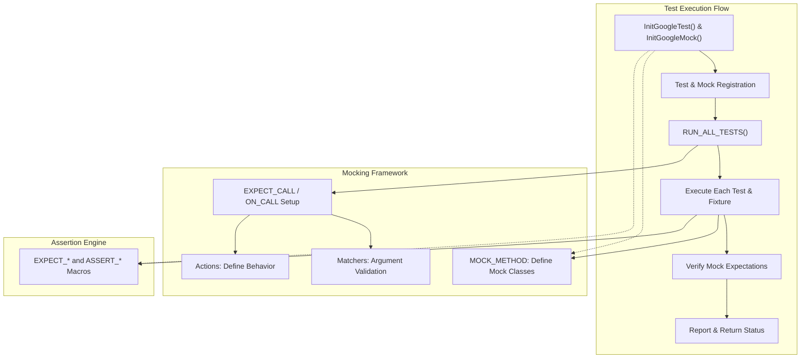

# GoogleTest & GoogleMock Architecture Overview

Understand the high-level architecture and core components of the integrated GoogleTest and GoogleMock frameworks. This guide explains how these modular tools collaborate to discover, execute, and verify tests, along with the key responsibilities of essential components such as test runners, assertion engines, and mocking utilities.

---

## 1. Overview of the Architecture

GoogleTest and GoogleMock form a cohesive C++ testing environment, modularly designed to facilitate efficient automated testing and mocking. Together, they streamline the process of writing, running, and verifying unit tests by providing:

- **Test Discovery & Execution**: Efficiently locating and executing defined tests.
- **Assertions Engine**: Handling validations and reporting test status.
- **Mocking Framework**: Providing robust mock objects for testing code interactions.

These pieces interlock to support seamless testing workflows tailored for scalable, readable, and maintainable C++ codebases.

### Key Architectural Modules:

- **Test Runner**: Manages initialization, execution flow, and reporting of test cases.
- **Assertion Engine**: Defines how assertions are specified and validated.
- **Mocking Utilities**: Includes mock class definitions, expectations setup (`EXPECT_CALL`, `ON_CALL`), matchers, and actions.

### Interaction Flow

A typical test run follows this path:

1. **Test Registration and Discovery**: GoogleTest automatically registers test cases at static initialization.
2. **Test Execution**: The test runner invokes tests sequentially or in parallel.
3. **Mock Object Usage**: During test execution, mock expectations guide code behavior and verify interactions.
4. **Assertion Verification**: Assertions validate test conditions, immediately reporting failures.
5. **Summary Reporting**: Results are aggregated and reported at the end of the run.

---

## 2. Core Components and Responsibilities

### 2.1 Test Runner and Main Entry

The test runner is the orchestration point responsible for test lifecycle management:

- **Initialization**: Invoking `InitGoogleTest()` and `InitGoogleMock()` to parse command-line flags and prepare the environment.
- **Test Execution**: Calling `RUN_ALL_TESTS()` which executes tests discovered during static initialization.
- **Exit Reporting**: Returning aggregate results and producing detailed reports.

GoogleTest provides a default `main()` function but allows custom mains for fine control over initialization.

### 2.2 Assertion Engine

Handles validation points within tests:

- Runs assertions defined by macros like `EXPECT_*` and `ASSERT_*`.
- Reports failures immediately with detailed diagnostic messages.
- Supports death tests and parameterized tests for advanced scenarios.

### 2.3 Mocking Framework (GoogleMock)

Manages mock object interactions and verifications:

- **Mock Class Definitions**: Created using `MOCK_METHOD` macros that generate mock implementations.
- **Expectations Setup**: Set via `EXPECT_CALL` (verifying calls) and `ON_CALL` (default behaviors).
- **Matchers and Actions**: Powerful tools to specify argument validations and behaviors.
- **Strictness Modes**: `NiceMock`, `NaggyMock`, and `StrictMock` control how uninteresting calls are treated.
- **Call Sequencing and Ordering**: Specify call order constraints using `Sequence`, `InSequence`, and `After`.
- **Default Values and Delegation**: Handle unimplemented method calls and delegate calls to real or fake objects.

---

## 3. How Test Discovery and Execution Work

GoogleTest uses static registration of test cases during program startup. Each test case and test suite is automatically added to an internal registry.

Upon invoking `RUN_ALL_TESTS()`, the test runner:

- Enumerates registered tests.
- Executes each test in isolation.
- Runs setup and teardown logic defined by test fixtures.
- Collects assertion results.

GoogleMock ties into this process by enabling mock expectations to be set before test code runs and verified automatically when mock objects are destroyed.

---

## 4. Responsibilities of Core Components

| Component                | Responsibility                                          |
|-------------------------|----------------------------------------------------------|
| `main()` / Test Runner  | Set up environment, initialize libraries, run tests.    |
| Test Registry           | Holds metadata about all test cases and suites.         |
| Test Fixture            | Sets up/tears down test context.                         |
| Assertion Macros        | Define pass/fail conditions within tests.               |
| Mock Classes            | Define mocked methods for interfaces under test.        |
| Expectation Engine      | Tracks and verifies mocks' calls and constraints.       |
| Matchers                | Specify argument validation for mock calls.             |
| Actions                 | Define behaviors executed when a mock method is called. |

---

## 5. Modular Design: GoogleTest vs GoogleMock

GoogleMock is designed as an extension layered on top of GoogleTest, enabling advanced mocking capabilities within the same framework. This division provides clarity:

- **GoogleTest**: Focused on test definition, execution, and assertion support.
- **GoogleMock**: Focused on mocking, defining test doubles, and verifying interactions.

They integrate by sharing test runners and lifecycle management, but remain modular to allow use of GoogleTest without mocks if desired.

---

## 6. Common Usage Workflow

### Step 1: Setup Mock Classes
- Define mock classes via `MOCK_METHOD` macros.

### Step 2: Set Expectations
- Use `EXPECT_CALL` to declare expected mock interactions.
- Use `ON_CALL` to set default behaviors without expectations.

### Step 3: Run Test Logic
- Execute code that depends on mocks and assertions.

### Step 4: Verification
- Automatic upon mock destruction or explicit.
- Reports successes, failures, or mismatches.

### Step 5: Reporting
- Summarize test and mock interaction results.

---

## 7. Visual Architecture Diagram

---

## 8. Troubleshooting & Tips

- **Test Not Discovered?** Ensure tests are linked and follow GoogleTest naming conventions. Static initialization registrations must run.
- **Mock Failures?** Confirm expectations are set **before** invocation; use the `--gmock_verbose=info` flag for detailed diagnostics.
- **Uninteresting Calls?** Use `NiceMock` to suppress warnings or explicitly specify expectations.
- **Sequencing Issues?** Apply `Sequence`, `InSequence`, or `After` to enforce call order.

---

## 9. Next Steps & Cross-References

For deeper mastery, consult:

- [Mock Class Definition and MOCK_METHOD Macros](../api-reference/mocking-framework/mock-class-definition)
- [Setting Expectations: EXPECT_CALL and ON_CALL](../api-reference/mocking-framework/setting-expectations)
- [Strict, Naggy, and Nice Mocks](../api-reference/mocking-framework/strict-naggy-nice-mocks)
- [Test Runner and Main Entry](../api-reference/core-testing-api/test-runner-and-main)
- [Matchers and Actions](../api-reference/matchers-actions/builtin-matchers)
- [Custom Matchers and Actions](../api-reference/matchers-actions/custom-matchers-and-actions)

Explore workflow guides such as [Exploring Mock Objects](../../guides/getting-started/exploring-mock-objects) and [Mocking Best Practices](../../guides/real-world-workflows/mocking-best-practices) for practical mastery.

---

## 10. Summary

GoogleTest and GoogleMock together provide a powerful, flexible, modular architecture for C++ testing and mocking. The test runner orchestrates setup and execution, while the assertion and mocking engines verify correctness and interaction fidelity. Understanding these core components and their interplay empowers developers to write reliable, maintainable tests with clear expectations, robust failure diagnostics, and scalable workflows.

---

<Callout title="Pro Tip">
Use the `--gmock_verbose=info` runtime flag to gain detailed insights, including expectation registration and mock call tracing, to debug complex test failures effectively.
</Callout>

<Note>
This architecture overview focuses on user-facing concepts and workflows. For implementation details, review corresponding API references and practical guides linked above.
</Note>

---