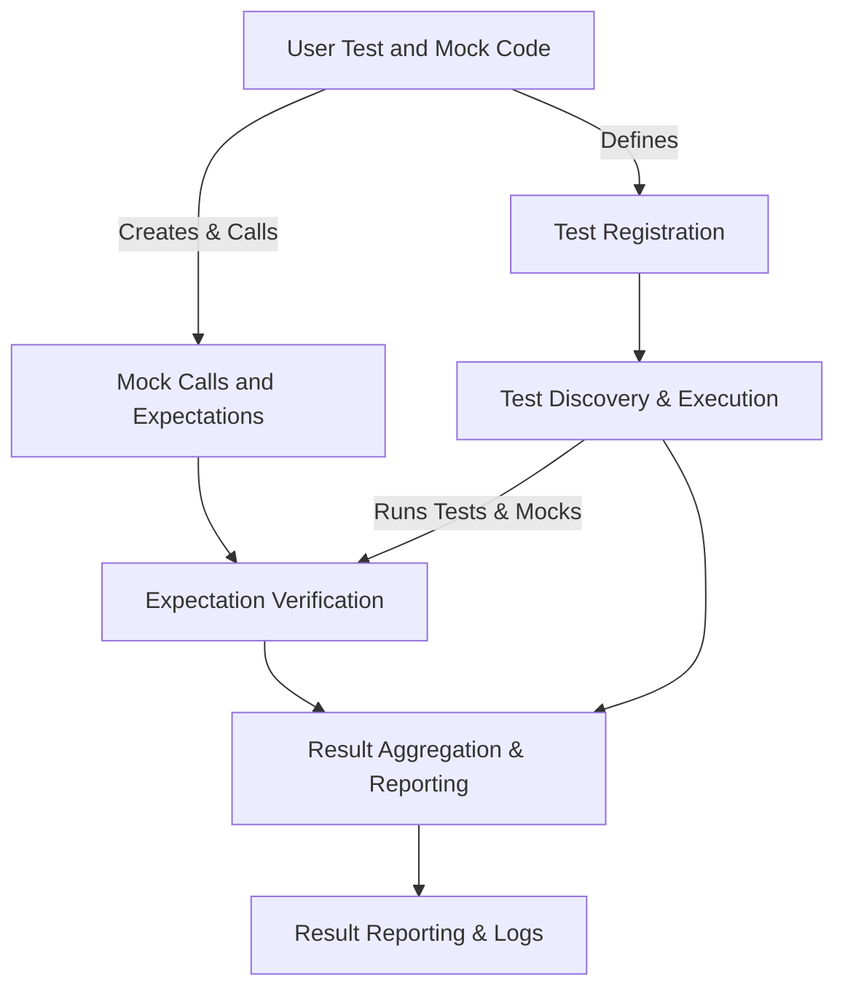

# Architecture Overview

Understanding the architecture of GoogleTest and GoogleMock provides a clear view of how your test code integrates seamlessly with the framework’s core modules to deliver powerful, efficient, and reliable testing capabilities. This guide walks you through the layered architecture, main components, and flow from user code to reporting results, illuminating how test and mock registration, execution, expectation verification, and aggregation fit together.

---

## Layered Architecture of GoogleTest and GoogleMock

GoogleTest and GoogleMock are designed as layered testing frameworks in C++. Each layer abstracts distinct functionality while collaborating to provide a smooth user experience for writing, running, and validating tests.

### 1. User Code Layer

This is where you write your tests and mocks. From defining test suites using the `TEST` and `TEST_F` macros in GoogleTest to creating mock classes and expectations using `MOCK_METHOD`, `EXPECT_CALL`, and `ON_CALL` in GoogleMock, this layer reflects your interaction with the framework.

### 2. Test and Mock Registration Layer

Upon compilation and linking, test cases and mock objects register themselves with GoogleTest’s internal registries. This layer maintains a global repository of available tests and mocks discovered during program initialization, enabling automatic discovery and execution.

### 3. Test Discovery and Execution Layer

GoogleTest's runtime engines discover the registered tests and execute them individually. This layer orchestrates test filtering (based on names or tags), test environment setup and teardown, and controlling test execution flow. It also manages execution hooks such as fixtures.

### 4. Mock Expectations and Verification Layer

GoogleMock intercepts calls to mock methods, verifies expectations in real-time, and manages call ordering, argument matching, and call cardinality. It enforces constraints like sequences and ordering through `Sequence`, `InSequence`, and `After` constructs.

### 5. Result Aggregation and Reporting Layer

As tests execute, GoogleTest collects results including passed, failed, and skipped tests. Reporting is handled here with rich structures for logging, console output, XML/JSON summaries for CI systems, and failure diagnostics including stack traces.

---

## Main Modules and Their Responsibilities

### GoogleTest Core Modules

- **Test Registration:** Automatically registers test cases and fixtures via macros.
- **Test Runner:** Executes tests, manages setup/teardown, and controls the test lifecycle.
- **Assertions Engine:** Implements `EXPECT_` and `ASSERT_` macros and verifies test conditions with detailed logging.
- **Result Reporter:** Handles output of test results, formats, and aggregates.

### GoogleMock Core Modules

- **Mock Class Generator:** The `MOCK_METHOD` macro generates mock method overrides at compile time.
- **Expectation Manager:** Handles storage and matching of expectations set via `EXPECT_CALL`.
- **Call Dispatcher:** Routes mock method calls and matches them to expectations or default actions.
- **Sequence and Ordering Controller:** Enforces call ordering constraints and retirement of saturated expectations.

---

## User Flow: From Writing Tests to Reporting Results

### Step 1: Define Tests and Mocks

You begin by writing test cases in GoogleTest using `TEST` or fixtures with `TEST_F`. For mock behavior, define mock classes inheriting interfaces or concrete classes and annotate mock methods with `MOCK_METHOD` macros.

### Step 2: Set Expectations and Default Behaviors

Use `EXPECT_CALL` to specify expected calls on mock objects, including argument matchers, call counts, and sequences. Use `ON_CALL` to define default behavior without setting expectations.

### Step 3: Test Execution and Mock Invocation

When running tests via `RUN_ALL_TESTS()`, GoogleTest discovers registered tests and runs each. As your code under test executes, it invokes mock methods which GoogleMock intercepts and verifies against the expectations.

### Step 4: Verification and Aggregation

GoogleMock performs real-time verification of call arguments, counts, and order. It marks expectations as satisfied or reports failures immediately. After test execution, GoogleTest aggregates all test results.

### Step 5: Reporting

Detailed reports with success, failures, and verbose diagnostics including stack traces and call traces are output on the console and optionally as XML/JSON for CI integration.

---

## Integration of Test and Mock Registration

- **Test Macros:** When you declare a test with `TEST` or `TEST_F`, GoogleTest uses static initialization functions to register the test case in a global registry.
- **Mock Classes:** When you define a mock class using `MOCK_METHOD`, no explicit registration is needed, but mock objects participate at runtime by setting expectations on instances.

This arrangement enables seamless and automatic discovery without manual wiring, simplifying the developer experience.

---

## Expectation Checks and Result Aggregation

GoogleMock’s verification engine matches each call with all active expectations in reverse declaration order (newest first). It verifies argument matchers, call cardinality, and ordering constraints:

- If a call matches an expectation, associated actions run.
- If an expectation reaches its upper call bound, it either remains active (sticky) or is retired (if `RetiresOnSaturation()` is used).
- Violations (unexpected calls, argument mismatches, ordinal errors) trigger immediate test failures.

The test runner collects pass/fail status from all tests and mock verifications, consolidating them for comprehensive test summaries.

---

## Practical Tips for Users

- Use `EXPECT_CALL` sparingly. Overuse leads to brittle tests.
- Start with `ON_CALL` to specify default behaviors.
- Use `InSequence` or `After` to enforce ordering only when necessary.
- For complex behaviors, combine `WillOnce` and `WillRepeatedly` actions.
- Remember that tests fail immediately on expectation violation, so set expectations before exercising mocks.

---

## Mermaid Diagram: High-Level Architecture

This diagram illustrates how user code initiates test registration and mock calls, which are managed by the framework's internal discovery, verification, and result aggregation modules.

---

By grasping this architecture and flow, you gain clarity on how your tests are wired, executed, verified, and reported — empowering you to write more effective tests and leverage GoogleTest and GoogleMock’s full capabilities with confidence.