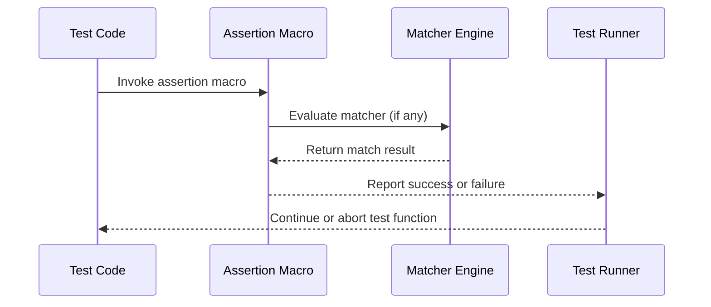

# Assertion Model & Matcher Engine

Delving into the core of GoogleTest’s assertion system, this guide unpacks how assertions, matchers, and their supporting engines operate together to empower expressive, detailed, and extensible test verifications.

---

## Understanding GoogleTest Assertions

GoogleTest assertions are more than simple checks; they form a powerful expressive language enabling developers to state conditions that must hold true for their tests to pass. Assertions report failures with contextual information, allowing quick pinpointing of issues.

- **Assertion Macros:** Assertions come in pairs — `ASSERT_*` and `EXPECT_*`. The `ASSERT_*` macros generate *fatal* failures that abort the current function immediately, preventing subsequent code from executing. Conversely, `EXPECT_*` macros generate *non-fatal* failures, allowing tests to continue and collect multiple errors per run.
- **Assertion Outcomes:** Each assertion evaluates to a result: **success**, **nonfatal failure**, or **fatal failure**. Test status depends on these results.

### How Assertions Work from a User Perspective

Conceptually:

1. You write an assertion macro like:
   ```cpp
   EXPECT_EQ(calculated_value, expected_value) << "Failure message";
   ```
2. At runtime, GoogleTest evaluates the expression.
3. On failure, it logs file, line number, the values involved, and the custom message.
4. Non-fatal failures let the test function continue; fatal failures abort it immediately.

#### Custom Failure Messages

Many assertions accept streamed messages for detailed diagnostics:

```cpp
EXPECT_TRUE(IsValid(x)) << "Expected x to be valid, but got " << x;
```

This enhances debugging by showing runtime values and context.

---

## Matcher Engine Overview

GoogleTest’s matcher engine extends assertions by enabling rich, composable predicates for verifying values and objects, making tests more readable and meaningful.

- **Matchers:** An abstraction representing predicates that check if a value satisfies a condition. For example, `Eq(5)`, `StartsWith("foo")`, or the wildcard matcher `_` (matches anything).
- **Using Matchers with Assertions:** The `EXPECT_THAT(value, matcher)` macro evaluates whether `value` satisfies `matcher`. On failure, expression details and matcher descriptions are reported.

### Example of Using Matchers

```cpp
using ::testing::StartsWith;
using ::testing::HasSubstr;

EXPECT_THAT(username, StartsWith("user_"));
EXPECT_THAT(log_message, HasSubstr("Error"));
```

### Combining Matchers

Matchers can be composed with logical patterns:

- `AllOf(m1, m2, ...)` - all matchers must match
- `AnyOf(m1, m2, ...)` - at least one matcher matches
- `Not(m)` - negates matcher

This lets you write very precise expectations.

---

## Internal Assertion Flow

While implementation details are hidden from users, understanding the flow helps appreciate GoogleTest’s precise diagnostics and extensibility:

1. **Assertion Macro Expansion:** Macros like `EXPECT_EQ` expand to helper functions capturing source text, file, and line.
2. **Evaluation:** The assertion code evaluates the condition.
3. **Matcher Invocation (if relevant):** For assertions using matchers (like `EXPECT_THAT`), the matcher’s logic is invoked.
4. **Diagnostic Reporting:** On failure, GoogleTest composes a detailed error message with values, expected conditions, and where it occurred.
5. **Failure Handling:** It classifies the failure as fatal or non-fatal and handles the test flow accordingly.

---

## Extensibility and Custom Matchers

GoogleTest empowers users to extend the assertion system via custom matchers, which fit seamlessly into `EXPECT_THAT` and other APIs:

- **Custom Matcher Classes:** Write classes implementing `MatchAndExplain()`, `DescribeTo()`, and `DescribeNegationTo()` to define rich, self-describing conditions.
- **Matcher Macros:** Use the `MATCHER`, `MATCHER_P`, etc., macros for concise, reusable matcher creation.
- **Parameterized Matchers:** Accept user-defined parameters for flexible matching.

### Example: Defining a Custom Matcher

```cpp
MATCHER(IsEven, "is an even number") {
  return (arg % 2) == 0;
}

EXPECT_THAT(value, IsEven());
```

With this, GoogleTest will report failed assertions with clear descriptions.

---

## Practical Tips and Best Practices

- Use `EXPECT_*` assertions wherever possible to allow a test to reveal multiple errors.
- Add custom failure messages to clarify context when standard messages are insufficient.
- Use matchers to express intent more clearly than bare boolean conditions.
- Avoid side effects in matchers; they must be functionally pure.
- Leverage custom matchers to encapsulate complex checks, improving test maintainability.

---

## Troubleshooting Common Issues

- **Assertion Doesn’t Report Expected Information:** Ensure the assertion or matcher supports detailed failure messages.
- **Unexpected Test Abort:** Check if a fatal assertion (`ASSERT_*`) is used where continuation is desired.
- **Matcher Not Matching Correctly:** Verify matchers are correctly constructed and cover all cases.

---

## Visualizing Assertion & Matcher Interaction



---

## Related Documentation

- [GoogleTest Primer](primer.md) — Introduces assertions and testing fundamentals.
- [Assertions Reference](reference/assertions.md) — Full list and details of assertion macros.
- [Matchers Reference](reference/matchers.md) — Comprehensive information on built-in matchers.
- [gMock Cookbook](gmock_cook_book.md#NewMatchers) — Guide for writing custom matchers.
- [Using Matchers](api-reference/matchers-and-expectations/using-matchers.mdx) — Guide on matcher APIs.


---

Harness the full power of GoogleTest assertions and matchers to write expressive tests that not only validate code correctness robustly but also provide detailed diagnostics to accelerate debugging and ensure high test maintainability.


---