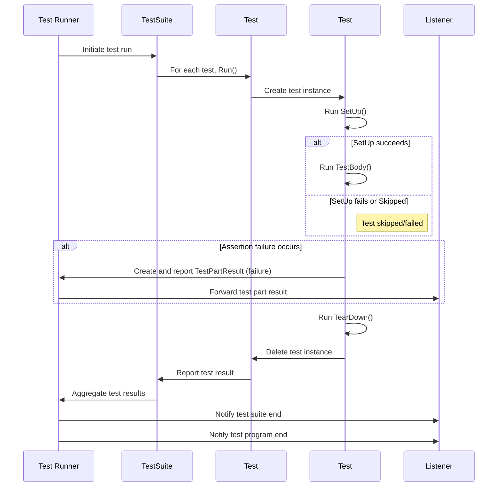

# Assertions, Failures, and Reporting

GoogleTest, Google's C++ testing framework, provides a rich and flexible system for assertions and failure handling which forms the critical foundation for reliable unit testing. This page dives deep into how assertions work, how failures—both fatal and non-fatal—are captured and reported, and the classes and macros underpinning this essential functionality.

---

## Understanding Assertions in GoogleTest

Assertions check your code against expected conditions, providing diagnostic feedback when these conditions are not met. These assertions are central to verifying test correctness and producing meaningful error reports.

GoogleTest offers two main types of assertions:

- **Fatal Assertions (`ASSERT_*`)**: Upon failure, aborts the current function immediately, helping stop further test execution that depends on unmet conditions.
- **Non-Fatal Assertions (`EXPECT_*`)**: Upon failure, logs the failure but allows the current function to continue, useful for checking multiple conditions within a single test.

Both types support streaming additional messages for richer diagnostics:

```cpp
EXPECT_TRUE(my_condition) << "Custom failure message with details.";
```

### Explicit Success and Failure Assertions

- `SUCCEED()` generates an explicit success mark—primarily for documentation purposes.
- `FAIL()` triggers a fatal failure and aborts the function.
- `ADD_FAILURE()` produces a non-fatal failure, allowing continued function execution.
- `ADD_FAILURE_AT(file, line)` records a failure at a specific source location.

These give you control over test outcomes even when the condition to test is based on control flow rather than a simple boolean.

## Assertion Macros Overview

GoogleTest provides a comprehensive set of assertion macros covering a wide spectrum of testing needs:

- **Boolean Checks:** `EXPECT_TRUE`, `ASSERT_TRUE`, `EXPECT_FALSE`, `ASSERT_FALSE`
- **Binary Comparisons:** `EXPECT_EQ`, `ASSERT_EQ`, `EXPECT_NE`, `ASSERT_NE`, `EXPECT_LT`, `ASSERT_LT`, and others for ordering comparisons.
- **String Comparisons:** `EXPECT_STREQ`, `ASSERT_STREQ` for C-style strings; wide string variants and case-insensitive versions.
- **Floating-Point Comparisons:** `EXPECT_FLOAT_EQ`, `ASSERT_FLOAT_EQ`, `EXPECT_DOUBLE_EQ`, `ASSERT_DOUBLE_EQ`, and `EXPECT_NEAR` to handle precision challenges.
- **Exception Assertions:** `EXPECT_THROW`, `ASSERT_THROW`, `EXPECT_NO_THROW`, `ASSERT_NO_THROW`, and their variants for verifying exception behavior.
- **Predicate Assertions:** Flexible macros like `EXPECT_PREDn` and `EXPECT_PRED_FORMATn` allow complex predicates and custom message formatting.
- **Windows HRESULT Assertions:** Specialized macros like `EXPECT_HRESULT_SUCCEEDED` check Windows HRESULTs.
- **Death Assertions:** `EXPECT_DEATH` and `ASSERT_DEATH` verify that a statement terminates the process as expected.

For macro details and examples, see [Assertions Reference](reference/assertions.md).

## How GoogleTest Processes Assertions Internally

Assertions in GoogleTest translate to instances of internal classes and invoke specific reporting mechanisms:

### TestPartResult

- Represents the outcome of a single test part, e.g., an assertion or an explicit `FAIL()`.
- Has types: `kSuccess`, `kNonFatalFailure`, `kFatalFailure`, and `kSkip`.
- Provides metadata about file, line number, detailed message, and a failure summary.

Example of a `TestPartResult` instantiation:

```cpp
TestPartResult(TestPartResult::kFatalFailure, "file.cc", 42, "Expected failure message");
```

### TestResult

- Aggregates multiple `TestPartResult` objects within a single test.
- Tracks properties logged by the test.
- Knows if it has failures (fatal and nonfatal), skips, and elapsed time.

### Test and TestInfo

- The `Test` class represents an individual test fixture instance.
- Contains virtual functions `SetUp()`, `TearDown()`, and the critical `TestBody()` where test logic is defined.
- `TestInfo` stores metadata about a test, its result, and controls execution.

When an assertion macro is invoked, it ultimately creates a `TestPartResult` and reports it to the current test via `UnitTest::AddTestPartResult()`.

## Failure Handling and Reporting Flow

GoogleTest captures assertion outcomes and dispatches notifications for reporting:

1. When an assertion fails, a `TestPartResult` object is created capturing
   - The failure type (fatal or non-fatal),
   - Source location (file and line),
   - Failure message, including optional user streams and stack traces.

2. The failure is then reported to the registered **TestPartResultReporterInterface**, which disseminates events to listeners.

3. Registered **TestEventListeners** receive notifications at key moments including assertion results, test start/end, and program start/end.

4. Standard listeners include the default console printer, XML/JSON generators, and streaming listeners (for remote reporting).

## User-Focused Failure Propagation

In typical usage:

- `ASSERT_*` macros abort the current function on failure, but do not abort the entire test process.
- For subroutines, GoogleTest provides mechanisms such as:
  - `HasFatalFailure()` and `HasNonfatalFailure()` to check if previous assertions failed.
  - `ASSERT_NO_FATAL_FAILURE()` to ensure no fatal failures occur in a statement block.
  - Using exceptions by attaching special test event listeners if more granular control is needed.

This structured failure propagation empowers test authors to handle partial failures gracefully or treat failures as critical per their testing strategy.

## Recording Additional Test Properties

GoogleTest supports logging key-value properties during tests for incorporation in XML or JSON reports.

- Use `::testing::Test::RecordProperty(key, value);` within tests or test suite setup/teardown.
- Keys must be valid XML attribute names and not conflict with reserved names (`name`, `time`, `status`, etc).
- Properties recorded:
  - Inside a test: attached to the individual test case element.
  - Inside `SetUpTestSuite()`/`TearDownTestSuite()`: attached to the test suite element.
  - Outside any test suite: attached to the top-level test suites element.

This feature is invaluable for tracking test metadata such as configuration values, resource usage, or environmental conditions.

## Skipping Tests

GoogleTest allows dynamic skipping using `GTEST_SKIP()` macro, which is treated as a special form of assertion that aborts the current test while marking it skipped.

Example usage:

```cpp
TEST(MyTestSuite, TestToSkip) {
  if (!SetupIsComplete()) {
    GTEST_SKIP() << "Skipping because setup is incomplete.";
  }
  // Test body...
}
```

Skips can also occur implicitly based on fixture setups or test filtering.

## Common User Scenarios and Best Practices

- **Selecting which tests to run:** Use `--gtest_filter` and related flags to include/exclude tests by name.
- **Stopping on first failure:** Set `--gtest_fail_fast` to exit after the first failure.
- **Disabling tests:** Prefix test or test suite names with `DISABLED_` to exclude from runs without deleting code.
- **Running disabled tests:** Use `--gtest_also_run_disabled_tests` flag.
- **Repeating tests:** `--gtest_repeat` runs tests multiple times, useful for catching flaky behavior.
- **Shuffling tests:** `--gtest_shuffle` randomizes test order for dependency detection.

## Troubleshooting Failures

- Make sure assertion expressions are side-effect free or be mindful that arguments may be evaluated only once and in unspecified order.
- Use the `SCOPED_TRACE` macro to append contextual trace messages when calling helper functions that may fail.
- Call `HasFatalFailure()` after subroutine calls to decide whether to continue critical test logic.
- Pay attention to XML/JSON reports and console colors to quickly spot test failures.

---

## Illustrative Compilation and Runtime Flow



---

For further conceptual details, integration examples, and advanced usage scenarios, consult related guides under [Core Testing Workflows](https://github.com/google/googletest/blob/main/docs/guides/core-testing-workflows/using-assertions-effectively.md) and the [Assertions Reference](https://github.com/google/googletest/blob/main/docs/reference/assertions.md).

<Accordion title="Helpful Tips and Common Pitfalls">
- Always structure assertions so that the left-hand side and right-hand side expressions can be safely evaluated once.
- Avoid placing fatal assertions in constructors or destructors; prefer `SetUp` and `TearDown`.
- Remember to use `EXPECT_STREQ` for comparing C-style strings by content rather than pointer equality.
- Use `SCOPED_TRACE` liberally in helper functions to get better diagnostics about where assertion failures occur.
- When writing death tests, name test suites with a `*DeathTest` suffix to ensure proper execution ordering.
- Use `RecordProperty` to log important test metadata and review reports for insights.
</Accordion>

---

# API and Class References

### TestPartResult
Encapsulates single assertion or test-part result. Records:

- Type (Success, Non-fatal failure, Fatal failure, Skip)
- Source file and line
- Failure summary and detailed message

### TestResult
Aggregates many `TestPartResult` instances for one test and tracks:

- Total test parts
- Properties (key-value pairs)
- Verdicts: `Passed()`, `Failed()`, `Skipped()`, `HasFatalFailure()`, `HasNonfatalFailure()`
- Timing: start timestamp, elapsed time

### Test
Base class for test fixtures, providing:

- Lifecycle Hooks: `SetUp()`, `TearDown()`
- Test execution inside `TestBody()` (to be overridden)
- Failure checks: `HasFatalFailure()`, `HasNonfatalFailure()`, `IsSkipped()`
- Static method `RecordProperty` to log key-values

### TestInfo
Stores per-test metadata:

- Test suite and test names
- File and line defined
- Test execution control and results (`should_run_`, `is_disabled_`, `result_`)
- Factory to create new test instances

### TestEventListener
Interface to listen for test events:

- Test start/end
- Assertion results
- Test suite start/end
- Global set-up/tear-down

Allows extending or customizing test reporting by implementing this interface or using `EmptyTestEventListener`.

## Macro and Function Highlights

- `ASSERT_*` and `EXPECT_*` macros for various assertion types.
- `SCOPED_TRACE(message)` to add trace messages to failures.
- `GTEST_SKIP()` to dynamically skip tests.
- `RecordProperty(key, value)` to add custom test metadata.

---

For source code browsing, see the following key files:

- `googletest/include/gtest/gtest.h` — Public GoogleTest API including macro definitions
- `googletest/include/gtest/gtest-test-part.h` — Defines `TestPartResult` class and assertion results
- `googletest/src/gtest.cc` — Core GoogleTest implementation, test orchestration
- `googletest/src/gtest-test-part.cc` — Implementation of TestPartResult and related
- `docs/reference/assertions.md` — Comprehensive assertion macro reference
- `docs/advanced.md` — Advanced usage patterns and concepts

---

By mastering the concepts in this page, users gain a foundational understanding of how GoogleTest captures, propagates, and reports assertion outcomes, empowering effective test writing and debugging.