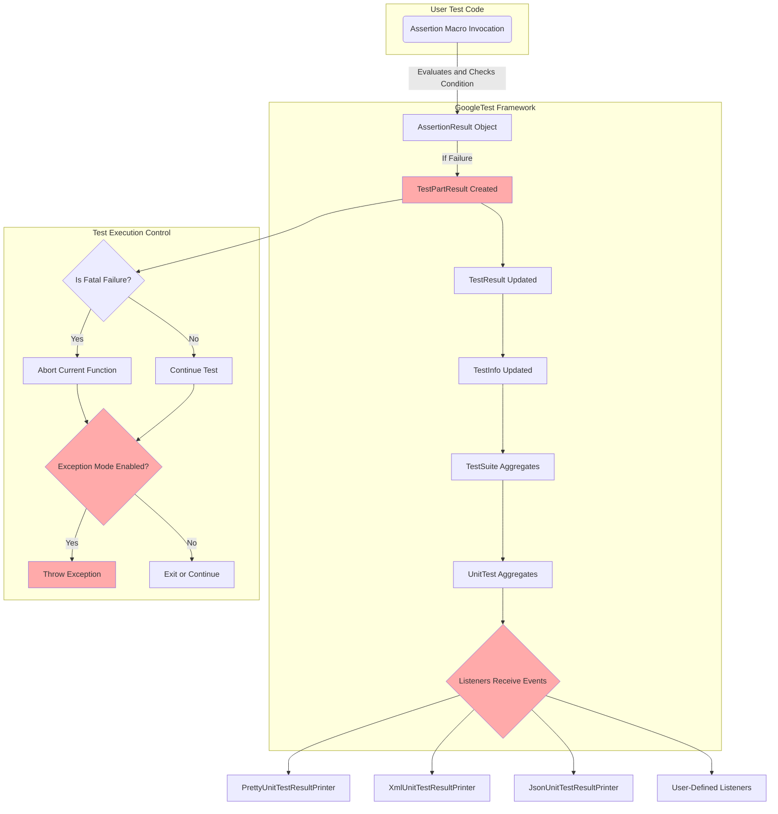

# Assertions, Failures, and Test Results

Understanding assertions is fundamental for effective testing with GoogleTest. This guide explores how assertion macros work, distinguishes between fatal and non-fatal failures, explains how failures propagate through tests, and details how test results are reported within the framework. It also covers the handling of custom assertions and the flow of test outcomes.

---

## 1. Introduction to Assertions in GoogleTest

GoogleTest provides a rich set of assertion macros designed to verify that program behavior matches expectations. Assertions serve as checkpoints in test code, indicating success or failure of certain conditions.

- **EXPECT_** assertions generate *non-fatal* failures — the test continues after failure.
- **ASSERT_** assertions generate *fatal* failures — the test aborts immediately after failure.

Assertions can be equipped with custom failure messages using stream operators (`<<`), which enhances diagnostic capabilities.

**Example:**

```cpp
EXPECT_EQ(value, expected) << "Value did not meet expectations";
ASSERT_TRUE(condition) << "Condition failed";
```

---

## 2. Fatal vs Non-Fatal Failures

### Fatal Failures
A *fatal failure* immediately aborts the current function, which is usually a test body or a `void` helper function used in tests. This behavior guarantees that subsequent code that depends on the assumption that the assertion passed will not execute.

*Usage:* Typically produced by `ASSERT_*()` macros or `FAIL()`.

### Non-Fatal Failures
A *non-fatal failure* records the failure but lets the current function continue executing, allowing subsequent assertions to run and report other issues.

*Usage:* Typically produced by `EXPECT_*()` macros or `ADD_FAILURE()`.

### Choosing Between Them
Use `ASSERT_*()` when further test code depends on the assertion’s success, preventing misleading failures or crashes. Use `EXPECT_*()` when it is safe and helpful to continue the test after a failure.

<Check>
Remember: Fatal failures only abort the current function, **not** the entire test. Use helper macros for subroutines that may fail (see Section 6).
</Check>

---

## 3. The Flow and Propagation of Assertion Results

Assertions result in `TestPartResult` objects representing success, failure (fatal or non-fatal), or skip. These results are captured by test infrastructure and reported accordingly.

- Upon failure, GoogleTest adds a `TestPartResult` to the current `TestResult`.
- For fatal failures, the current function returns immediately, but the overall test continues unless fatal failures are explicitly propagated (see below).
- Test results accumulate within `TestInfo` objects representing individual tests.
- Test suites aggregate results from their constituent tests.

### Propagation Caveat
Since fatal failures abort *only* the current function, writing helper functions containing `ASSERT_*()` requires care. Otherwise, test execution may continue beyond the failure point leading to unclear outcomes or crashes.

---

## 4. Assertion Macros and Implementation Overview

### Implementation of Assertion Macros

Assertion macros are implemented to:

- Evaluate expressions exactly once to avoid side effects.
- Create informative failure messages including the expression text.
- Support streaming of custom messages.
- Determine whether to generate fatal or non-fatal failures.
- Collect test part results and report them through the current test context.

The core abstraction is the `AssertHelper` object, which captures the failure context and streams user messages before committing the result to the framework.

### Streaming Assertion Messages

Users can append streaming text to assertions, which appends to the failure message if the assertion fails.

```cpp
EXPECT_TRUE(x > 0) << "x must be positive, but was " << x;
```


---

## 5. How Test Results Are Reported

GoogleTest organizes test results hierarchically:

- **TestPartResult:** Represents an individual assertion result.
- **TestResult:** Tracks results for a test, including all `TestPartResult`s.
- **TestInfo:** Encapsulates a test’s metadata and its `TestResult`.
- **TestSuite:** Aggregates multiple Tests and their results.
- **UnitTest:** The global test program state containing all `TestSuite`s.

### Reporting Flow

1. When an assertion runs, it calls into the framework’s `AddTestPartResult` method.
2. The result is propagated to listeners subscribed to test events.
3. Listeners such as `PrettyUnitTestResultPrinter` and XML/JSON generators consume events and produce output.
4. At the end of test execution, summary output is generated including passed, failed, and skipped tests.

### Test Event Listeners
GoogleTest uses the **Event Listener API** to notify components of test progress and results. Users can extend this system to capture or redirect test results.

---

## 6. Handling Failures and Custom Assertions

### Catching Failures in Subroutines
When subroutines contain `ASSERT_` macros, failures abort the current function only. To handle this:

- Use `ASSERT_NO_FATAL_FAILURE()` / `EXPECT_NO_FATAL_FAILURE()` around calls to subroutines to detect failures within them.
- Check for failures with `HasFatalFailure()` after subroutine calls and return early if failures occurred.
- Alternatively, enable exception mode (`throw_on_failure` flag) to have assertions throw exceptions upon failure (see Section 7).

---

## 7. Exception Mode and Throwing on Failure

GoogleTest supports a *throw-on-failure* mode controlled by the flag `--gtest_throw_on_failure`:

- When enabled and exceptions are available, failed assertions throw an exception of type `GoogleTestFailureException`.
- When exceptions are not available, it exits the program with a non-zero status.

This mode is especially useful to integrate GoogleTest assertions in other test frameworks.

**Example:**

```cpp
GTEST_FLAG_SET(throw_on_failure, true);
try {
  EXPECT_EQ(1, 2);  // Throws on failure
} catch (const std::runtime_error& e) {
  // Handle the failure
}
```

---

## 8. Custom Assertion Results with AssertionResult

For complex predicates where you want rich failure messages, you can return an `AssertionResult` object instead of a boolean. This allows detailed diagnostics when an assertion like `EXPECT_TRUE()` fails.

**Example:**

```cpp
testing::AssertionResult IsEven(int n) {
  if (n % 2 == 0)
    return testing::AssertionSuccess() << n << " is even";
  else
    return testing::AssertionFailure() << n << " is odd";
}

EXPECT_TRUE(IsEven(3));  // Fails with message detailing the value.
```

You can also create predicate-format functions to customize failure message formatting.

---

## 9. Test Skipping and Success Assertions

- **SUCCEED()** explicitly records a success; it does not cause the test to terminate.
- **FAIL()** generates a fatal failure.
- **ADD_FAILURE()** generates a non-fatal failure.
- **GTEST_SKIP()** lets tests skip execution conditionally at runtime with optional messaging.

---

## 10. Tips, Best Practices, and Troubleshooting

- Always use assertion macros that match your desired failure handling (fatal vs. non-fatal).
- Ensure the arguments of assertions have no side effects or are safe to evaluate once.
- Use streaming of messages for clearer diagnostics.
- For subroutine failures, consider exception mode or `ASSERT_NO_FATAL_FAILURE` to properly propagate failures.
- Avoid mixing `TEST` and `TEST_F` in the same test suite as this causes errors.
- Check for disabled tests that might be silently skipped; use flags `--gtest_also_run_disabled_tests` or prefix with `DISABLED_`.
- Use `SCOPED_TRACE` to add context for nested assertions and complex call chains.

---

## 11. Visual Overview of Assertion and Test Result Flow



---

## 12. References and Further Reading

- [Assertions Reference](./reference/assertions.md) - Complete API list of assertion macros.
- [Advanced GoogleTest Topics](./advanced.md) - Detailed concepts including predicate assertions and exception handling.
- [Core Concepts and Terminology](./overview/core-concepts-architecture/core-concepts-terminology.md) - Definitions and roles of test entities.
- [Catching Failures](./advanced.md#catching-failures) - Techniques to handle and test assertion failures within code.
- [Scoped Trace Usage](./advanced.md#using-assertions-in-sub-routines) - Useful for adding diagnostic context.

---

## 13. Example: Using EXPECT_FATAL_FAILURE to Test Assertion Failures

```cpp
#include "gtest/gtest-spi.h"  // For EXPECT_FATAL_FAILURE

void AddFatalFailure() {
  FAIL() << "Expected fatal failure.";
}

TEST(ExampleTest, TestFatalFailureDetection) {
  EXPECT_FATAL_FAILURE(AddFatalFailure(), "Expected fatal failure.");
}
```

This shows how you can programmatically check that a function triggers a fatal failure.

---

## Conclusion

GoogleTest’s assertion system is designed to give precise control over test flow, failure handling, and diagnostic output. Understanding fatal vs. non-fatal failures, how assertions propagate, and utilizing features like exception mode and `AssertionResult` empowers developers to write expressive, maintainable, and robust tests.

If you master these concepts, you will be well equipped to handle both standard and complex test scenarios effectively.
