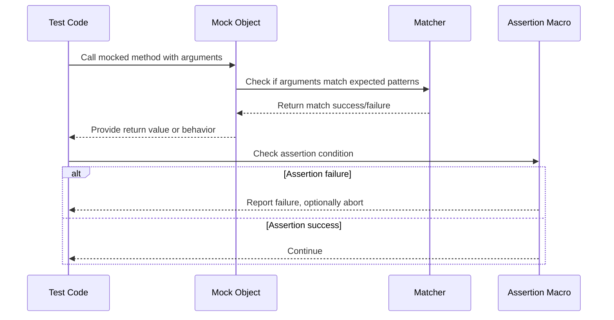

# Assertions and Matchers

Explore the assertions and matchers system that enables expressive test validations in GoogleTest. Learn how assertions deal with both fatal and non-fatal failures, and discover how matchers provide composable, reusable conditions that clarify test intent and outcomes to produce precise, readable tests.

---

## Understanding Assertions in GoogleTest

Assertions are the primary mechanism for validating conditions during test execution. GoogleTest provides two categories of assertions:

- **Fatal assertions (`ASSERT_*`)**: On failure, they immediately abort the current function, preventing further code execution within the test.
- **Non-fatal assertions (`EXPECT_*`)**: On failure, they record the failure but allow the test function to continue running, enabling multiple checks in a single test.

This distinction allows you to balance test thoroughness against early failure detection.

### Basic Assertion Usage

Examples of basic assertions include boolean conditions (`EXPECT_TRUE`, `EXPECT_FALSE`) and binary comparisons (`EXPECT_EQ`, `EXPECT_NE`, `EXPECT_LT`, etc.):

```cpp
EXPECT_TRUE(is_valid);
EXPECT_EQ(expected_value, actual_value);
ASSERT_NE(nullptr, object_ptr);
```

All GoogleTest assertion macros support streaming additional failure messages using the `<<` operator:

```cpp
EXPECT_TRUE(condition) << "Failure details: expected condition to be true.";
```

### Using `EXPECT_THAT` with Matchers

Matchers extend assertions by allowing expressive, complex condition checks. The `EXPECT_THAT` and `ASSERT_THAT` macros verify that values satisfy matchers:

```cpp
EXPECT_THAT(value, StartsWith("Hello"));
EXPECT_THAT(container, ElementsAre(1, 2, Gt(3)));
```

Matchers improve readability by describing conditions in clear, English-like syntax and provide detailed diagnostic messages when failures occur.

More details on matchers can be found in the [Matchers Reference](reference/matchers.md).

---

## Matchers: Composable and Reusable Conditions

Matchers are predicates used primarily with mock expectations and assertions to verify that arguments or values meet specified conditions.

### Built-in Matchers

GoogleMock provides an extensive set of built-in matchers, including:

- Wildcard matchers (`_` matches any value, `A<T>()` matches any value of type `T`)
- Comparison matchers (`Eq()`, `Ge()`, `Le()`, `Ne()`, etc.)
- Floating-point comparators (`DoubleEq()`, `FloatNear()`, `NanSensitiveDoubleEq()`, etc.)
- String matchers (`HasSubstr()`, `StartsWith()`, `EndsWith()`, `MatchesRegex()`, etc.)
- Container matchers (`ElementsAre()`, `UnorderedElementsAre()`, `Contains()`, `Each()`, `SizeIs()`, etc.)
- Pointer and reference matchers (`IsNull()`, `NotNull()`, `Pointee()`, `Ref()`, etc.)
- Exception matchers (`Throws<E>()`, `ThrowsMessage<E>()`, etc.)

For example:

```cpp
EXPECT_CALL(mock_object, ProcessData(Ge(5), StartsWith("prefix")));
EXPECT_THAT(data_vector, Contains(ElementsAre(1, 2, 3)));
```

### Composing Matchers

Matchers can be combined logically using combinators such as `AllOf()`, `AnyOf()`, and negations `Not()`:

```cpp
EXPECT_THAT(value, AllOf(Ge(10), Le(20)));
EXPECT_THAT(name, Not(StartsWith("temp")));
```

This allows crafting precise and descriptive conditions adapted to your tests.

### Defining Custom Matchers

GoogleMock lets you create custom matchers using the `MATCHER` and `MATCHER_P` macros for easy, expressive matcher definitions. For example:

```cpp
MATCHER(IsEven, "Checks if number is even") { return (arg % 2) == 0; }

EXPECT_CALL(mock, Foo(IsEven()));
EXPECT_THAT(value, IsEven());
```

You can provide detailed explanations on match failures, enhancing the debuggability of tests.

---

## Assertions and Matchers Workflow

1. **Set expectations on mock methods using `EXPECT_CALL` with argument matchers:**

```cpp
EXPECT_CALL(mock_object, Compute(Ge(5), _))
    .Times(AtLeast(1))
    .WillRepeatedly(Return(true));
```

2. **Invoke your code under test, which exercises the mocks.**
3. **Assertions verify that the conditions hold, reporting errors with expressive messages if they don't.**

### Practical Tips

- Use `_` to ignore arguments that don't matter to the test, reducing brittleness.
- Be cautious about setting overly strict expectations that constrain implementation unnecessarily.
- Use `ON_CALL` to specify default behaviors without imposing expectations, making tests more robust.
- Combine matchers to express complex argument constraints clearly.

---

## Best Practices and Common Pitfalls

- Always set expectations *before* exercising the mocks; otherwise, behavior is undefined.
- Avoid catching or suppressing uninteresting call warnings by simply adding `EXPECT_CALL` without intent; use `NiceMock` to suppress warnings as needed.
- Use `RetiresOnSaturation()` with multiple expectations to avoid sticky expectations blocking subsequent calls.
- Prefer `EXPECT_THAT` over generic boolean assertions when verifying complex conditions for richer diagnostics.

---

## Examples

### Simple Assertion

```cpp
ASSERT_EQ(42, ComputeAnswer());
```

### Using Matchers in Expectations

```cpp
using ::testing::NotNull;
using ::testing::Gt;

EXPECT_CALL(mock, ProcessData(NotNull(), Gt(10)))
    .Times(1)
    .WillOnce(Return(true));
```

### Matcher Composition and Custom Matcher

```cpp
MATCHER(IsPositive, "checks if number is positive") {
  return arg > 0;
}

EXPECT_THAT(value, AllOf(IsPositive(), Lt(100)));
```

### Ignoring Arguments

```cpp
EXPECT_CALL(mock, Save(_, _))
    .Times(AnyNumber());  // Only care that Save() is called.
```

---

## Troubleshooting

- If an unexpected call occurs, check that your expectations exactly match the arguments.
- Use `--gmock_verbose=info` flag to get detailed logs about mock calls and expectation matching.
- Verify expectations are set before invoking the mock methods.
- For complex argument matchers, test them in isolation using `EXPECT_THAT` to confirm expected behavior.

---

## Advanced Features

- Use `EXPECT_CALL` clauses such as `With()`, `Times()`, `InSequence()`, `After()`, and `WillOnce()`/`WillRepeatedly()` to finely control expectations, call ordering, and mock behavior.
- Different cardinality specifiers (`Exactly(n)`, `AtLeast(n)`, `AnyNumber()`, etc.) enable flexible expectations on call counts.
- Matchers support matching multiple arguments as tuples with `With()` and support argument selectors (`Args<>`, `AllArgs()`).

For details, see the [Mocking Reference](reference/mocking.md) and the [gMock Cookbook](gmock_cook_book.md).

---

## Visualization: Assertions and Matchers Interaction Flow



---

## Related Documentation

- [GoogleTest Assertions and Expectations Reference](reference/assertions.md)
- [GoogleMock Matchers Reference](reference/matchers.md)
- [Mocking Reference (EXPECT_CALL, ON_CALL)](reference/mocking.md)
- [gMock Cookbook](gmock_cook_book.md)
- [Writing Your First Test](getting-started/first-steps-usage/writing-your-first-test)
- [Using Assertions and Matchers Effectively Guide](guides/everyday-workflows/assertions-matchers)

---

For a guided introduction to mock objects and setting expectations, visit the [gMock for Dummies tutorial](docs/gmock_for_dummies.md).

---

## Summary

This page delves into the essential mechanisms of **Assertions and Matchers** in GoogleTest and GoogleMock. It explains how to write expressive, clear validations in test code that distinguish between fatal and non-fatal test failures and how to leverage the powerful matcher system to define versatile, reusable argument constraints. Emphasis is placed on writing maintainable tests by setting appropriate expectations, composing matchers, and correctly interpreting assertion results.

---

## Code Example Sum-up

```cpp
// Simple assertion
EXPECT_EQ(42, ComputeAnswer());

// Expecting a mock method call with matchers
EXPECT_CALL(mock, Foo(Ge(10), _))
    .Times(AtLeast(1))
    .WillRepeatedly(Return(true));

// Using matchers in assertions
EXPECT_THAT(container, ElementsAre(1, 2, Gt(3)));

// Custom matcher
MATCHER(IsEven, "checks if number is even") {
  return (arg % 2) == 0;
}
EXPECT_CALL(mock, Process(IsEven()));
```
