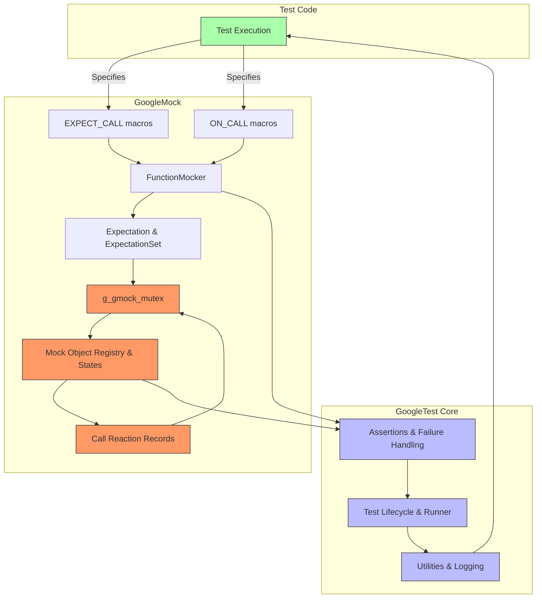

# Component Interactions: GoogleTest & GoogleMock

GoogleMock builds upon GoogleTest to provide a seamless framework for writing, configuring, and verifying mock objects in C++. This page clarifies the interplay between the two frameworks, highlighting how their core components—including key header files, main entry points, and runtime elements—coordinate to deliver a cohesive testing and mocking experience.

---

## 1. GoogleTest and GoogleMock Integration Overview

GoogleMock complements GoogleTest by introducing powerful mocking capabilities into the existing testing infrastructure. Both frameworks share runtime components, synchronization mechanisms, and core utilities to ensure consistent, thread-safe operation.

- **Shared Runtime:** Both use a common runtime environment, including global mutexes and failure reporting, facilitating smooth cooperation and consistent output.
- **Dependency Structure:** GoogleMock depends on GoogleTest's core, especially for assertions, test lifecycle management, and utility functionality.
- **Unified Build:** GoogleMock is bundled as part of the GoogleTest repository, simplifying integration and maintenance.

<Check>
Using GoogleMock requires including `<gmock/gmock.h>`, which internally includes GoogleTest headers, ensuring all dependencies are resolved transparently.
</Check>

---

## 2. Core Header Files and Entry Points

### 2.1 Key Headers

- **`gmock-spec-builders.h`**
  - Implements macros `ON_CALL()` and `EXPECT_CALL()` that let users define mock method behaviors and expectations declaratively.
  - Provides the class templates and supporting types that manage mock function expectations, default actions, call sequencing, and verification logic.
  - Internally includes `gtest/gtest.h`, linking GoogleMock to GoogleTest's assertion and test infrastructure.

- **`gmock.h`**
  - Umbrella header that includes all necessary GoogleMock components.

### 2.2 Macros and Their Internals

- `ON_CALL(mock_object, Method(...))`
  - Defines default behavior for methods without setting call expectations.
  - Requires `.WillByDefault(action)` to specify the behavior.

- `EXPECT_CALL(mock_object, Method(...))`
  - Declares an expectation that a method will be called with certain arguments.
  - Supports comprehensive modifiers like `.Times()`, `.InSequence()`, `.After()`, `.WillOnce()`, `.WillRepeatedly()`, and `.RetiresOnSaturation()`.

These macros invoke underlying C++ template classes that:
- Store expectations with cardinalities,
- Manage call counts,
- Match actual function calls with expectations,
- Dispatch behavior accordingly.

<i>Story:</i> <b>As a test author, you write expressive `EXPECT_CALL` statements to precisely specify how your mock should behave and be verified during test execution. GoogleMock manages the verification and failure reporting, supplementing GoogleTest's framework seamlessly.</b>

---

## 3. Synchronization and State Management

- **Global Mutex (`g_gmock_mutex`):**
  - Ensures thread-safe access to internal mock registries, expectation lists, and runtime state.
  - Protects updates to mock call counts, expectation lifecycle management, and concurrency-sensitive structures.

- **Mock Object Registry:**
  - Tracks live mock objects and their associated mock method instances.
  - Detects leaked mocks to help users catch common testing bugs.
  - Coordinates verification and cleaning of expectations on mock destruction or manual invocation.

- **Call Reaction Management:**
  - Controls the behavior when uninteresting calls occur (allowed, warned, or failed).
  - Allows users to customize verbosity and strictness on a per-mock-object basis, with wrappers like `NiceMock`, `NaggyMock`, and `StrictMock` reflecting different policies.

---

## 4. Expectations and Call Matching Flow

### The User Experience

By writing `EXPECT_CALL` statements before exercising the code under test, users specify how many times and under what conditions a mock method should be triggered.

### Internals Handle

1. On invocation, the mock method locks `g_gmock_mutex` to synchronize state updates.
2. It searches for the most recent matching expectation (searching in reverse order, so the newest expectation overrides older ones).
3. It verifies that pre-requisites and cardinality constraints are met.
4. It selects the corresponding action (from `WillOnce()`, `WillRepeatedly()` or default).
5. Reports errors on unexpected, excessive, or uninteresting calls accordingly.

### Expectation Modifiers

Users can chain clauses for fine-grained behavior:

- `.With()` - Additional matching on the full argument tuple.
- `.Times()` - Specifies call cardinality (Exactly, AtLeast, AnyNumber, etc).
- `.InSequence()` and `.After()` - Control expected call order and partial orders.
- `.WillOnce()` and `.WillRepeatedly()` - Define call behaviors.
- `.RetiresOnSaturation()` - Automatically deactivate expectations once saturated.

---

## 5. Default Behaviors and ON_CALL

- `ON_CALL` specifications set default actions when no matching `EXPECT_CALL` exists.
- They do not generate call count expectations but provide fallback/mock action when methods are invoked unexpectedly.
- Users typically place `ON_CALL` statements in mock class constructors or test fixture setup to specify common default behaviors.

---

## 6. Summary of Component Interactions

This flowchart depicts the user writing code that sets expectations and default behaviors using GoogleMock macros. These interact with the function mockers and expectation objects managed under synchronization, coordinated by the internal registry and state. GoogleTest core handles assertions, test lifecycle, and failure reporting, completing the test cycle.

---

## 7. Best Practices & Common Pitfalls

- **Always set expectations before exercising the mock.** Setting them late leads to undefined behavior.
- **Use `ON_CALL` for default behavior, `EXPECT_CALL` for expectations that must be verified.** Avoid overusing expectations to keep tests robust.
- **Chain expectation clauses properly in order**: `.With()`, `.Times()`, `.InSequence()`, `.After()`, `.WillOnce()`, `.WillRepeatedly()`, `.RetiresOnSaturation()`.
- **Avoid ambiguous overloads without matchers** to prevent compile errors.
- **Pay attention to call ordering via sequences and After clauses** when calling order matters.
- **Use `NiceMock` or `StrictMock` as appropriate** to control warnings or errors on uninteresting calls.
- **Clean up mocks and verify expectations** to avoid leaking mocks, which disables verification.

<Warning>
Misuse of expectations or neglecting call order constraints often leads to unhelpful failures or test instability. Use GoogleMock's verbose modes to gain insights into expectation match failures.
</Warning>

---

## Related Resources

- [gMock for Dummies](https://google.github.io/googletest/gmock_for_dummies.html): Beginner-friendly tutorial introducing mocking with GoogleMock.
- [Mocking Reference](../docs/reference/mocking.md): Detailed descriptions of key macros and classes.
- [gMock Cookbook](https://google.github.io/googletest/gmock_cook_book.html): Hands-on recipes and patterns for effective mocking.
- [GoogleTest Primer](https://google.github.io/googletest/primer.html): Core GoogleTest concepts and usage.

---

## Troubleshooting

- Use the verbosity flag `--gmock_verbose=info` during test runs to see detailed matching and call trace logs.
- Inspect warnings about "Uninteresting mock function call" and consider adding `EXPECT_CALL(...).Times(AnyNumber())` or switching to `NiceMock` if warnings are expected.
- Verify that all expectations are satisfied by checking test output or explicitly invoking `Mock::VerifyAndClearExpectations(&mock_object)`.
- Leaked mocks are reported at program exit; use `Mock::AllowLeak` cautiously or ensure proper resource cleanup.

---

By understanding the integration and interaction of GoogleTest and GoogleMock components, users can harness the full power of both frameworks to write precise, expressive, and reliable unit tests with comprehensive mock support.