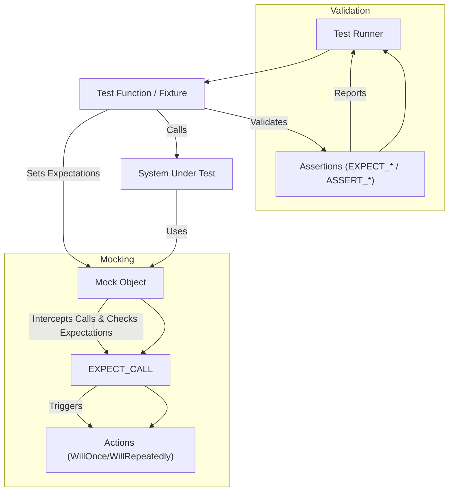

# Component Interactions: Test, Assertion, Mock

Understanding how the core components of GoogleTest—**tests**, **assertions**, and **mocks**—interact within the testing workflow is essential to leveraging the full power of the framework. This guide unpacks their collaborative roles throughout the execution pipeline, focusing on where expectations are declared, how assertions report results, and when mocks capture interactions to verify expected behaviors.

---

## Overview of Core Components Interaction

GoogleTest orchestrates a coordinated dance among tests, assertions, and mocks to rigorously verify your C++ code. Here’s how they fit together:

- **Tests**: The container and execution unit that defines what behavior to verify. Tests are structured as functions or fixtures that run sequences of code, assertions, and mock interactions.

- **Assertions**: The checks embedded within tests that examine conditions and record success or failure immediately. Assertions provide the granular validation points and communicate results clearly.

- **Mocks**: Test doubles that substitute for real objects or functions allowing you to **set expectations** on calls, monitor interactions, and simulate behaviors.

This guide dives deeply into how these components function together, enabling developers to write expressive, correct, and maintainable tests.

---

## Test Execution Pipeline: A User Journey

Imagine you’re validating a component that depends on a collaborator object. You want to confirm that your component calls the collaborator's methods in a specific way.

### Step 1: Define Test and Instantiate Mocks

You start by writing a **test** function or fixture in GoogleTest:

```cpp
TEST(SampleComponentTest, CallsCollaboratorCorrectly) {
  MockCollaborator mock;
  SampleComponent component(&mock);
  ...
}
```

You create a `MockCollaborator` instance, which will intercept calls made by `SampleComponent` during the test.

### Step 2: Set Expectations on Mock Methods

Before exercising your component, you specify **expectations** on the mock. These expectations define _which_ methods are expected to be called, _how often_, and _with what arguments_. For example:

```cpp
EXPECT_CALL(mock, PerformAction(42))
    .Times(1)
    .WillOnce(Return(true));
```

This means you expect `PerformAction(42)` to be called exactly once and when called, the mock will return `true`.

### Step 3: Exercise the System Under Test

You invoke the component methods under test, triggering interactions:

```cpp
bool result = component.DoWork();
```

During this call, your mock object intercepts calls to `PerformAction` and checks them against expectations.

### Step 4: Use Assertions for Additional Checks

Within your test, you can use **assertions** to check state or outputs independently:

```cpp
EXPECT_TRUE(result);
EXPECT_EQ(component.GetState(), ExpectedState);
```

These validate conditions immediately and cause the test to fail fast upon violations.

### Step 5: Automatic Verification of Expectations

Upon test or mock destruction, GoogleMock automatically verifies that all expectations were met. If a mock method was not called as expected—or was called outside the specified parameters—GoogleTest will report detailed test failures.

---

## Detailed Component Roles and Interaction Points

### Tests

- Define the scope and lifecycle of the verification.
- Organize setup, exercise, and validation phases.
- Provide the context for assertions and mocks to operate.

### Assertions

- Check specific conditions (truth, equality, etc.) within tests.
- Provide immediate feedback on success or failure.
- Integrate with GoogleTest’s filtering, reporting, and failure handling mechanisms.
- Can test return values, state changes, error conditions, and more.

### Mocks

- Replace real dependencies with controllable, observable substitutes.
- Allow expectations to be set using `EXPECT_CALL` before exercising tested code.
- Use `ON_CALL` to specify default behaviors for unspecified calls.
- Check that expected calls occur, with matching arguments, in the correct order if sequences or ordering constraints are defined.
- Report warnings or failures on uninteresting or unexpected calls, depending on mock strictness (nice, naggy, strict).

---

## Where Expectations Are Set and Verified

The pivotal method for interacting with mocks is `EXPECT_CALL`. It specifies which calls are anticipated:

- Placed in test setup or body before code under test executes.
- Defines matchers on function arguments to specify how calls are matched.
- Specifies cardinality with `.Times()` (e.g., exactly once, any number).
- Optionally orders expectations using `.InSequence()` and `.After()`.
- Specifies actions with `.WillOnce()` and `.WillRepeatedly()` to simulate return values or side effects.

The mock framework intercepts all calls made to mocked methods during test execution. It selects the matching expectation based on:

- Argument matching
- Current state (e.g., call count, retirement of expectation)
- Prerequisites (ordering constraints)

If a call matches an expectation, the associated action executes, the call count is incremented, and prequisite expectations may retire to control ordering.

If no expectations match, the call is unexpected; behavior depends on the mock's strictness.

---

## Assertions: Communicating Results

Assertions are the test’s way of reporting verification status:

- Macros like `EXPECT_EQ`, `ASSERT_TRUE`, and `EXPECT_THAT` verify conditions synchronously.
- Assertion failures print precise error messages, including expected and actual values.
- Failures abort test execution immediately if using `ASSERT_` variants.
- Assertions contribute to GoogleTest's consolidated test reports, enabling failure diagnosis.

Within mocks, failed expectations cause test failures with rich descriptions, including:

- Which method call failed.
- Argument mismatches.
- Call count violations.
- Ordering violations.

Verbose logging support (`--gmock_verbose=info`) can be enabled to trace mock calls and matched expectations during test runs, aiding diagnostic efforts.

---

## Practical Tips and Best Practices

- Always set expectations **before** you execute the code under test. Changing expectations afterward leads to undefined behavior.
- Use **matchers** generously to avoid over-constraining tests with exact arguments; focus on the properties you care about.
- Utilize `.RetiresOnSaturation()` to prevent sticky expectations causing accidental failures.
- For ordered calls, leverage `InSequence` or explicit `.After()` constructs to express partial or total order.
- Control uninteresting call warnings by choosing mock types: `NiceMock` (suppress warnings), `NaggyMock` (default warnings), `StrictMock` (treat unexpected calls as failures).
- Consider using `ON_CALL` to set default mock method behaviors without enforcing call expectations.

---

## Example: Full Mocking Workflow

```cpp
#include <gmock/gmock.h>

using ::testing::Return;
using ::testing::_;
using ::testing::InSequence;

class Collaborator {
 public:
  virtual ~Collaborator() {}
  virtual int PerformAction(int x) = 0;
};

class MockCollaborator : public Collaborator {
 public:
  MOCK_METHOD(int, PerformAction, (int x), (override));
};

TEST(ExampleTest, ValidatesCollaboratorInteraction) {
  MockCollaborator mock;
  SampleComponent component(&mock);

  InSequence seq;  // Enforces call order.

  EXPECT_CALL(mock, PerformAction(42))
      .Times(1)
      .WillOnce(Return(100));

  EXPECT_CALL(mock, PerformAction(_))
      .WillRepeatedly(Return(0));

  int result = component.DoWork();

  EXPECT_EQ(result, 100);
}
```

This example:

- Defines `MockCollaborator` with `MOCK_METHOD`.
- Uses `EXPECT_CALL` to demand a specific call and provide a response.
- Uses `InSequence` to enforce call order.
- Runs the component code which exercises the mock.
- Uses assertions to check test outcomes and validate call expectations.

---

## Troubleshooting Common Interaction Issues

- **Mock calls unexpected or excessive**: Confirm expectations are set before exercising code, check argument matchers, and verify call cardinality.
- **Uninteresting calls warnings**: Use `NiceMock` to suppress or add catch-all `EXPECT_CALL(mock, Method(_)).Times(AnyNumber())`.
- **Expectations never met**: Run tests with `--gmock_verbose=info` to trace calls and verify expectation matches.
- **Order violations**: Review `.InSequence` and `.After` usage to ensure call ordering matches expectations.
- **Mock lifetimes**: Ensure mocks are destructed so expectations are verified, or explicitly call `Mock::VerifyAndClearExpectations(&mock)`.

---

## Summary

In GoogleTest, **tests** define the scope and run the code, **assertions** validate correctness inline, and **mocks** substitute dependencies and enforce call contracts through **expectations**. This synergy enables precise, readable, and maintainable testing of complex C++ codebases.

Use expectations (`EXPECT_CALL`) to declare desired mock interactions prior to exercising code, utilize assertions to check outputs and states, and allow GoogleMock to automatically verify that all interactions matched your contract.

For rich diagnostics, enable verbose logging and harness ordering constructs to express complex interaction sequences. Follow best practices around expectation declaration timing and mock types to maintain stable and effective tests.

---

## Additional Resources

- [Mocking Reference](../reference/mocking.md): Detailed explanation of mocks, macros, and mock classes.
- [gMock for Dummies](https://google.github.io/googletest/gmock_for_dummies.html): Introductory tutorial on using mocks.
- [gMock Cookbook](../gmock_cook_book.md): Recipes and best practices for advanced mocking.
- [EXPECT_CALL documentation](../reference/mocking.md#EXPECT_CALL): Syntax and modifiers for setting expectations.
- [Matchers Reference](../reference/matchers.md): Using matchers to specify argument expectations.
- [Actions Reference](../reference/actions.md): Defining mock method behaviors.

Explore related guides such as 'Writing Your First Test', 'Basic Mocking', and 'Debugging and Troubleshooting Test Failures' for complete mastery.

---

<Accordion title="Mermaid Diagram: Component Interaction Overview">

</Accordion>
