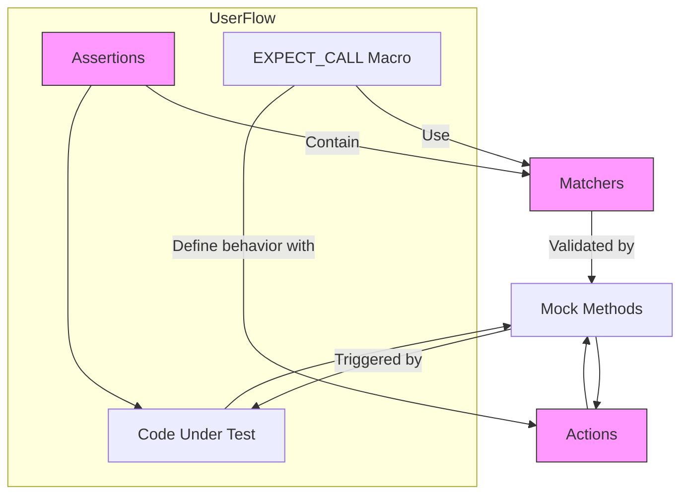

# Core Abstractions: Assertions, Matchers, and Actions

Understanding the foundational building blocks of GoogleTest and GoogleMock is essential to mastering effective and expressive test writing. This guide unpacks the core abstractions that enable tests to be both powerful and readable — **Assertions**, **Matchers**, and **Actions**. Together, they form the backbone of test validation, flexible condition expression, and mock behavior definition.

---

## 1. Assertions: Validating Behavior

Assertions are the **guardians of correctness** in your tests. They **validate that code behaves as expected during test execution**, immediately flagging deviations.

### What Assertions Do

- **Check conditions** you expect to be true.
- **Signal failures** when expectations are not met.
- Distinguish between _fatal_ failures (which abort the current test) and _non-fatal_ failures (which allow tests to proceed).

### Typical Assertions You Use

Your tests will rely heavily on assertions such as `EXPECT_EQ`, `ASSERT_TRUE`, or the expressive `EXPECT_THAT`, which integrates matchers to precisely describe conditions. The assertions verify actual outcomes against expected values or states.

### Assertion Workflow

1. The test invokes code that produces a result.
2. An assertion checks the result against expected behavior.
3. On failure, GoogleTest reports details including expected vs. actual values, aiding rapid diagnosis.

### Examples

```cpp
// Basic Boolean assertion
EXPECT_TRUE(IsConnected());

// Equality check
EXPECT_EQ(42, CalculateAnswer());

// Using matchers for expressive validation
EXPECT_THAT(user_name, StartsWith("Admin"));
```

<div class="callout note">
For deeper understanding of assertions, see <a href="../api-reference/gtest-core-apis/test-assertions">GoogleTest Assertions Reference</a>.
</div>

---

## 2. Matchers: Expressing Flexible Conditions

Matchers bring **expressiveness and flexibility** to test validation. Unlike fixed values, matchers can describe a variety of conditions, enabling you to verify that arguments or results satisfy complex properties.

### Role of Matchers

- **Match method call arguments** in mocks to specify expected inputs flexibly.
- **Enhance assertions** to validate conditions beyond simple equality, such as ranges, substrings, or custom predicates.

### How Matchers Work

Matchers act like predicates for values:

- They check if a given value fits the condition described.
- They produce meaningful messages explaining mismatches in failure reports.

### Common Built-in Matchers

- Wildcard matcher: `_` (matches any value)
- Comparisons: `Eq()`, `Ne()`, `Gt()`, `Lt()`, `Ge()`, `Le()`
- String matchers: `StartsWith()`, `HasSubstr()`, `MatchesRegex()`
- Container matchers: `ElementsAre()`, `UnorderedElementsAre()`, `Contains()`
- Pointer matchers: `NotNull()`, `Pointee()`

### Using Matchers in Expectations

Matchers integrate naturally with `EXPECT_CALL` to specify which calls should be expected, e.g.,

```cpp
EXPECT_CALL(mock_obj, Process(_));   // Any argument accepted
EXPECT_CALL(mock_obj, Process(Gt(0)));  // Argument greater than zero
```

### Creating Custom Matchers

You can write your own matchers for domain-specific checks in just a few lines, using `MATCHER` and related macros or by implementing matcher classes directly.

### Examples

```cpp
using ::testing::_;
using ::testing::Ge;

EXPECT_CALL(mock_turtle, GoTo(50, _));  // X must be 50; Y can be anything
EXPECT_THAT(result, AllOf(Ge(10), Lt(20)));  // result in [10,20)
```

<div class="callout note">
For a complete list of standard matchers and their usage, visit <a href="../api-reference/gmock-apis/matchers-reference">Matchers Reference</a>.
</div>

---

## 3. Actions: Driving Mock Responses

Actions define **how mock methods respond** when called, allowing you to specify return values, side effects, or custom behaviors.

### What Actions Enable

- Returning pre-determined values or stateful results.
- Modifying output arguments or shared state.
- Invoking callback functions, lambdas, or existing methods.
- Composing multiple sub-actions to perform complex sequences.

### Defining Mock Behavior

By default, mock methods return zero-like or default-constructed values. To specify precise behaviors, you use:

- `WillOnce(action)`: action to perform on a single mock call.
- `WillRepeatedly(action)`: action to perform on all matching calls after `WillOnce`s are exhausted.

### Built-in Actions

- `Return(value)`: return a fixed value.
- `ReturnRef(value)`: return a reference.
- `ReturnPointee(pointer)`: return what the pointer points to at call time.
- `SetArgPointee<N>(value)`: set the value of an output pointer argument.
- `Invoke(callable)`: call a function, method, or functor.
- `DoAll(...)`: execute multiple actions in sequence.

### Custom Actions

You can create new, parameterized, or polymorphic actions using:

- The `ACTION` family of macros for quick declaration.
- The full `ActionInterface` for fine control.

### Examples

```cpp
EXPECT_CALL(mock_calculator, Add(3, 4))
    .WillOnce(Return(7));

EXPECT_CALL(mock_database, Query(_))
    .WillRepeatedly(Invoke(&real_database, &Database::Query));

EXPECT_CALL(mock_file, Read(_, _))
    .WillOnce(DoAll(SetArgPointee<1>(1024), Return(true)));
```

<div class="callout note">
Learn advanced action authoring in the <a href="../guides/advanced-usage-and-integration/writing-custom-matchers-and-actions">Writing Custom Matchers and Actions</a> guide.
</div>

---

## 4. How the Abstractions Work Together

These abstractions collaborate seamlessly:

- Assertions use matchers to express conditions elegantly.
- Mock expectations set with `EXPECT_CALL` use matchers to specify input parameters precisely.
- Actions define what happens when a mock's method is invoked, supporting complex interactions and side effects.

This synergy lets you write **expressive, readable, and maintainable tests**.

---

## 5. Best Practices & Tips

- Use **Assertions** to validate outcomes clearly and early.
- Leverage **Matchers** to avoid brittle tests by matching just what matters.
- Prefer `ON_CALL` to set default behaviors and reserve `EXPECT_CALL` for behavior you **intend to verify**.
- Use **NiceMock<T>** to suppress noisy warnings from unimportant calls.
- Specify **call order** and cardinalities (`Times()`, `InSequence()`) only when essential.
- Compose complex mock behavior with multiple **WillOnce()** and a final **WillRepeatedly()**.
- Write **custom matchers and actions** to tailor the framework to your domain.

---

## 6. Troubleshooting Common Issues

- **Uninteresting call warnings:** occur when mock methods are called without expectations; use `NiceMock` or add a catch-all expectation.
- **Unexpected calls:** happen if a call does not match any `EXPECT_CALL` matcher — check your matchers and order.
- **Action exhaustion warnings:** ensure `WillOnce` actions and cardinalities align.
- **Mock leaking:** verify mocks by destruction or explicitly via `Mock::VerifyAndClearExpectations()`.

---

## 7. Visualizing Interactions



---

## 8. Additional References

- [Using Assertions and Matchers Guide](../guides/core-testing-workflows/using-assertions-and-matchers)
- [gMock Cookbook](../docs/gmock_cook_book.md)
- [Matchers Reference](../api-reference/gmock-apis/matchers-reference)
- [Actions Reference](../api-reference/gmock-apis/actions-reference)
- [Mocking Reference](../api-reference/gmock-apis/mocking-api)
- [gMock Cheat Sheet](../docs/gmock_cheat_sheet.md)

---

Mastering assertions, matchers, and actions will enable you to write unit tests that are both expressive and maintainable — a cornerstone of productive C++ development with GoogleTest and GoogleMock.