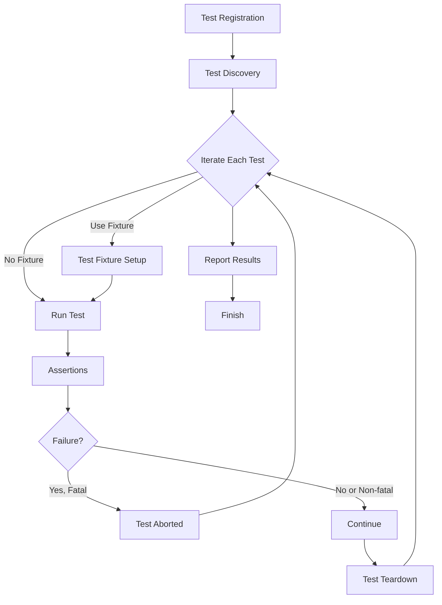

# Test Structure and Core Abstractions

Understanding how GoogleTest structures tests and orchestrates their execution is fundamental to mastering the framework. This guide dives deep into the core abstractions like Test Cases, Test Fixtures, Assertions, and their interrelationships that empower efficient, maintainable tests.

---

## Test Cases and Tests

### Test Case
A **Test Case** is a collection of many related tests that focus on a specific component or feature. It can be thought of as a suite grouping together similar tests, generally sharing common setup or intent.

Example:

```cpp
TEST(MathUtilsTest, AddsTwoNumbers) {
  EXPECT_EQ(Add(1, 2), 3);
}

TEST(MathUtilsTest, MultipliesTwoNumbers) {
  EXPECT_EQ(Multiply(3, 4), 12);
}
```

Both tests belong to the `MathUtilsTest` test case.

### Test
A **Test** is a function that exercises a particular aspect of code and makes assertions about expected behavior. Each test is uniquely named within its test case.

GoogleTest provides the `TEST` macro to define tests succinctly:

```cpp
TEST(TestCaseName, TestName) {
  // Test body
}
```

Each test is executed independently by the test runner.

<Check>
Tests within a test case should be **independent and self-contained**: order must not affect results.
</Check>

---

## Test Fixtures

A **Test Fixture** defines a common environment for a group of related tests, bundling shared setup and teardown code to avoid duplication and increase test clarity.

Test fixtures are classes deriving from `::testing::Test`:

```cpp
class MathTest : public ::testing::Test {
 protected:
  void SetUp() override {
    // Initialization code
  }

  void TearDown() override {
    // Cleanup code
  }

  int value_;
};

TEST_F(MathTest, Add) {
  value_ = 1;
  EXPECT_EQ(Add(value_, 2), 3);
}

TEST_F(MathTest, Multiply) {
  value_ = 3;
  EXPECT_EQ(Multiply(value_, 4), 12);
}
```

- `Test_F` identifies that the test uses the fixture class.
- `SetUp()` runs before each test.
- `TearDown()` runs after each test.

<Info>
Test fixtures promote DRY tests by sharing common context and help maintain state between setup and test execution phases.
</Info>

---

## Assertions

Assertions verify expectations about program state during a test.

GoogleTest distinguishes:
- **Fatal assertions** like `EXPECT_FATAL_FAILURE` or `ASSERT_...` stop current test execution immediately on failure.
- **Non-fatal assertions** like `EXPECT_...` continue test execution even if failed.

Common assertions:

| Assertion          | Description                                      |
| ------------------ | ------------------------------------------------ |
| `EXPECT_EQ(a,b)`   | Checks if `a == b`; continues on failure.        |
| `ASSERT_EQ(a,b)`   | Checks if `a == b`; aborts test on failure.       |
| `EXPECT_TRUE(x)`   | Checks if `x` is true; continues on failure.      |
| `ASSERT_FALSE(x)`  | Checks if `x` is false; aborts test on failure.   |

<Note>
Use `ASSERT_` for critical conditions whose failure compromises the rest of the test.
</Note>

---

## Test Execution Flow

1. **Test Registration:** When a test macro is encountered, GoogleTest automatically registers the test name, test case, and fixture class.
2. **Test Discovery:** At runtime, the framework enumerates all registered tests.
3. **Test Execution:** Each test runs in isolation, using test fixtures if applicable.
4. **Assertion Checking:** Assertions report failures; tests may continue or abort based on the assertion type.
5. **Reporting:** After all tests run, results are summarized and failures are reported.

This flow ensures tests don't interfere and provides precise feedback.

---

## Core Objects and Mental Models

These key abstractions help in understanding and writing maintainable tests.

### Test Case & Test
- **Test Case** groups functionally-related tests.
- **Test** encapsulates a focused validation.

### Test Fixture (Class)
- Encapsulates setup and teardown logic.
- Enables sharing state among related tests.

### Test Runner
- Handles discovery, iteration, and reporting of tests.

### Assertions
- Express conditions expected to be true
- Provide immediate feedback on failures

---

## Best Practices for Structuring Tests

- Keep **tests small and focused**; each test should verify one logical behavior.
- Use **test fixtures to reuse setup code**, avoid duplication.
- Ensure **tests are independent**; avoid shared state that causes flaky or order-dependent tests.
- Prefer **non-fatal assertions (`EXPECT_`)** unless a failure prevents meaningful continuation.
- Use **descriptive test and test case names** to express intent clearly.

<Warning>
Avoid test interdependencies; flaky tests waste time and reduce trust in the test suite.
</Warning>

---

## Example: Using a Test Fixture

```cpp
class DatabaseTest : public ::testing::Test {
 protected:
  void SetUp() override {
    db_.Connect();
  }

  void TearDown() override {
    db_.Disconnect();
  }

  Database db_;
};

TEST_F(DatabaseTest, CanInsertRecord) {
  EXPECT_TRUE(db_.Insert("record1"));
}

TEST_F(DatabaseTest, CanRemoveRecord) {
  db_.Insert("record2");
  EXPECT_TRUE(db_.Remove("record2"));
}
```

This example shows how shared setup/teardown save duplication between tests.

---

## Troubleshooting and Common Pitfalls

- **Tests failing intermittently:** Check shared state or side effects leaking between tests.
- **Assertions that abort tests unnecessarily:** Replace `ASSERT_` with `EXPECT_` where possible to gather more insight.
- **Test fixtures not running setup/teardown:** Verify inheritance from `::testing::Test` and correct overriding of `SetUp()`/`TearDown()`.

<Tip>
Run tests with verbose output (`--gtest_verbose=info`) to gain insights into test registration and execution.
</Tip>

---

## Visualizing Test Structure



The flow demonstrates test orchestration handling setup, assertion evaluation, and teardown.

---

For more on test creation, use cases, and extensions, continue with:
- [Writing Your First Test](../../getting-started/first-test-run-validation/writing-your-first-test.md)
- [Core Features at a Glance](../../overview/product-intro-core-concepts/core-features-overview.md)
- [Mocking and Expectation Model](./mocking-model.md)

---

*This page focuses solely on test structure and core abstractions, complementing the broader GoogleMock documentation.*
