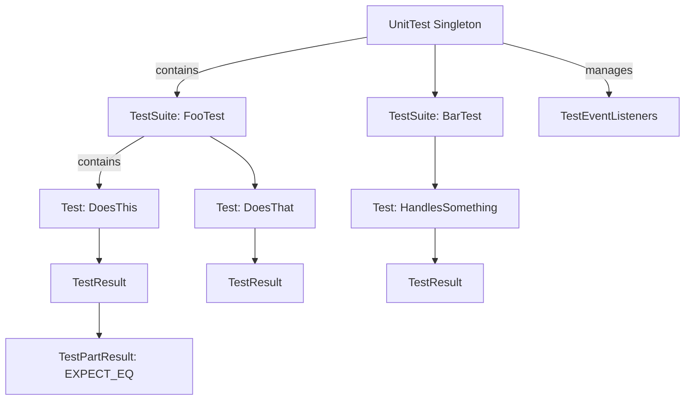

# Test Suites, Cases, and Assertion Model

Delve into the hierarchical structure of test suites, test cases, and assertions that shape the data model within GoogleTest and GoogleMock. Understand how test information is organized, managed, and reported to enable scalable and maintainable test design.

---

## Overview of the Testing Hierarchy

GoogleTest organizes tests in a clean, hierarchical model that users interact with through macros and test fixtures:

- **Test Suites (also known as Test Cases)**: Logical groups of related tests, often representing a class or feature under test.
- **Tests (Test Cases within suites)**: Individual tests that verify a particular aspect or behavior.
- **Assertions (Test Parts)**: The individual checks within a test, such as `EXPECT_EQ` or `ASSERT_TRUE`, which determine test outcomes.

This structure allows developers to write, run, and report tests efficiently and systematically.

## Test Suite: The Container of Tests

A **TestSuite** encapsulates multiple individual tests sharing the same fixture (setup and teardown) and other commonalities. It offers the following characteristics:

- **Naming:** Each TestSuite has a unique name that identifies it in reports and command-line filters.
- **Type Parameter:** Supports typed or parameterized tests via optional type parameters.
- **Lifecycle hooks:** Provides static methods `SetUpTestSuite()` and `TearDownTestSuite()` for shared setup and teardown.
- **Collection:** Holds a collection of `TestInfo` objects representing tests it includes.
- **Statistics:** Tracks counts of successful, skipped, failed, and disabled tests.
- **Execution:** Responsible for running or skipping tests collectively.

Users typically define TestSuites implicitly when using macros such as `TEST()` or `TEST_F()`.

### How Tests Belong to Suites

Each test is registered to its TestSuite at initialization. GoogleTest enforces that all tests within a suite share the same fixture class, ensuring consistent test environment management.

## TestInfo: Details of Individual Tests

The **TestInfo** class stores all metadata and runtime details about a single test:

- **Identifiers:** Holds the test suite name, test name, and optional type or value parameters (for typed or parameterized tests).
- **Source Location:** File and line number where the test is defined, aiding debugging and reporting.
- **Should Run:** Flags indicating whether the test should be executed based on filters or sharding.
- **Disabled Status:** Tracks if the test is disabled explicitly (e.g., via `DISABLED_` prefix).
- **Sharding:** Manages test execution across multiple shards or parallel test workers.
- **Factory:** Owns a factory object capable of creating the test fixture instance when the test is run.
- **Results:** Maintains a `TestResult` object, which collects all assertion outcomes and timing.

Users rarely interact with TestInfo objects directly; instead, they invoke the macros and test functions that implicitly use them.

## TestResult: Aggregated Outcome of a Test

The **TestResult** object collects and reports all results for a single test:

- **Assertions:** Holds a list of **TestPartResult** objects representing individual assertions' outcomes.
- **Properties:** Contains user-added key-value properties (via `RecordProperty`).
- **Death Tests:** Tracks how many death tests are within this test.
- **Timing:** Records the start timestamp and elapsed time.
- **Status Queries:** Provides methods to check if the test passed, failed, skipped, or had fatal/non-fatal failures.

The `TestResult`'s detailed state allows comprehensive reporting and helps diagnose test failures.

## TestPartResult: Assertions and Their Outcomes

Each test consists of zero or more **TestPartResults**, each representing the outcome of a single assertion or explicit success/failure directive:

- **Type:** Indicates if this is a success, nonfatal failure, fatal failure, or skip.
- **Location:** Tracks file and line number where the assertion occurred.
- **Message:** Stores the human-readable message summarizing the failure or success.
- **Status Helpers:** Offers methods to query if a test part passed, failed, was skipped, or had fatal vs non-fatal failure.

Assertions like `EXPECT_EQ` and `ASSERT_TRUE` result in one or more TestPartResults.

## How the Data Model Works Together

When you write test code, consider this sequence:

1. **Test Registration:** Using macros like `TEST` or `TEST_F`, GoogleTest registers new `TestInfo` objects linked to a corresponding `TestSuite`.

2. **Test Execution:** When running tests, the TestSuite runs its associated `TestInfo` tests sequentially or according to filters and sharding.

3. **Test Object Creation:** For each test, a new fixture object is created dynamically via the factory.

4. **Assertions Execution:** As the test body runs, each assertion results in TestPartResults being recorded.

5. **Result Aggregation:** After test completion, `TestResult` aggregates assertion outcomes, failed messages, skips, and timing.

6. **Reporting:** Listeners consume test and test suite data for console output, XML/JSON reports, or custom handling.

## User-Centric Test Flows and Examples

### Defining Tests

```cpp
// Simple test without fixture
TEST(MathTest, BasicAdd) {
  EXPECT_EQ(2 + 2, 4);
}

// Test with a fixture
class FooTest : public ::testing::Test {
 protected:
  void SetUp() override {
    shared_resource_ = new int(42);
  }
  void TearDown() override {
    delete shared_resource_;
  }
  int* shared_resource_;
};

TEST_F(FooTest, UsesSharedResource) {
  EXPECT_EQ(*shared_resource_, 42);
}
```

### Parameterized Tests Example

```cpp
class FactorialTest : public ::testing::TestWithParam<int> {};

TEST_P(FactorialTest, HandleFactorialInput) {
  int n = GetParam();
  EXPECT_GE(n, 0);
  // ... test factorial function ...
}

INSTANTIATE_TEST_SUITE_P(FactorialValues, FactorialTest,
                         ::testing::Values(0, 1, 2, 3, 10));
```

Here each instantiated test is a distinct `TestInfo` linked to parameter values.

### Accessing Test Information at Runtime

Within a test, you can query information about the current running test:

```cpp
const testing::TestInfo* const test_info =
    testing::UnitTest::GetInstance()->current_test_info();

std::cout << "Running test " << test_info->test_suite_name() << "." 
          << test_info->name() << std::endl;
```

### Adding Custom Properties

During test execution, tests can log custom properties useful for reporting:

```cpp
TEST(MyTest, RecordsProperties) {
  ::testing::Test::RecordProperty("Iteration", "42");
  // ... test logic ...
}
```

These properties appear in XML or JSON reports.

## Common Pitfalls and Best Practices

- **Unique Test Suite and Test Names:** Avoid underscores in test and suite names to prevent naming conflicts and reserved keywords. See the FAQ for details.
- **Consistent Fixture Usage:** All tests in a test suite must use the same fixture class. Mixing `TEST` and `TEST_F` inside one suite leads to runtime errors.
- **No Shared State Leakage:** Each `Test` object is a fresh instance; do not assume state carries over.
- **Use `SetUpTestSuite()` wisely:** Use it for expensive shared resource setup, but remember it may be called multiple times in derived classes.
- **Handle Skips and Failures Carefully:** Use `GTEST_SKIP()` to skip, and check `HasFatalFailure()` to abort early.

## Summary Diagram of Test Model



## Troubleshooting

- **Test Not Running:** Confirm test suite and test names are valid and filters (e.g., `--gtest_filter`) allow their execution.
- **Tests Are Disabled:** Check for `DISABLED_` prefixes; use `--gtest_also_run_disabled_tests` to run disabled tests.
- **Fixture Mismatch Errors:** Ensure all tests in a suite use the same fixture class.
- **Unexpected Skips:** Confirm `GTEST_SKIP()` usage and environment setups.
- **Assertion Failures Without Halt:** Understand `ASSERT_*` only aborts current function, not entire test. Use `HasFatalFailure()` or exceptions for propagation.

## Additional Resources

- [GoogleTest Primer](primer.md) for foundational concepts.
- [Test Infrastructure API](api-reference/core-testing-apis/test-infrastructure.mdx) for full class details.
- [Parameterized and Typed Tests Guide](guides/advanced-testing-patterns/parameterized-and-typed-tests) for advanced testing.
- [FAQ on Testing Naming Conventions and Common Issues](docs/faq.md) for best practices.

---

This page is part of the **Core Architecture** concepts in the GoogleTest documentation, focusing heavily on how tests are structured and organized internally and how users should understand this structure for effective test development and troubleshooting.

