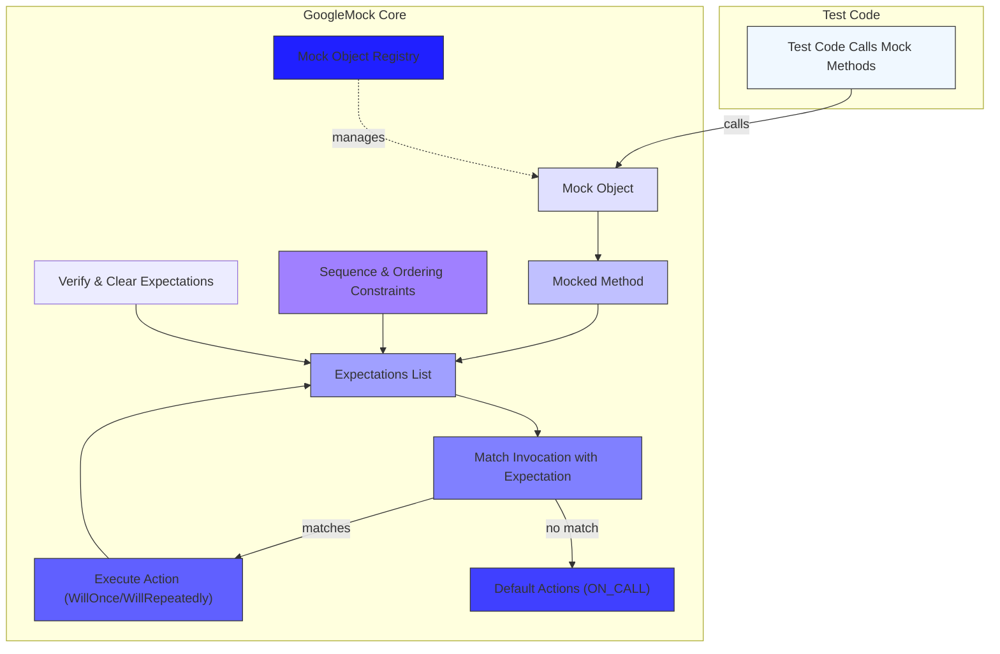

# GoogleMock Architecture and Mock Object Model

GoogleMock (or gMock) is an integral part of the GoogleTest framework, purpose-built to enable precise, flexible, and maintainable mocking of C++ classes. This page dives deeply into the internal workings of GoogleMock, describing how mock objects are constructed, invoked, and verified during test execution, and how GoogleMock integrates seamlessly on top of GoogleTest’s xUnit-based test lifecycle.

---

## How Mock Objects Are Defined

At the heart of GoogleMock's architecture is the concept of **mock classes** and **mock methods**, generated primarily via the `MOCK_METHOD` macro. This declarative syntax allows users to specify a *mock* version of any virtual method directly within their mock classes — no manual implementation required.

- **Mock Classes:** Derived from interfaces or base classes, they contain mocked methods that possess detailed specifications via `EXPECT_CALL` or `ON_CALL` statements.
- **MOCK_METHOD Macro:** Takes the method's return type, name, and argument list (with optional qualifiers) and expands into the fully implemented mock method.

These mocks implement all necessary plumbing to track calls, arguments, and expectations internally.

**Example:**
```cpp
class MockTurtle : public Turtle {
 public:
  MOCK_METHOD(void, PenDown, (), (override));
  MOCK_METHOD(void, Forward, (int distance), (override));
  MOCK_METHOD(int, GetX, (), (const, override));
};
```

The mock methods created are automatically registered with the global mock registry, allowing GoogleMock to manage their behavior and verification state.


## Invocation and Matching of Mock Methods

When your test code calls a mock method, GoogleMock performs several internal steps to ensure the call adheres to the expectations:

1. **Mock Object and Method Identification:** The invoked method internally knows which mock object and method is being called.
2. **Expectation Matching:** GoogleMock maintains an ordered list of expectations (`EXPECT_CALL`) on that mock method. It evaluates the call’s arguments against matchers defined in the expectations, searching **in reverse order** (newest expectations first) to find the first matching active expectation.
3. **Pre-requisite Checks:** If ordering constraints (`.InSequence()`, `.After()`) exist, GoogleMock checks that all prerequisites have been satisfied before accepting the call.
4. **Action Execution:** Upon matching, the associated actions (`.WillOnce()`, `.WillRepeatedly()`) are executed, returning the value or performing side effects as specified.
5. **Call Counting and Saturation:** GoogleMock internally tracks how many times each expectation has been matched. Expectations may be "sticky" and remain active after being saturated unless marked with `.RetiresOnSaturation()` or arranged in sequences.
6. **Failure Handling:** Calls that violate expectations (no match found, excessive calls, wrong order) trigger immediate failures with detailed diagnostic messages including argument mismatches and call trace.

When no expectations match, GoogleMock searches for a default action defined via `ON_CALL`. If none applies, it performs default behavior based on the mocked method’s return type (e.g., returning zero, false, or a default-constructed object).


## Expectations and Their Modifiers

GoogleMock extensively models expectations as objects supporting a chainable syntax to express complex test specifications:

- **`EXPECT_CALL(mock, method(matchers))`:** Establishes that the method is expected to be called with matching arguments.
- **Modifiers:**
  - `.Times(cardinality)`: How many times the call is allowed/expected (exactly, at least, any number, etc).
  - `.WillOnce(action)` / `.WillRepeatedly(action)`: Defines behaviors and return values executed on calls.
  - `.InSequence(seq...)`: Expectations are tied to sequences enforcing strict or partial ordering.
  - `.After(e1, e2, ...)`: Specifies that this expectation should only be matched after other given expectations.
  - `.RetiresOnSaturation()`: Causes an expectation to become inactive after its call limit is reached, allowing other expectations to take over.
  - `.With(multi_arg_matcher)`: Allows matching all function arguments as a tuple against a compound matcher.

These expectations and modifiers form the backbone of the mock's specification and invocation verification.


## Default Actions and Uninteresting Calls

GoogleMock differentiates between expectations (which constrain call counts) and default behaviors:

- **`ON_CALL(mock, method(matchers)).WillByDefault(action)`:** Defines default actions without expectations — calls that match but have no explicit `EXPECT_CALL`.
- **Uninteresting Calls:** Calls to mock methods without any `EXPECT_CALL`. By default, they trigger warnings, but do not fail tests.

GoogleMock offers three strictness modes for mock objects:

- **NaggyMock:** Warns on uninteresting calls (default behavior).
- **NiceMock:** Suppresses warnings on uninteresting calls.
- **StrictMock:** Treats uninteresting calls as failures.

You control this behavior by wrapping mock objects appropriately.


## Sequences and Ordering Constraints

Sometimes your tests require calls to occur in a certain order. GoogleMock provides two mechanisms:

- **`InSequence` Object:** RAII-type object; all `EXPECT_CALL`s within its scope are added into an anonymous sequence that enforces strict ordering.
- **`.InSequence(Sequence...)` Clause:** Specifies manually created named sequences, allowing complex partial ordering between expectations.

Each sequence manages its expectations as a directed chain, enforcing calls to occur sequentially as per test logic.

**Example partial order:**
```cpp
Sequence s1, s2;
EXPECT_CALL(mock, Reset()).InSequence(s1, s2);
EXPECT_CALL(mock, GetSize()).InSequence(s1);
EXPECT_CALL(mock, Describe()).InSequence(s2);
```
Here, `Reset()` must occur before both `GetSize()` and `Describe()`. `GetSize()` and `Describe()` may happen in any order relative to each other.


## Integration with GoogleTest Execution Model

GoogleMock integrates tightly with GoogleTest to provide automatic verification and lifecycle management:

- **Mock Registry:** Tracks all live mock objects and their mocked methods.
- **Leak Detection:** Reports mocks left alive at test program exit as failures unless explicitly marked as leaked.
- **Automatic Verification:** When a mock object is destructed, GoogleMock verifies all its expectations have been met, reporting failures immediately.
- **Explicit Verification:** You can force verification and clearing of expectations using `Mock::VerifyAndClearExpectations` or `Mock::VerifyAndClear`.
- **Thread Safety:** GoogleMock employs internal locking to allow multi-threaded tests; however, users must set up expectations before concurrent mock method calls.


## Summary Diagram: GoogleMock Core Components Interaction




## Practical Tips & Best Practices

- **Define expectations (`EXPECT_CALL`) *before* calling mocked methods.** GoogleMock requires this order for meaningful error reporting.
- **Use `ON_CALL` for default behaviors** when call count verification is not needed.
- **Control call order explicitly** using sequences or `.After()` if ordering is critical.
- **Employ `RetiresOnSaturation()` to avoid "sticky" expectations causing errors.**
- **Choose an appropriate mock strictness level:** `NiceMock` for minimal noise, `NaggyMock` (default) to warn on unexpected calls, `StrictMock` to fail fast on uninteresting calls.
- **Use `Mock::VerifyAndClearExpectations()` when mocks survive beyond test scope** to manually verify.


## Troubleshooting Common Issues

- **Unexpected calls or arguments:** Verify your `EXPECT_CALL` matchers including `.With()` clauses.
- **Uninteresting call warnings:** Consider if you should add an `EXPECT_CALL` or suppress warnings with `NiceMock`.
- **Call order violations:** Use sequences or `.After()` clauses properly.
- **Excessive calls:** Check cardinalities and whether expectations are set to retire on saturation.
- **Leaked mocks:** Ensure deletion of mocks or explicitly allow leaks with `Mock::AllowLeak()`.


## References

- [GoogleMock for Dummies](https://google.github.io/googletest/gmock_for_dummies.html)
- [Mocking Reference](https://google.github.io/googletest/reference/mocking.html)
- [GoogleMock API: Mock Object Creation & Usage](../../api_reference/mocking_apis/mock_object_basics.md)
- [GoogleMock API: Expectations & Actions](../../api_reference/mocking_apis/expectations_actions.md)
- Related GoogleTest pages:
  - [xUnit Testing and the Test Lifecycle](../core-architecture/xunit-and-test-lifecycle.md)
  - [Assertions, Expectations, and Failure Modes](../core-architecture/assertions-and-failure-modes.md)

---

With a clear understanding of GoogleMock's architecture — how mock classes define their methods, expectations govern calls, actions specify behavior, and sequences enforce ordering — you are ready to leverage its powerful features to write expressive, maintainable, and robust mock-based tests.