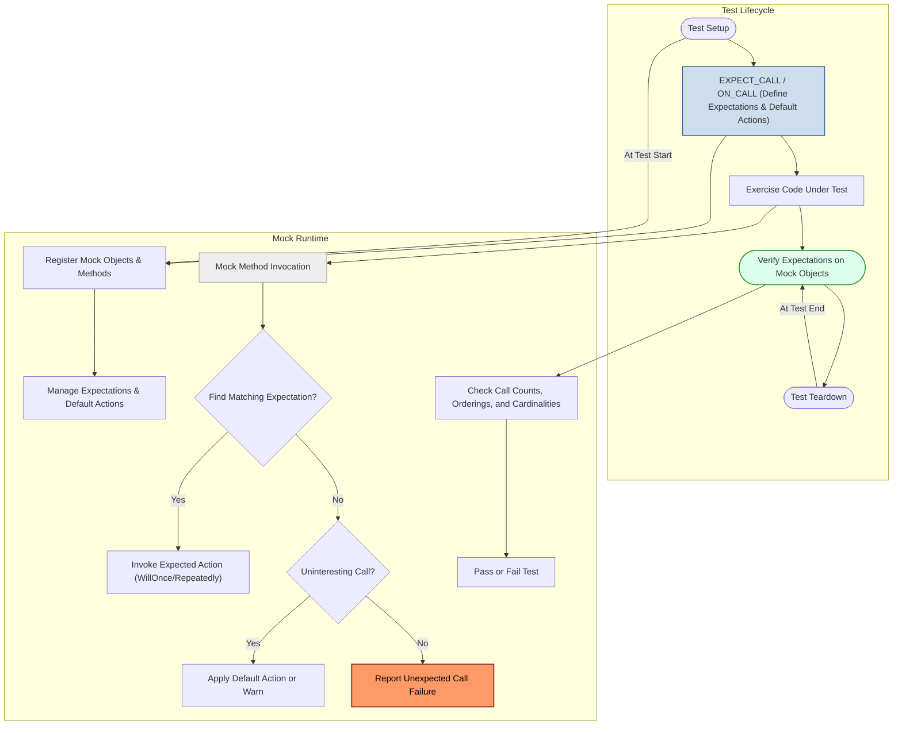

# Unified Test & Mock Integration

GoogleTest and GoogleMock have been merged into a single, cohesive platform, uniting test execution, assertion checking, and mocking capabilities under a seamless architecture. This unified model simplifies writing, organizing, and scaling tests by integrating GoogleMock's powerful mocking features directly into GoogleTest's framework, thus empowering developers to create comprehensive and maintainable C++ test suites.

---

## Introduction to Unified Architecture

Imagine you're running a suite of tests for a complex C++ application. You want precise control not only over the validation of results but also over the interactions your code has with its dependencies. Previously, GoogleTest handled test discovery and assertion verification, while GoogleMock separately managed mocks and expectations. Now, the integrated platform combines these elements so the flow of test execution, mock behavior specification, and verification occur cohesively, all within a single runtime system.

This integration ensures that expectations and mock verifications are automatically checked during test lifecycles, lowering the risk of mismatches between tested code and mocks. It also promotes consistency, reduces boilerplate, and enhances debugging by leveraging shared stacks, logging, and error reporting.

---

## Core Concepts of Unified Interaction

### 1. Expectations and Default Behaviors via `EXPECT_CALL` and `ON_CALL`

- **`EXPECT_CALL`** declares an expectation on a mock method, specifying how many times it should be called, with what arguments, in which order, and what behavior (return values or actions) to perform. 
- **`ON_CALL`** declares default behavior for mock methods without establishing expectations, serving as a fallback for unverified calls.

Both macros are part of the integrated syntax, using a consistent chainable DSL that allows you to specify matchers, cardinalities (`Times()`), sequences (`InSequence()`), call ordering (`After()`), and actions (`WillOnce()`, `WillRepeatedly()`).

### 2. Seamless Mock Object Lifecycle Management

Mocks register themselves with the framework internally on first use, tracking expectations, default actions, and call invocations. Verification of expectations happens automatically upon mock destruction, integrating tightly with GoogleTest's test lifecycle. Advanced interactions such as allowing leaks (`Mock::AllowLeak`) or verifying expectations manually (`Mock::VerifyAndClearExpectations`) are also supported.

### 3. Ordering and Partial Orders Through Sequences and After Clauses

The unified architecture supports sophisticated call ordering controls:

- Expectations can be grouped into sequences using `InSequence` or `.InSequence()` clauses to enforce strict call order within a linear chain.
- The `.After()` clause allows defining explicit partial orders or Directed Acyclic Graph (DAG) constraints among expectations, enabling flexible specification of which calls must precede others.

### 4. Robust Handling of Uninteresting and Unexpected Calls

The integrated platform controls the behavior and reporting of uninteresting calls (calls to mock methods without expectations) and unexpected calls (calls that don't match any expectation):

- By default, uninteresting calls trigger warnings but do not fail tests.
- Strictness can be customized per mock object using modes like `NaggyMock` (default, warns), `NiceMock` (silences warnings), and `StrictMock` (treats uninteresting calls as failures).

### 5. Thread Safety and Concurrent Invocation

The integration ensures that mock method calls and expectation matching are thread-safe by serializing access to shared mock state using internal mutexes. Actions run in the thread invoking the mock method, and expectations can be verified safely even in multithreaded test scenarios.

### 6. Diagnostic and Reporting Enhancements

With unified logging and verbose modes (`--gmock_verbose`), users gain detailed insight into which mocks matched a call, reasons for match failures, and invocation sequences. Stack traces, argument printing, and default action diagnostics are consistently presented alongside GoogleTest's assertion failures.

---

## User Workflow for Writing Unified Tests with Mocks

1. **Define Mock Classes:** Use `MOCK_METHOD` macros within your mock classes as usual.

2. **Set Default Actions:** Use `ON_CALL(mock_object, Method(args))` clauses to specify fallback responses when calls are made but no explicit expectations exist.

3. **Declare Expectations:** Use `EXPECT_CALL` to specify exactly which calls you expect, how often, and any particular behaviors or ordering constraints.

4. **Run Tests:** Execute your tests using GoogleTest's test runners. The unified framework automatically checks whether the expectations have been met.

5. **Interpret Results:** If expectations fail, detailed diagnostic messages explain which calls were expected, which were actually made, and why mismatches occurred.

6. **Leverage Advanced Features:** Use `Sequence` and `After` to capture call ordering logic, and adjust strictness modes with `NiceMock` or `StrictMock` as your test requirements evolve.

---

## Practical Examples 

### A Basic Expectation with Default Action

```cpp
#include <gmock/gmock.h>
using ::testing::Return;

class MockDatabase {
 public:
  MOCK_METHOD(bool, Connect, (const std::string&), ());
};

TEST(DatabaseTest, ConnectsSuccessfully) {
  MockDatabase mock_db;
  ON_CALL(mock_db, Connect).WillByDefault(Return(true));
  EXPECT_CALL(mock_db, Connect("localhost"));

  // Code under test uses mock_db
  bool result = mock_db.Connect("localhost");
  EXPECT_TRUE(result);
}
```

In this example, the default action (`Return(true)`) is set with `ON_CALL`, while the actual test enforces that `Connect` must be called with "localhost" exactly once.

### Enforcing Call Order Using Sequence

```cpp
using ::testing::InSequence;
using ::testing::Return;

class MockTurtle {
 public:
  MOCK_METHOD(void, PenDown, (), ());
  MOCK_METHOD(void, Forward, (int), ());
  MOCK_METHOD(void, PenUp, (), ());
};

TEST(DrawingTest, DrawsLineSegmentInOrder) {
  MockTurtle turtle;
  {
    InSequence seq;
    EXPECT_CALL(turtle, PenDown());
    EXPECT_CALL(turtle, Forward(100));
    EXPECT_CALL(turtle, PenUp());
  }

  // Code under test: calls turtle methods
  turtle.PenDown();
  turtle.Forward(100);
  turtle.PenUp();
}
```

Here, expectations within the `InSequence` block must be satisfied **strictly in order**, or the test will fail.

### Partial Order Using `.After()` Clause

```cpp
using ::testing::Expectation;
using ::testing::Return;

class MockFoo {
 public:
  MOCK_METHOD(void, Init, (), ());
  MOCK_METHOD(void, Start, (), ());
  MOCK_METHOD(void, Run, (), ());
};

TEST(PartialOrderTest, EnforcesPartialOrder) {
  MockFoo foo;

  Expectation init = EXPECT_CALL(foo, Init());
  EXPECT_CALL(foo, Start()).After(init);
  EXPECT_CALL(foo, Run()).After(init);

  foo.Init();
  foo.Start();
  foo.Run();
}
```

This test requires that `Init` be called before either `Start` or `Run`, but does not enforce the relative order between `Start` and `Run`.

---

## Implementation Highlights (User-Focused Overview)

The unified platform includes the following functional highlights (without exposing internal code details):

- **Mock Registration & Ownership:** Mocks register themselves on first use via `RegisterOwner`, enabling lifecycle tracking and detection of leaked mocks.

- **Expectation Management:** Expectations created by `EXPECT_CALL` are encapsulated in typed `TypedExpectation` objects, supporting chained clauses like `Times()`, `With()`, `InSequence()`, and `After()`.

- **Default Action Handling:** Using `ON_CALL`, default behaviors are managed as `OnCallSpec` objects, allowing fallback when expectations don't match.

- **Thread-Safe Invocation:** All mock method calls pass through a global mutex ensuring atomic selection of matching expectations and safe mutation of expectation state.

- **Diagnostic Reporting:** Robust logging and detailed failure reporting hooks are integrated, with verbosity levels controlled by `--gmock_verbose`.

- **Strictness Modes:** Wrapper mock types like `NiceMock`, `NaggyMock`, and `StrictMock` adjust how uninteresting mock calls are handled at runtime.

---

## Tips for Success

- **Always define expectations before exercising mock methods.** This allows the framework to detect mismatches immediately.

- **Use `ON_CALL` for default behavior without enforcing call order or call frequency.**

- **Use sequences or the `.After()` clause to impose call ordering when needed, to keep tests expressive but not brittle.**

- **Set strictness (`NiceMock`, `StrictMock`) thoughtfully to balance coverage and flakiness.**

- **Use meaningful method names with `MOCK_METHOD` and avoid macro name clashes to prevent compilation issues.**

- **Leverage rich diagnostics enhanced by the unified platform with `--gmock_verbose=info` for debugging complex mock behaviors.**

- **Verify expectations explicitly with `Mock::VerifyAndClearExpectations` if mocks live beyond the test lifetime or are leaked intentionally.**

---

## Mermaid Diagram: Unified Test and Mock Integration Flow


---

## Troubleshooting Common Issues

- **Uninteresting Call Warnings:** If you see warnings about uninteresting mock calls, consider either adding `EXPECT_CALL(...).Times(AnyNumber())` or switching to `NiceMock` for that mock object.

- **Unexpected Call Errors:** These indicate calls that do not match any active expectation. Check your argument matchers and call order constraints.

- **Saturated Expectations:** Too many calls to an expectation cause failures unless `.RetiresOnSaturation()` is added to retire expectations after reaching the call limit.

- **Ambiguous Overloads:** Always specify argument lists or use `Const()` wrappers to disambiguate overloaded methods.

- **Leaked Mocks:** Leaked mocks will raise runtime errors unless `Mock::AllowLeak` is explicitly called.

- **Multi-threading Issues:** Avoid setting expectations or changing mock state concurrently with invocation from multiple threads.

---

## Summary

This page has outlined the conceptual integration of GoogleTest and GoogleMock into a unified platform, describing how assertions, test execution, and mocking interact seamlessly. By mastering the combined model of expectations, default actions, call ordering, and verification tied to the test lifecycle, users can write powerful, expressive, and maintainable C++ tests at scale.

---

## Next Steps

- Explore the **[Mocking Reference](../docs/reference/mocking.md)** page for detailed syntax and option descriptions.
- Follow the **[gMock for Dummies](../docs/gmock_for_dummies.md)** for beginner-friendly tutorials.
- Dive into the advanced **[gMock Cookbook](../docs/gmock_cook_book.md)** for practical recipes.
- Use the **[Expectations, Actions & Sequences API Reference](../api-reference/gmock-mocking-framework/expectations-actions-and-sequences.mdx)** for in-depth API insights.

These resources will build your expertise in writing effective unit tests by leveraging the full power of the integrated GoogleTest + GoogleMock framework.