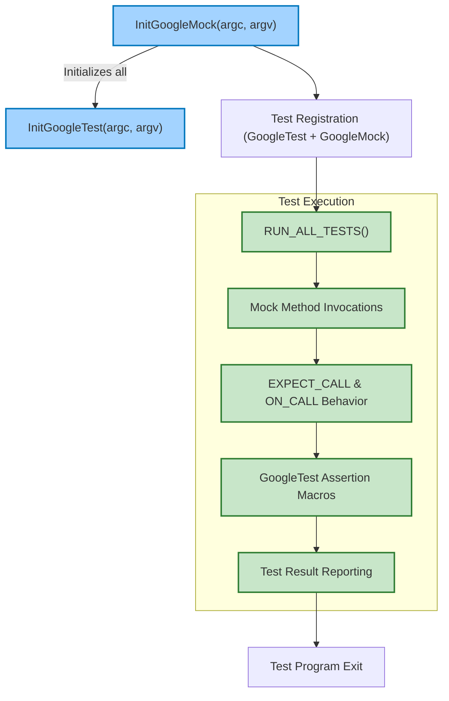

# Integration of GoogleMock and GoogleTest

GoogleMock builds directly on top of GoogleTest, forming a unified, comprehensive C++ testing framework. By layering the powerful mocking capabilities within the established testing infrastructure of GoogleTest, GoogleMock allows developers to seamlessly write flexible, expressive tests leveraging both core assertions and rich mock object behaviors.

This page explains how GoogleMock integrates with GoogleTest, the shared infrastructures they rely upon, the added nuances GoogleMock introduces, and the typical workflows enabled by their combined power.

---

## Foundation: GoogleMock Built on GoogleTest

GoogleMock depends fundamentally on GoogleTest. It reuses GoogleTest’s:

- **Assertions infrastructure:** All GoogleMock expectations ultimately rely on GoogleTest’s assertion macros and reporting system to communicate success or failure.
- **Test runner:** GoogleTest’s execution engine runs GoogleMock tests, integrating mock expectation verification into the same lifecycle.
- **Command-line initialization:** GoogleMock’s initialization function `InitGoogleMock()` internally invokes GoogleTest’s `InitGoogleTest()`, parsing and handling command-line flags for both frameworks cohesively.

This tight coupling means that GoogleMock can enhance testing without forcing developers to learn multiple runtimes or separate workflows. You write mock tests just like regular GoogleTest tests, but gain powerful mocking constructs.

<Check>
GoogleMock is not a standalone test framework; it is designed as an extension and requires GoogleTest to operate.
</Check>

---

## Shared Test Lifecycle and Execution Flow

When you run tests using GoogleMock, the following user-level workflow and flow of control ensures smooth operation:

1. **Initialization:**
   Invoke `testing::InitGoogleMock(&argc, argv);` at the start of your `main()` program. This initializes GoogleTest and GoogleMock flags.

2. **Test Registration:**
   Tests defined with `TEST()`, `TEST_F()`, and mock expectations are registered using the standard GoogleTest macros and extended GoogleMock macros.

3. **Running Tests:**
   Calling `RUN_ALL_TESTS()` runs all registered tests, including those using mocking constructs.

4. **Mock Invocation Verification:**
   During execution, GoogleMock tracks calls to mock methods, validates them against expectations (`EXPECT_CALL`), and asserts failures through GoogleTest assertions if expectations are not met.

5. **Reporting:**
   Test results, including assertion failures and mock unmet expectations, are displayed in unified reports.

This integration ensures you can treat mock-heavy tests and traditional unit tests uniformly in your test suites.

---

## GoogleMock Extensions Over GoogleTest

While GoogleMock leverages GoogleTest's foundations, it enriches the testing experience by adding:

### 1. Declarative Mock Definitions
- The `MOCK_METHOD` macro defines mock methods inside mock classes, describing the signatures of functions you want to stub and verify.

### 2. Rich Expectation Syntax
- The `EXPECT_CALL` macro combined with chaining clauses (`Times`, `WillOnce`, `WillRepeatedly`, `InSequence`, etc.) allows detailed specification of expectations and behaviors for mock methods.

### 3. Default Behavior Specifications
- `ON_CALL` enables setting default behaviors for mocks when explicit expectations are not active, complementing GoogleTest’s assertion framework.

### 4. Specialized Mocks
- Wrappers like `NiceMock`, `NaggyMock`, and `StrictMock` control how “uninteresting” calls to mocks are handled — from silencing warnings to triggering test failures.

### 5. Sequence Management
- GoogleMock can enforce call ordering using sequences and scoped `InSequence` blocks, providing control beyond what GoogleTest alone offers.

<Info>
These extensions integrate seamlessly with GoogleTest’s fixtures and assertions, letting you combine mock behavior verification and flexible setup/teardown.
</Info>

---

## Typical User Journey Integrating GoogleMock and GoogleTest

### Step 1: Setup and Initialization
Begin your test binary's main function by calling `InitGoogleMock`, ensuring all GoogleTest and GoogleMock flags are processed.

```cpp
int main(int argc, char** argv) {
  testing::InitGoogleMock(&argc, argv);
  return RUN_ALL_TESTS();
}
```

### Step 2: Define Mock Classes
Create mock classes using `MOCK_METHOD` inside the class declaration to substitute real dependencies with controllable mocks.

```cpp
class MockFoo {
 public:
  MOCK_METHOD(int, Bar, (int n));
  MOCK_METHOD(char, Baz, (const char* s1, const std::string& s2));
};
```

### Step 3: Specify Expectations
Use `EXPECT_CALL` to specify how the mock methods are expected to behave and how many times they should be called.

```cpp
MockFoo mock;
EXPECT_CALL(mock, Bar(0)).Times(AtMost(3));
EXPECT_CALL(mock, Baz(_, _))
    .WillOnce(Return('z'))
    .WillRepeatedly(Return('a'));
```

### Step 4: Use Mocks in Tests
Invoke code under test, providing mocks where dependencies would normally be. The mocks intercept calls and verify against expectations.

### Step 5: Run Tests and Analyze Results
The combined GoogleTest and GoogleMock runtime evaluates all assertions and mock expectations. Failures in either domain surface as clear diagnostics.

---

## Thread Safety and Concurrency

GoogleMock is designed to work safely in multi-threaded test contexts on supported platforms (where pthreads are available). The underlying GoogleTest framework provides thread safety, and GoogleMock includes specific stress test examples validating concurrent usage:

- Multiple threads invoking methods on separate mock objects with no interference.
- Multiple threads invoking methods on the same mock object with partial ordering.

This capability allows large-scale, parallelized test suites using mocks without fragile race conditions.

---

## Practical Tips for Integrating GoogleMock and GoogleTest

- Always call `InitGoogleMock` in `main()` instead of only `InitGoogleTest` to initialize both frameworks.
- You can write tests mixing plain GoogleTest assertions and GoogleMock expectations for flexible scenarios.
- Use GoogleMock’s wrappers (`NiceMock`, `StrictMock`, `NaggyMock`) to simplify tests by adjusting their response to uninteresting calls.
- Take advantage of sequence and ordering features to express complex interaction patterns.
- Use `ON_CALL` for setting default mock behaviors and `EXPECT_CALL` for specifying verifiable expectations.

---

## Troubleshooting Common Integration Issues

<AccordionGroup title="Common Integration Pitfalls and Solutions">
<Accordion title="Failure to Initialize GoogleMock Correctly">
Ensure you call `testing::InitGoogleMock()` instead of only GoogleTest’s init. Missing this causes initialization issues, especially with mock-specific flags.
</Accordion>
<Accordion title="Mock Expectations Not Verified or Not Reporting Failures">
Verify that tests go through the standard `RUN_ALL_TESTS()` macro. Avoid calling it multiple times or circumventing the GoogleTest runner.
</Accordion>
<Accordion title="Thread Safety Problems in Tests">
Confirm your platform supports pthreads and that the macro `GTEST_IS_THREADSAFE` is defined to 1. On unsupported platforms, avoid concurrent mock calls or use synchronization in tests.
</Accordion>
<Accordion title="Linking Errors Due to Main Function Conflicts">
If you provide your own `main`, ensure it returns the result of `RUN_ALL_TESTS()` and calls `InitGoogleMock()`. Alternatively, link with `gmock_main` which offers a pre-built main with proper integration.
</Accordion>
</AccordionGroup>

---

## Integration Summary Mermaid Diagram



---

## Additional Resources

- [GoogleTest Primer](../docs/primer.md) — learn the fundamentals of test writing that GoogleMock builds on
- [Mocking Reference](../docs/reference/mocking.md) — detailed guide to GoogleMock macros and classes
- [Specifying Expectations and Actions Guide](../guides/mocking-and-behavior-verification/specifying-expectations-and-actions.mdx) — best practices for expectation syntax
- [Nice, Strict, and Naggy Mocks](../api-reference/mocking-apis/nice-strict-mocks.mdx) — controlling mock strictness
- [Test Runner Initialization](../api-reference/infrastructure-and-internals/test-runner-entrypoint.mdx) — details on main function and initialization

Understanding this integration is crucial for mastering effective C++ testing with GoogleTest and GoogleMock. Start writing tests mixing both frameworks to leverage their combined strengths seamlessly.

---

*This documentation focuses specifically on the integration mechanics and workflows between GoogleMock and GoogleTest. For comprehensive information on individual API details, expectational syntax, and mock class definition, please refer to the respective referenced guides.*
