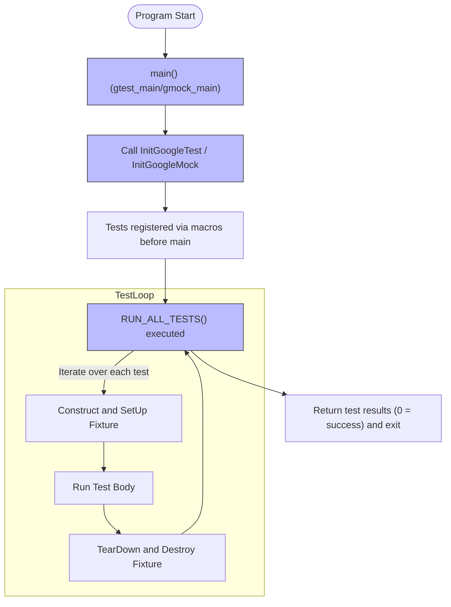

# Main Entry Point & Test Execution

Welcome to this guide explaining how GoogleTest and GoogleMock test programs start and run. This document walks you through the journey from program launch to the execution of all your tests, highlighting the default main functions provided by the framework, initialization steps, and how test execution is managed across environments.

---

## Introduction

GoogleTest and GoogleMock frameworks provide default implementations of the program's entry point (`main` function) via two ready-to-link libraries: **gtest_main** and **gmock_main**. These entry points initialize the testing environment, parse command-line options, run tests, and return meaningful exit codes to integrate smoothly into build pipelines and CI systems.

By linking your test binary with either `gtest_main` or `gmock_main`, you avoid writing a custom `main` function unless you need special startup logic before tests run.


## Understanding the Provided Entry Points

### gtest_main

The `gtest_main` library implements a executable entry point that:

- Prints an identifying startup message.
- Calls `testing::InitGoogleTest()` with the program arguments.
- Calls `RUN_ALL_TESTS()` to execute all tests registered in your program.
- Returns the result of `RUN_ALL_TESTS()` as the program exit code.

This is the simplest way to run tests if you don't require GoogleMock functionalities.

### gmock_main

The `gmock_main` library extends the role of `gtest_main` for projects using GoogleMock. It:

- Prints a startup message indicating it's from `gmock_main.cc`.
- Calls `testing::InitGoogleMock()`, which initializes both GoogleMock and GoogleTest subsystems.
- Executes `RUN_ALL_TESTS()`.
- Returns the exit code from `RUN_ALL_TESTS()`.

Use this entry point when your tests involve mocking.


## Typical Workflow of Test Program Execution

1. **Program Startup:** The OS transfers control to the test program's `main()` (or platform-specific entry).

2. **GoogleTest/GoogleMock Initialization:** 
   - When using `gtest_main`, `testing::InitGoogleTest(&argc, argv)` processes GoogleTest flags and configures test runtime state.
   - When using `gmock_main`, `testing::InitGoogleMock(&argc, argv)` does the same for GoogleTest and additionally configures mocking features.

3. **Test Discovery and Registration:**
   - Ahead of `main()` execution, all test cases registered via macros like `TEST()`, `TEST_F()`, or parameterized tests have been statically registered in GoogleTest’s internal structures.

4. **Running Tests:**
   - `RUN_ALL_TESTS()` iterates over all registered tests, running them one by one.
   - Each test's fixture construction, `SetUp()`, test body, `TearDown()`, and destruction run in a deterministic sequence.
   - Failures and assertions are monitored to determine test success.

5. **Result and Cleanup:**
   - After all tests finish, `RUN_ALL_TESTS()` returns `0` for success or nonzero otherwise.
   - The program exits with that status code, signaling test suite success or failure to external tools.


## Platform-Specific Considerations

### Arduino-like Environments

On Arduino or embedded platforms such as ESP8266 and ESP32, the entry points differ:
- Instead of `main()`, the program defines `setup()` and `loop()` functions.
- The `setup()` function calls `testing::InitGoogleTest()` or `testing::InitGoogleMock()`.
- The `loop()` function continuously invokes `RUN_ALL_TESTS()`, suitable for the embedded runtime model.

### Other Special Environments

- On QURT, a specialized operating system, the `main()` function has no arguments but still initializes GoogleTest and runs tests.

- Windows Mobile uses `_tmain` with wide-character support.


## Writing Your Own main() Function

While most users should link with `gtest_main` or `gmock_main` to avoid boilerplate, there are legitimate reasons to provide a custom `main()`:

- You want to perform additional setup before tests run (e.g., initializing logging or custom frameworks).
- You need to parse or handle additional command-line arguments.
- You want to customize test initialization or shut down resources after tests.

If you write your own `main()`, follow this pattern:

```cpp
int main(int argc, char **argv) {
  testing::InitGoogleTest(&argc, argv);  // Or InitGoogleMock if using mocks
  return RUN_ALL_TESTS();
}
```

Always pass `argc` and `argv` to the initializer and return `RUN_ALL_TESTS()` result for correct test exit status.


## Integration with Build Systems

### Linking Convenience

CMake, Bazel, and other build systems typically offer targets (`gtest_main` and `gmock_main`) that provide the entry point. Linking these targets is usually just one line in your build configuration.

This design frees you from maintaining multiple `main()` implementations in your codebase and ensures consistent test startup behavior.


### Command-Line Flags

Both `InitGoogleTest()` and `InitGoogleMock()` remove recognized GoogleTest flags from `argv` to allow transparent use of common GoogleTest command-line options such as:

- `--gtest_filter` to select tests
- `--gtest_repeat` to rerun tests multiple times
- `--gtest_output` to produce XML/JUnit reports

Your own arguments should come after or before these, and unrecognized flags remain to be handled manually if you use a custom `main()`.


## Common Pitfalls & Troubleshooting

<Tip>
- **Don’t ignore the return value of `RUN_ALL_TESTS()`.** Your program’s exit code determines success or failure in CI pipelines.
- **Avoid calling `RUN_ALL_TESTS()` more than once.** This can cause unexpected behavior.
- **When using mocks, always prefer linking with `gmock_main`.** It initializes the mock framework properly.
- **Check platform-specific entry points for embedded or specialized systems.** You may need `setup()`/`loop()` instead of `main()`.
</Tip>

<Warning>
If you override the `main()` function but forget to call `InitGoogleTest()` or `InitGoogleMock()`, command-line flags will not be processed and GoogleTest internal state may be invalid.
</Warning>


## Example: Using Default gtest_main

With `gtest_main` linked in your test target, your test file could be as simple as:

```cpp
#include <gtest/gtest.h>

TEST(FactorialTest, HandlesZeroInput) {
  EXPECT_EQ(Factorial(0), 1);
}

// No main needed - gtest_main provides it.
```

On running the executable, GoogleTest automatically discovers and runs all defined tests.


## Visual Overview of Test Program Execution Flow




## Summary
- Linking with **gtest_main** or **gmock_main** provides a default, robust program entry point for your tests.
- `InitGoogleTest()` and `InitGoogleMock()` initialize framework internals and parse command-line flags.
- `RUN_ALL_TESTS()` discovers and runs all registered tests and returns an exit status reflecting test success or failure.
- Platform-specific entry points differ on embedded systems but preserve this paradigm.


## Further Reading and Related Documentation

- [Basic Configuration](https://github.com/google/googletest/tree/main/docs/getting-started/initial-configuration-validation/basic-configuration) — How to link and build with gtest_main and gmock_main.
- [Writing Your First Test](https://github.com/google/googletest/tree/main/docs/googletest-guides/getting-started/primer-first-test) — Start writing tests and how they run.
- [Test Structure & Lifecycle](https://github.com/google/googletest/tree/main/docs/concepts/core-architecture/test-structure-lifecycle) — Understand how tests run inside GoogleTest.
- [Common Installation & Build Issues](https://github.com/google/googletest/tree/main/docs/getting-started/troubleshooting-support/common-issues) — Troubleshoot problems related to main entry linkage.


## Links
- [GoogleTest GitHub Repository](https://github.com/google/googletest)
- [gmock_main.cc source](https://github.com/google/googletest/blob/main/googlemock/src/gmock_main.cc)
- [gtest_main.cc source](https://github.com/google/googletest/blob/main/googletest/src/gtest_main.cc)


---

This completes your understanding of how GoogleTest and GoogleMock test programs begin and execute. With this knowledge, you can confidently integrate test execution into your build and deployment workflows, customize startup behavior if needed, and ensure seamless, consistent test runs across platforms.